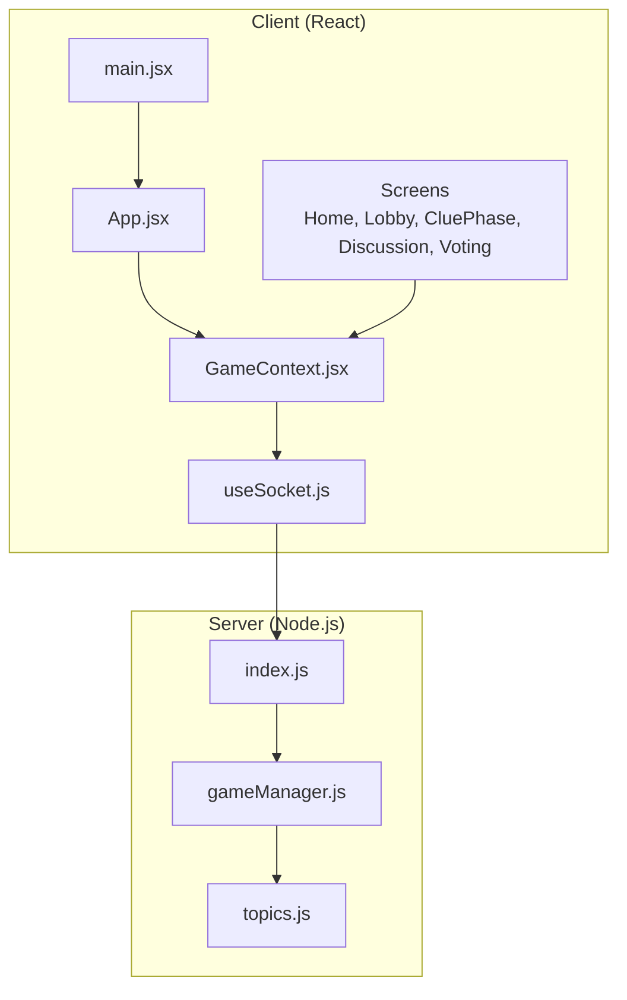
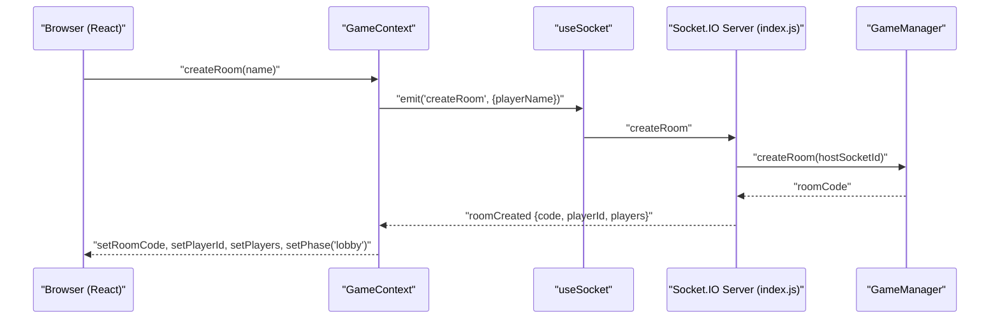
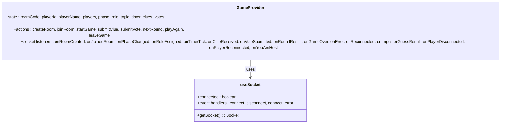
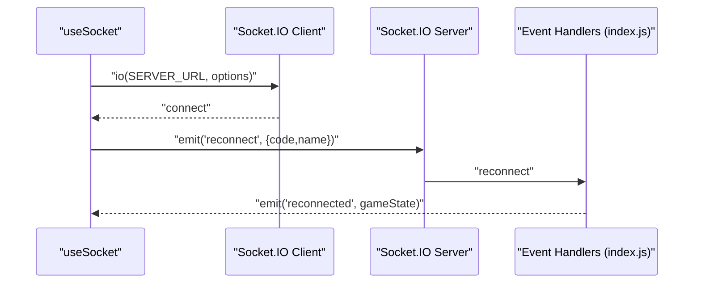
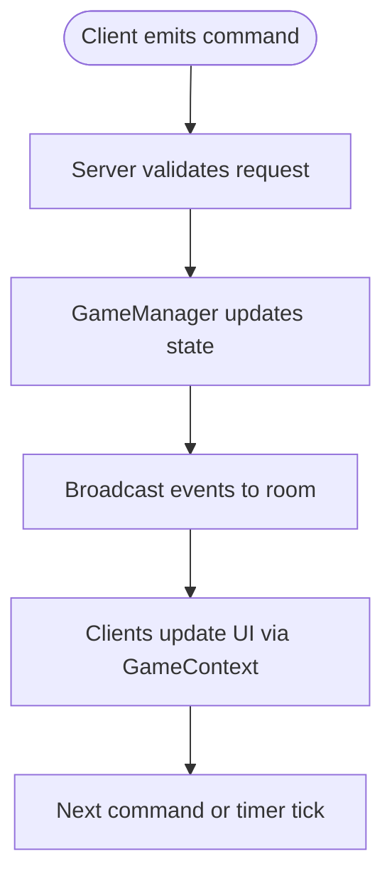
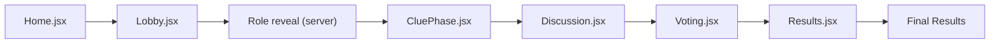
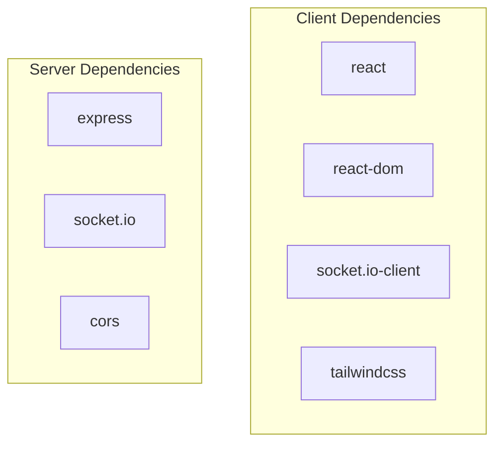

# Architecture Overview

<cite>
**Referenced Files in This Document**
- [client/src/App.jsx](file://client/src/App.jsx)
- [client/src/main.jsx](file://client/src/main.jsx)
- [client/src/context/GameContext.jsx](file://client/src/context/GameContext.jsx)
- [client/src/hooks/useSocket.js](file://client/src/hooks/useSocket.js)
- [client/src/screens/Home.jsx](file://client/src/screens/Home.jsx)
- [client/src/screens/Lobby.jsx](file://client/src/screens/Lobby.jsx)
- [client/src/screens/CluePhase.jsx](file://client/src/screens/CluePhase.jsx)
- [client/src/screens/Discussion.jsx](file://client/src/screens/Discussion.jsx)
- [client/src/screens/Voting.jsx](file://client/src/screens/Voting.jsx)
- [server/index.js](file://server/index.js)
- [server/gameManager.js](file://server/gameManager.js)
- [server/topics.js](file://server/topics.js)
- [client/package.json](file://client/package.json)
- [server/package.json](file://server/package.json)
</cite>

## Table of Contents
1. [Introduction](#introduction)
2. [Project Structure](#project-structure)
3. [Core Components](#core-components)
4. [Architecture Overview](#architecture-overview)
5. [Detailed Component Analysis](#detailed-component-analysis)
6. [Dependency Analysis](#dependency-analysis)
7. [Performance Considerations](#performance-considerations)
8. [Troubleshooting Guide](#troubleshooting-guide)
9. [Conclusion](#conclusion)

## Introduction
This document describes the architectural design of the Imposter Game system, focusing on the real-time client-server architecture powered by Socket.IO. It explains how the React frontend integrates with the Node.js backend via event-driven communication, how state is managed using React Context, and how the server-side game manager orchestrates gameplay phases and synchronization across clients. Cross-cutting concerns such as real-time synchronization, state persistence, and error handling are documented alongside technology stack choices and scalability considerations.

## Project Structure
The project is split into two primary modules:
- Client (React + Vite): Provides the user interface, real-time socket integration, and centralized state management.
- Server (Node.js + Express + Socket.IO): Serves the API and real-time events, manages game state, and enforces game rules.

**Diagram sources**
- [client/src/main.jsx:1-14](file://client/src/main.jsx#L1-L14)
- [client/src/App.jsx:1-101](file://client/src/App.jsx#L1-L101)
- [client/src/context/GameContext.jsx:1-383](file://client/src/context/GameContext.jsx#L1-L383)
- [client/src/hooks/useSocket.js:1-76](file://client/src/hooks/useSocket.js#L1-L76)
- [server/index.js:1-687](file://server/index.js#L1-L687)
- [server/gameManager.js:1-636](file://server/gameManager.js#L1-L636)
- [server/topics.js:1-104](file://server/topics.js#L1-L104)

**Section sources**
- [client/src/main.jsx:1-14](file://client/src/main.jsx#L1-L14)
- [client/src/App.jsx:1-101](file://client/src/App.jsx#L1-L101)
- [server/index.js:1-687](file://server/index.js#L1-L687)

## Core Components
- React application bootstrap and routing:
  - The React app is mounted under a provider that exposes shared game state and actions to all screens.
  - The root component renders the current screen based on the active game phase and applies transitions.
- Centralized state and socket integration:
  - A React Context provider encapsulates all game state, actions, and socket event handlers.
  - A custom hook initializes and manages a single Socket.IO client with automatic reconnection and session restoration.
- Server-side game orchestration:
  - An Express server hosts the Socket.IO server and routes events to the GameManager.
  - The GameManager maintains rooms, players, timers, and game logic, broadcasting synchronized updates to clients.

Key responsibilities:
- Client
  - UI rendering and user interactions
  - Real-time event subscription and state updates
  - Local persistence of session data for reconnection
- Server
  - Room lifecycle and player management
  - Game flow control and phase transitions
  - Event broadcasting and state synchronization

**Section sources**
- [client/src/main.jsx:1-14](file://client/src/main.jsx#L1-L14)
- [client/src/App.jsx:67-101](file://client/src/App.jsx#L67-L101)
- [client/src/context/GameContext.jsx:12-380](file://client/src/context/GameContext.jsx#L12-L380)
- [client/src/hooks/useSocket.js:8-76](file://client/src/hooks/useSocket.js#L8-L76)
- [server/index.js:173-676](file://server/index.js#L173-L676)
- [server/gameManager.js:9-636](file://server/gameManager.js#L9-L636)

## Architecture Overview
The system follows an event-driven architecture:
- Clients emit commands (create/join/start, submit clues/votes, etc.) via Socket.IO.
- The server validates requests, updates internal state, and emits synchronized events to all clients in the room.
- Clients react to emitted events by updating local state and advancing UI phases.

**Diagram sources**
- [client/src/context/GameContext.jsx:257-262](file://client/src/context/GameContext.jsx#L257-L262)
- [client/src/hooks/useSocket.js:21-32](file://client/src/hooks/useSocket.js#L21-L32)
- [server/index.js:178-210](file://server/index.js#L178-L210)
- [server/gameManager.js:53-90](file://server/gameManager.js#L53-L90)

## Detailed Component Analysis

### Client-Side State Management with React Context
The GameContext provider centralizes:
- Session state: room code, player identity, host flag
- Game state: players, phase, role/topic, timer, clues, votes, round info, final scores
- UI state: toasts, errors, submission flags
- Actions: createRoom, joinRoom, startGame, submitClue, submitVote, nextRound, playAgain, leaveGame
- Socket event handlers: map server events to state updates and UI transitions

**Diagram sources**
- [client/src/context/GameContext.jsx:12-380](file://client/src/context/GameContext.jsx#L12-L380)
- [client/src/hooks/useSocket.js:8-76](file://client/src/hooks/useSocket.js#L8-L76)

**Section sources**
- [client/src/context/GameContext.jsx:12-380](file://client/src/context/GameContext.jsx#L12-L380)
- [client/src/hooks/useSocket.js:8-76](file://client/src/hooks/useSocket.js#L8-L76)

### Real-Time Communication with Socket.IO
The client establishes a persistent Socket.IO connection with:
- Automatic reconnection and exponential backoff
- Graceful fallback to polling if WebSocket fails
- Session restoration on reconnect using stored room code and player name

**Diagram sources**
- [client/src/hooks/useSocket.js:21-74](file://client/src/hooks/useSocket.js#L21-L74)
- [server/index.js:542-608](file://server/index.js#L542-L608)

**Section sources**
- [client/src/hooks/useSocket.js:8-76](file://client/src/hooks/useSocket.js#L8-L76)
- [server/index.js:542-608](file://server/index.js#L542-L608)

### Server-Side Game Orchestration
The server’s index.js registers handlers for client commands and delegates to GameManager for state changes. It also schedules timers and broadcasts synchronized updates.

**Diagram sources**
- [server/index.js:173-676](file://server/index.js#L173-L676)
- [server/gameManager.js:49-636](file://server/gameManager.js#L49-L636)

**Section sources**
- [server/index.js:173-676](file://server/index.js#L173-L676)
- [server/gameManager.js:49-636](file://server/gameManager.js#L49-L636)

### Screens and UI State Synchronization
- Home: Creates or joins rooms, displays connection status and errors.
- Lobby: Shows players, host controls, and category selection.
- CluePhase: One-word clue submission with a 60-second countdown.
- Discussion: Displays all clues for 60 seconds.
- Voting: Player selection with 45-second countdown and vote reveal.

**Diagram sources**
- [client/src/screens/Home.jsx:1-231](file://client/src/screens/Home.jsx#L1-L231)
- [client/src/screens/Lobby.jsx:1-211](file://client/src/screens/Lobby.jsx#L1-L211)
- [client/src/screens/CluePhase.jsx:1-165](file://client/src/screens/CluePhase.jsx#L1-L165)
- [client/src/screens/Discussion.jsx:1-114](file://client/src/screens/Discussion.jsx#L1-L114)
- [client/src/screens/Voting.jsx:1-180](file://client/src/screens/Voting.jsx#L1-L180)

**Section sources**
- [client/src/screens/Home.jsx:12-29](file://client/src/screens/Home.jsx#L12-L29)
- [client/src/screens/Lobby.jsx:56-86](file://client/src/screens/Lobby.jsx#L56-L86)
- [client/src/screens/CluePhase.jsx:45-62](file://client/src/screens/CluePhase.jsx#L45-L62)
- [client/src/screens/Discussion.jsx:45-54](file://client/src/screens/Discussion.jsx#L45-L54)
- [client/src/screens/Voting.jsx:56-61](file://client/src/screens/Voting.jsx#L56-L61)

### Observer Pattern Implementation
- Server emits events to all clients subscribed to a room namespace.
- Clients subscribe to events in GameContext and update state accordingly.
- This decouples UI updates from server logic, enabling scalable synchronization.

**Section sources**
- [client/src/context/GameContext.jsx:70-254](file://client/src/context/GameContext.jsx#L70-L254)
- [server/index.js:50-122](file://server/index.js#L50-L122)

## Dependency Analysis
- Client dependencies:
  - React and React DOM for UI
  - Socket.IO client for real-time communication
  - Tailwind CSS for styling
- Server dependencies:
  - Express for HTTP transport
  - Socket.IO for real-time bidirectional communication
  - CORS support for cross-origin requests

**Diagram sources**
- [client/package.json:12-24](file://client/package.json#L12-L24)
- [server/package.json:10-14](file://server/package.json#L10-L14)

**Section sources**
- [client/package.json:12-24](file://client/package.json#L12-L24)
- [server/package.json:10-14](file://server/package.json#L10-L14)

## Performance Considerations
- Real-time synchronization:
  - Server-side timers emit periodic ticks to keep UI clocks synchronized.
  - Broadcasting minimal state snapshots reduces bandwidth and parsing overhead.
- Scalability:
  - Socket.IO rooms isolate state per room, minimizing cross-room contention.
  - GameManager uses maps for O(1) lookups of rooms and players.
- Client responsiveness:
  - React Context consolidates state updates, avoiding prop drilling.
  - Local session storage enables quick reconnection without re-authentication.

[No sources needed since this section provides general guidance]

## Troubleshooting Guide
Common issues and remedies:
- Connection failures:
  - Verify server availability and network accessibility.
  - Check client-side reconnection attempts and fallback to polling.
- Reconnection not restoring state:
  - Ensure room code and player name are persisted in session storage.
  - Confirm the server’s reconnect handler emits the full game state snapshot.
- Events not received:
  - Confirm the client is joined to the correct room namespace.
  - Validate event names match server emissions (e.g., roleAssigned, timerTick).
- Game state desync:
  - Review server-side state updates and ensure all clients receive the same event sequence.
  - Check for missing or duplicate event handlers in GameContext.

**Section sources**
- [client/src/hooks/useSocket.js:34-72](file://client/src/hooks/useSocket.js#L34-L72)
- [server/index.js:542-608](file://server/index.js#L542-L608)
- [client/src/context/GameContext.jsx:70-254](file://client/src/context/GameContext.jsx#L70-L254)

## Conclusion
The Imposter Game employs a clean, event-driven architecture that separates concerns between the React frontend and Node.js backend. Socket.IO ensures low-latency, bidirectional communication, while React Context and the GameManager coordinate state and game logic. The design supports real-time synchronization, graceful reconnection, and straightforward extension for additional gameplay features.