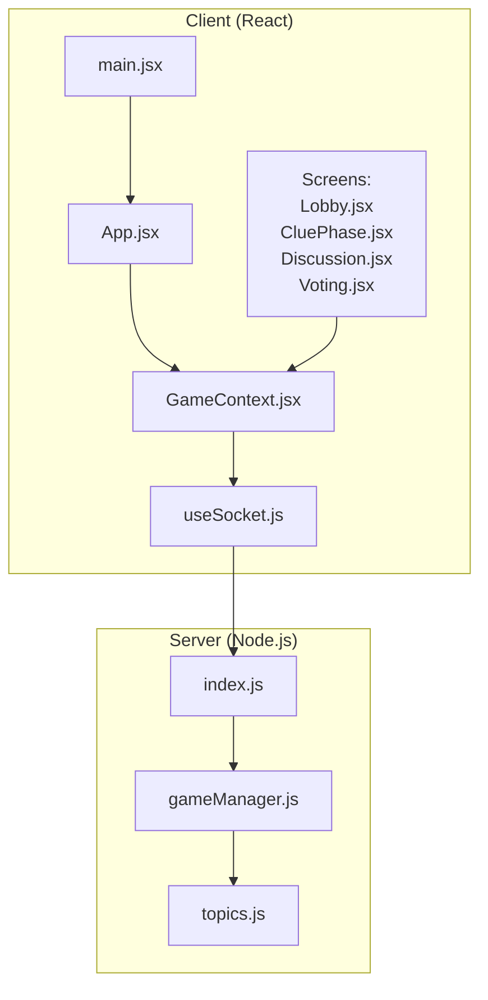
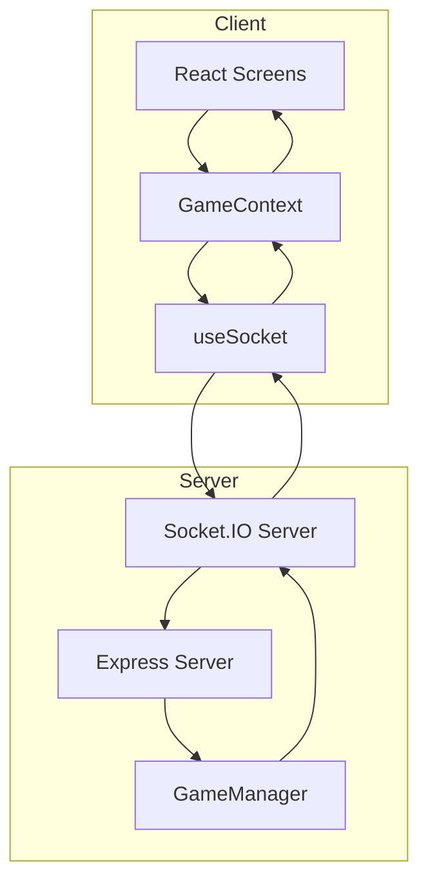
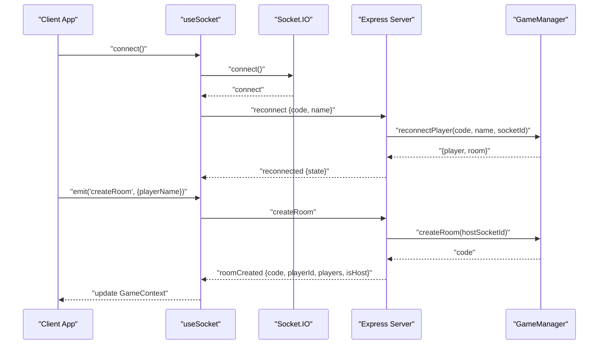
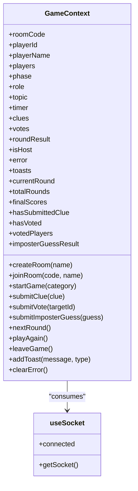
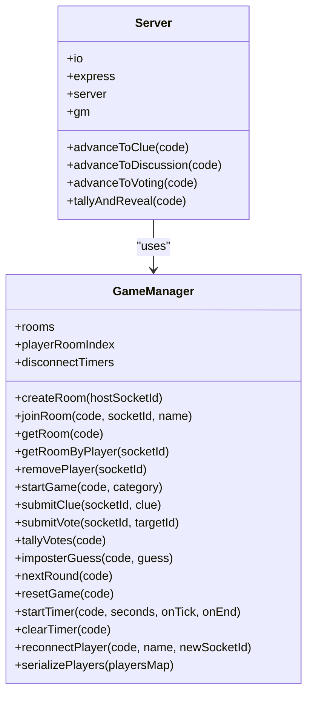
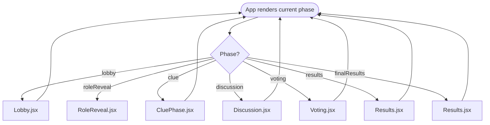
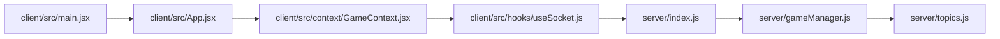

# Architecture Overview

<cite>
**Referenced Files in This Document**
- [README.md](file://README.md)
- [server/index.js](file://server/index.js)
- [server/gameManager.js](file://server/gameManager.js)
- [server/topics.js](file://server/topics.js)
- [client/src/main.jsx](file://client/src/main.jsx)
- [client/src/App.jsx](file://client/src/App.jsx)
- [client/src/context/GameContext.jsx](file://client/src/context/GameContext.jsx)
- [client/src/hooks/useSocket.js](file://client/src/hooks/useSocket.js)
- [client/src/screens/Lobby.jsx](file://client/src/screens/Lobby.jsx)
- [client/src/screens/CluePhase.jsx](file://client/src/screens/CluePhase.jsx)
- [client/src/screens/Discussion.jsx](file://client/src/screens/Discussion.jsx)
- [client/src/screens/Voting.jsx](file://client/src/screens/Voting.jsx)
</cite>

## Table of Contents
1. [Introduction](#introduction)
2. [Project Structure](#project-structure)
3. [Core Components](#core-components)
4. [Architecture Overview](#architecture-overview)
5. [Detailed Component Analysis](#detailed-component-analysis)
6. [Dependency Analysis](#dependency-analysis)
7. [Performance Considerations](#performance-considerations)
8. [Troubleshooting Guide](#troubleshooting-guide)
9. [Conclusion](#conclusion)

## Introduction
This document describes the architectural design of the Imposter Game system, a real-time multiplayer bluffing game built with a React frontend and a Node.js/Express + Socket.IO backend. The system uses an event-driven architecture to synchronize game state across clients in real time, with React Context managing local state and Socket.IO events coordinating server-side game logic and broadcasting updates to all players.

Key goals:
- Real-time synchronization of game phases, timers, roles, clues, votes, and results
- Robust connection handling with reconnection and graceful degradation
- Clear separation of concerns between client-side UI and server-side game state machine
- Cross-cutting concerns: error handling, timeouts, and graceful user feedback

## Project Structure
The repository is organized into two primary directories:
- server: Express server, Socket.IO integration, and the GameManager that maintains game state and enforces rules
- client: React application with Vite, Tailwind CSS, and screen components for each game phase

**Diagram sources**
- [client/src/main.jsx:1-14](file://client/src/main.jsx#L1-L14)
- [client/src/App.jsx:1-101](file://client/src/App.jsx#L1-L101)
- [client/src/context/GameContext.jsx:1-383](file://client/src/context/GameContext.jsx#L1-L383)
- [client/src/hooks/useSocket.js:1-76](file://client/src/hooks/useSocket.js#L1-L76)
- [client/src/screens/Lobby.jsx:1-211](file://client/src/screens/Lobby.jsx#L1-L211)
- [client/src/screens/CluePhase.jsx:1-165](file://client/src/screens/CluePhase.jsx#L1-L165)
- [client/src/screens/Discussion.jsx:1-114](file://client/src/screens/Discussion.jsx#L1-L114)
- [client/src/screens/Voting.jsx:1-180](file://client/src/screens/Voting.jsx#L1-L180)
- [server/index.js:1-687](file://server/index.js#L1-L687)
- [server/gameManager.js:1-636](file://server/gameManager.js#L1-L636)
- [server/topics.js:1-104](file://server/topics.js#L1-L104)

**Section sources**
- [README.md:88-111](file://README.md#L88-L111)
- [client/src/main.jsx:1-14](file://client/src/main.jsx#L1-L14)
- [server/index.js:1-687](file://server/index.js#L1-L687)

## Core Components
- React Application
  - Entry point initializes the React root and wraps the app with GameProvider
  - App renders the current screen based on the active game phase and displays connection status and toasts
  - GameContext manages global state and exposes actions to emit Socket.IO events
  - useSocket encapsulates the Socket.IO connection, reconnection policy, and reconnection on startup
  - Screens implement UI for each game phase and react to state changes from GameContext

- Server
  - Express server with CORS and JSON middleware
  - Socket.IO server that handles connection lifecycle and routes events to GameManager
  - GameManager maintains rooms, players, timers, votes, and scoring; broadcasts state changes to clients

- Data and Topics
  - topics.js defines word categories used for assigning topics to players

**Section sources**
- [client/src/main.jsx:1-14](file://client/src/main.jsx#L1-L14)
- [client/src/App.jsx:1-101](file://client/src/App.jsx#L1-L101)
- [client/src/context/GameContext.jsx:1-383](file://client/src/context/GameContext.jsx#L1-L383)
- [client/src/hooks/useSocket.js:1-76](file://client/src/hooks/useSocket.js#L1-L76)
- [server/index.js:1-687](file://server/index.js#L1-L687)
- [server/gameManager.js:1-636](file://server/gameManager.js#L1-L636)
- [server/topics.js:1-104](file://server/topics.js#L1-L104)

## Architecture Overview
The system follows a client-server architecture with real-time bidirectional communication via Socket.IO. The server acts as the authoritative source of truth for game state, while the client renders the UI and coordinates user interactions.

**Diagram sources**
- [client/src/context/GameContext.jsx:12-380](file://client/src/context/GameContext.jsx#L12-L380)
- [client/src/hooks/useSocket.js:8-75](file://client/src/hooks/useSocket.js#L8-L75)
- [server/index.js:14-686](file://server/index.js#L14-L686)
- [server/gameManager.js:9-17](file://server/gameManager.js#L9-L17)

### Event-Driven Communication Model
- Client emits commands to the server (e.g., createRoom, joinRoom, startGame, submitClue, submitVote, imposterGuess, nextRound, playAgain, reconnect)
- Server responds with events that update client state (e.g., roomCreated, joinedRoom, phaseChanged, timerTick, clueReceived, voteSubmitted, roundResult, gameOver, reconnected)
- Server also broadcasts state changes to all clients in a room (e.g., playerJoined, playerLeft, playerDisconnected, playerReconnected, youAreHost)

**Diagram sources**
- [client/src/hooks/useSocket.js:34-72](file://client/src/hooks/useSocket.js#L34-L72)
- [server/index.js:173-210](file://server/index.js#L173-L210)
- [server/gameManager.js:53-90](file://server/gameManager.js#L53-L90)

**Section sources**
- [README.md:113-135](file://README.md#L113-L135)
- [server/index.js:173-676](file://server/index.js#L173-L676)
- [client/src/context/GameContext.jsx:70-254](file://client/src/context/GameContext.jsx#L70-L254)

## Detailed Component Analysis

### React Frontend: GameContext and useSocket
- GameContext
  - Provides a centralized state store for room code, player identity, players list, current phase, role/topic, timer, clues, votes, round results, host flag, errors, toasts, rounds, and submission flags
  - Exposes actions to emit Socket.IO events (createRoom, joinRoom, startGame, submitClue, submitVote, submitImposterGuess, nextRound, playAgain, leaveGame)
  - Registers Socket.IO event listeners to update state and show notifications
  - Implements error handling with timed toasts and automatic clearing

- useSocket
  - Creates a singleton Socket.IO connection with reconnection enabled and polling fallback
  - On connect, attempts to reconnect previously joined rooms using stored session data
  - Tracks connection status and exposes it to the rest of the app

**Diagram sources**
- [client/src/context/GameContext.jsx:12-380](file://client/src/context/GameContext.jsx#L12-L380)
- [client/src/hooks/useSocket.js:8-75](file://client/src/hooks/useSocket.js#L8-L75)

**Section sources**
- [client/src/context/GameContext.jsx:12-380](file://client/src/context/GameContext.jsx#L12-L380)
- [client/src/hooks/useSocket.js:8-75](file://client/src/hooks/useSocket.js#L8-L75)

### Server: Socket.IO and GameManager
- index.js
  - Initializes Express, CORS, JSON parsing, HTTP server, and Socket.IO with CORS configuration
  - Defines health check endpoint and serializes player data for clients
  - Implements game progression functions (advanceToClue, advanceToDiscussion, advanceToVoting, tallyAndReveal)
  - Registers Socket.IO event handlers for room creation/joining, starting the game, submitting clues/votes, imposter guessing, advancing rounds, playing again, and reconnection
  - Handles disconnections with a 30-second grace period and removes players who do not reconnect

- gameManager.js
  - Manages rooms, players, rounds, timers, votes, and scoring
  - Enforces game rules (minimum players, category validation, clue length limits, self-vote prevention)
  - Implements tie-breaking for votes and scoring mechanics
  - Supports reconnection by updating socket IDs and maintaining host/imposter state
  - Serializes player data for efficient client transmission

**Diagram sources**
- [server/gameManager.js:9-636](file://server/gameManager.js#L9-L636)
- [server/index.js:14-686](file://server/index.js#L14-L686)

**Section sources**
- [server/index.js:14-686](file://server/index.js#L14-L686)
- [server/gameManager.js:9-636](file://server/gameManager.js#L9-L636)

### Client Screens and Phase Transitions
- App.jsx
  - Renders the current screen based on the active phase and applies smooth transitions
  - Displays connection status and toast notifications overlay
  - Uses GameContext to access state and actions

- Lobby.jsx
  - Shows room code, player list with connectivity indicators, and category selection for the host
  - Enables starting the game when conditions are met

- CluePhase.jsx
  - Timer UI and input for one-word clues
  - Displays submitted clues and submission status per player

- Discussion.jsx
  - Timer UI and list of submitted clues for discussion
  - Visual indicators for ongoing activity

- Voting.jsx
  - Player grid with selection and lock-in button
  - Shows vote progress and indicates who has voted

**Diagram sources**
- [client/src/App.jsx:56-100](file://client/src/App.jsx#L56-L100)
- [client/src/screens/Lobby.jsx:56-211](file://client/src/screens/Lobby.jsx#L56-L211)
- [client/src/screens/CluePhase.jsx:45-165](file://client/src/screens/CluePhase.jsx#L45-L165)
- [client/src/screens/Discussion.jsx:45-114](file://client/src/screens/Discussion.jsx#L45-L114)
- [client/src/screens/Voting.jsx:56-180](file://client/src/screens/Voting.jsx#L56-L180)

**Section sources**
- [client/src/App.jsx:56-100](file://client/src/App.jsx#L56-L100)
- [client/src/screens/Lobby.jsx:56-211](file://client/src/screens/Lobby.jsx#L56-L211)
- [client/src/screens/CluePhase.jsx:45-165](file://client/src/screens/CluePhase.jsx#L45-L165)
- [client/src/screens/Discussion.jsx:45-114](file://client/src/screens/Discussion.jsx#L45-L114)
- [client/src/screens/Voting.jsx:56-180](file://client/src/screens/Voting.jsx#L56-L180)

## Dependency Analysis
- Client depends on:
  - React for UI rendering
  - Socket.IO client for real-time communication
  - GameContext for state management
  - Screens for phase-specific UI

- Server depends on:
  - Express for HTTP routing
  - Socket.IO for real-time events
  - GameManager for game logic and state
  - topics.js for word lists

**Diagram sources**
- [client/src/main.jsx:1-14](file://client/src/main.jsx#L1-L14)
- [client/src/App.jsx:1-101](file://client/src/App.jsx#L1-L101)
- [client/src/context/GameContext.jsx:1-383](file://client/src/context/GameContext.jsx#L1-L383)
- [client/src/hooks/useSocket.js:1-76](file://client/src/hooks/useSocket.js#L1-L76)
- [server/index.js:1-687](file://server/index.js#L1-L687)
- [server/gameManager.js:1-636](file://server/gameManager.js#L1-L636)
- [server/topics.js:1-104](file://server/topics.js#L1-L104)

**Section sources**
- [client/src/main.jsx:1-14](file://client/src/main.jsx#L1-L14)
- [server/index.js:14-25](file://server/index.js#L14-L25)

## Performance Considerations
- Real-time timers: Server-side timers reduce clock drift and ensure synchronized timing across clients
- Efficient serialization: GameManager serializes player data to arrays for compact transmission
- Minimal DOM updates: React state updates and transitions keep UI responsive during rapid state changes
- Connection resilience: Socket.IO reconnection with exponential backoff reduces dropped connections under network instability
- Graceful degradation: UI remains functional even when disconnected; reconnection restores state seamlessly

## Troubleshooting Guide
Common issues and remedies:
- Connection problems
  - Verify VITE_SERVER_URL points to the deployed server
  - Check CORS configuration on the server
  - Confirm Socket.IO reconnection attempts are enabled

- Room join failures
  - Ensure room code is uppercase and matches the host’s room
  - Confirm player name uniqueness within the room
  - Verify room is still in lobby phase

- Game state desynchronization
  - Use reconnected event to restore state after disconnection
  - Ensure timers are cleared and restarted appropriately on phase changes

- Scoring anomalies
  - Verify tie-breaking logic and vote counting in GameManager
  - Confirm imposter guess correctness and scoring adjustments

**Section sources**
- [client/src/hooks/useSocket.js:34-72](file://client/src/hooks/useSocket.js#L34-L72)
- [server/index.js:542-608](file://server/index.js#L542-L608)
- [server/gameManager.js:316-378](file://server/gameManager.js#L316-L378)

## Conclusion
The Imposter Game employs a clean, event-driven architecture that separates client UI concerns from server-side game logic. React Context centralizes state and actions, while Socket.IO ensures reliable, real-time synchronization across clients. The GameManager enforces game rules and maintains authoritative state, enabling robust gameplay with graceful connection handling and clear phase transitions. This design supports scalability, maintainability, and a smooth user experience across devices.