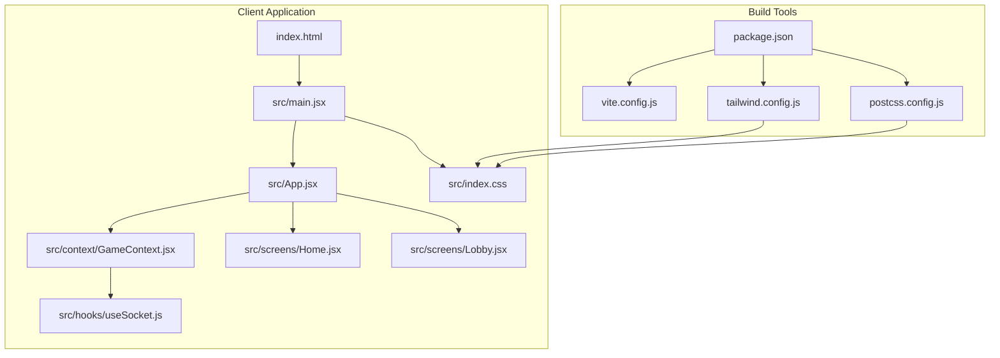
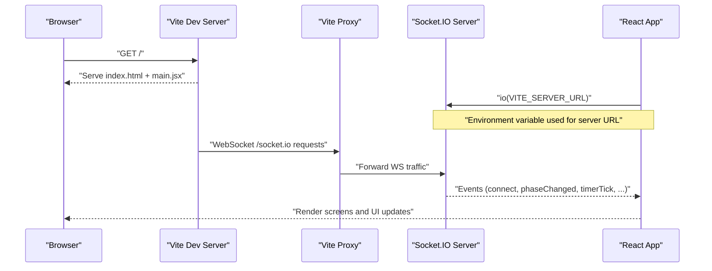
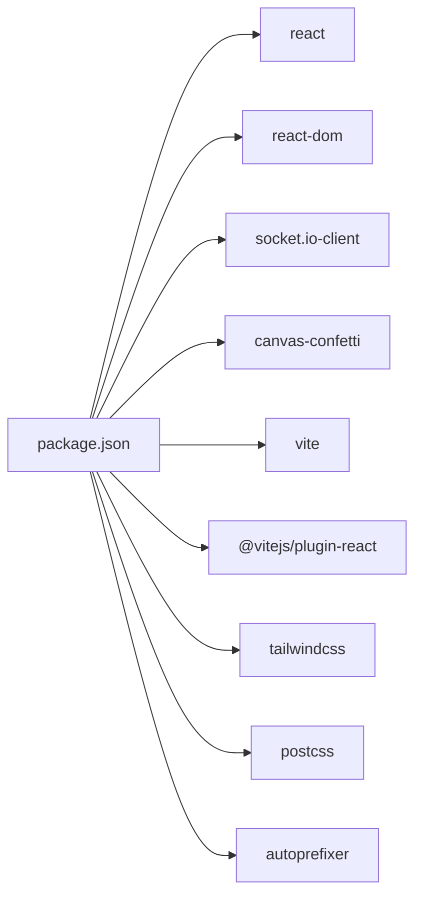

# Build Configuration and Development Setup

<cite>
**Referenced Files in This Document**
- [package.json](file://client/package.json)
- [vite.config.js](file://client/vite.config.js)
- [tailwind.config.js](file://client/tailwind.config.js)
- [postcss.config.js](file://client/postcss.config.js)
- [index.html](file://client/index.html)
- [main.jsx](file://client/src/main.jsx)
- [index.css](file://client/src/index.css)
- [App.jsx](file://client/src/App.jsx)
- [GameContext.jsx](file://client/src/context/GameContext.jsx)
- [useSocket.js](file://client/src/hooks/useSocket.js)
- [Home.jsx](file://client/src/screens/Home.jsx)
- [Lobby.jsx](file://client/src/screens/Lobby.jsx)
- [README.md](file://README.md)
</cite>

## Table of Contents
1. [Introduction](#introduction)
2. [Project Structure](#project-structure)
3. [Core Components](#core-components)
4. [Architecture Overview](#architecture-overview)
5. [Detailed Component Analysis](#detailed-component-analysis)
6. [Dependency Analysis](#dependency-analysis)
7. [Performance Considerations](#performance-considerations)
8. [Troubleshooting Guide](#troubleshooting-guide)
9. [Conclusion](#conclusion)
10. [Appendices](#appendices)

## Introduction
This document explains the complete build configuration and development setup for the React client application. It covers Vite configuration (development server, proxying, and asset handling), package dependencies (React, Socket.IO client, Canvas Confetti, and build tools), Tailwind CSS configuration (design system, color palette, animations, and custom utilities), and PostCSS processing. It also provides step-by-step development setup, environment variable configuration, deployment preparation, performance optimization strategies, and troubleshooting guidance.

## Project Structure
The client application is organized around a Vite-managed React project with Tailwind CSS for styling and PostCSS for processing. The build pipeline integrates React Fast Refresh, CSS processing, and runtime proxying for the Socket.IO server during development.

**Diagram sources**
- [index.html:1-20](file://client/index.html#L1-L20)
- [main.jsx:1-14](file://client/src/main.jsx#L1-L14)
- [App.jsx:1-101](file://client/src/App.jsx#L1-L101)
- [GameContext.jsx:1-383](file://client/src/context/GameContext.jsx#L1-L383)
- [useSocket.js:1-76](file://client/src/hooks/useSocket.js#L1-L76)
- [Home.jsx:1-231](file://client/src/screens/Home.jsx#L1-L231)
- [Lobby.jsx:1-211](file://client/src/screens/Lobby.jsx#L1-L211)
- [index.css:1-215](file://client/src/index.css#L1-L215)
- [package.json:1-26](file://client/package.json#L1-L26)
- [vite.config.js:1-16](file://client/vite.config.js#L1-L16)
- [tailwind.config.js:1-48](file://client/tailwind.config.js#L1-L48)
- [postcss.config.js:1-2](file://client/postcss.config.js#L1-L2)

**Section sources**
- [index.html:1-20](file://client/index.html#L1-L20)
- [main.jsx:1-14](file://client/src/main.jsx#L1-L14)
- [package.json:1-26](file://client/package.json#L1-L26)

## Core Components
- Vite configuration defines the development server port and a proxy for Socket.IO WebSocket connections to the backend server.
- Tailwind CSS configuration enables scanning of templates and JS/JSX files, extends a custom color palette, and registers custom animations and keyframes.
- PostCSS configuration activates Tailwind and Autoprefixer plugins.
- React application bootstraps the app with a provider that manages global game state and a Socket.IO connection hook.
- Environment variables are consumed via Vite’s import.meta.env to configure the Socket.IO server URL.

**Section sources**
- [vite.config.js:1-16](file://client/vite.config.js#L1-L16)
- [tailwind.config.js:1-48](file://client/tailwind.config.js#L1-L48)
- [postcss.config.js:1-2](file://client/postcss.config.js#L1-L2)
- [main.jsx:1-14](file://client/src/main.jsx#L1-L14)
- [useSocket.js:1-76](file://client/src/hooks/useSocket.js#L1-L76)
- [package.json:1-26](file://client/package.json#L1-L26)

## Architecture Overview
The client integrates React with Vite for development and build, Tailwind CSS for styling, and PostCSS for processing. During development, Vite proxies Socket.IO WebSocket traffic to the backend server. The application uses a centralized context to manage game state and emits/receives events via Socket.IO.

**Diagram sources**
- [vite.config.js:6-14](file://client/vite.config.js#L6-L14)
- [useSocket.js:4-4](file://client/src/hooks/useSocket.js#L4-L4)
- [index.html:1-20](file://client/index.html#L1-L20)
- [App.jsx:1-101](file://client/src/App.jsx#L1-L101)

## Detailed Component Analysis

### Vite Configuration
- Plugin stack includes @vitejs/plugin-react for JSX transforms and Fast Refresh.
- Development server runs on port 5173.
- Proxy configuration forwards WebSocket connections for /socket.io to the backend server URL.
- No build-time asset optimization is configured in the Vite config; defaults apply.

Key behaviors:
- Hot Module Replacement (HMR) enabled via React plugin.
- WebSocket proxy ensures seamless local development with the backend.

**Section sources**
- [vite.config.js:1-16](file://client/vite.config.js#L1-L16)

### Tailwind CSS Configuration
- Content scanning targets index.html and all JS/JSX under src/.
- Theme extensions:
  - Color palette: dark shades, accent colors, and neon palette.
  - Animation utilities: pulse-ring, fade-in, slide-up, scale-in, glow, float.
  - Keyframes for each animation.
- Plugins array is empty; no additional Tailwind plugins are enabled.

Custom utilities and animations are defined in the global CSS file and referenced by components.

**Section sources**
- [tailwind.config.js:1-48](file://client/tailwind.config.js#L1-L48)
- [index.css:1-215](file://client/src/index.css#L1-L215)

### PostCSS Configuration
- Enables Tailwind and Autoprefixer plugins.
- Ensures vendor prefixes are added and Tailwind directives are processed.

**Section sources**
- [postcss.config.js:1-2](file://client/postcss.config.js#L1-L2)

### React Application Bootstrap
- The root module imports the App component and wraps it in a GameProvider.
- Tailwind directives are included in the global CSS file.
- The application renders a full-screen layout with a gradient background and routes to different screens based on game phase.

**Section sources**
- [main.jsx:1-14](file://client/src/main.jsx#L1-L14)
- [index.css:1-3](file://client/src/index.css#L1-L3)
- [App.jsx:67-99](file://client/src/App.jsx#L67-L99)

### Game Context and Socket Hook
- The GameProvider initializes and manages game state, including room code, players, phase, role, timer, clues, votes, and UI notifications.
- The useSocket hook establishes a Socket.IO connection with reconnection settings and exposes connected status and the socket instance.
- Environment variable VITE_SERVER_URL controls the server URL used by the client.

**Section sources**
- [GameContext.jsx:12-380](file://client/src/context/GameContext.jsx#L12-L380)
- [useSocket.js:1-76](file://client/src/hooks/useSocket.js#L1-L76)
- [package.json:4-4](file://client/package.json#L4-L4)

### Screens and Styling
- Home and Lobby screens demonstrate Tailwind utilities, custom animations, and responsive design patterns.
- Components use Tailwind classes for layout, colors, shadows, and transitions, and rely on custom animations defined in Tailwind and CSS.

**Section sources**
- [Home.jsx:12-231](file://client/src/screens/Home.jsx#L12-L231)
- [Lobby.jsx:56-211](file://client/src/screens/Lobby.jsx#L56-L211)
- [tailwind.config.js:10-44](file://client/tailwind.config.js#L10-L44)
- [index.css:111-215](file://client/src/index.css#L111-L215)

## Dependency Analysis
The client depends on React and React DOM for rendering, Socket.IO client for real-time communication, and Canvas Confetti for celebratory effects. Build-time dependencies include Vite, @vitejs/plugin-react, Tailwind CSS, PostCSS, and Autoprefixer.

**Diagram sources**
- [package.json:12-24](file://client/package.json#L12-L24)

**Section sources**
- [package.json:12-24](file://client/package.json#L12-L24)

## Performance Considerations
- Development server: Vite’s default configuration provides fast HMR and efficient asset serving. No additional Vite plugins are configured for bundling in this project.
- CSS processing: Tailwind purging is controlled by content globs; ensure all template and component paths are included to remove unused styles.
- Animations: Custom CSS animations and transitions are used; keep keyframe complexity minimal for smooth performance on mobile devices.
- Asset handling: No explicit asset optimization is configured; defaults apply. For production builds, Vite’s default minification and asset handling are sufficient for this project size.
- Bundle analysis: Not configured. To analyze bundle size, integrate a Vite plugin such as vite-bundle-analyzer or use Vite’s built-in preview with profiling tools.

[No sources needed since this section provides general guidance]

## Troubleshooting Guide
Common issues and resolutions:
- Socket.IO connection failures:
  - Verify VITE_SERVER_URL environment variable matches the deployed backend URL.
  - Confirm the backend server is reachable and listening on the expected port.
  - Check browser console for WebSocket errors and CORS-related messages.
- Proxy not forwarding WebSocket traffic:
  - Ensure the proxy target in Vite config matches the backend server URL.
  - Confirm the backend is configured to accept WebSocket connections.
- Tailwind utilities not applying:
  - Verify content globs in Tailwind config include all relevant files.
  - Run a clean build or restart the dev server after adding new files.
- Missing fonts or theme color:
  - Confirm the preconnect and stylesheet links in index.html are present.
  - Ensure the theme color meta tag is set appropriately.

**Section sources**
- [useSocket.js:4-4](file://client/src/hooks/useSocket.js#L4-L4)
- [vite.config.js:8-12](file://client/vite.config.js#L8-L12)
- [tailwind.config.js:2-2](file://client/tailwind.config.js#L2-L2)
- [index.html:7-13](file://client/index.html#L7-L13)

## Conclusion
The client application is configured for a streamlined development experience with Vite, Tailwind CSS, and PostCSS. The Socket.IO client integrates seamlessly with the backend via a development proxy. The design system is defined through Tailwind’s theme extensions and custom CSS animations. For production, deploy the client to a static hosting platform and configure the VITE_SERVER_URL environment variable to point to the backend service.

[No sources needed since this section summarizes without analyzing specific files]

## Appendices

### Step-by-Step Development Setup
- Install dependencies:
  - Navigate to the server directory and install server dependencies.
  - Navigate to the client directory and install client dependencies.
- Start the server:
  - Run the server in development mode.
- Start the client:
  - Run the client in development mode.
- Open the application:
  - Access the application at the development server URL.

Environment variables:
- VITE_SERVER_URL: Configure the Socket.IO server URL for the client.

Deployment preparation:
- Server:
  - Deploy the server to a platform that supports Node.js and sets the PORT environment variable.
- Client:
  - Deploy the client to a static hosting platform and set VITE_SERVER_URL to the backend URL.

**Section sources**
- [README.md:5-25](file://README.md#L5-L25)
- [README.md:48-61](file://README.md#L48-L61)
- [README.md:62-80](file://README.md#L62-L80)
- [useSocket.js:4-4](file://client/src/hooks/useSocket.js#L4-L4)

### Build and Preview Commands
- Development: npm run dev
- Production build: npm run build
- Preview production build locally: npm run preview

**Section sources**
- [package.json:7-11](file://client/package.json#L7-L11)

### Tailwind and PostCSS Notes
- Tailwind directives are included in the global CSS file.
- PostCSS plugins are configured to process Tailwind and add vendor prefixes.

**Section sources**
- [index.css:1-3](file://client/src/index.css#L1-L3)
- [postcss.config.js:1-2](file://client/postcss.config.js#L1-L2)