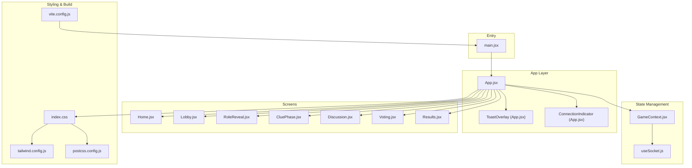
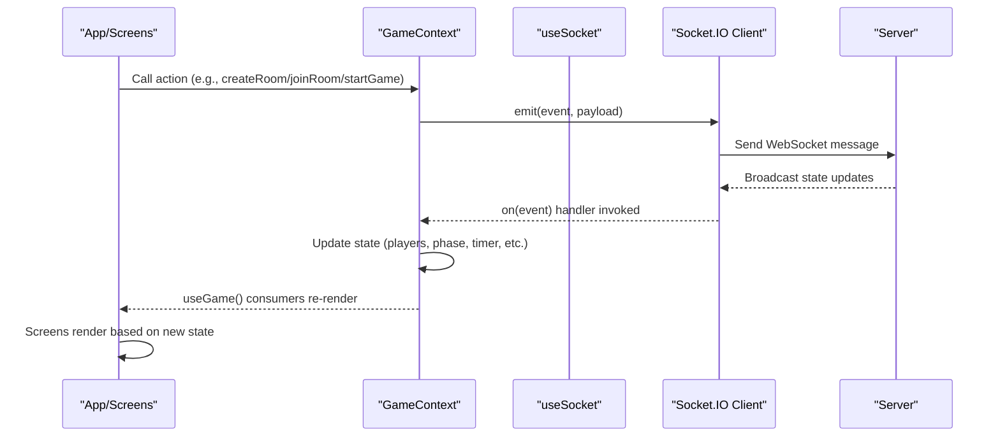
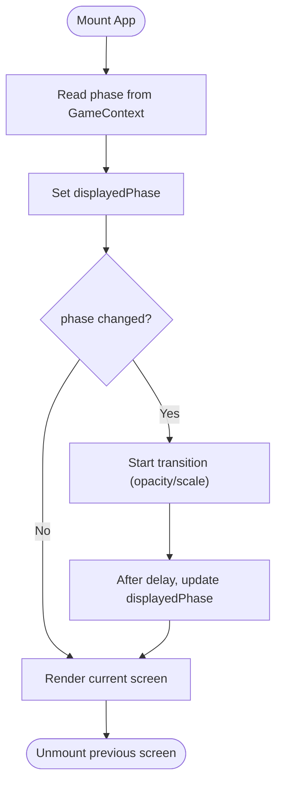
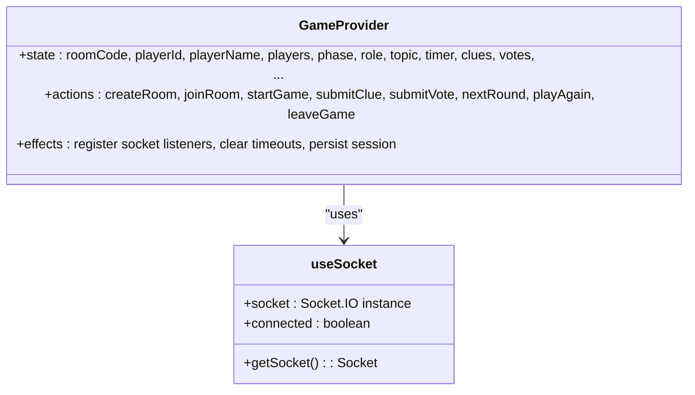
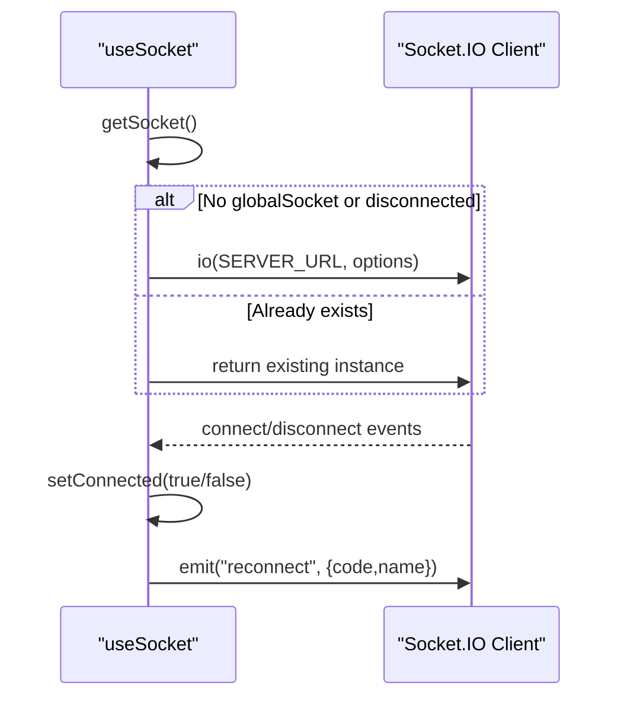
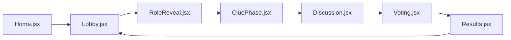
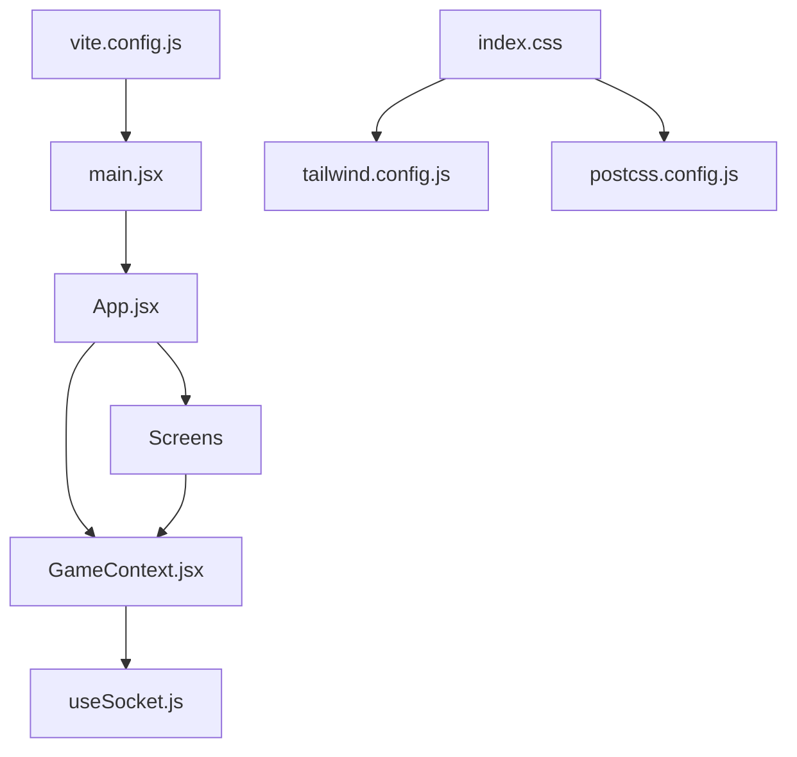

# Client Architecture

<cite>
**Referenced Files in This Document**
- [main.jsx](file://client/src/main.jsx)
- [App.jsx](file://client/src/App.jsx)
- [GameContext.jsx](file://client/src/context/GameContext.jsx)
- [useSocket.js](file://client/src/hooks/useSocket.js)
- [Home.jsx](file://client/src/screens/Home.jsx)
- [Lobby.jsx](file://client/src/screens/Lobby.jsx)
- [RoleReveal.jsx](file://client/src/screens/RoleReveal.jsx)
- [CluePhase.jsx](file://client/src/screens/CluePhase.jsx)
- [Discussion.jsx](file://client/src/screens/Discussion.jsx)
- [Voting.jsx](file://client/src/screens/Voting.jsx)
- [Results.jsx](file://client/src/screens/Results.jsx)
- [index.css](file://client/src/index.css)
- [vite.config.js](file://client/vite.config.js)
- [tailwind.config.js](file://client/tailwind.config.js)
- [postcss.config.js](file://client/postcss.config.js)
- [package.json](file://client/package.json)
</cite>

## Table of Contents
1. [Introduction](#introduction)
2. [Project Structure](#project-structure)
3. [Core Components](#core-components)
4. [Architecture Overview](#architecture-overview)
5. [Detailed Component Analysis](#detailed-component-analysis)
6. [Dependency Analysis](#dependency-analysis)
7. [Performance Considerations](#performance-considerations)
8. [Troubleshooting Guide](#troubleshooting-guide)
9. [Conclusion](#conclusion)

## Introduction
This document describes the client architecture of the React-based frontend for the multiplayer Imposter game. It covers the component hierarchy starting from the root, the centralized state management via React Context and the GameContext provider pattern, WebSocket integration through a custom hook, real-time event handling, build configuration with Vite, styling and responsive design with Tailwind CSS, and performance and error-handling strategies.

## Project Structure
The client is organized around a small set of core files:
- Root entry initializes the React app and wraps it in the GameProvider.
- App renders the current screen with transitions and overlays.
- GameContext manages all game state and WebSocket events.
- useSocket encapsulates connection lifecycle and reconnection logic.
- Screens implement gameplay phases with Tailwind-styled UIs.
- Vite configures development server, proxy, and React plugin.
- Tailwind and PostCSS configure design tokens and animations.

**Diagram sources**
- [main.jsx:1-14](file://client/src/main.jsx#L1-L14)
- [App.jsx:67-100](file://client/src/App.jsx#L67-L100)
- [GameContext.jsx:12-380](file://client/src/context/GameContext.jsx#L12-L380)
- [useSocket.js:8-76](file://client/src/hooks/useSocket.js#L8-L76)
- [Home.jsx:12-231](file://client/src/screens/Home.jsx#L12-L231)
- [Lobby.jsx:56-211](file://client/src/screens/Lobby.jsx#L56-L211)
- [RoleReveal.jsx:4-123](file://client/src/screens/RoleReveal.jsx#L4-L123)
- [CluePhase.jsx:45-165](file://client/src/screens/CluePhase.jsx#L45-L165)
- [Discussion.jsx:45-114](file://client/src/screens/Discussion.jsx#L45-L114)
- [Voting.jsx:56-180](file://client/src/screens/Voting.jsx#L56-L180)
- [Results.jsx:100-443](file://client/src/screens/Results.jsx#L100-L443)
- [index.css:1-215](file://client/src/index.css#L1-L215)
- [tailwind.config.js:1-48](file://client/tailwind.config.js#L1-L48)
- [postcss.config.js:1-2](file://client/postcss.config.js#L1-L2)
- [vite.config.js:1-16](file://client/vite.config.js#L1-L16)

**Section sources**
- [main.jsx:1-14](file://client/src/main.jsx#L1-L14)
- [App.jsx:56-100](file://client/src/App.jsx#L56-L100)
- [index.css:1-215](file://client/src/index.css#L1-L215)
- [vite.config.js:1-16](file://client/vite.config.js#L1-L16)
- [tailwind.config.js:1-48](file://client/tailwind.config.js#L1-L48)
- [postcss.config.js:1-2](file://client/postcss.config.js#L1-L2)

## Core Components
- App.jsx orchestrates the current screen, handles phase transitions, and renders global overlays (toasts and connection indicator).
- GameContext.jsx provides centralized state and actions, subscribes to WebSocket events, and exposes a rich API to all screens.
- useSocket.js manages a singleton Socket.IO client with reconnection, error handling, and automatic rejoin on reconnect.
- Screens implement gameplay phases: Home, Lobby, RoleReveal, CluePhase, Discussion, Voting, Results.

Key responsibilities:
- State synchronization: All server-driven updates flow into GameContext, which screens consume via useGame().
- Real-time events: GameContext registers handlers for room lifecycle, roles, timers, clues, votes, and results.
- User actions: Screens call GameContext actions (createRoom, joinRoom, startGame, submitClue, submitVote, etc.) to emit commands.

**Section sources**
- [App.jsx:11-100](file://client/src/App.jsx#L11-L100)
- [GameContext.jsx:12-380](file://client/src/context/GameContext.jsx#L12-L380)
- [useSocket.js:8-76](file://client/src/hooks/useSocket.js#L8-L76)

## Architecture Overview
The runtime flow connects UI screens to the server via a shared WebSocket connection managed by GameContext and useSocket.

**Diagram sources**
- [GameContext.jsx:256-337](file://client/src/context/GameContext.jsx#L256-L337)
- [useSocket.js:34-72](file://client/src/hooks/useSocket.js#L34-L72)
- [App.jsx:67-100](file://client/src/App.jsx#L67-L100)

## Detailed Component Analysis

### App.jsx: Screen Routing and Transitions
- Maintains a mapping of phase to screen component.
- Uses a transition state to animate screen changes with fade/scale effects.
- Renders global overlays: ConnectionIndicator and ToastOverlay.
- Reads current phase from GameContext and switches the active screen accordingly.

**Diagram sources**
- [App.jsx:67-81](file://client/src/App.jsx#L67-L81)
- [App.jsx:83-99](file://client/src/App.jsx#L83-L99)

**Section sources**
- [App.jsx:56-100](file://client/src/App.jsx#L56-L100)

### GameContext.jsx: Centralized State and Actions
- Provides a single source of truth for game state: room, players, phase, role/topic, timer, clues, votes, rounds, toasts, errors, and host status.
- Exposes actions to mutate state and communicate with the server (createRoom, joinRoom, startGame, submitClue, submitVote, nextRound, playAgain, leaveGame).
- Registers and unregisters numerous socket event handlers to keep state synchronized with the server.
- Manages toasts and transient errors with timeouts and cleanup.

**Diagram sources**
- [GameContext.jsx:12-380](file://client/src/context/GameContext.jsx#L12-L380)
- [useSocket.js:8-76](file://client/src/hooks/useSocket.js#L8-L76)

**Section sources**
- [GameContext.jsx:12-380](file://client/src/context/GameContext.jsx#L12-L380)

### useSocket.js: WebSocket Integration
- Creates a singleton Socket.IO client configured with reconnection attempts, transport selection, and timeout.
- Tracks connection state and triggers rejoin on reconnect using stored session data.
- Exposes connected status and the socket instance to GameContext.

**Diagram sources**
- [useSocket.js:12-72](file://client/src/hooks/useSocket.js#L12-L72)

**Section sources**
- [useSocket.js:8-76](file://client/src/hooks/useSocket.js#L8-L76)

### Screens: Gameplay Phases
- Home: Name entry, create/join room, connection and error feedback.
- Lobby: Room code sharing, player list, host controls, category selection, start game.
- RoleReveal: Role/topic reveal with flip animation and timer.
- CluePhase: One-word clue submission with countdown ring and player status.
- Discussion: Shared clues display and animated speaking indicators.
- Voting: Player selection with lock-in, vote status, and countdown.
- Results: Round/final results with staggered reveal, confetti, scoring, and imposter guess.

**Diagram sources**
- [Home.jsx:12-231](file://client/src/screens/Home.jsx#L12-L231)
- [Lobby.jsx:56-211](file://client/src/screens/Lobby.jsx#L56-L211)
- [RoleReveal.jsx:4-123](file://client/src/screens/RoleReveal.jsx#L4-L123)
- [CluePhase.jsx:45-165](file://client/src/screens/CluePhase.jsx#L45-L165)
- [Discussion.jsx:45-114](file://client/src/screens/Discussion.jsx#L45-L114)
- [Voting.jsx:56-180](file://client/src/screens/Voting.jsx#L56-L180)
- [Results.jsx:100-443](file://client/src/screens/Results.jsx#L100-L443)

**Section sources**
- [Home.jsx:12-231](file://client/src/screens/Home.jsx#L12-L231)
- [Lobby.jsx:56-211](file://client/src/screens/Lobby.jsx#L56-L211)
- [RoleReveal.jsx:4-123](file://client/src/screens/RoleReveal.jsx#L4-L123)
- [CluePhase.jsx:45-165](file://client/src/screens/CluePhase.jsx#L45-L165)
- [Discussion.jsx:45-114](file://client/src/screens/Discussion.jsx#L45-L114)
- [Voting.jsx:56-180](file://client/src/screens/Voting.jsx#L56-L180)
- [Results.jsx:100-443](file://client/src/screens/Results.jsx#L100-L443)

## Dependency Analysis
- Entry depends on GameProvider and App.
- App depends on GameContext and screen components.
- GameContext depends on useSocket and exposes actions to screens.
- Screens depend on GameContext via useGame.
- Styling pipeline: index.css imports Tailwind directives; Tailwind reads tailwind.config.js; PostCSS applies Tailwind and Autoprefixer; Vite builds assets.

**Diagram sources**
- [main.jsx:1-14](file://client/src/main.jsx#L1-L14)
- [App.jsx:1-100](file://client/src/App.jsx#L1-L100)
- [GameContext.jsx:1-383](file://client/src/context/GameContext.jsx#L1-L383)
- [useSocket.js:1-76](file://client/src/hooks/useSocket.js#L1-L76)
- [index.css:1-215](file://client/src/index.css#L1-L215)
- [tailwind.config.js:1-48](file://client/tailwind.config.js#L1-L48)
- [postcss.config.js:1-2](file://client/postcss.config.js#L1-L2)
- [vite.config.js:1-16](file://client/vite.config.js#L1-L16)

**Section sources**
- [package.json:1-26](file://client/package.json#L1-L26)

## Performance Considerations
- Efficient re-renders: GameContext uses memoized callbacks (useCallback) for actions and toast/error helpers to avoid unnecessary renders.
- Event cleanup: Socket listeners are registered in a single effect and removed on teardown to prevent leaks.
- Transition optimization: App uses a minimal transition state and short animation durations to reduce layout thrashing.
- Rendering scope: Screens are pure functional components with local state only for UI, keeping render paths predictable.
- Memory hygiene: Timers and timeouts are cleared in effects and callbacks; session storage is used for persistence across reloads.
- Bundle size: Vite with React plugin and Tailwind optimize dev/build; keep animations and images scoped to avoid bloating.

[No sources needed since this section provides general guidance]

## Troubleshooting Guide
Common issues and strategies:
- Connection problems:
  - Verify Vite proxy targets the backend server for WebSocket upgrades.
  - Confirm environment variable for server URL is set if not using default.
- Reconnection:
  - On reconnect, the client emits a rejoin event with stored room code and name; ensure server handles rejoin gracefully.
- Error visibility:
  - Errors are surfaced via transient toasts; check addToast and setErrorWithTimeout behavior.
- State desync:
  - Ensure all state mutations go through GameContext actions and that socket handlers update state consistently.

**Section sources**
- [vite.config.js:6-14](file://client/vite.config.js#L6-L14)
- [useSocket.js:34-72](file://client/src/hooks/useSocket.js#L34-L72)
- [GameContext.jsx:40-68](file://client/src/context/GameContext.jsx#L40-L68)
- [GameContext.jsx:70-254](file://client/src/context/GameContext.jsx#L70-L254)

## Conclusion
The client architecture centers on a robust GameContext provider that synchronizes UI with server state via Socket.IO, while App.jsx coordinates screen transitions and global UX elements. The screens are cohesive, stateless UI components that rely on centralized state and actions. Vite and Tailwind streamline development and styling, enabling a responsive, animated experience optimized for real-time interaction.