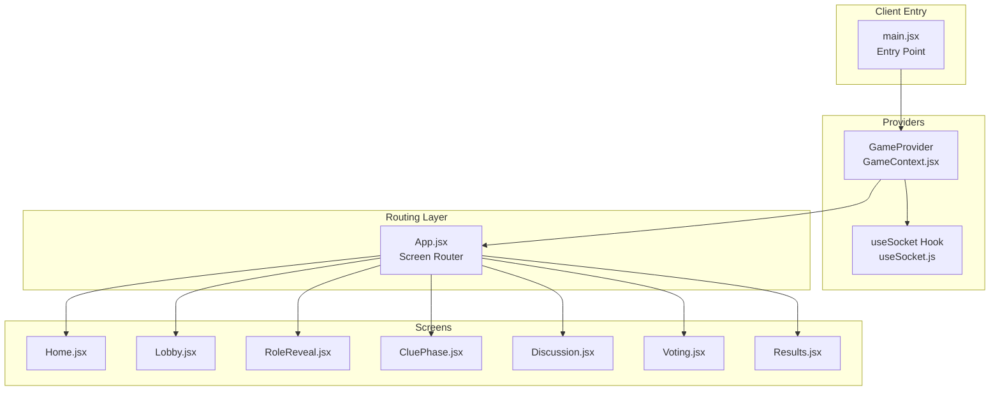
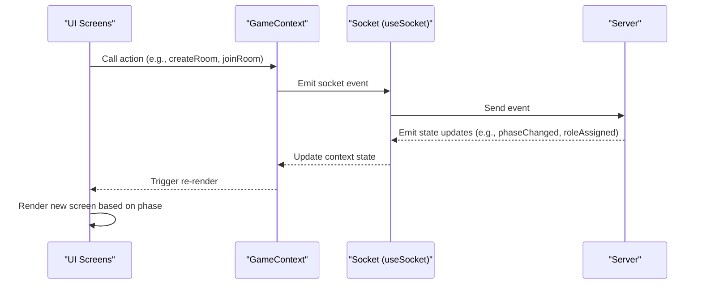
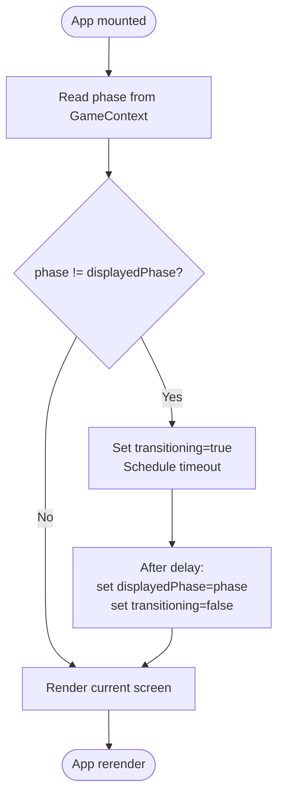
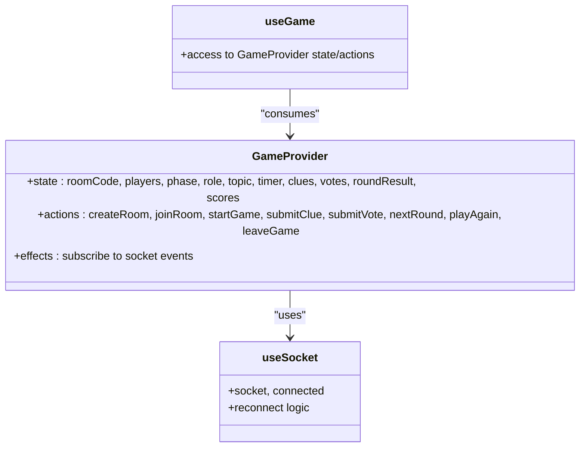
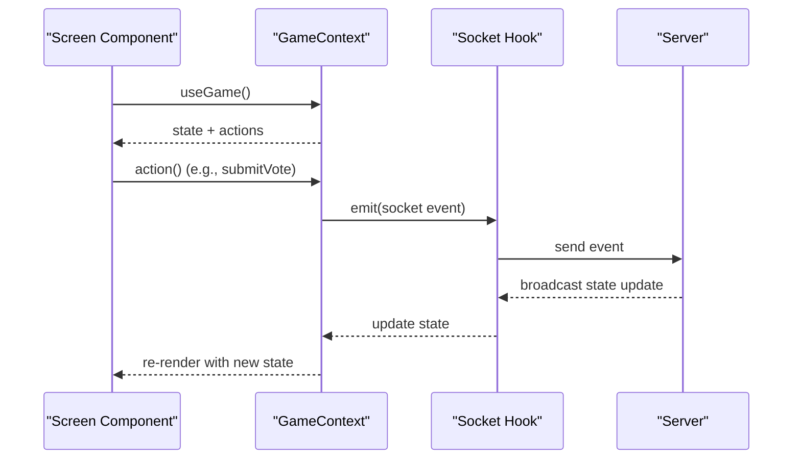
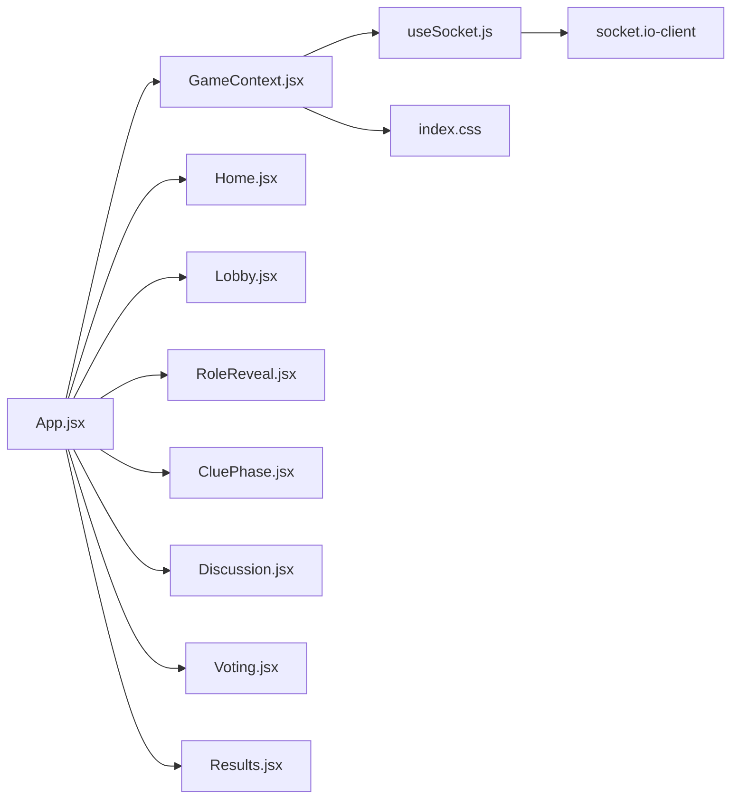

# React Application Structure

<cite>
**Referenced Files in This Document**
- [App.jsx](file://client/src/App.jsx)
- [GameContext.jsx](file://client/src/context/GameContext.jsx)
- [main.jsx](file://client/src/main.jsx)
- [Home.jsx](file://client/src/screens/Home.jsx)
- [Lobby.jsx](file://client/src/screens/Lobby.jsx)
- [RoleReveal.jsx](file://client/src/screens/RoleReveal.jsx)
- [CluePhase.jsx](file://client/src/screens/CluePhase.jsx)
- [Discussion.jsx](file://client/src/screens/Discussion.jsx)
- [Voting.jsx](file://client/src/screens/Voting.jsx)
- [Results.jsx](file://client/src/screens/Results.jsx)
- [useSocket.js](file://client/src/hooks/useSocket.js)
- [index.css](file://client/src/index.css)
- [package.json](file://client/package.json)
- [README.md](file://README.md)
</cite>

## Table of Contents
1. [Introduction](#introduction)
2. [Project Structure](#project-structure)
3. [Core Components](#core-components)
4. [Architecture Overview](#architecture-overview)
5. [Detailed Component Analysis](#detailed-component-analysis)
6. [Dependency Analysis](#dependency-analysis)
7. [Performance Considerations](#performance-considerations)
8. [Troubleshooting Guide](#troubleshooting-guide)
9. [Conclusion](#conclusion)

## Introduction
This document explains the React application structure and component hierarchy for the Imposter Game. It focuses on the root App component, its screen routing system, component lifecycle, prop drilling patterns, and how different game screens are organized and rendered. The application follows a screen-based architecture where each game phase has its own dedicated component (Home, Lobby, RoleReveal, CluePhase, Discussion, Voting, Results). Components communicate through the GameContext provider, enabling centralized state management and seamless transitions between game phases.

## Project Structure
The client-side React application is organized around a clear separation of concerns:
- Root entry point initializes the GameProvider and renders the App component.
- App.jsx acts as the screen router, selecting and animating the current screen based on the game phase.
- Screens are grouped under client/src/screens/, each representing a distinct game phase.
- GameContext.jsx provides shared state and actions to all components.
- useSocket.js encapsulates the Socket.IO connection and reconnection logic.
- Tailwind CSS defines the UI styles and animations.

**Diagram sources**
- [main.jsx:1-14](file://client/src/main.jsx#L1-L14)
- [GameContext.jsx:12-380](file://client/src/context/GameContext.jsx#L12-L380)
- [App.jsx:56-100](file://client/src/App.jsx#L56-L100)
- [Home.jsx:1-231](file://client/src/screens/Home.jsx#L1-L231)
- [Lobby.jsx:1-211](file://client/src/screens/Lobby.jsx#L1-L211)
- [RoleReveal.jsx:1-123](file://client/src/screens/RoleReveal.jsx#L1-L123)
- [CluePhase.jsx:1-165](file://client/src/screens/CluePhase.jsx#L1-L165)
- [Discussion.jsx:1-114](file://client/src/screens/Discussion.jsx#L1-L114)
- [Voting.jsx:1-180](file://client/src/screens/Voting.jsx#L1-L180)
- [Results.jsx:1-443](file://client/src/screens/Results.jsx#L1-L443)
- [useSocket.js:1-76](file://client/src/hooks/useSocket.js#L1-L76)

**Section sources**
- [README.md:88-111](file://README.md#L88-L111)
- [main.jsx:1-14](file://client/src/main.jsx#L1-L14)
- [package.json:1-26](file://client/package.json#L1-L26)

## Core Components
- App.jsx: The root component that manages screen selection and transitions. It reads the current game phase from GameContext, maintains a displayed phase state with transitions, and renders the appropriate screen component. It also renders global overlays for connection status and toast notifications.
- GameContext.jsx: Provides a centralized state store and action methods for the entire app. It manages socket connections, game state (phase, players, roles, timers, votes, scores), and exposes actions to mutate state and emit socket events.
- useSocket.js: Encapsulates the Socket.IO connection, reconnection logic, and emits/receives events. It persists session data and reconnects automatically when the page reloads.
- Screens: Each screen component consumes GameContext to read state and call actions. They render UI tailored to their game phase and coordinate with the backend via socket events.

Key patterns:
- Centralized state via GameContext eliminates prop drilling across deep component hierarchies.
- Screen routing is driven by the phase property, enabling declarative navigation.
- Transition effects are handled at the App level to provide smooth visual continuity.

**Section sources**
- [App.jsx:67-100](file://client/src/App.jsx#L67-L100)
- [GameContext.jsx:12-380](file://client/src/context/GameContext.jsx#L12-L380)
- [useSocket.js:8-76](file://client/src/hooks/useSocket.js#L8-L76)

## Architecture Overview
The application follows a unidirectional data flow:
- Components read state from GameContext.
- Components call actions exposed by GameContext to update state or emit socket events.
- Socket events update GameContext state, which triggers re-renders across the app.
- App.jsx selects the current screen based on the phase and applies transitions.

**Diagram sources**
- [GameContext.jsx:256-337](file://client/src/context/GameContext.jsx#L256-L337)
- [useSocket.js:34-72](file://client/src/hooks/useSocket.js#L34-L72)
- [App.jsx:67-100](file://client/src/App.jsx#L67-L100)

## Detailed Component Analysis

### App.jsx: Root Component and Screen Routing
Responsibilities:
- Reads the current phase from GameContext.
- Manages a displayed phase state with a transition delay to prevent flickering during phase changes.
- Renders the ConnectionIndicator and ToastOverlay overlays.
- Selects the current screen component from a screens map keyed by phase and renders it with a fade/transform transition.

Lifecycle and rendering:
- Uses useEffect to detect phase changes and schedule a transition.
- Applies CSS classes for enter/exit transitions based on the transitioning state.
- The screens map ensures robust fallback to Home if an unknown phase is encountered.

**Diagram sources**
- [App.jsx:67-81](file://client/src/App.jsx#L67-L81)
- [App.jsx:83-99](file://client/src/App.jsx#L83-L99)

**Section sources**
- [App.jsx:56-100](file://client/src/App.jsx#L56-L100)

### GameContext.jsx: Provider and State Management
Responsibilities:
- Holds all game state (roomCode, players, phase, role, topic, timer, clues, votes, roundResult, scores, etc.).
- Exposes actions to mutate state and emit socket events (createRoom, joinRoom, startGame, submitClue, submitVote, nextRound, playAgain, leaveGame).
- Subscribes to socket events and updates state accordingly (e.g., onPhaseChanged, onRoleAssigned, onTimerTick, onRoundResult, onGameOver).
- Provides toast notifications and error handling with timeouts.

Communication patterns:
- Components call actions to send commands to the server.
- Socket event handlers update local state, which propagates to all consumers via React Context.

**Diagram sources**
- [GameContext.jsx:12-380](file://client/src/context/GameContext.jsx#L12-L380)
- [useSocket.js:8-76](file://client/src/hooks/useSocket.js#L8-L76)

**Section sources**
- [GameContext.jsx:12-380](file://client/src/context/GameContext.jsx#L12-L380)

### Screen Components: Composition Patterns and Conditional Rendering
Each screen composes reusable UI elements and conditionally renders content based on game state and user interactions.

- Home.jsx: Presents create/join flows, validates inputs, and integrates with GameContext actions. Displays connection status and error messages.
- Lobby.jsx: Shows player avatars, room code, and host controls. Enables category selection and starts the game when conditions are met.
- RoleReveal.jsx: Implements a flip-card reveal animation for roles and displays a timer overlay.
- CluePhase.jsx: Provides a countdown ring, input for one-word clues, and a list of submitted clues with animated staggered reveals.
- Discussion.jsx: Displays the submitted clues and a speaking animation while the timer counts down.
- Voting.jsx: Presents a grid of player avatars, allows selection, locks in votes, and shows voting progress.
- Results.jsx: Implements a multi-stage reveal for votes, imposter identity, scoring, and confetti effects. Supports imposter guessing and final standings.

Conditional rendering patterns:
- Screens check phase, timers, submission flags, and host privileges to decide what to render.
- Many screens use staggered animations and visual indicators to reflect real-time updates.

**Section sources**
- [Home.jsx:12-231](file://client/src/screens/Home.jsx#L12-L231)
- [Lobby.jsx:56-211](file://client/src/screens/Lobby.jsx#L56-L211)
- [RoleReveal.jsx:4-123](file://client/src/screens/RoleReveal.jsx#L4-L123)
- [CluePhase.jsx:45-165](file://client/src/screens/CluePhase.jsx#L45-L165)
- [Discussion.jsx:45-114](file://client/src/screens/Discussion.jsx#L45-L114)
- [Voting.jsx:56-180](file://client/src/screens/Voting.jsx#L56-L180)
- [Results.jsx:100-443](file://client/src/screens/Results.jsx#L100-L443)

### Component Lifecycle and Transitions
- App.jsx manages a two-state transition cycle: transitioning and displayedPhase. This prevents abrupt phase changes and ensures smooth animations.
- Screens implement their own lifecycle hooks (e.g., useEffect for timers, animations) and rely on GameContext state updates to drive re-renders.
- Overlays (ConnectionIndicator, ToastOverlay) are always present and react to GameContext state changes.

**Section sources**
- [App.jsx:67-81](file://client/src/App.jsx#L67-L81)
- [Results.jsx:130-149](file://client/src/screens/Results.jsx#L130-L149)

### Communication Between Components and GameContext
- Components consume GameContext via useGame to read state and call actions.
- GameContext actions emit socket events, which the server acknowledges with state updates.
- Socket event handlers update GameContext state, triggering re-renders across the app.

**Diagram sources**
- [GameContext.jsx:256-337](file://client/src/context/GameContext.jsx#L256-L337)
- [useSocket.js:34-72](file://client/src/hooks/useSocket.js#L34-L72)

## Dependency Analysis
- App.jsx depends on GameContext for phase and renders screens based on a screens map.
- Screens depend on GameContext for state and actions.
- GameContext depends on useSocket for network communication.
- useSocket depends on socket.io-client and environment variables for server URL.
- Styles are managed via Tailwind CSS classes defined in index.css.

**Diagram sources**
- [App.jsx:1-10](file://client/src/App.jsx#L1-L10)
- [GameContext.jsx:1-10](file://client/src/context/GameContext.jsx#L1-L10)
- [useSocket.js:1-5](file://client/src/hooks/useSocket.js#L1-L5)
- [index.css:1-215](file://client/src/index.css#L1-L215)
- [package.json:12-16](file://client/package.json#L12-L16)

**Section sources**
- [package.json:12-16](file://client/package.json#L12-L16)

## Performance Considerations
- Efficient re-renders: GameContext uses memoized callbacks (useCallback) for actions and toast management to minimize unnecessary re-renders.
- Transition optimization: App.jsx uses a minimal transition delay and CSS transforms to keep animations smooth without heavy computations.
- Conditional rendering: Screens render only relevant UI based on state, reducing DOM overhead.
- Socket reconnection: useSocket implements exponential backoff and transport preferences to reduce connection churn.

[No sources needed since this section provides general guidance]

## Troubleshooting Guide
Common issues and resolutions:
- Connection problems: The ConnectionIndicator overlay shows live/offline status. useSocket handles reconnection attempts and dispatches a reconnected event to restore state.
- Error messaging: GameContext provides setErrorWithTimeout and addToast to surface server errors and user feedback.
- Phase stuck: If the phase does not change, verify socket event handlers for onPhaseChanged and ensure the server emits phaseChanged with the correct phase.
- Input validation: Screens enforce input limits (e.g., room code length, name length) and clear errors on input changes.

**Section sources**
- [App.jsx:39-54](file://client/src/App.jsx#L39-L54)
- [GameContext.jsx:53-68](file://client/src/context/GameContext.jsx#L53-L68)
- [Home.jsx:19-40](file://client/src/screens/Home.jsx#L19-L40)
- [useSocket.js:34-72](file://client/src/hooks/useSocket.js#L34-L72)

## Conclusion
The application employs a clean, scalable architecture centered on GameContext for state management and App.jsx for screen routing. The screen-based design enables modular development, while the GameContext provider minimizes prop drilling and centralizes cross-component communication. Socket-driven updates ensure real-time synchronization, and thoughtful transitions enhance the user experience. Together, these patterns deliver a responsive, maintainable React application for the Imposter Game.