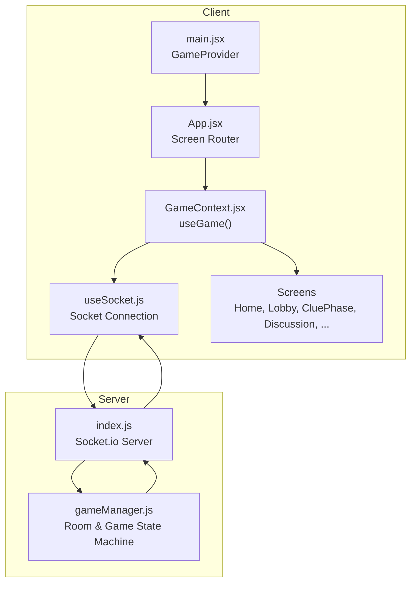
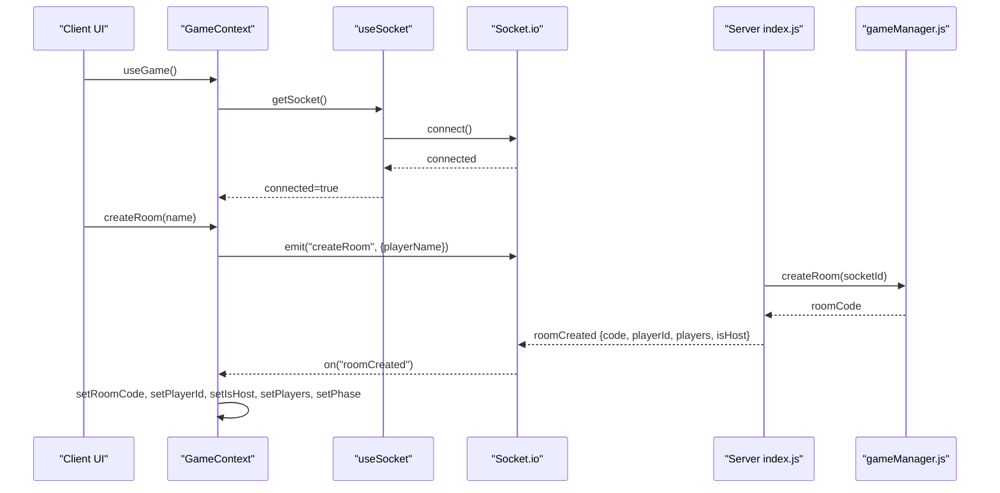
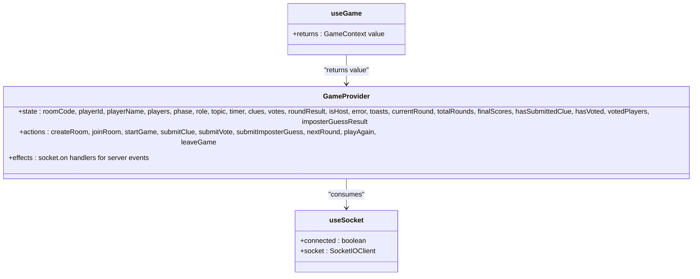
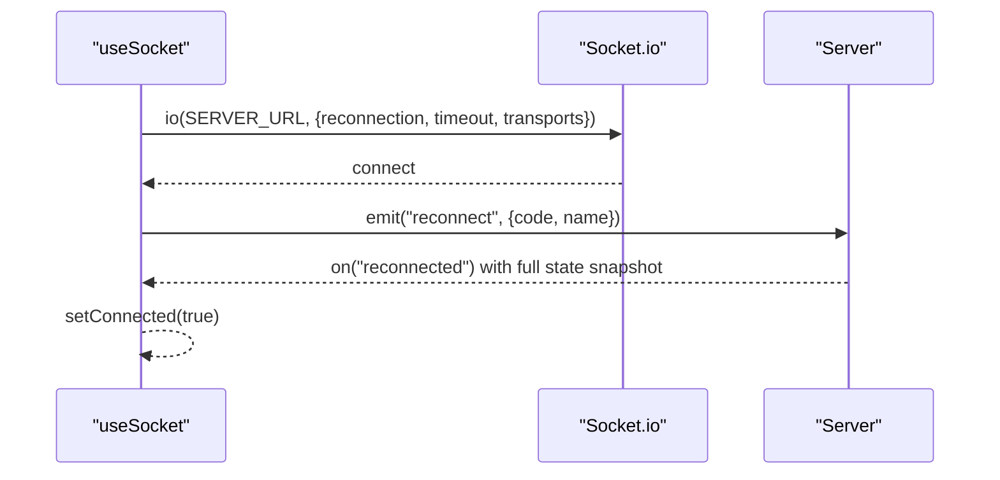
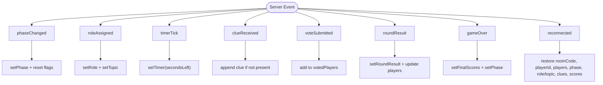
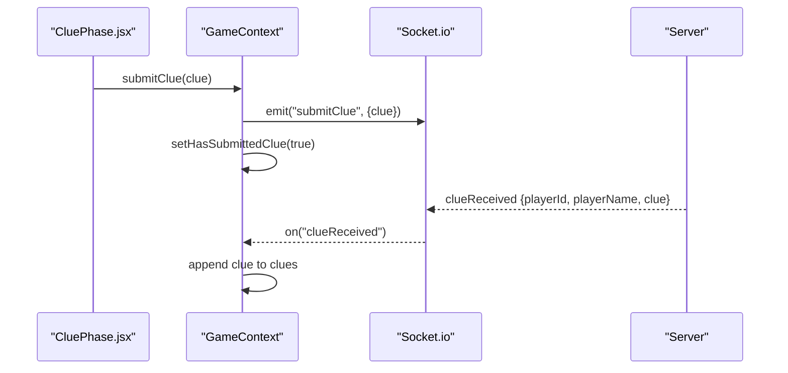
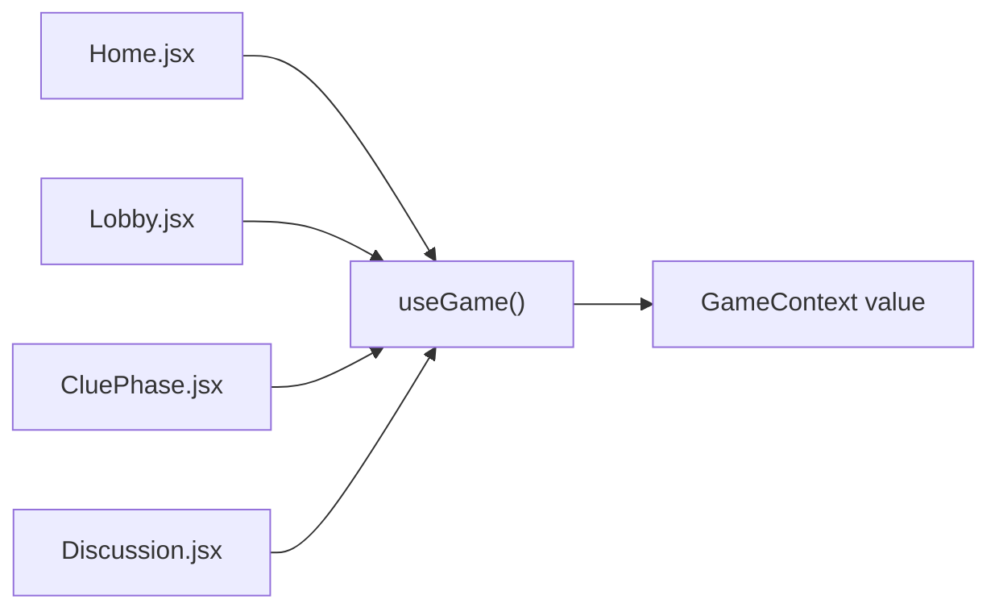
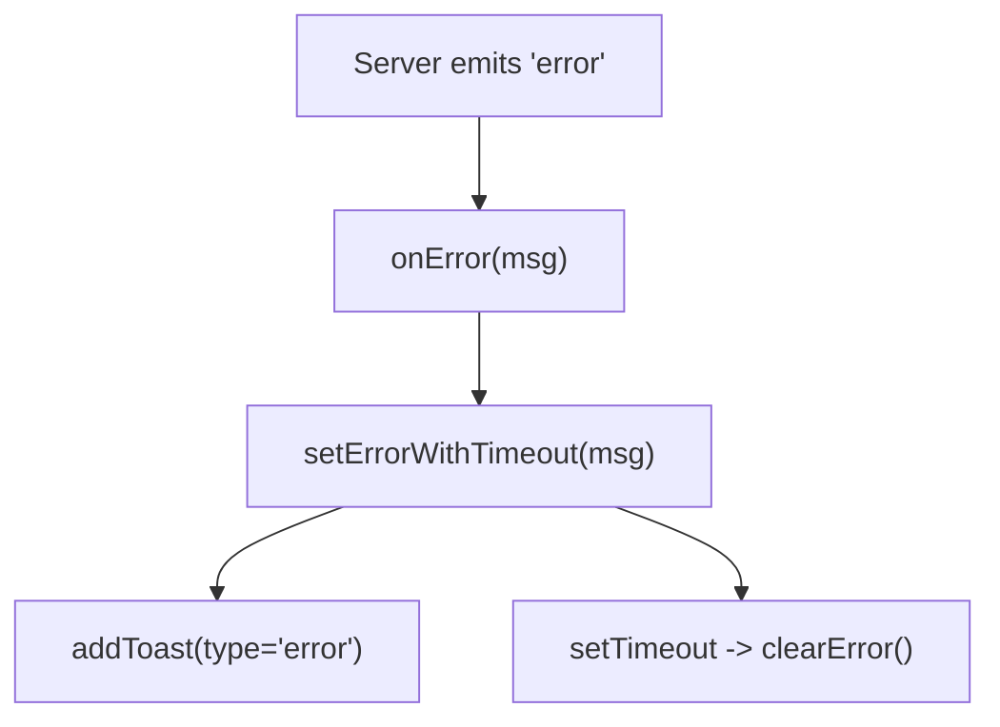
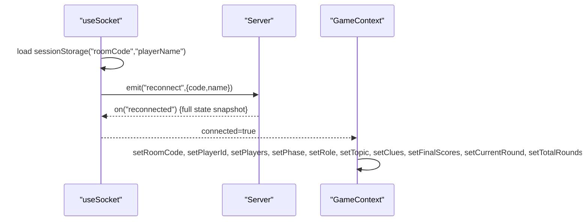
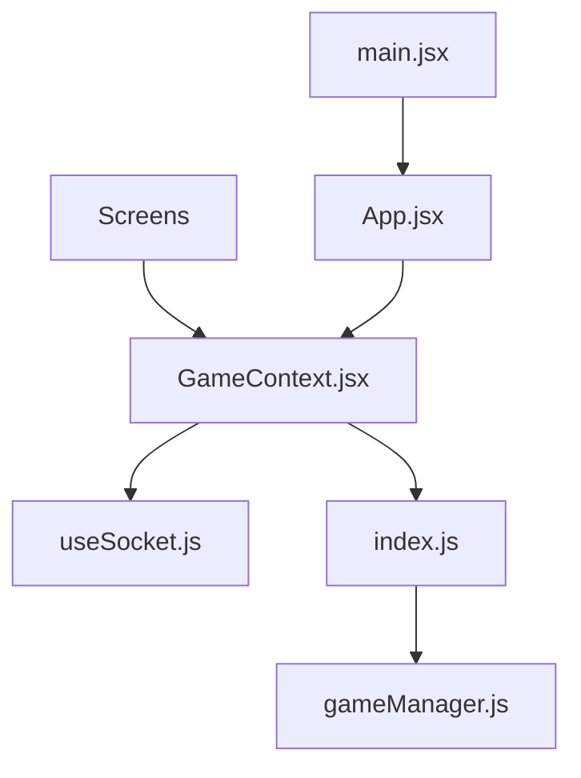

# State Management and GameContext

<cite>
**Referenced Files in This Document**
- [GameContext.jsx](file://client/src/context/GameContext.jsx)
- [useSocket.js](file://client/src/hooks/useSocket.js)
- [App.jsx](file://client/src/App.jsx)
- [main.jsx](file://client/src/main.jsx)
- [Home.jsx](file://client/src/screens/Home.jsx)
- [Lobby.jsx](file://client/src/screens/Lobby.jsx)
- [CluePhase.jsx](file://client/src/screens/CluePhase.jsx)
- [Discussion.jsx](file://client/src/screens/Discussion.jsx)
- [index.js](file://server/index.js)
- [gameManager.js](file://server/gameManager.js)
- [README.md](file://README.md)
</cite>

## Table of Contents
1. [Introduction](#introduction)
2. [Project Structure](#project-structure)
3. [Core Components](#core-components)
4. [Architecture Overview](#architecture-overview)
5. [Detailed Component Analysis](#detailed-component-analysis)
6. [Dependency Analysis](#dependency-analysis)
7. [Performance Considerations](#performance-considerations)
8. [Troubleshooting Guide](#troubleshooting-guide)
9. [Conclusion](#conclusion)

## Introduction
This document explains the centralized state management system built with React Context for the Imposter Game. It focuses on the GameContext provider pattern, how it manages the complete game state (rooms, players, current phase, timers, scores, and UI notifications), the action creators for state mutations, and how components consume context data. It also covers state synchronization with the server, error handling, performance optimizations, and best practices for avoiding unnecessary re-renders. Finally, it documents state persistence during reconnections and graceful degradation when server communication fails.

## Project Structure
The state management spans the client’s React application and the server’s Socket.io backend. The client initializes the GameProvider at the root and exposes a useGame hook for components to subscribe to and mutate state. The server maintains the authoritative game state machine and emits events to keep clients synchronized.

**Diagram sources**
- [main.jsx:7-13](file://client/src/main.jsx#L7-L13)
- [App.jsx:67-100](file://client/src/App.jsx#L67-L100)
- [GameContext.jsx:12-380](file://client/src/context/GameContext.jsx#L12-L380)
- [useSocket.js:8-75](file://client/src/hooks/useSocket.js#L8-L75)
- [index.js:173-676](file://server/index.js#L173-L676)
- [gameManager.js:9-17](file://server/gameManager.js#L9-L17)

**Section sources**
- [README.md:88-111](file://README.md#L88-L111)
- [main.jsx:7-13](file://client/src/main.jsx#L7-L13)
- [App.jsx:67-100](file://client/src/App.jsx#L67-L100)
- [GameContext.jsx:12-380](file://client/src/context/GameContext.jsx#L12-L380)
- [useSocket.js:8-75](file://client/src/hooks/useSocket.js#L8-L75)
- [index.js:173-676](file://server/index.js#L173-L676)
- [gameManager.js:9-17](file://server/gameManager.js#L9-L17)

## Core Components
- GameProvider: Creates and manages the entire game state, socket event listeners, and action creators. Exposes a value object containing state and actions to consumers.
- useGame: A convenience hook that throws if used outside GameProvider and returns the context value.
- useSocket: A hook that manages a singleton Socket.io connection with reconnection, error handling, and reconnection handshake with the server.

Key responsibilities:
- Centralized state: roomCode, playerId, playerName, players, phase, role, topic, timer, clues, votes, roundResult, isHost, error, toasts, currentRound, totalRounds, finalScores, submission flags, and imposterGuessResult.
- Action creators: createRoom, joinRoom, startGame, submitClue, submitVote, submitImposterGuess, nextRound, playAgain, leaveGame.
- Event-driven updates: socket.on handlers update state in response to server events.
- UI notifications: addToast, clearError, and error timeouts.

**Section sources**
- [GameContext.jsx:12-380](file://client/src/context/GameContext.jsx#L12-L380)
- [useSocket.js:8-75](file://client/src/hooks/useSocket.js#L8-L75)

## Architecture Overview
The client subscribes to server events and updates local state accordingly. Components render based on the shared context. Actions emit commands to the server, which mutates the authoritative game state and broadcasts updates.

**Diagram sources**
- [GameContext.jsx:257-262](file://client/src/context/GameContext.jsx#L257-L262)
- [useSocket.js:34-72](file://client/src/hooks/useSocket.js#L34-L72)
- [index.js:178-210](file://server/index.js#L178-L210)
- [gameManager.js:53-90](file://server/gameManager.js#L53-L90)

## Detailed Component Analysis

### GameContext Provider Pattern
- Provider initialization: Wraps the app with GameProvider and sets up socket connection and state.
- State fields: Room, player, roles, timers, clues, votes, round results, UI flags, and notifications.
- Action creators: Encapsulate socket emissions and local optimistic updates where appropriate.
- Event listeners: Subscribe to server events and update state, including reconnection restoration.

**Diagram sources**
- [GameContext.jsx:12-380](file://client/src/context/GameContext.jsx#L12-L380)
- [useSocket.js:8-75](file://client/src/hooks/useSocket.js#L8-L75)

**Section sources**
- [GameContext.jsx:12-380](file://client/src/context/GameContext.jsx#L12-L380)

### Socket Connection and Reconnection
- Singleton connection: useSocket caches a global socket instance and configures reconnection behavior.
- Reconnection handshake: On initial connect, sends a reconnect event with stored room code and name to restore state.
- Graceful offline handling: connected flag toggles UI feedback and disables interactive controls.

**Diagram sources**
- [useSocket.js:21-32](file://client/src/hooks/useSocket.js#L21-L32)
- [useSocket.js:34-72](file://client/src/hooks/useSocket.js#L34-L72)
- [index.js:542-608](file://server/index.js#L542-L608)

**Section sources**
- [useSocket.js:8-75](file://client/src/hooks/useSocket.js#L8-L75)
- [index.js:542-608](file://server/index.js#L542-L608)

### State Synchronization with the Server
- Room lifecycle: createRoom, joinRoom, playerJoined/left, youAreHost, playerDisconnected/playerReconnected.
- Game flow: phaseChanged, roleAssigned, timerTick, clueReceived, voteSubmitted, roundResult, gameOver, imposterGuessResult.
- Reconnection sync: reconnected event replays the latest game state snapshot.

**Diagram sources**
- [GameContext.jsx:110-196](file://client/src/context/GameContext.jsx#L110-L196)
- [index.js:49-167](file://server/index.js#L49-L167)

**Section sources**
- [GameContext.jsx:70-254](file://client/src/context/GameContext.jsx#L70-L254)
- [index.js:49-167](file://server/index.js#L49-L167)

### Action Creators and State Mutations
- Room actions: createRoom, joinRoom, startGame, nextRound, playAgain, leaveGame.
- Gameplay actions: submitClue, submitVote, submitImposterGuess.
- Local optimistic updates: hasSubmittedClue, hasVoted are set immediately upon emitting actions.

**Diagram sources**
- [CluePhase.jsx:49-54](file://client/src/screens/CluePhase.jsx#L49-L54)
- [GameContext.jsx:276-280](file://client/src/context/GameContext.jsx#L276-L280)
- [index.js:314-347](file://server/index.js#L314-L347)

**Section sources**
- [GameContext.jsx:257-337](file://client/src/context/GameContext.jsx#L257-L337)
- [CluePhase.jsx:49-54](file://client/src/screens/CluePhase.jsx#L49-L54)
- [Discussion.jsx:46](file://client/src/screens/Discussion.jsx#L46)

### Component Consumption Patterns
- Home: Uses createRoom, joinRoom, error, clearError, connected to drive UI and validation.
- Lobby: Uses roomCode, players, isHost, startGame, leaveGame, addToast to manage room state and host controls.
- CluePhase: Uses timer, submitClue, hasSubmittedClue, clues, players, playerId to render the clue submission UI and progress indicators.
- Discussion: Uses timer, clues, players to display clues and timing.

**Diagram sources**
- [Home.jsx:12-40](file://client/src/screens/Home.jsx#L12-L40)
- [Lobby.jsx:56-86](file://client/src/screens/Lobby.jsx#L56-L86)
- [CluePhase.jsx:45-54](file://client/src/screens/CluePhase.jsx#L45-L54)
- [Discussion.jsx:45-47](file://client/src/screens/Discussion.jsx#L45-L47)
- [GameContext.jsx:339-377](file://client/src/context/GameContext.jsx#L339-L377)

**Section sources**
- [Home.jsx:12-40](file://client/src/screens/Home.jsx#L12-L40)
- [Lobby.jsx:56-86](file://client/src/screens/Lobby.jsx#L56-L86)
- [CluePhase.jsx:45-54](file://client/src/screens/CluePhase.jsx#L45-L54)
- [Discussion.jsx:45-47](file://client/src/screens/Discussion.jsx#L45-L47)

### Error Handling and Notifications
- Error propagation: server emits "error" with a message; GameContext displays a timed toast and clears it automatically.
- Toast system: addToast enqueues messages with exit animations; clearError cancels pending timeouts.
- Connection indicator: App.jsx shows live/offline status based on connected flag.

**Diagram sources**
- [GameContext.jsx:172-175](file://client/src/context/GameContext.jsx#L172-L175)
- [GameContext.jsx:61-68](file://client/src/context/GameContext.jsx#L61-L68)
- [App.jsx:39-54](file://client/src/App.jsx#L39-L54)

**Section sources**
- [GameContext.jsx:53-68](file://client/src/context/GameContext.jsx#L53-L68)
- [GameContext.jsx:172-175](file://client/src/context/GameContext.jsx#L172-L175)
- [App.jsx:39-54](file://client/src/App.jsx#L39-L54)

### State Persistence During Reconnections
- Client persists roomCode and playerName in sessionStorage to restore state after reconnect.
- Server responds to reconnect with a full state snapshot, restoring roomCode, playerId, players, phase, role/topic, clues, and scores.

**Diagram sources**
- [useSocket.js:40-44](file://client/src/hooks/useSocket.js#L40-L44)
- [index.js:542-608](file://server/index.js#L542-L608)
- [GameContext.jsx:177-191](file://client/src/context/GameContext.jsx#L177-L191)

**Section sources**
- [useSocket.js:40-44](file://client/src/hooks/useSocket.js#L40-L44)
- [index.js:542-608](file://server/index.js#L542-L608)
- [GameContext.jsx:177-191](file://client/src/context/GameContext.jsx#L177-L191)

### Best Practices and Avoiding Unnecessary Re-renders
- Keep the context value minimal and granular: The provider exposes a single object with state and actions. Consumers should destructure only what they need to reduce re-renders.
- Memoize callbacks: useGame wraps action creators with useCallback to prevent recreation on each render.
- Separate concerns: UI-only state (e.g., form inputs) remains local to components; only cross-component state is in context.
- Subscription granularity: Components subscribe to only the parts of state they need (e.g., Home uses error and connected; CluePhase uses timer and clues).

**Section sources**
- [GameContext.jsx:257-337](file://client/src/context/GameContext.jsx#L257-L337)
- [Home.jsx:12-40](file://client/src/screens/Home.jsx#L12-L40)
- [CluePhase.jsx:45-54](file://client/src/screens/CluePhase.jsx#L45-L54)

## Dependency Analysis
- Client depends on Socket.io for real-time communication and on the server’s game state machine for authoritative updates.
- GameContext depends on useSocket for connection state and event subscriptions.
- Screens depend on useGame for state and actions.

**Diagram sources**
- [GameContext.jsx:12-380](file://client/src/context/GameContext.jsx#L12-L380)
- [useSocket.js:8-75](file://client/src/hooks/useSocket.js#L8-L75)
- [index.js:173-676](file://server/index.js#L173-L676)
- [gameManager.js:9-17](file://server/gameManager.js#L9-L17)

**Section sources**
- [GameContext.jsx:12-380](file://client/src/context/GameContext.jsx#L12-L380)
- [useSocket.js:8-75](file://client/src/hooks/useSocket.js#L8-L75)
- [index.js:173-676](file://server/index.js#L173-L676)
- [gameManager.js:9-17](file://server/gameManager.js#L9-L17)

## Performance Considerations
- Context splitting: The current implementation bundles all state and actions into a single context value. For very large apps, consider splitting context into smaller providers (e.g., separate contexts for UI state vs. game state) to minimize re-renders when unrelated parts change.
- Optimizing renders: Components should only subscribe to the fields they use. Destructure minimally and avoid passing the entire context value down to child components unnecessarily.
- Event batching: The server emits frequent timerTick events; ensure UI components throttle rendering or use memoization for derived values.
- Avoid redundant state: Some fields (e.g., hasSubmittedClue, hasVoted) are set optimistically to improve perceived responsiveness; ensure they are cleared or corrected on reconnection.

[No sources needed since this section provides general guidance]

## Troubleshooting Guide
Common issues and resolutions:
- No server connection: Verify VITE_SERVER_URL and network connectivity. The connection indicator shows live/offline status.
- Reconnection failures: Ensure roomCode and playerName are persisted in sessionStorage and sent on reconnect. The server will respond with a full state snapshot.
- Duplicate names or invalid room codes: Server validates inputs and emits errors; display user-friendly messages via the error toast system.
- Graceful degradation: When disconnected, disable interactive controls and show offline messaging. On reconnect, the provider restores state from the server snapshot.

**Section sources**
- [useSocket.js:34-72](file://client/src/hooks/useSocket.js#L34-L72)
- [index.js:542-608](file://server/index.js#L542-L608)
- [GameContext.jsx:172-175](file://client/src/context/GameContext.jsx#L172-L175)
- [App.jsx:39-54](file://client/src/App.jsx#L39-L54)

## Conclusion
The GameContext provider centralizes game state and actions, enabling a clean separation between UI and game logic. Socket.io ensures real-time synchronization with the server, while the reconnection mechanism preserves continuity across network interruptions. By following the consumption patterns and best practices outlined here, developers can build scalable, responsive gameplay experiences with predictable state behavior.