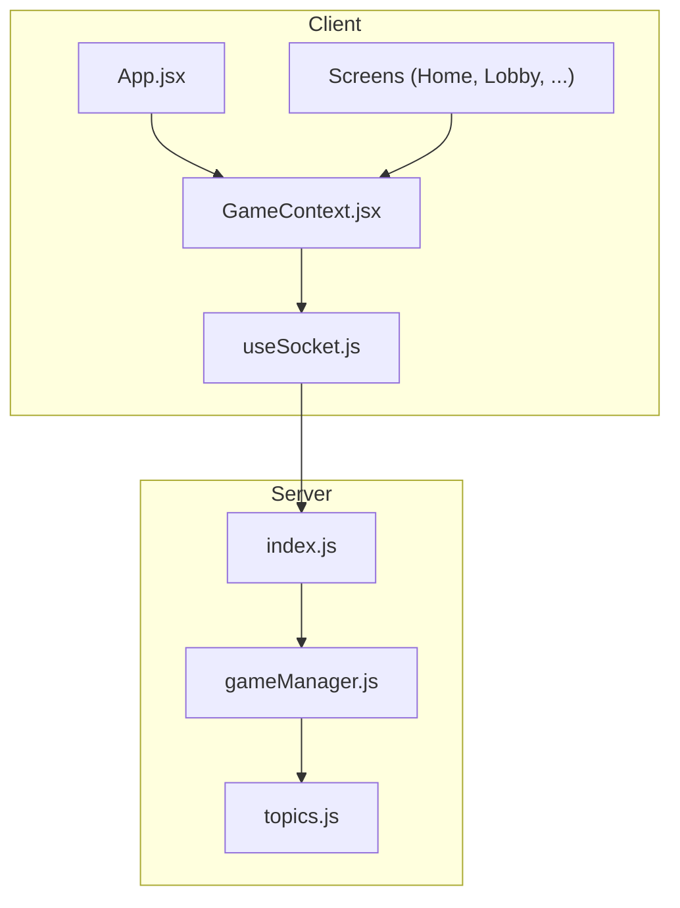
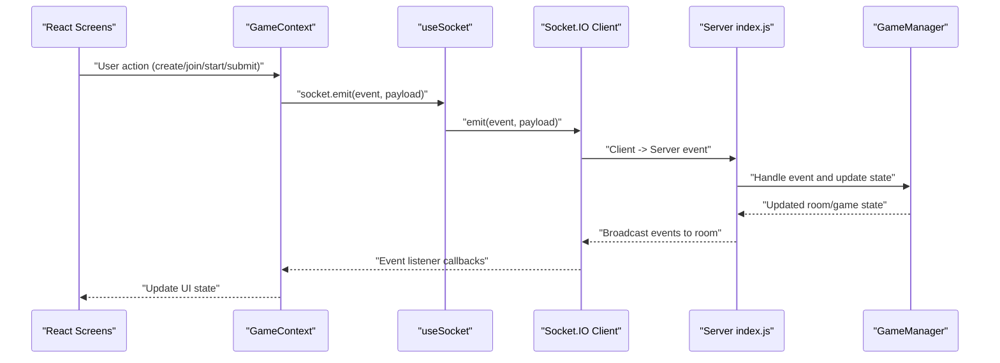
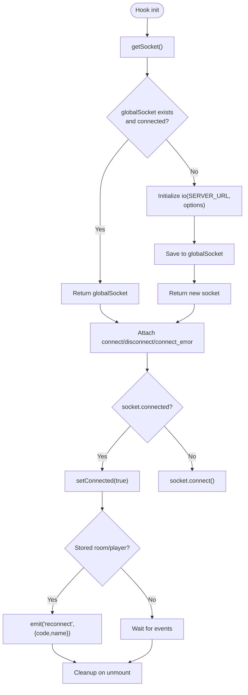
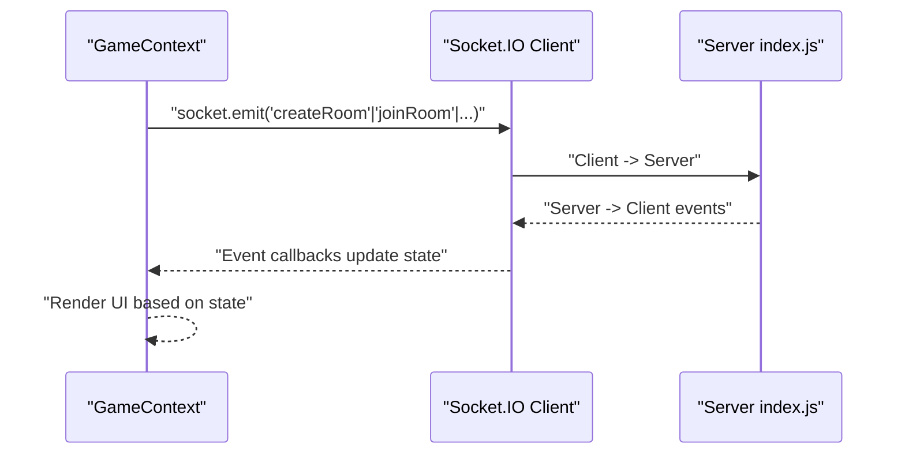
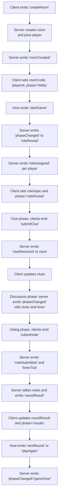
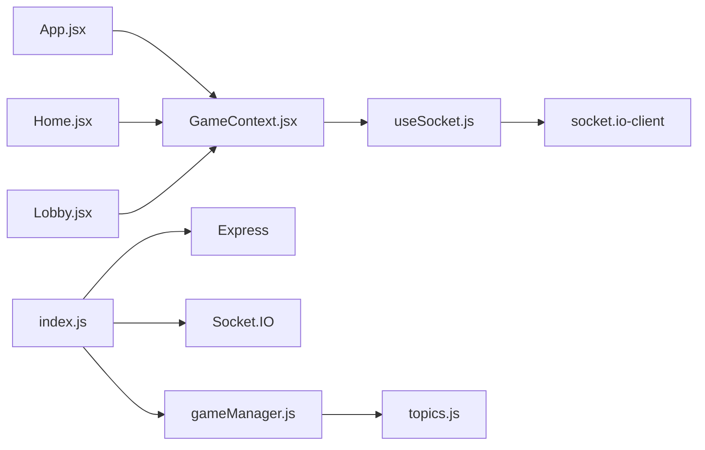

# WebSocket Integration and useSocket Hook

<cite>
**Referenced Files in This Document**
- [useSocket.js](file://client/src/hooks/useSocket.js)
- [GameContext.jsx](file://client/src/context/GameContext.jsx)
- [index.js](file://server/index.js)
- [gameManager.js](file://server/gameManager.js)
- [topics.js](file://server/topics.js)
- [App.jsx](file://client/src/App.jsx)
- [Home.jsx](file://client/src/screens/Home.jsx)
- [Lobby.jsx](file://client/src/screens/Lobby.jsx)
- [README.md](file://README.md)
</cite>

## Update Summary
**Changes Made**
- Updated connection configuration section to reflect enhanced WebSocket settings
- Modified performance considerations to address new transport priority and timeout values
- Updated troubleshooting guide with new timeout and transport-related guidance
- Enhanced reconnection logic documentation with infinite retry capabilities

## Table of Contents
1. [Introduction](#introduction)
2. [Project Structure](#project-structure)
3. [Core Components](#core-components)
4. [Architecture Overview](#architecture-overview)
5. [Detailed Component Analysis](#detailed-component-analysis)
6. [Dependency Analysis](#dependency-analysis)
7. [Performance Considerations](#performance-considerations)
8. [Troubleshooting Guide](#troubleshooting-guide)
9. [Conclusion](#conclusion)

## Introduction
This document explains the WebSocket integration for the Imposter Game using the useSocket hook. It covers connection lifecycle management, event handling patterns, automatic reconnection logic, and the full set of Socket.IO events used across the application. It also documents how the hook integrates with React components, performance considerations for real-time communication, and debugging techniques for common connection issues.

## Project Structure
The WebSocket integration spans two primary areas:
- Client-side React application with a custom hook for Socket.IO and a global GameContext that orchestrates UI state and actions.
- Server-side Node.js + Express + Socket.IO server that manages rooms, game state, timers, and broadcasting events.

**Diagram sources**
- [App.jsx:1-101](file://client/src/App.jsx#L1-L101)
- [GameContext.jsx:12-380](file://client/src/context/GameContext.jsx#L12-L380)
- [useSocket.js:8-75](file://client/src/hooks/useSocket.js#L8-L75)
- [index.js:14-687](file://server/index.js#L14-L687)
- [gameManager.js:9-636](file://server/gameManager.js#L9-L636)
- [topics.js:4-103](file://server/topics.js#L4-L103)

**Section sources**
- [README.md:88-111](file://README.md#L88-L111)

## Core Components
- useSocket hook: Creates and manages a singleton Socket.IO client with automatic reconnection, transport selection, and lifecycle events.
- GameContext: Centralizes game state, action dispatchers, and Socket.IO event listeners. It wires the hook to UI screens and manages UI reactions to server events.
- Server index.js: Initializes Socket.IO, routes client events to the GameManager, and broadcasts game state to clients.
- GameManager: Implements the game state machine, timers, voting, scoring, and reconnection logic.

Key responsibilities:
- Connection management: Establishes connection, handles connect/disconnect/connect_error, and triggers reconnection on initial connect.
- Event orchestration: Emits client actions and listens to server events to keep UI state synchronized.
- Automatic reconnection: On first connect, reads session-stored room code and player name to restore state.

**Section sources**
- [useSocket.js:8-75](file://client/src/hooks/useSocket.js#L8-L75)
- [GameContext.jsx:12-380](file://client/src/context/GameContext.jsx#L12-L380)
- [index.js:173-676](file://server/index.js#L173-L676)
- [gameManager.js:9-636](file://server/gameManager.js#L9-L636)

## Architecture Overview
The client and server communicate via Socket.IO with bidirectional event exchange. The client emits actions and receives state updates. The server maintains rooms and game state, broadcasting events to all clients in a room.

**Diagram sources**
- [GameContext.jsx:257-337](file://client/src/context/GameContext.jsx#L257-L337)
- [useSocket.js:34-72](file://client/src/hooks/useSocket.js#L34-L72)
- [index.js:173-676](file://server/index.js#L173-L676)
- [gameManager.js:48-201](file://server/gameManager.js#L48-L201)

## Detailed Component Analysis

### useSocket Hook Implementation
The hook encapsulates connection lifecycle and reconnection behavior:
- Singleton socket: Uses a module-level global to reuse a single Socket.IO instance across renders.
- Auto-connect and reconnection: Enables automatic reconnection with exponential backoff and polling fallback.
- Transport selection: **Enhanced** to prioritize polling over WebSocket for improved mobile connectivity reliability.
- Initial reconnection: On connect, reads room code and player name from session storage and emits a reconnect event to restore state.
- Lifecycle cleanup: Removes event listeners on unmount.

**Updated** Enhanced connection configuration with infinite reconnection attempts, increased timeout, and transport priority optimization.

**Diagram sources**
- [useSocket.js:12-32](file://client/src/hooks/useSocket.js#L12-L32)
- [useSocket.js:34-72](file://client/src/hooks/useSocket.js#L34-L72)

**Section sources**
- [useSocket.js:8-75](file://client/src/hooks/useSocket.js#L8-L75)

### Enhanced Connection Configuration
The useSocket hook now implements advanced connection settings optimized for reliability and mobile connectivity:

**Connection Settings:**
- `reconnectionAttempts: Infinity` - Infinite reconnection attempts for persistent connectivity
- `timeout: 20000` - Increased connection timeout from 10,000ms to 20,000ms for better reliability
- `transports: ['polling', 'websocket']` - Prioritizes polling over WebSocket for improved mobile network support

**Reconnection Strategy:**
- Exponential backoff with `reconnectionDelay: 1000` and `reconnectionDelayMax: 5000`
- Automatic reconnection on network interruptions
- Graceful handling of connection failures

**Section sources**
- [useSocket.js:21-29](file://client/src/hooks/useSocket.js#L21-L29)

### GameContext: Event Listeners and Actions
GameContext wires the socket to UI state:
- Event listeners: Subscribes to server events (roomCreated, joinedRoom, playerJoined/left, phaseChanged, roleAssigned, timerTick, clueReceived, voteSubmitted, roundResult, gameOver, error, reconnected, imposterGuessResult, playerDisconnected/reconnected, youAreHost).
- Actions: Emits client events (createRoom, joinRoom, startGame, submitClue, submitVote, submitImposterGuess, nextRound, playAgain, leaveRoom, reconnect).
- State synchronization: Updates UI state (roomCode, players, phase, role, topic, timer, clues, votes, roundResult, finalScores, isHost, error, toasts).

**Diagram sources**
- [GameContext.jsx:70-254](file://client/src/context/GameContext.jsx#L70-L254)
- [GameContext.jsx:257-337](file://client/src/context/GameContext.jsx#L257-L337)

**Section sources**
- [GameContext.jsx:12-380](file://client/src/context/GameContext.jsx#L12-L380)

### Server-Side Event Handlers and Game Flow
The server implements the game flow and broadcasts events:
- Room lifecycle: createRoom, joinRoom, playerJoined notifications, playerLeft on disconnect timeout.
- Game flow: startGame (role assignment), clue submission, discussion, voting, roundResult, nextRound, playAgain, gameOver.
- Timers: server-side timers emit timerTick and trigger phase transitions.
- Reconnection: reconnect event restores player state and notifies others.

**Diagram sources**
- [index.js:178-297](file://server/index.js#L178-L297)
- [index.js:314-405](file://server/index.js#L314-L405)
- [index.js:446-538](file://server/index.js#L446-L538)
- [index.js:542-608](file://server/index.js#L542-L608)

**Section sources**
- [index.js:173-676](file://server/index.js#L173-L676)
- [gameManager.js:48-201](file://server/gameManager.js#L48-L201)

### Socket.IO Events Inventory
Client-to-server events:
- createRoom: { playerName }
- joinRoom: { code, name }
- startGame: { category }
- submitClue: { clue }
- submitVote: { targetId }
- imposterGuess / submitImposterGuess: { guess }
- nextRound: —
- playAgain: —
- reconnect: { code, name }

Server-to-client events:
- roomCreated: { code, roomCode, playerId, players, isHost }
- joinedRoom: { code, roomCode, playerId, players, isHost }
- playerJoined: { players, playerName }
- playerLeft: { players, wasHost?, newHostId? }
- playerDisconnected: { playerId, playerName, players }
- playerReconnected: { playerId, playerName, players }
- youAreHost: —
- phaseChanged: { phase, clues?, round?, totalRounds? }
- roleAssigned: { role, topic? }
- timerTick: { secondsLeft }
- clueReceived: { playerId, playerName, clue }
- voteSubmitted: { voterId, playerId }
- roundResult: { votedOutId, wasImposter, caught, imposterId, imposterName, topic, scores, votes, currentRound, totalRounds, players }
- gameOver: { players, winner }
- error: { message }
- reconnected: { code, roomCode, playerId, phase, players, hostId, isHost, currentRound, totalRounds, role, topic, clues? }
- imposterGuessResult: { correct, guess, imposterId, imposterName, players }
- disconnect: —

**Section sources**
- [README.md:113-135](file://README.md#L113-L135)
- [index.js:178-608](file://server/index.js#L178-L608)

## Dependency Analysis
- Client depends on socket.io-client for real-time communication.
- GameContext depends on useSocket for the socket instance and connection status.
- Server depends on Express, Socket.IO, and GameManager for game logic.
- GameManager depends on topics for word lists.

**Diagram sources**
- [useSocket.js:1-2](file://client/src/hooks/useSocket.js#L1-L2)
- [GameContext.jsx:1-2](file://client/src/context/GameContext.jsx#L1-L2)
- [index.js:4-8](file://server/index.js#L4-L8)
- [gameManager.js:4](file://server/gameManager.js#L4)
- [topics.js:1-2](file://server/topics.js#L1-L2)

**Section sources**
- [package.json:12-24](file://client/package.json#L12-L24)

## Performance Considerations
- Connection pooling: The hook uses a singleton socket to avoid multiple connections and reduce overhead.
- **Enhanced** Transport selection: **Prioritizes polling over WebSocket** with increased timeout (20,000ms) for improved mobile connectivity reliability.
- Memory management: Event listeners are attached and detached in useEffect cleanup to prevent leaks.
- Efficient broadcasting: Server emits targeted events to rooms and individual sockets to reduce unnecessary traffic.
- Timer management: Server-side timers are cleared on transitions and room deletion to prevent lingering intervals.
- UI updates: GameContext batches state updates and uses minimal re-renders by updating only affected slices.

**Updated** The enhanced transport priority and increased timeout values provide better performance over mobile networks while maintaining connection reliability.

## Troubleshooting Guide
Common connection issues and solutions:
- **Connection fails or slow:**
  - Verify VITE_SERVER_URL environment variable points to the deployed server.
  - Check CORS configuration on the server allows client origin.
  - Confirm firewall/proxy settings allow WebSocket and polling traffic.
  - **New** Verify the increased timeout setting (20,000ms) is sufficient for your network conditions.
- **Frequent disconnects:**
  - Review reconnection options (reconnectionAttempts: Infinity, reconnectionDelay: 1000, reconnectionDelayMax: 5000).
  - Ensure client session storage contains roomCode and playerName for seamless reconnection.
  - **New** Monitor transport switching between polling and WebSocket based on network conditions.
- **Reconnection not restoring state:**
  - Confirm the reconnect event is emitted with correct code and name.
  - Verify server responds with reconnected event containing current game state.
- **Player disappears unexpectedly:**
  - Server implements a 30-second grace period before removing disconnected players.
  - UI shows playerDisconnected and later playerReconnected when reconnected.
- **Timer anomalies:**
  - Server clears timers on transitions and onEnd triggers phase advancement.
  - Clients rely on timerTick events; ensure UI resets timers on phase changes.

**New** Debugging techniques for enhanced configuration:
- Enable Socket.IO debug logs on the client and server to monitor transport switching.
- Inspect network tab for WebSocket upgrade and polling fallback behavior.
- Monitor reconnection attempts count to verify infinite retry capability.
- Observe timeout behavior during connection establishment.

**Section sources**
- [useSocket.js:21-29](file://client/src/hooks/useSocket.js#L21-L29)
- [index.js:612-675](file://server/index.js#L612-L675)
- [index.js:542-608](file://server/index.js#L542-L608)

## Conclusion
The useSocket hook provides robust, reusable WebSocket connectivity with automatic reconnection and a singleton socket instance. **Enhanced** with infinite reconnection attempts, increased timeout, and optimized transport priority, the system delivers improved reliability particularly for mobile connectivity. Combined with GameContext's event-driven state management and the server's authoritative game state machine, the system delivers a responsive, real-time multiplayer experience. Following the event inventory and troubleshooting steps ensures reliable operation across diverse network conditions with the new enhanced connection configuration.