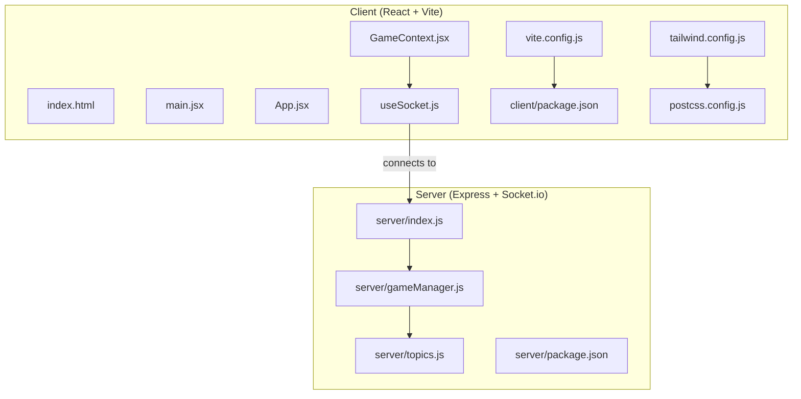
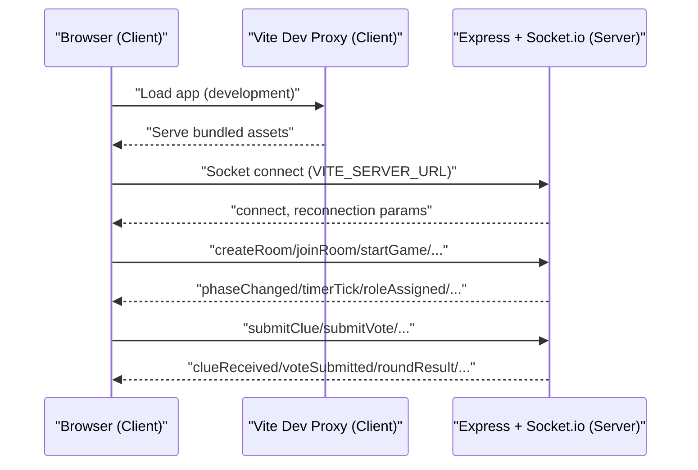
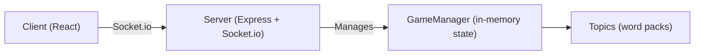

# Deployment and Hosting

<cite>
**Referenced Files in This Document**
- [README.md](file://README.md)
- [server/index.js](file://server/index.js)
- [server/package.json](file://server/package.json)
- [server/gameManager.js](file://server/gameManager.js)
- [server/topics.js](file://server/topics.js)
- [client/vite.config.js](file://client/vite.config.js)
- [client/package.json](file://client/package.json)
- [client/src/hooks/useSocket.js](file://client/src/hooks/useSocket.js)
- [client/src/context/GameContext.jsx](file://client/src/context/GameContext.jsx)
- [client/tailwind.config.js](file://client/tailwind.config.js)
- [client/postcss.config.js](file://client/postcss.config.js)
</cite>

## Table of Contents
1. [Introduction](#introduction)
2. [Project Structure](#project-structure)
3. [Core Components](#core-components)
4. [Architecture Overview](#architecture-overview)
5. [Detailed Component Analysis](#detailed-component-analysis)
6. [Dependency Analysis](#dependency-analysis)
7. [Performance Considerations](#performance-considerations)
8. [Troubleshooting Guide](#troubleshooting-guide)
9. [Conclusion](#conclusion)
10. [Appendices](#appendices)

## Introduction
This document provides end-to-end deployment and hosting guidance for the Imposter Game, covering both server and client components. It explains how to deploy the Node.js + Express + Socket.io backend to Railway and the React + Vite frontend to Vercel, details environment variables, domain and SSL configuration, production builds, monitoring/logging, performance tuning, rollbacks, updates, and scaling considerations.

## Project Structure
The project is split into two primary parts:
- Server: Real-time game backend built with Express and Socket.io, managing rooms, timers, and game state.
- Client: React single-page application using Vite for development and build, connecting to the server via Socket.io.

**Diagram sources**
- [client/vite.config.js:1-16](file://client/vite.config.js#L1-L16)
- [client/package.json:1-26](file://client/package.json#L1-L26)
- [client/tailwind.config.js:1-48](file://client/tailwind.config.js#L1-L48)
- [client/postcss.config.js:1-2](file://client/postcss.config.js#L1-L2)
- [server/index.js:1-687](file://server/index.js#L1-L687)
- [server/gameManager.js:1-200](file://server/gameManager.js#L1-L200)
- [server/topics.js:1-104](file://server/topics.js#L1-L104)
- [server/package.json:1-16](file://server/package.json#L1-L16)

**Section sources**
- [README.md:88-111](file://README.md#L88-L111)

## Core Components
- Server
  - Express HTTP server with CORS enabled.
  - Socket.io server handling real-time events and broadcasting game state.
  - Health check endpoint returning status and number of active rooms.
  - Port configurable via environment variable.
- Client
  - React application bootstrapped with Vite.
  - Socket.io client configured with automatic reconnection and transport fallback.
  - Environment variable for server URL.
  - Tailwind CSS for styling and animations.

Key deployment-relevant aspects:
- Server listens on a configurable port and exposes a health endpoint.
- Client connects to the server via a configurable URL and handles reconnection gracefully.
- Build pipeline uses Vite with React plugin and Tailwind PostCSS.

**Section sources**
- [server/index.js:14-35](file://server/index.js#L14-L35)
- [server/index.js:682-687](file://server/index.js#L682-L687)
- [server/package.json:1-16](file://server/package.json#L1-L16)
- [client/src/hooks/useSocket.js:1-76](file://client/src/hooks/useSocket.js#L1-L76)
- [client/package.json:1-26](file://client/package.json#L1-L26)
- [client/vite.config.js:1-16](file://client/vite.config.js#L1-L16)
- [client/tailwind.config.js:1-48](file://client/tailwind.config.js#L1-L48)
- [client/postcss.config.js:1-2](file://client/postcss.config.js#L1-L2)

## Architecture Overview
The client and server communicate over WebSocket and HTTP polling via Socket.io. The server maintains in-memory game state and broadcasts updates to clients in real time.

**Diagram sources**
- [client/vite.config.js:6-14](file://client/vite.config.js#L6-L14)
- [client/src/hooks/useSocket.js:21-29](file://client/src/hooks/useSocket.js#L21-L29)
- [server/index.js:173-676](file://server/index.js#L173-L676)

## Detailed Component Analysis

### Server Deployment (Railway)
- Root directory: server
- Runtime: Node.js
- Startup command: npm start (runs server/index.js)
- Port: configurable via PORT environment variable
- Health check: GET /
- CORS: enabled for development and runtime

Environment variables:
- PORT: server port (default 3001)

Domain and SSL:
- Railway provides a dynamic *.up.railway.app URL by default.
- SSL is managed by Railway; HTTPS is supported automatically.

Build and production:
- No build step required; Railway runs npm start.
- Keep the server lean; it serves static assets from the client separately.

Scaling and sessions:
- Socket.io uses in-memory engine; for horizontal scaling, integrate a Redis adapter to share session state across instances.

Monitoring and logs:
- Railway provides logs and metrics dashboards.
- Add structured logging and error boundaries around Socket.io handlers for observability.

**Section sources**
- [README.md:62-71](file://README.md#L62-L71)
- [server/package.json:6-9](file://server/package.json#L6-L9)
- [server/index.js:14-25](file://server/index.js#L14-L25)
- [server/index.js:33-35](file://server/index.js#L33-L35)
- [server/index.js:682-687](file://server/index.js#L682-L687)

### Client Deployment (Vercel)
- Root directory: client
- Framework preset: Vite
- Environment variables:
  - VITE_SERVER_URL: URL of the deployed server (e.g., https://{railway-app}.up.railway.app)
- Build command: Vite defaults to npm build
- Output directory: dist (standard Vite output)

Domain and SSL:
- Vercel provides a vercel.app domain with free TLS certificates.
- You can configure a custom domain and SSL via Vercel’s dashboard.

CDN and caching:
- Vercel serves static assets globally via CDN.
- Configure cache headers and immutable asset hashing (handled by Vite) to optimize delivery.

**Section sources**
- [README.md:73-79](file://README.md#L73-L79)
- [client/package.json:7-11](file://client/package.json#L7-L11)
- [client/src/hooks/useSocket.js](file://client/src/hooks/useSocket.js#L4)

### Environment Variables
- Server
  - PORT: listening port (default 3001)
- Client
  - VITE_SERVER_URL: Socket.io server URL (must match deployed server)

Notes:
- VITE_* variables are injected at build time and exposed to the browser.
- For local development, Vite proxies WebSocket traffic to the server during dev.

**Section sources**
- [README.md:48-61](file://README.md#L48-L61)
- [client/vite.config.js:8-12](file://client/vite.config.js#L8-L12)
- [client/src/hooks/useSocket.js](file://client/src/hooks/useSocket.js#L4)

### Production Build and Asset Optimization
- Client build
  - Vite compiles React, applies Tailwind CSS, and bundles assets.
  - Use Vite’s default minification and chunk splitting.
  - Tailwind purges unused styles based on content globs.
- Asset optimization
  - Enable compression (gzip/brotli) via hosting provider settings.
  - Serve images and fonts with appropriate cache headers.
- CDN
  - Vercel CDN serves static assets; ensure immutable filenames for long-term caching.

**Section sources**
- [client/package.json:7-11](file://client/package.json#L7-L11)
- [client/tailwind.config.js:1-48](file://client/tailwind.config.js#L1-L48)
- [client/postcss.config.js:1-2](file://client/postcss.config.js#L1-L2)

### Monitoring, Logging, and Observability
- Server
  - Add structured logging for connection, error, and game lifecycle events.
  - Expose metrics (e.g., active rooms, concurrent sockets) via a /metrics endpoint or external exporter.
  - Monitor memory and CPU; consider clustering or process managers for stability.
- Client
  - Capture errors via a global error boundary and report to an external service.
  - Track Socket.io reconnection attempts and failures.

**Section sources**
- [server/index.js:173-210](file://server/index.js#L173-L210)
- [server/index.js:212-248](file://server/index.js#L212-L248)
- [client/src/context/GameContext.jsx:172-175](file://client/src/context/GameContext.jsx#L172-L175)

### Rollback Procedures and Update Workflows
- Server
  - Railway supports redeploy from the same commit; use “Redeploy” to rollback to previous successful build.
  - For breaking changes, pin a working commit and deploy selectively.
- Client
  - Vercel allows redeploy; use the dashboard to select a previous successful build.
  - Test hotfixes on a staging branch before merging to main.
- Zero-downtime
  - For critical updates, deploy client to a preview branch, verify, then promote to production.

**Section sources**
- [README.md:62-79](file://README.md#L62-L79)

### Maintenance Tasks
- Server
  - Periodically prune stale rooms and timers.
  - Monitor disconnect grace periods and cleanup logic.
- Client
  - Keep dependencies updated; test Socket.io compatibility after updates.
  - Validate Tailwind purging and build output in CI.

**Section sources**
- [server/gameManager.js:165-200](file://server/gameManager.js#L165-L200)
- [server/index.js:636-675](file://server/index.js#L636-L675)

### Scaling, Load Balancing, and Cost Optimization
- Current state
  - In-memory Socket.io and state; not horizontally scalable.
- Recommended
  - Use a Redis adapter for Socket.io to enable multiple server instances behind a load balancer.
  - Split static assets (client) and server (API + WS) onto separate hosts or CDNs.
  - Use autoscaling groups with health checks; monitor latency and error rates.
- Costs
  - Railway offers free tier with limited resources; upgrade as usage grows.
  - Vercel provides generous free tiers for static sites; monitor bandwidth and requests.
  - Consider regional deployments to reduce latency.

[No sources needed since this section provides general guidance]

## Dependency Analysis
The client depends on the server for real-time updates. The server manages game state and emits events consumed by the client.

**Diagram sources**
- [server/index.js:1-27](file://server/index.js#L1-L27)
- [server/gameManager.js:1-200](file://server/gameManager.js#L1-L200)
- [server/topics.js:1-104](file://server/topics.js#L1-L104)

**Section sources**
- [server/index.js:1-27](file://server/index.js#L1-L27)
- [server/gameManager.js:1-200](file://server/gameManager.js#L1-L200)

## Performance Considerations
- Network
  - Prefer WebSocket transport; fall back to polling only when necessary.
  - Keep messages small; batch UI updates where possible.
- Server
  - Limit concurrent rooms and players per instance; shard by region.
  - Use a Redis-backed Socket.io adapter for multi-instance setups.
- Client
  - Minimize re-renders; memoize derived state.
  - Lazy-load non-critical assets; defer animations until needed.

[No sources needed since this section provides general guidance]

## Troubleshooting Guide
Common deployment issues and resolutions:
- Client cannot connect to server
  - Verify VITE_SERVER_URL points to the deployed server URL.
  - Ensure the server allows cross-origin requests and that the port matches the deployed environment.
- WebSocket fails in production
  - Confirm the server is reachable on the configured port and that reverse proxies allow WebSocket upgrades.
  - Check firewall and load balancer settings.
- CORS errors
  - Review server CORS configuration and ensure origins are permitted.
- Health checks failing
  - Confirm the server responds to GET / and that PORT is set correctly.
- Reconnection loops
  - Inspect client reconnection settings and network stability; verify server uptime.

**Section sources**
- [client/src/hooks/useSocket.js:21-29](file://client/src/hooks/useSocket.js#L21-L29)
- [server/index.js:14-25](file://server/index.js#L14-L25)
- [server/index.js:33-35](file://server/index.js#L33-L35)
- [server/index.js:682-687](file://server/index.js#L682-L687)

## Conclusion
Deploying the Imposter Game involves straightforward steps: run the server on Railway with a root directory of server and expose a health endpoint, and deploy the client to Vercel with a root directory of client and the correct server URL. For production, add a Redis adapter for horizontal scaling, configure domains and SSL via the platforms, and establish monitoring and logging. Use staged rollouts and maintain conservative resource plans initially, scaling out as usage grows.

[No sources needed since this section summarizes without analyzing specific files]

## Appendices

### Appendix A: Environment Variables Reference
- Server
  - PORT: server port (default 3001)
- Client
  - VITE_SERVER_URL: Socket.io server URL

**Section sources**
- [README.md:48-61](file://README.md#L48-L61)

### Appendix B: Socket Events Summary
- Client → Server
  - createRoom, joinRoom, startGame, submitClue, submitVote, submitImposterGuess, nextRound, playAgain, reconnect
- Server → Client
  - phaseChanged, timerTick, roleAssigned, clueReceived, voteSubmitted, roundResult, gameOver, error, reconnected, imposterGuessResult, playerDisconnected, playerReconnected, playerLeft, playerJoined, youAreHost

**Section sources**
- [README.md:113-135](file://README.md#L113-L135)