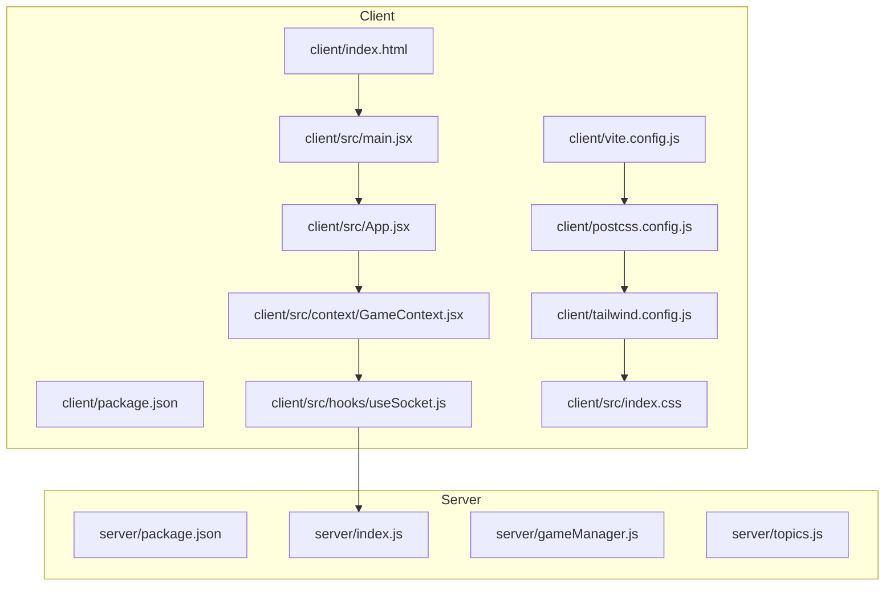
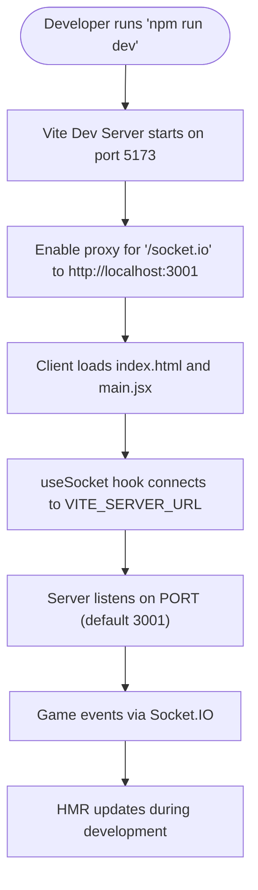
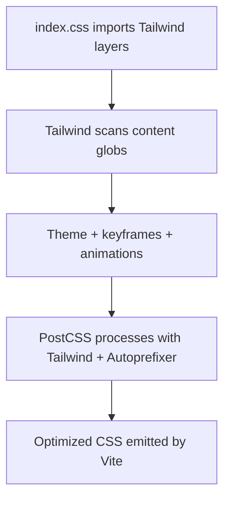
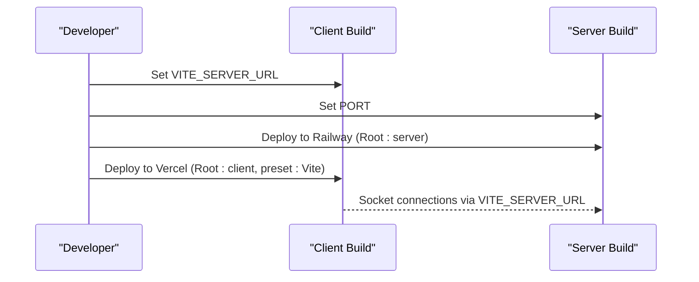
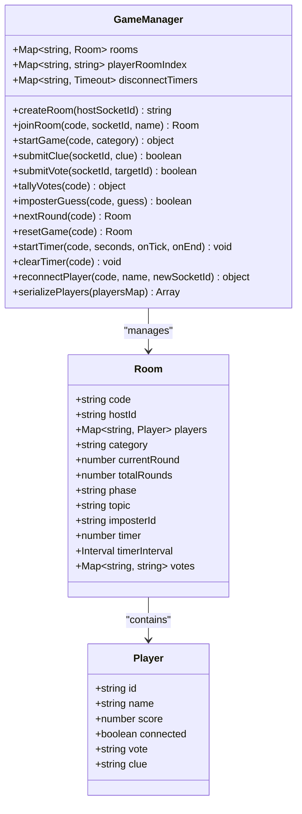
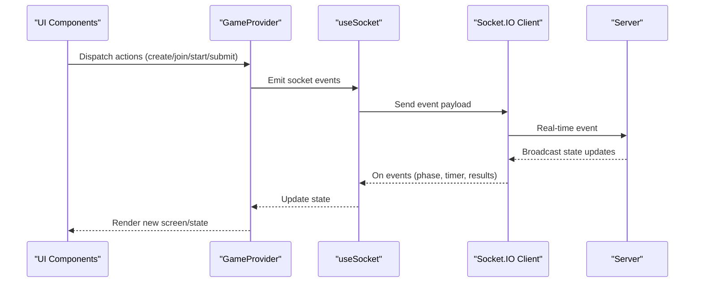
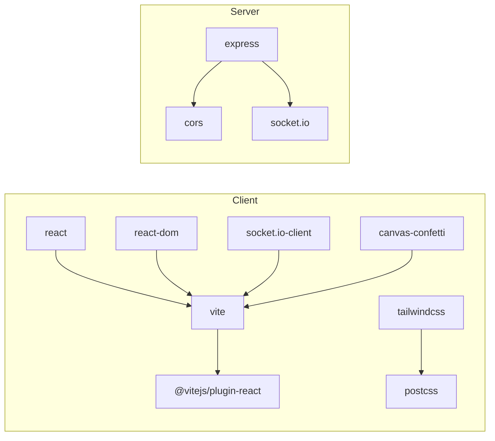

# Development and Build Process

<cite>
**Referenced Files in This Document**
- [client/package.json](file://client/package.json)
- [client/vite.config.js](file://client/vite.config.js)
- [client/postcss.config.js](file://client/postcss.config.js)
- [client/tailwind.config.js](file://client/tailwind.config.js)
- [client/index.html](file://client/index.html)
- [client/src/main.jsx](file://client/src/main.jsx)
- [client/src/App.jsx](file://client/src/App.jsx)
- [client/src/context/GameContext.jsx](file://client/src/context/GameContext.jsx)
- [client/src/hooks/useSocket.js](file://client/src/hooks/useSocket.js)
- [client/src/index.css](file://client/src/index.css)
- [server/package.json](file://server/package.json)
- [server/index.js](file://server/index.js)
- [server/gameManager.js](file://server/gameManager.js)
- [server/topics.js](file://server/topics.js)
- [README.md](file://README.md)
</cite>

## Table of Contents
1. [Introduction](#introduction)
2. [Project Structure](#project-structure)
3. [Core Components](#core-components)
4. [Architecture Overview](#architecture-overview)
5. [Detailed Component Analysis](#detailed-component-analysis)
6. [Dependency Analysis](#dependency-analysis)
7. [Performance Considerations](#performance-considerations)
8. [Troubleshooting Guide](#troubleshooting-guide)
9. [Conclusion](#conclusion)
10. [Appendices](#appendices)

## Introduction
This document describes the complete development and build process for the Imposter Game, covering both client and server components. It explains the Vite configuration for development and production, npm scripts, Tailwind CSS and PostCSS integration, asset optimization strategies, environment variable configuration, deployment preparation, and build artifact management. It also outlines the development workflow, including code splitting, lazy loading, performance monitoring, build troubleshooting, dependency management, and continuous integration considerations.

## Project Structure
The project is split into two primary packages:
- Client: React + Vite + Tailwind CSS single-page application
- Server: Node.js + Express + Socket.io real-time backend



**Diagram sources**
- [client/package.json:1-26](file://client/package.json#L1-L26)
- [client/vite.config.js:1-16](file://client/vite.config.js#L1-L16)
- [client/postcss.config.js:1-2](file://client/postcss.config.js#L1-L2)
- [client/tailwind.config.js:1-48](file://client/tailwind.config.js#L1-L48)
- [client/index.html:1-20](file://client/index.html#L1-L20)
- [client/src/main.jsx:1-14](file://client/src/main.jsx#L1-L14)
- [client/src/App.jsx:1-101](file://client/src/App.jsx#L1-L101)
- [client/src/context/GameContext.jsx:1-383](file://client/src/context/GameContext.jsx#L1-L383)
- [client/src/hooks/useSocket.js:1-76](file://client/src/hooks/useSocket.js#L1-L76)
- [client/src/index.css:1-215](file://client/src/index.css#L1-L215)
- [server/package.json:1-16](file://server/package.json#L1-L16)
- [server/index.js:1-687](file://server/index.js#L1-L687)
- [server/gameManager.js:1-636](file://server/gameManager.js#L1-L636)
- [server/topics.js:1-104](file://server/topics.js#L1-L104)

**Section sources**
- [README.md:88-111](file://README.md#L88-L111)

## Core Components
- Client build and dev server powered by Vite with React plugin, hot module replacement, and a development proxy for Socket.IO.
- Tailwind CSS configured for scoped content and custom animations; PostCSS pipeline enabled via vite.config.js and postcss.config.js.
- Environment variables for client (VITE_SERVER_URL) and server (PORT).
- Server built with Express and Socket.IO, exposing health checks and a comprehensive game state machine.

Key npm scripts:
- Client: dev, build, preview
- Server: start, dev

**Section sources**
- [client/package.json:7-11](file://client/package.json#L7-L11)
- [client/vite.config.js:4-15](file://client/vite.config.js#L4-L15)
- [client/postcss.config.js:1-2](file://client/postcss.config.js#L1-L2)
- [client/tailwind.config.js:1-48](file://client/tailwind.config.js#L1-L48)
- [server/package.json:6-9](file://server/package.json#L6-L9)
- [README.md:48-61](file://README.md#L48-L61)

## Architecture Overview
The client connects to the server via Socket.IO. The server exposes REST-like endpoints and real-time events for game lifecycle and state synchronization.

```mermaid
graph TB
Browser["Browser (Client)"]
ViteDev["Vite Dev Server<br/>port 5173"]
Proxy["Vite Proxy<br/>/socket.io -> http://localhost:3001"]
Express["Express Server"]
IO["Socket.IO Server"]
GM["GameManager"]
Browser --> ViteDev
ViteDev --> Proxy
Proxy --> Express
Express --> IO
IO --> GM
Browser <- --> IO
```

**Diagram sources**
- [client/vite.config.js:6-14](file://client/vite.config.js#L6-L14)
- [server/index.js:14-25](file://server/index.js#L14-L25)
- [server/gameManager.js:9-17](file://server/gameManager.js#L9-L17)

## Detailed Component Analysis

### Vite Build Configuration and Development Workflow
- Plugin stack: React Fast Refresh and automatic JSX runtime support.
- Dev server:
  - Port 5173
  - Proxy for Socket.IO WebSocket traffic to the server at port 3001
- Production build:
  - Uses Vite’s default bundling and code-splitting strategies
  - Asset optimization handled by Vite (minification, hashing, pre-bundling)
- Hot reload:
  - React plugin enables fast refresh
  - Vite HMR for styles and JS modules



**Diagram sources**
- [client/vite.config.js:6-14](file://client/vite.config.js#L6-L14)
- [client/src/hooks/useSocket.js:4-32](file://client/src/hooks/useSocket.js#L4-L32)
- [server/index.js:682-686](file://server/index.js#L682-L686)

**Section sources**
- [client/vite.config.js:4-15](file://client/vite.config.js#L4-L15)
- [client/package.json:7-11](file://client/package.json#L7-L11)
- [client/src/hooks/useSocket.js:4-32](file://client/src/hooks/useSocket.js#L4-L32)
- [server/index.js:682-686](file://server/index.js#L682-L686)

### Tailwind CSS and PostCSS Integration
- Tailwind scanning: targets index.html and all JS/JSX under src.
- Theme extensions: custom dark palette, accent and neon colors, plus custom animations and keyframes.
- PostCSS pipeline: Tailwind directives and autoprefixer applied in postcss.config.js.
- Client CSS entry imports Tailwind layers and defines custom utilities and animations.



**Diagram sources**
- [client/src/index.css:1-3](file://client/src/index.css#L1-L3)
- [client/tailwind.config.js:2-47](file://client/tailwind.config.js#L2-L47)
- [client/postcss.config.js:1-2](file://client/postcss.config.js#L1-L2)

**Section sources**
- [client/tailwind.config.js:1-48](file://client/tailwind.config.js#L1-L48)
- [client/postcss.config.js:1-2](file://client/postcss.config.js#L1-L2)
- [client/src/index.css:1-215](file://client/src/index.css#L1-L215)

### Environment Variables and Deployment Preparation
- Client:
  - VITE_SERVER_URL controls the Socket.IO server URL used by the client
- Server:
  - PORT sets the listening port (default 3001)
- Deployment:
  - Server to Railway: set Root Directory to server, environment variable PORT=3001, auto-start via npm start
  - Client to Vercel: set Root Directory to client, Framework Preset to Vite, environment variable VITE_SERVER_URL=https://your-railway-app.up.railway.app



**Diagram sources**
- [README.md:48-80](file://README.md#L48-L80)
- [client/src/hooks/useSocket.js:4-4](file://client/src/hooks/useSocket.js#L4-L4)
- [server/index.js:682-686](file://server/index.js#L682-L686)

**Section sources**
- [README.md:48-80](file://README.md#L48-L80)
- [client/src/hooks/useSocket.js:4-4](file://client/src/hooks/useSocket.js#L4-L4)
- [server/index.js:682-686](file://server/index.js#L682-L686)

### Development Workflow: Code Splitting, Lazy Loading, and Performance Monitoring
- Code splitting:
  - Vite performs dynamic import-based code splitting automatically; organize feature routes/screens accordingly to leverage this
- Lazy loading:
  - React.lazy and Suspense can be used for heavy components; ensure chunk boundaries align with screen transitions
- Performance monitoring:
  - Use browser devtools Network and Performance panels
  - Monitor Socket.IO latency and event throughput
  - Track bundle sizes and hydration costs in Vite’s dev server

[No sources needed since this section provides general guidance]

### Server-Side Game State Machine
The server encapsulates the game lifecycle, room management, timers, voting, scoring, and reconnection logic.



**Diagram sources**
- [server/gameManager.js:9-17](file://server/gameManager.js#L9-L17)
- [server/gameManager.js:60-73](file://server/gameManager.js#L60-L73)
- [server/gameManager.js:123-130](file://server/gameManager.js#L123-L130)

**Section sources**
- [server/gameManager.js:1-636](file://server/gameManager.js#L1-L636)

### Client-Side State and Socket Integration
- GameProvider manages global state and socket event subscriptions.
- useSocket encapsulates connection lifecycle, reconnection, and optional reconnection handshake with the server.
- App composes screens and orchestrates transitions.



**Diagram sources**
- [client/src/context/GameContext.jsx:256-337](file://client/src/context/GameContext.jsx#L256-L337)
- [client/src/hooks/useSocket.js:34-72](file://client/src/hooks/useSocket.js#L34-L72)
- [server/index.js:173-250](file://server/index.js#L173-L250)

**Section sources**
- [client/src/context/GameContext.jsx:1-383](file://client/src/context/GameContext.jsx#L1-L383)
- [client/src/hooks/useSocket.js:1-76](file://client/src/hooks/useSocket.js#L1-L76)
- [server/index.js:173-250](file://server/index.js#L173-L250)

## Dependency Analysis
- Client dependencies:
  - React and React DOM for UI
  - socket.io-client for real-time connectivity
  - canvas-confetti for celebratory effects
  - Vite, @vitejs/plugin-react for build and dev experience
  - Tailwind CSS and PostCSS toolchain
- Server dependencies:
  - Express for HTTP routing
  - Socket.IO for real-time bidirectional events
  - CORS for cross-origin requests



**Diagram sources**
- [client/package.json:12-24](file://client/package.json#L12-L24)
- [server/package.json:10-14](file://server/package.json#L10-L14)

**Section sources**
- [client/package.json:12-24](file://client/package.json#L12-L24)
- [server/package.json:10-14](file://server/package.json#L10-L14)

## Performance Considerations
- Bundle size:
  - Prefer dynamic imports for route-level code splitting
  - Keep Tailwind purged to production content only
- Rendering:
  - Minimize heavy DOM in transition frames
  - Use CSS transforms and opacity for animations
- Network:
  - Monitor Socket.IO reconnection behavior and latency
  - Batch frequent events if needed
- Assets:
  - Leverage Vite’s built-in image optimization and pre-bundling

[No sources needed since this section provides general guidance]

## Troubleshooting Guide
Common issues and resolutions:
- Client cannot connect to server:
  - Verify VITE_SERVER_URL matches deployed server URL
  - Confirm proxy configuration in vite.config.js for local dev
- Socket.IO handshake errors:
  - Ensure server CORS allows client origin
  - Check that server listens on the expected port
- Build failures:
  - Run npm ci in both client and server directories
  - Clear node_modules and reinstall if lockfiles differ
- Hot reload not working:
  - Disable ad blockers or firewall interference
  - Restart Vite dev server if stuck

**Section sources**
- [client/src/hooks/useSocket.js:4-32](file://client/src/hooks/useSocket.js#L4-L32)
- [client/vite.config.js:6-14](file://client/vite.config.js#L6-L14)
- [server/index.js:14-25](file://server/index.js#L14-L25)
- [README.md:48-80](file://README.md#L48-L80)

## Conclusion
The Imposter Game leverages Vite for a fast, modern client development experience with Tailwind CSS for styling and Socket.IO for real-time gameplay. The server provides a robust game state machine and straightforward deployment targets. Following the documented environment variables, build scripts, and deployment steps ensures smooth development and production workflows.

## Appendices

### Appendix A: NPM Scripts Reference
- Client
  - dev: Start Vite dev server
  - build: Build optimized production bundle
  - preview: Preview production build locally
- Server
  - start: Run production server
  - dev: Watch and restart server during development

**Section sources**
- [client/package.json:7-11](file://client/package.json#L7-L11)
- [server/package.json:6-9](file://server/package.json#L6-L9)

### Appendix B: Environment Variables Reference
- Client
  - VITE_SERVER_URL: Socket.IO server URL
- Server
  - PORT: Listening port (default 3001)

**Section sources**
- [README.md:48-61](file://README.md#L48-L61)
- [client/src/hooks/useSocket.js:4-4](file://client/src/hooks/useSocket.js#L4-L4)
- [server/index.js:682-686](file://server/index.js#L682-L686)