# Game Mechanics and Rules

<cite>
**Referenced Files in This Document**
- [README.md](file://README.md)
- [server/index.js](file://server/index.js)
- [server/gameManager.js](file://server/gameManager.js)
- [server/topics.js](file://server/topics.js)
- [client/src/context/GameContext.jsx](file://client/src/context/GameContext.jsx)
- [client/src/hooks/useSocket.js](file://client/src/hooks/useSocket.js)
- [client/src/screens/RoleReveal.jsx](file://client/src/screens/RoleReveal.jsx)
- [client/src/screens/CluePhase.jsx](file://client/src/screens/CluePhase.jsx)
- [client/src/screens/Discussion.jsx](file://client/src/screens/Discussion.jsx)
- [client/src/screens/Voting.jsx](file://client/src/screens/Voting.jsx)
- [client/src/screens/Results.jsx](file://client/src/screens/Results.jsx)
</cite>

## Table of Contents
1. [Introduction](#introduction)
2. [Project Structure](#project-structure)
3. [Core Components](#core-components)
4. [Architecture Overview](#architecture-overview)
5. [Detailed Component Analysis](#detailed-component-analysis)
6. [Dependency Analysis](#dependency-analysis)
7. [Performance Considerations](#performance-considerations)
8. [Troubleshooting Guide](#troubleshooting-guide)
9. [Conclusion](#conclusion)
10. [Appendices](#appendices)

## Introduction
This document explains the complete game mechanics and rule implementation for the Imposter Game. It covers room management, player assignment, role distribution, phase transitions, scoring, timers, topic selection, tie-breaking, host rotation, and player reconnection handling. It also addresses edge cases and state synchronization challenges.

## Project Structure
The project consists of a Node.js/Express + Socket.io backend and a React/Vite frontend. The backend manages rooms, game state, timers, and scoring. The frontend renders screens for each game phase and synchronizes with the backend via Socket.io events.

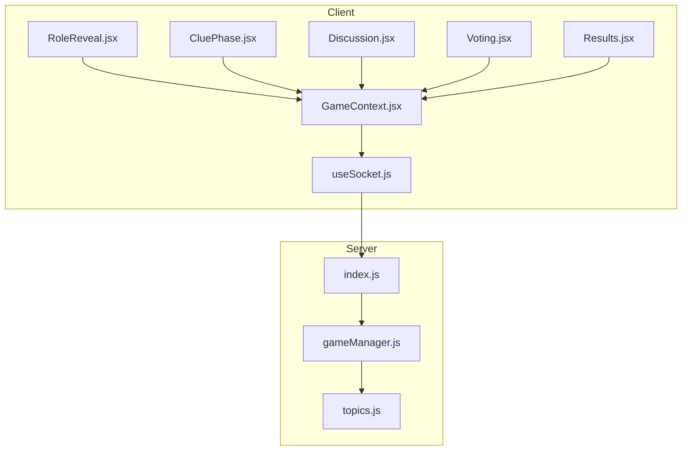

**Diagram sources**
- [server/index.js:173-676](file://server/index.js#L173-L676)
- [server/gameManager.js:9-636](file://server/gameManager.js#L9-L636)
- [server/topics.js:4-103](file://server/topics.js#L4-L103)
- [client/src/context/GameContext.jsx:12-383](file://client/src/context/GameContext.jsx#L12-L383)
- [client/src/hooks/useSocket.js:8-76](file://client/src/hooks/useSocket.js#L8-L76)
- [client/src/screens/RoleReveal.jsx:4-123](file://client/src/screens/RoleReveal.jsx#L4-L123)
- [client/src/screens/CluePhase.jsx:45-165](file://client/src/screens/CluePhase.jsx#L45-L165)
- [client/src/screens/Discussion.jsx:45-114](file://client/src/screens/Discussion.jsx#L45-L114)
- [client/src/screens/Voting.jsx:56-180](file://client/src/screens/Voting.jsx#L56-L180)
- [client/src/screens/Results.jsx:100-443](file://client/src/screens/Results.jsx#L100-L443)

**Section sources**
- [README.md:88-111](file://README.md#L88-L111)
- [server/index.js:14-28](file://server/index.js#L14-L28)
- [client/src/context/GameContext.jsx:12-383](file://client/src/context/GameContext.jsx#L12-L383)

## Core Components
- GameManager: Central state machine managing rooms, players, roles, votes, timers, and scoring.
- Socket server: Orchestrates phase transitions, timers, and broadcasting updates to clients.
- Topics: Word pools organized by category (General, Family, Adult).
- Client context and screens: Render UI for each phase and synchronize with server.

Key responsibilities:
- Room lifecycle: creation, joining, host rotation, and deletion.
- Role distribution: random selection of imposter among connected players.
- Timers: enforce phase durations and tick updates.
- Voting and scoring: tally votes, resolve ties, award points.
- Reconnection: restore state for disconnected players.

**Section sources**
- [server/gameManager.js:9-636](file://server/gameManager.js#L9-L636)
- [server/index.js:49-167](file://server/index.js#L49-L167)
- [server/topics.js:4-103](file://server/topics.js#L4-L103)
- [client/src/context/GameContext.jsx:12-383](file://client/src/context/GameContext.jsx#L12-L383)

## Architecture Overview
The server exposes Socket.io endpoints. Clients connect, receive state snapshots on reconnection, and react to live updates. The server advances phases and triggers timers, while the client renders screens and collects user input.

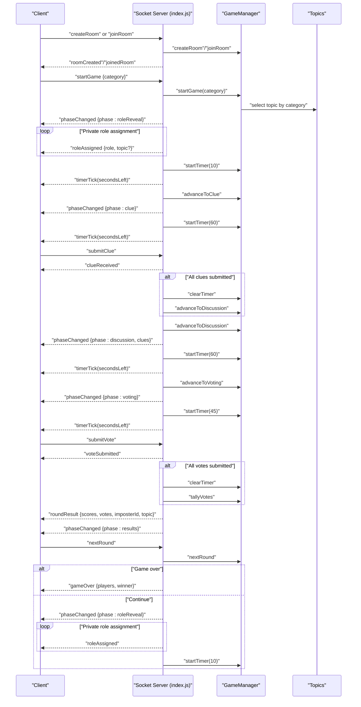

**Diagram sources**
- [server/index.js:173-676](file://server/index.js#L173-L676)
- [server/gameManager.js:213-453](file://server/gameManager.js#L213-L453)
- [server/topics.js:4-103](file://server/topics.js#L4-L103)
- [client/src/context/GameContext.jsx:70-254](file://client/src/context/GameContext.jsx#L70-L254)

## Detailed Component Analysis

### Room Management and Lifecycle
- Room creation: Generates a unique 4-letter uppercase code and initializes a lobby with the host as the first player.
- Joining: Validates room existence, phase, capacity, and duplicate names; adds player to room and maps socket to room.
- Host rotation: If the host leaves, the first remaining player becomes the new host.
- Deletion: If a room empties, it is removed and timers cleared.
- Reconnection: Players can reconnect using stored session data; socket IDs are remapped and references updated.

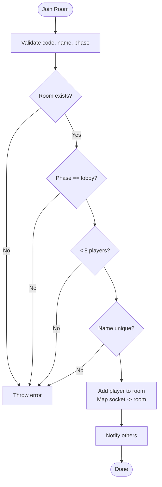

**Diagram sources**
- [server/gameManager.js:99-136](file://server/gameManager.js#L99-L136)

**Section sources**
- [server/gameManager.js:53-90](file://server/gameManager.js#L53-L90)
- [server/gameManager.js:99-136](file://server/gameManager.js#L99-L136)
- [server/gameManager.js:165-201](file://server/gameManager.js#L165-L201)
- [server/index.js:214-248](file://server/index.js#L214-L248)

### Role Distribution and Assignment
- At game start, the server selects a category and a random topic from the pool.
- A random connected player is chosen as the imposter.
- Private role assignments are sent: imposter receives role without topic; others receive role and topic.
- After 10 seconds, the server advances to the clue phase.

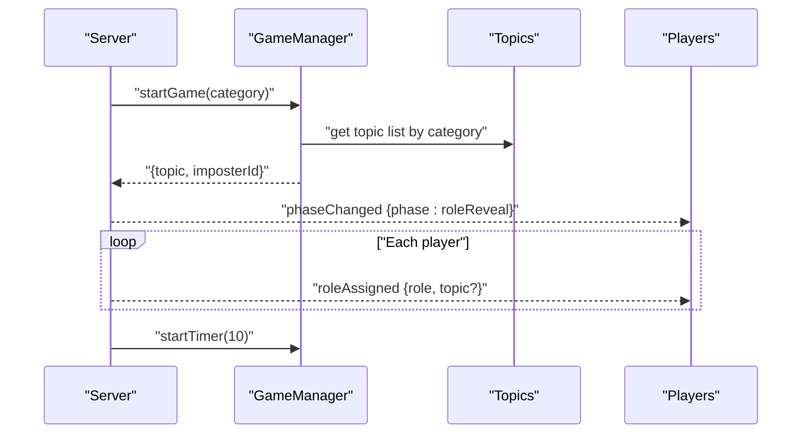

**Diagram sources**
- [server/index.js:252-297](file://server/index.js#L252-L297)
- [server/gameManager.js:213-241](file://server/gameManager.js#L213-L241)
- [server/topics.js:4-103](file://server/topics.js#L4-L103)

**Section sources**
- [server/index.js:252-297](file://server/index.js#L252-L297)
- [server/gameManager.js:213-241](file://server/gameManager.js#L213-L241)
- [server/topics.js:4-103](file://server/topics.js#L4-L103)

### Phase Transitions and Timers
Phases and durations:
- Role Reveal: 10 seconds
- Clue Phase: 60 seconds
- Discussion: 60 seconds
- Voting: 45 seconds

The server advances phases automatically after timers end or when all participants submit clues/votes. Timers emit periodic ticks to clients.

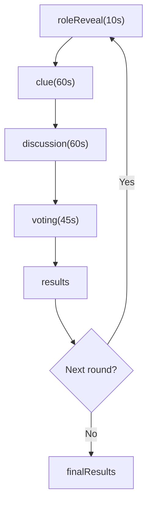

**Diagram sources**
- [server/index.js:49-122](file://server/index.js#L49-L122)
- [server/index.js:277-287](file://server/index.js#L277-L287)
- [server/index.js:336-340](file://server/index.js#L336-L340)
- [server/index.js:394-397](file://server/index.js#L394-L397)
- [server/index.js:490-501](file://server/index.js#L490-L501)

**Section sources**
- [server/index.js:49-122](file://server/index.js#L49-L122)
- [server/index.js:277-287](file://server/index.js#L277-L287)
- [server/index.js:336-340](file://server/index.js#L336-L340)
- [server/index.js:394-397](file://server/index.js#L394-L397)
- [server/index.js:490-501](file://server/index.js#L490-L501)

### Topic Selection System
- Categories: General, Family, Adult.
- Each category contains at least 30 unique topics.
- During game start, a topic is randomly selected from the chosen category.

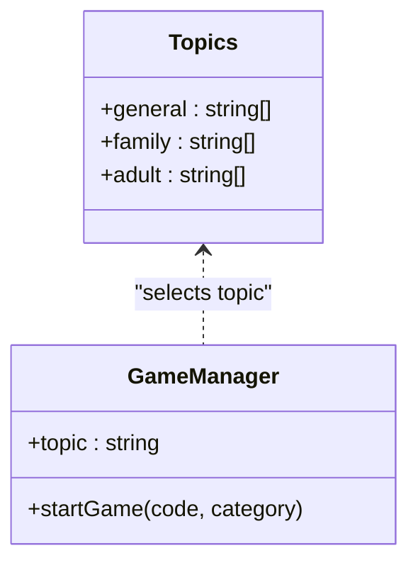

**Diagram sources**
- [server/topics.js:4-103](file://server/topics.js#L4-L103)
- [server/gameManager.js:213-241](file://server/gameManager.js#L213-L241)

**Section sources**
- [server/topics.js:4-103](file://server/topics.js#L4-L103)
- [server/gameManager.js:213-241](file://server/gameManager.js#L213-L241)

### Voting, Tie-Breaking, and Scoring
- Voting: Players vote for who they think is the imposter. Self-votes are rejected.
- Tally: Aggregate votes; highest vote count wins.
- Tie-breaking: Alphabetical by player name.
- Scoring:
  - Correct voters (when imposter is voted out): +2 each.
  - Surviving imposter: +3.
  - Consolation: If imposter guesses the topic correctly after being caught, +1.

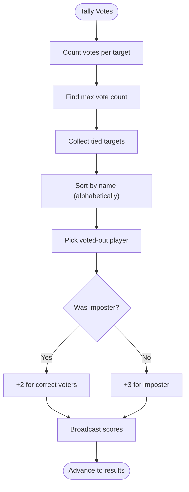

**Diagram sources**
- [server/gameManager.js:316-378](file://server/gameManager.js#L316-L378)

**Section sources**
- [server/gameManager.js:284-307](file://server/gameManager.js#L284-L307)
- [server/gameManager.js:316-378](file://server/gameManager.js#L316-L378)
- [server/gameManager.js:387-403](file://server/gameManager.js#L387-L403)

### Timer Management
- Server-side timers: Each phase starts a timer with callbacks for tick and end.
- Tick broadcasts: Clients render countdowns and animations.
- Grace period: On disconnect, players have 30 seconds to reconnect; otherwise they are removed.

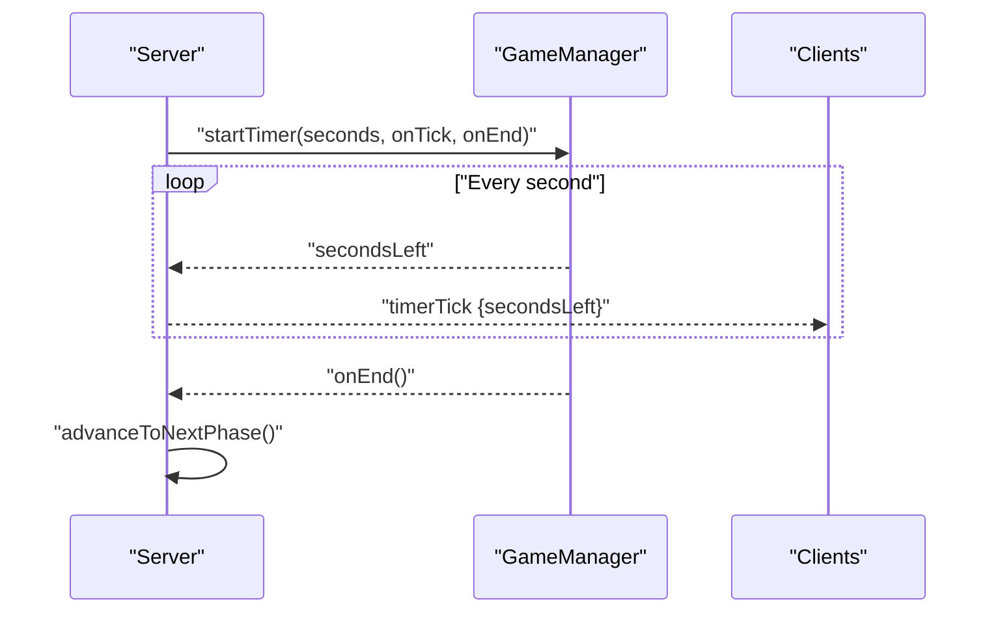

**Diagram sources**
- [server/gameManager.js:495-531](file://server/gameManager.js#L495-L531)
- [server/index.js:56-66](file://server/index.js#L56-L66)
- [server/index.js:87-96](file://server/index.js#L87-L96)
- [server/index.js:112-122](file://server/index.js#L112-L122)
- [server/index.js:636-671](file://server/index.js#L636-L671)

**Section sources**
- [server/gameManager.js:495-531](file://server/gameManager.js#L495-L531)
- [server/index.js:56-66](file://server/index.js#L56-L66)
- [server/index.js:87-96](file://server/index.js#L87-L96)
- [server/index.js:112-122](file://server/index.js#L112-L122)
- [server/index.js:636-671](file://server/index.js#L636-L671)

### Player Reconnection Handling
- On connect, clients send stored room code and name to rejoin.
- Server validates and restores state, remaps socket IDs, updates host/imposter references, and rebroadcasts state.
- Disconnected players are marked unconnected and removed after a 30-second grace period if they do not reconnect.

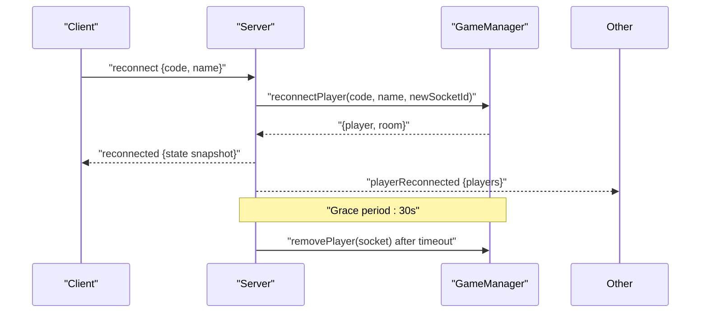

**Diagram sources**
- [server/index.js:542-608](file://server/index.js#L542-L608)
- [server/gameManager.js:544-609](file://server/gameManager.js#L544-L609)
- [client/src/hooks/useSocket.js:42-44](file://client/src/hooks/useSocket.js#L42-L44)

**Section sources**
- [server/index.js:542-608](file://server/index.js#L542-L608)
- [server/gameManager.js:544-609](file://server/gameManager.js#L544-L609)
- [client/src/hooks/useSocket.js:42-44](file://client/src/hooks/useSocket.js#L42-L44)

### Client-Side Screens and State Synchronization
- RoleReveal: Displays role/topic privately; shows 10s timer.
- CluePhase: One-word clue submission with 60s timer; shows submitted clues.
- Discussion: Shows all clues; 60s timer.
- Voting: Select a player to vote; 45s timer; shows vote submissions.
- Results: Staggered vote reveal, imposter reveal, scoring, and next round controls.

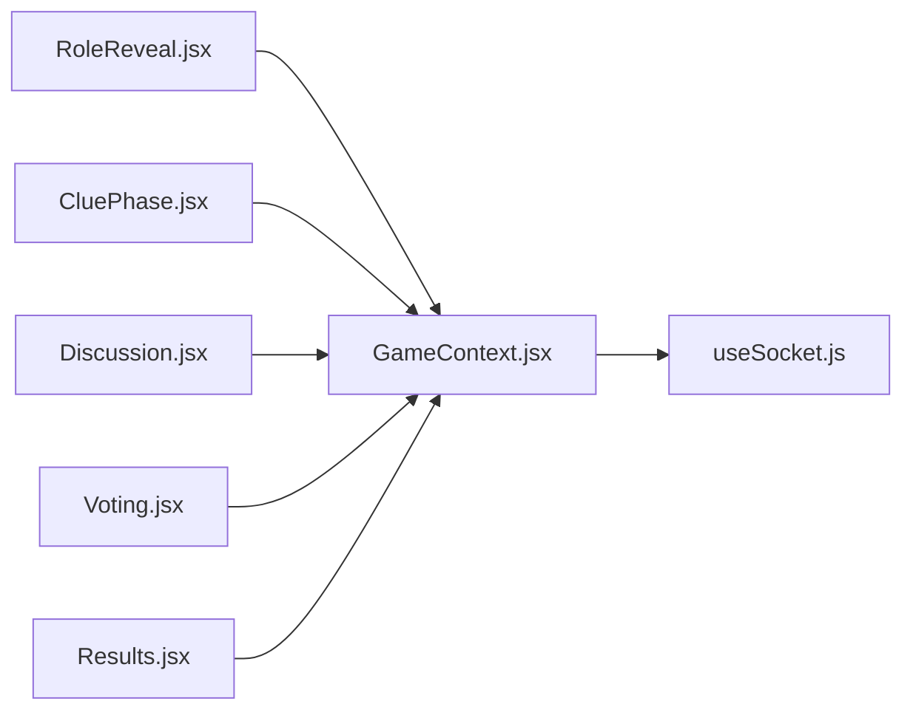

**Diagram sources**
- [client/src/screens/RoleReveal.jsx:4-123](file://client/src/screens/RoleReveal.jsx#L4-L123)
- [client/src/screens/CluePhase.jsx:45-165](file://client/src/screens/CluePhase.jsx#L45-L165)
- [client/src/screens/Discussion.jsx:45-114](file://client/src/screens/Discussion.jsx#L45-L114)
- [client/src/screens/Voting.jsx:56-180](file://client/src/screens/Voting.jsx#L56-L180)
- [client/src/screens/Results.jsx:100-443](file://client/src/screens/Results.jsx#L100-L443)
- [client/src/context/GameContext.jsx:12-383](file://client/src/context/GameContext.jsx#L12-L383)
- [client/src/hooks/useSocket.js:8-76](file://client/src/hooks/useSocket.js#L8-L76)

**Section sources**
- [client/src/screens/RoleReveal.jsx:4-123](file://client/src/screens/RoleReveal.jsx#L4-L123)
- [client/src/screens/CluePhase.jsx:45-165](file://client/src/screens/CluePhase.jsx#L45-L165)
- [client/src/screens/Discussion.jsx:45-114](file://client/src/screens/Discussion.jsx#L45-L114)
- [client/src/screens/Voting.jsx:56-180](file://client/src/screens/Voting.jsx#L56-L180)
- [client/src/screens/Results.jsx:100-443](file://client/src/screens/Results.jsx#L100-L443)
- [client/src/context/GameContext.jsx:70-254](file://client/src/context/GameContext.jsx#L70-L254)

## Dependency Analysis
- Server depends on GameManager for state and on topics for word pools.
- GameManager depends on topics for category selection.
- Client depends on Socket.io for real-time updates and GameContext for state/actions.

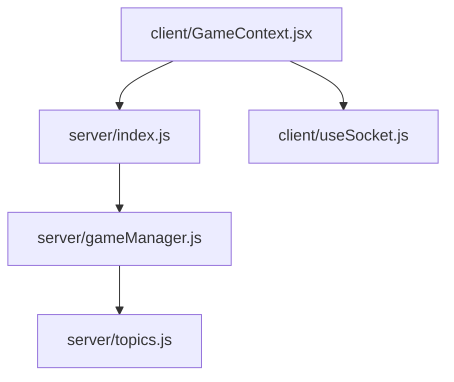

**Diagram sources**
- [server/index.js:27-27](file://server/index.js#L27-L27)
- [server/gameManager.js:4-4](file://server/gameManager.js#L4-L4)
- [client/src/context/GameContext.jsx:12-12](file://client/src/context/GameContext.jsx#L12-L12)
- [client/src/hooks/useSocket.js:8-8](file://client/src/hooks/useSocket.js#L8-L8)

**Section sources**
- [server/index.js:27-27](file://server/index.js#L27-L27)
- [server/gameManager.js:4-4](file://server/gameManager.js#L4-L4)
- [client/src/context/GameContext.jsx:12-12](file://client/src/context/GameContext.jsx#L12-L12)
- [client/src/hooks/useSocket.js:8-8](file://client/src/hooks/useSocket.js#L8-L8)

## Performance Considerations
- In-memory state: No persistence; suitable for small groups and quick sessions.
- Timer intervals: Minimal overhead; ensure cleanup on phase changes and room deletion.
- Client rendering: Staggered reveals and animations are lightweight; avoid unnecessary re-renders by using stable references and memoization where applicable.
- Network resilience: Socket.io reconnection reduces disruption; ensure clients handle reconnection gracefully.

[No sources needed since this section provides general guidance]

## Troubleshooting Guide
Common issues and resolutions:
- Cannot join room: Verify room code, phase is lobby, and capacity allows entry. Check for duplicate names.
- Not receiving role/topic: Ensure the roleReveal phase completed and timer finished; confirm private role messages were received.
- Voting errors: Self-votes are invalid; ensure target is a valid player and not self.
- Timer not updating: Confirm timer events are emitted and handled; check client-side timer state updates.
- Reconnection problems: Ensure stored room code and name are present; verify server reconnection handler runs and state is restored.
- Host controls: Only the host can advance rounds or restart; verify host status.

**Section sources**
- [server/gameManager.js:99-136](file://server/gameManager.js#L99-L136)
- [server/gameManager.js:284-307](file://server/gameManager.js#L284-L307)
- [server/index.js:252-297](file://server/index.js#L252-L297)
- [server/index.js:542-608](file://server/index.js#L542-L608)
- [client/src/context/GameContext.jsx:70-254](file://client/src/context/GameContext.jsx#L70-L254)

## Conclusion
The Imposter Game implements a robust, real-time multiplayer experience with clear phases, deterministic scoring, and resilient state synchronization. The backend enforces rules and timers, while the frontend provides intuitive screens for each stage. Edge cases like reconnections and host rotation are handled to maintain fairness and continuity.

[No sources needed since this section summarizes without analyzing specific files]

## Appendices

### Scoring Summary
- Correct vote (imposter caught): +2 per correct voter.
- Surviving imposter: +3 to imposter.
- Consolation: +1 if imposter guesses the topic after being caught.

**Section sources**
- [README.md:40-47](file://README.md#L40-L47)
- [server/gameManager.js:352-366](file://server/gameManager.js#L352-L366)
- [server/gameManager.js:387-403](file://server/gameManager.js#L387-L403)

### Timers Summary
- Role Reveal: 10 seconds.
- Clue Phase: 60 seconds.
- Discussion: 60 seconds.
- Voting: 45 seconds.

**Section sources**
- [server/index.js:49-122](file://server/index.js#L49-L122)
- [server/index.js:277-287](file://server/index.js#L277-L287)
- [server/index.js:336-340](file://server/index.js#L336-L340)
- [server/index.js:394-397](file://server/index.js#L394-L397)
- [server/index.js:490-501](file://server/index.js#L490-L501)

### Topics Categories
- General: 30+ topics.
- Family: 30+ topics.
- Adult: 30+ topics.

**Section sources**
- [server/topics.js:4-103](file://server/topics.js#L4-L103)