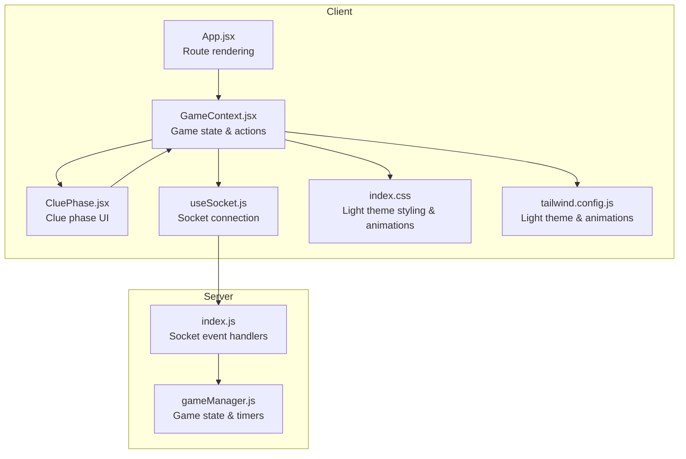
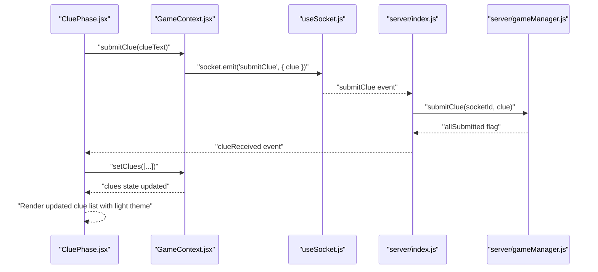
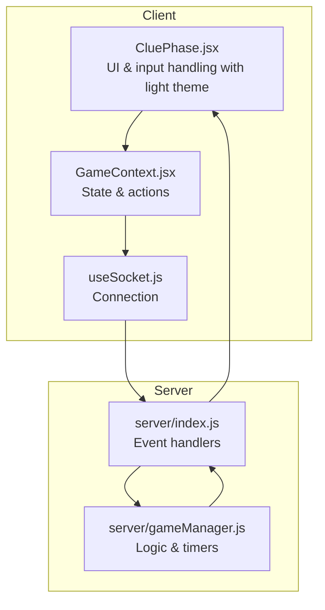
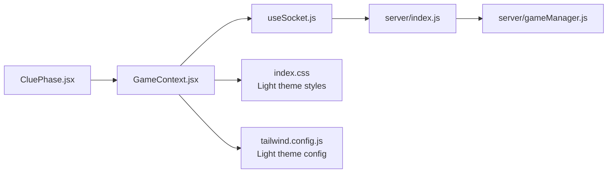

# Clue Phase Screen

<cite>
**Referenced Files in This Document**
- [CluePhase.jsx](file://client/src/screens/CluePhase.jsx)
- [GameContext.jsx](file://client/src/context/GameContext.jsx)
- [useSocket.js](file://client/src/hooks/useSocket.js)
- [index.js](file://server/index.js)
- [gameManager.js](file://server/gameManager.js)
- [index.css](file://client/src/index.css)
- [tailwind.config.js](file://client/tailwind.config.js)
- [App.jsx](file://client/src/App.jsx)
</cite>

## Update Summary
**Changes Made**
- Updated styling documentation to reflect light theme adaptations for Clue Phase screen
- Added documentation for updated countdown rings with light theme color schemes
- Documented form elements styling using light theme color schemes
- Updated status indicators documentation with light theme color palette
- Enhanced visual feedback documentation for light theme implementation

## Table of Contents
1. [Introduction](#introduction)
2. [Project Structure](#project-structure)
3. [Core Components](#core-components)
4. [Architecture Overview](#architecture-overview)
5. [Detailed Component Analysis](#detailed-component-analysis)
6. [Dependency Analysis](#dependency-analysis)
7. [Performance Considerations](#performance-considerations)
8. [Troubleshooting Guide](#troubleshooting-guide)
9. [Conclusion](#conclusion)

## Introduction
This document provides comprehensive technical documentation for the Clue Phase screen component in the Imposter Game. It explains the timed clue submission interface, real-time clue broadcasting, and timer synchronization. It covers clue input validation, character limits, and submission mechanics, along with the clue display system, real-time updates from other players, and the countdown timer integration. The responsive design for clue cards, input field styling, and visual feedback for submissions are documented alongside socket event handling for clue updates, timer management, and transitions to subsequent game phases.

**Updated** The Clue Phase screen now features a comprehensive light theme implementation with updated color schemes, improved visual hierarchy, and enhanced accessibility through carefully selected light theme palettes.

## Project Structure
The Clue Phase screen is part of a React client application integrated with a Socket.IO server. The client manages game state via a context provider and communicates with the server through socket events. The server orchestrates game phases, timers, and real-time broadcasts.

**Diagram sources**
- [App.jsx:67-100](file://client/src/App.jsx#L67-L100)
- [GameContext.jsx:12-380](file://client/src/context/GameContext.jsx#L12-L380)
- [CluePhase.jsx:45-165](file://client/src/screens/CluePhase.jsx#L45-L165)
- [useSocket.js:8-75](file://client/src/hooks/useSocket.js#L8-L75)
- [index.js:173-676](file://server/index.js#L173-L676)
- [gameManager.js:9-636](file://server/gameManager.js#L9-L636)
- [index.css:1-215](file://client/src/index.css#L1-215)
- [tailwind.config.js:1-48](file://client/tailwind.config.js#L1-L48)

**Section sources**
- [App.jsx:67-100](file://client/src/App.jsx#L67-L100)
- [GameContext.jsx:12-380](file://client/src/context/GameContext.jsx#L12-L380)
- [CluePhase.jsx:45-165](file://client/src/screens/CluePhase.jsx#L45-L165)
- [useSocket.js:8-75](file://client/src/hooks/useSocket.js#L8-L75)
- [index.js:173-676](file://server/index.js#L173-L676)
- [gameManager.js:9-636](file://server/gameManager.js#L9-L636)
- [index.css:1-215](file://client/src/index.css#L1-L215)
- [tailwind.config.js:1-48](file://client/tailwind.config.js#L1-L48)

## Core Components
- CluePhase screen: Renders the clue input, timer, and real-time clue display. Handles local validation and submission with light theme styling.
- GameContext: Centralizes game state, socket event listeners, and action dispatchers (including clue submission).
- useSocket: Manages persistent Socket.IO connection and reconnection logic.
- Server index: Implements socket event handlers for clue submission, timer broadcasts, and phase transitions.
- GameManager: Encapsulates game logic, timers, and state transitions.

Key responsibilities:
- Timed clue submission: Client enforces input constraints with light theme validation; server validates and broadcasts.
- Real-time clue broadcasting: Server emits clueReceived to all clients; client updates UI reactively with light theme feedback.
- Timer synchronization: Server starts a 60-second countdown; client receives timerTick events and renders a visual countdown ring with light theme colors.
- Responsive design: Tailwind utilities and custom animations provide responsive layouts and visual feedback with light theme color schemes.

**Updated** The Clue Phase screen now implements a cohesive light theme design system with carefully chosen color palettes for optimal readability and visual appeal.

**Section sources**
- [CluePhase.jsx:45-165](file://client/src/screens/CluePhase.jsx#L45-L165)
- [GameContext.jsx:12-380](file://client/src/context/GameContext.jsx#L12-L380)
- [useSocket.js:8-75](file://client/src/hooks/useSocket.js#L8-L75)
- [index.js:314-347](file://server/index.js#L314-L347)
- [gameManager.js:488-531](file://server/gameManager.js#L488-L531)

## Architecture Overview
The Clue Phase integrates client-side UI with server-side orchestration. The client renders the clue interface and reacts to server events with light theme styling. The server manages the game clock and distributes updates to all clients.

**Diagram sources**
- [CluePhase.jsx:49-54](file://client/src/screens/CluePhase.jsx#L49-L54)
- [GameContext.jsx:276-280](file://client/src/context/GameContext.jsx#L276-L280)
- [useSocket.js:8-75](file://client/src/hooks/useSocket.js#L8-L75)
- [index.js:314-347](file://server/index.js#L314-L347)
- [gameManager.js:249-276](file://server/gameManager.js#L249-L276)

## Detailed Component Analysis

### CluePhase Screen Component
The CluePhase screen manages the timed clue submission experience with comprehensive light theme styling. It renders:
- A countdown ring synchronized with server-side timer ticks using light theme color transitions.
- An instruction header with light theme typography and color scheme.
- A real-time display of submitted clues from all players with light theme visual indicators.
- Visual feedback for self-submission and player presence using light theme accents.

**Updated** The CluePhase component now features enhanced light theme styling with:
- Light theme color palette for all UI elements
- Improved contrast ratios for better accessibility
- Cohesive color scheme using light theme variants
- Enhanced visual hierarchy with proper spacing and typography

Input validation and constraints:
- Local trimming and empty-check prevent submission of whitespace-only entries.
- Character limit enforcement occurs during input (removes spaces and truncates to 20 characters).
- Submission button is disabled until valid input is present.
- After submission, the input is cleared and the submission state is updated.

Real-time clue display:
- The clue list iterates over players and displays either the submitted clue or a thinking indicator for pending submissions.
- Visual indicators highlight players who have submitted using light theme status colors.
- Mark the current player with appropriate light theme styling.

Responsive design and styling:
- Uses Tailwind utilities for responsive layout and glass-card styling with light theme backdrop filters.
- Animations (fade-in, slide-up, scale-in) enhance UX transitions with light theme color transitions.
- Custom CSS defines the countdown ring SVG with light theme color schemes and associated animations.

**Section sources**
- [CluePhase.jsx:45-165](file://client/src/screens/CluePhase.jsx#L45-L165)
- [index.css:70-78](file://client/src/index.css#L70-L78)
- [tailwind.config.js:10-43](file://client/tailwind.config.js#L10-L43)

### CountdownRing Component
The CountdownRing renders a circular progress indicator based on timeLeft and totalTime using light theme color transitions. It dynamically adjusts color based on remaining time and centers the numeric display.

**Updated** The CountdownRing now implements light theme color transitions:
- Green (#10b981) for high time remaining
- Yellow (#f59e0b) for medium time remaining  
- Red (#e94560) for critical time remaining
- Light theme background with proper contrast ratios

Implementation highlights:
- Calculates circumference and stroke dashoffset to render progress.
- Color transitions from green to yellow to red as time decreases.
- Uses SVG circle elements for the background and animated progress arc with light theme colors.

**Section sources**
- [CluePhase.jsx:4-43](file://client/src/screens/CluePhase.jsx#L4-L43)

### GameContext Integration
GameContext coordinates:
- Socket event subscriptions for clueReceived, timerTick, and phaseChanged.
- Action dispatchers for submitClue and other game actions.
- State updates for timer, clues, and submission status.

Clue submission flow:
- submitClue emits a socket event and sets local hasSubmittedClue to true.
- onClueReceived updates the clues array with incoming data, preventing duplicates.

Timer synchronization:
- onTimerTick updates the timer state from server-provided secondsLeft.
- CountdownRing consumes timer and totalTime props to render the visual indicator with light theme colors.

**Section sources**
- [GameContext.jsx:70-254](file://client/src/context/GameContext.jsx#L70-L254)
- [GameContext.jsx:276-280](file://client/src/context/GameContext.jsx#L276-L280)
- [GameContext.jsx:138-140](file://client/src/context/GameContext.jsx#L138-L140)
- [GameContext.jsx:142-148](file://client/src/context/GameContext.jsx#L142-L148)

### Server-Side Clue Management
The server handles clue submission and broadcasting:
- Validates clue length and phase before accepting submissions.
- Emits clueReceived to all clients in the room.
- Checks if all connected players have submitted; if so, clears the timer and advances to discussion.

Timer management:
- advanceToClue starts a 60-second countdown and emits timerTick events.
- On completion, the server advances to discussion automatically.

**Section sources**
- [index.js:314-347](file://server/index.js#L314-L347)
- [index.js:49-66](file://server/index.js#L49-L66)
- [gameManager.js:249-276](file://server/gameManager.js#L249-L276)
- [gameManager.js:488-531](file://server/gameManager.js#L488-L531)

### Socket Event Handling Patterns
Client-side event handling:
- Subscribes to timerTick to keep the UI synchronized with server time.
- Subscribes to clueReceived to update the clue list in real-time.
- Subscribes to phaseChanged to reset UI state when entering the clue phase.

Server-side event handling:
- Handles submitClue, validates input, and broadcasts clueReceived.
- Manages phase transitions and timer lifecycle.

**Section sources**
- [GameContext.jsx:226-227](file://client/src/context/GameContext.jsx#L226-L227)
- [GameContext.jsx:245-246](file://client/src/context/GameContext.jsx#L245-L246)
- [GameContext.jsx:246-247](file://client/src/context/GameContext.jsx#L246-L247)
- [index.js:314-347](file://server/index.js#L314-L347)
- [index.js:49-66](file://server/index.js#L49-L66)

### Responsive Design and Visual Feedback
Responsive layout:
- Flexbox and max-width constraints ensure the screen adapts to various viewport sizes.
- Tailwind utilities provide spacing, alignment, and responsive breakpoints with light theme considerations.

**Updated** Visual feedback with light theme enhancements:
- Animated transitions for screen changes and element appearance with light theme color transitions.
- Glass-card styling for subtle depth and backdrop blur using light theme transparency effects.
- Thinking dots animation for pending submissions with light theme color variations.
- Countdown ring with color-coded progress using light theme palette.
- Enhanced status indicators with proper contrast ratios for accessibility.

**Section sources**
- [CluePhase.jsx:64-162](file://client/src/screens/CluePhase.jsx#L64-L162)
- [index.css:111-126](file://client/src/index.css#L111-L126)
- [index.css:191-209](file://client/src/index.css#L191-L209)
- [tailwind.config.js:10-43](file://client/tailwind.config.js#L10-L43)

## Architecture Overview
The Clue Phase integrates client-side UI with server-side orchestration. The client renders the clue interface and reacts to server events with enhanced light theme styling. The server manages the game clock and distributes updates to all clients.

**Diagram sources**
- [CluePhase.jsx:45-165](file://client/src/screens/CluePhase.jsx#L45-L165)
- [GameContext.jsx:12-380](file://client/src/context/GameContext.jsx#L12-L380)
- [useSocket.js:8-75](file://client/src/hooks/useSocket.js#L8-L75)
- [index.js:173-676](file://server/index.js#L173-L676)
- [gameManager.js:9-636](file://server/gameManager.js#L9-L636)

## Detailed Component Analysis

### Clue Input Validation and Submission Mechanics
Local validation:
- Trims input and prevents submission if empty or if the player has already submitted.
- Enforces a 20-character limit during input (removes spaces and truncates).
- Disables the submit button until valid input is present.

Submission flow:
- Calls submitClue action which emits a socket event.
- Sets local submission state to prevent duplicate submissions.
- Clears the input field upon successful submission.

Server-side validation:
- Ensures clue is non-empty and within acceptable length.
- Verifies the game is in the clue phase.
- Broadcasts clueReceived to all clients and checks for all-submissions condition.

**Section sources**
- [CluePhase.jsx:49-59](file://client/src/screens/CluePhase.jsx#L49-L59)
- [GameContext.jsx:276-280](file://client/src/context/GameContext.jsx#L276-L280)
- [index.js:314-347](file://server/index.js#L314-L347)
- [gameManager.js:249-276](file://server/gameManager.js#L249-L276)

### Real-Time Clue Broadcasting and Display
Broadcasting:
- Server emits clueReceived with playerId, playerName, and clue.
- Clients receive and append the clue to the clues array if not already present.

Display system:
- Iterates over players to show either the submitted clue or a thinking indicator.
- Highlights submitted players and marks the current player with light theme status indicators.
- Uses staggered animations for list items to improve perceived performance.

**Section sources**
- [GameContext.jsx:142-148](file://client/src/context/GameContext.jsx#L142-L148)
- [CluePhase.jsx:115-161](file://client/src/screens/CluePhase.jsx#L115-L161)
- [index.css:165-190](file://client/src/index.css#L165-L190)

### Timer Synchronization and Countdown Integration
Timer lifecycle:
- Server starts a 60-second countdown in the clue phase.
- Emits timerTick with secondsLeft every second.
- Clears timer on all-submissions or completion.

Client rendering:
- CountdownRing calculates progress based on timeLeft and totalTime.
- Progress color changes as time approaches zero using light theme color transitions.
- Numeric display updates in sync with timerTick events with proper light theme contrast.

**Section sources**
- [index.js:49-66](file://server/index.js#L49-L66)
- [GameContext.jsx:138-140](file://client/src/context/GameContext.jsx#L138-L140)
- [CluePhase.jsx:4-43](file://client/src/screens/CluePhase.jsx#L4-L43)

### Transition to Next Game Phase
Automatic advancement:
- When all connected players submit clues, the server clears the timer and advances to discussion.
- The server emits phaseChanged with the new phase and relevant data.

Client-side handling:
- onPhaseChanged resets submission state and clears the clues list when entering the clue phase.
- App.jsx routes to the CluePhase screen when phase is 'clue'.

**Section sources**
- [index.js:335-339](file://server/index.js#L335-L339)
- [GameContext.jsx:110-128](file://client/src/context/GameContext.jsx#L110-L128)
- [App.jsx:56-65](file://client/src/App.jsx#L56-L65)

### Socket Event Handling for Clue Updates, Timer, and Phase Transitions
Client-side listeners:
- timerTick: Updates the timer state.
- clueReceived: Appends received clue to the clues array.
- phaseChanged: Resets UI state for the clue phase.

Server-side handlers:
- submitClue: Validates, stores, and broadcasts clue; checks for all-submissions.
- advanceToClue: Starts timer and transitions to discussion when ready.

**Section sources**
- [GameContext.jsx:226-227](file://client/src/context/GameContext.jsx#L226-L227)
- [GameContext.jsx:245-247](file://client/src/context/GameContext.jsx#L245-L247)
- [index.js:314-347](file://server/index.js#L314-L347)
- [index.js:49-66](file://server/index.js#L49-L66)

### Light Theme Implementation Details
**Updated** The Clue Phase screen implements a comprehensive light theme design system:

**Color Palette**:
- Primary: #f5f5f5 (light theme base)
- Accent: #e94560 (light theme red/pink)
- Success: #10b981 (light theme green)
- Secondary: #3b82f6 (light theme blue)
- Background: Linear gradient from #f5f5f5 to #f0f0f5

**Glass Card Effects**:
- Background: rgba(255, 255, 255, 0.7) with backdrop blur
- Border: 1px solid rgba(0, 0, 0, 0.06)
- Shadow: 0 1px 3px rgba(0, 0, 0, 0.06)

**Typography**:
- Text colors: #1a1a2e (dark gray) for primary text
- Secondary text: #6b7280 (gray-500) for secondary text
- Placeholder: #d1d5db (gray-300) for input placeholders

**Status Indicators**:
- Submitted: neon-green (#10b981) with emerald-200 border
- Pending: gray-300 dots with thinking animation
- Self: "(you)" tag with gray-400 text

**Section sources**
- [index.css:111-126](file://client/src/index.css#L111-L126)
- [index.css:154-165](file://client/src/index.css#L154-L165)
- [index.css:213-216](file://client/src/index.css#L213-L216)
- [tailwind.config.js:5-9](file://client/tailwind.config.js#L5-L9)

## Dependency Analysis
The Clue Phase screen depends on:
- GameContext for state and actions.
- useSocket for maintaining the Socket.IO connection.
- Tailwind and custom CSS for styling and animations with light theme support.
- Server-side socket handlers for real-time updates and phase transitions.

**Diagram sources**
- [CluePhase.jsx:45-165](file://client/src/screens/CluePhase.jsx#L45-L165)
- [GameContext.jsx:12-380](file://client/src/context/GameContext.jsx#L12-L380)
- [useSocket.js:8-75](file://client/src/hooks/useSocket.js#L8-L75)
- [index.js:173-676](file://server/index.js#L173-L676)
- [gameManager.js:9-636](file://server/gameManager.js#L9-L636)
- [index.css:1-215](file://client/src/index.css#L1-L215)
- [tailwind.config.js:1-48](file://client/tailwind.config.js#L1-L48)

**Section sources**
- [CluePhase.jsx:45-165](file://client/src/screens/CluePhase.jsx#L45-L165)
- [GameContext.jsx:12-380](file://client/src/context/GameContext.jsx#L12-L380)
- [useSocket.js:8-75](file://client/src/hooks/useSocket.js#L8-L75)
- [index.js:173-676](file://server/index.js#L173-L676)
- [gameManager.js:9-636](file://server/gameManager.js#L9-L636)
- [index.css:1-215](file://client/src/index.css#L1-L215)
- [tailwind.config.js:1-48](file://client/tailwind.config.js#L1-L48)

## Performance Considerations
- Efficient rendering: The clue list uses a simple map over players and memoizes derived values (submittedIds) to minimize re-renders.
- Minimal state updates: Timer updates occur only on timerTick events, avoiding unnecessary polling.
- Animation performance: CSS animations and transforms are hardware-accelerated where possible.
- Network efficiency: Server emits only necessary data (playerId, playerName, clue) to reduce payload size.
- **Updated** Light theme optimization: CSS variables and pre-computed color values reduce runtime calculations for better performance.

## Troubleshooting Guide
Common issues and resolutions:
- Clue not submitting: Verify the input is non-empty after trimming and that hasSubmittedClue is false. Check for network connectivity and reconnection status.
- Timer not updating: Confirm the client receives timerTick events and that the server is broadcasting them. Inspect the timer lifecycle in advanceToClue.
- Clue not appearing: Ensure clueReceived is emitted by the server and that the client appends clues only if not already present.
- Duplicate submissions: The client sets hasSubmittedClue to true after submitClue; verify this state is respected.
- **Updated** Light theme issues: Verify CSS variables are loading correctly and check browser compatibility for backdrop-filter properties.

**Section sources**
- [GameContext.jsx:276-280](file://client/src/context/GameContext.jsx#L276-L280)
- [index.js:314-347](file://server/index.js#L314-L347)
- [index.js:49-66](file://server/index.js#L49-L66)

## Conclusion
The Clue Phase screen provides a responsive, real-time interface for timed clue submission with comprehensive light theme styling. It integrates tightly with the server to synchronize timers and broadcast clues, ensuring a cohesive multiplayer experience. The component's design emphasizes clarity, immediate feedback, and smooth transitions, leveraging Tailwind utilities and custom animations for an engaging user interface with proper light theme accessibility and visual hierarchy.