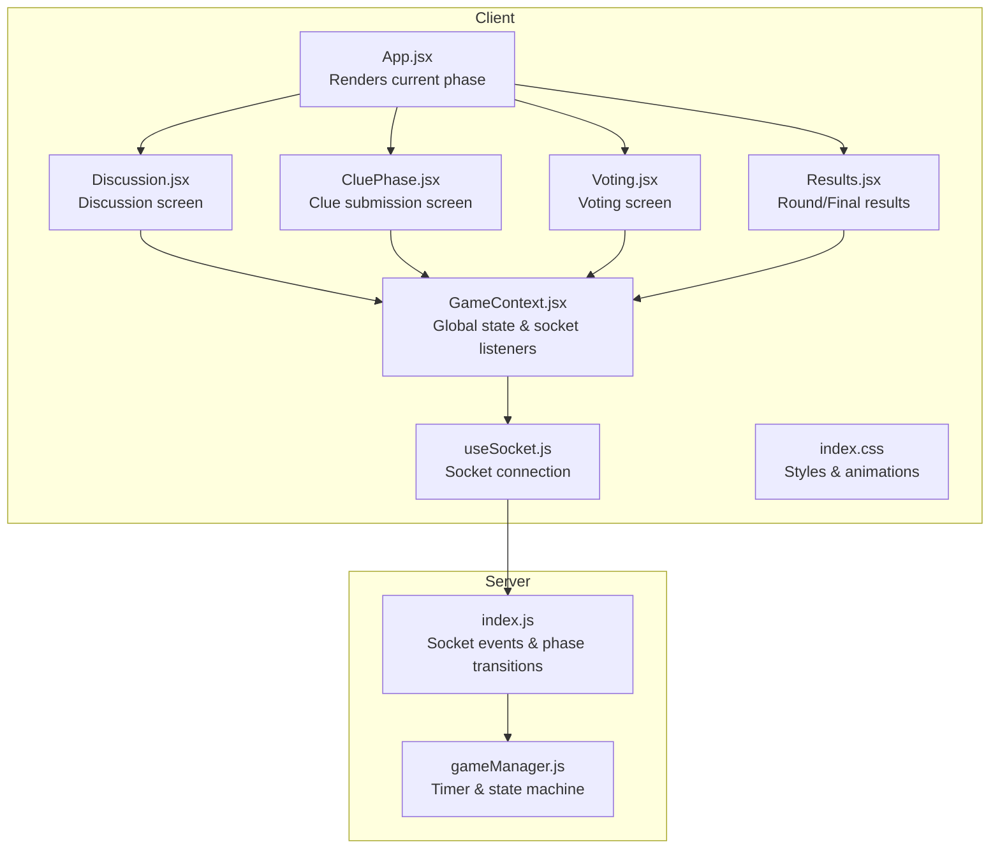
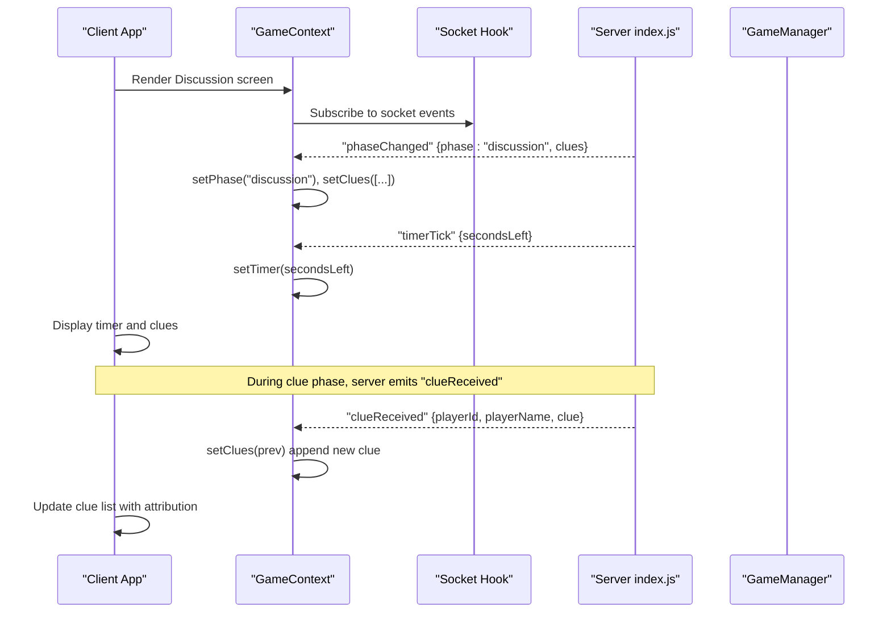
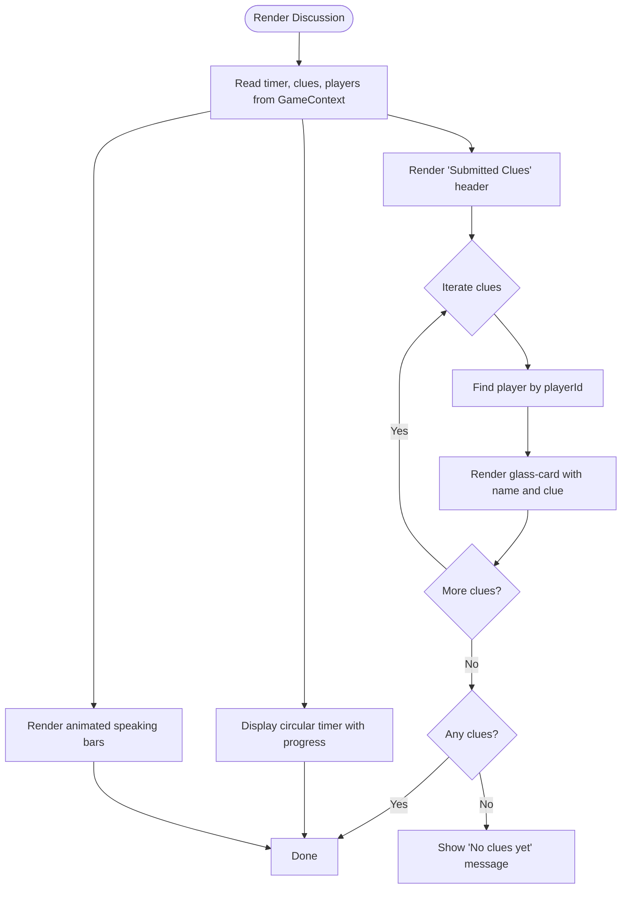
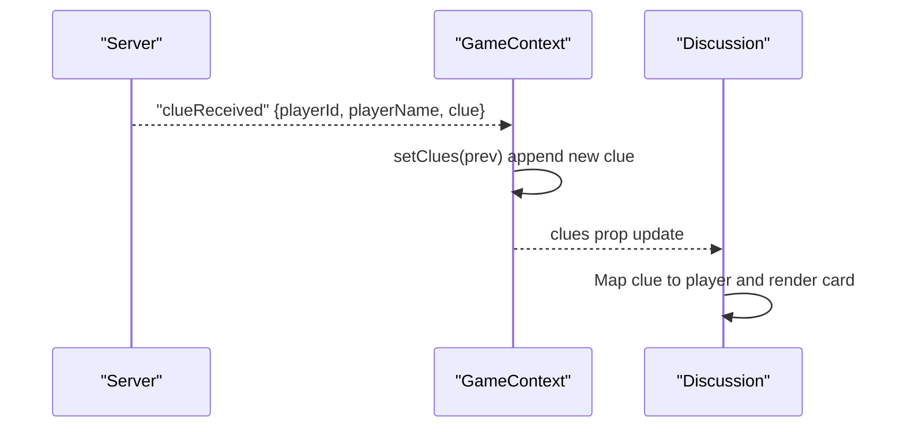
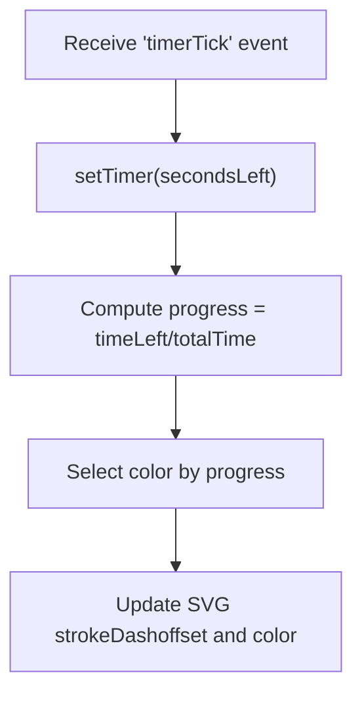
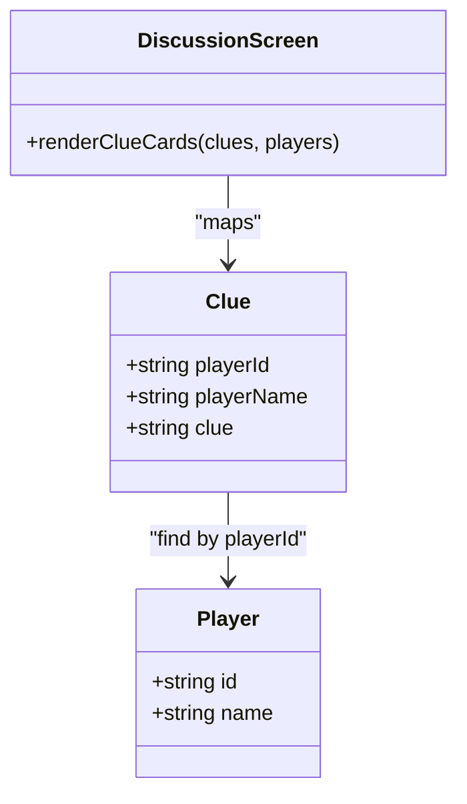
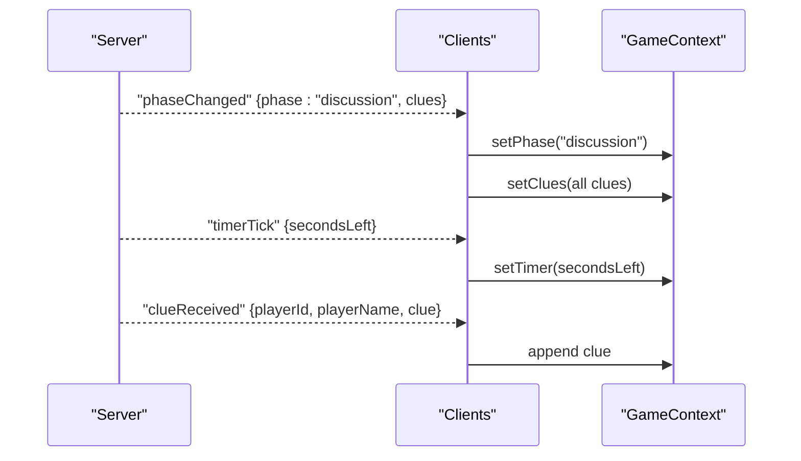
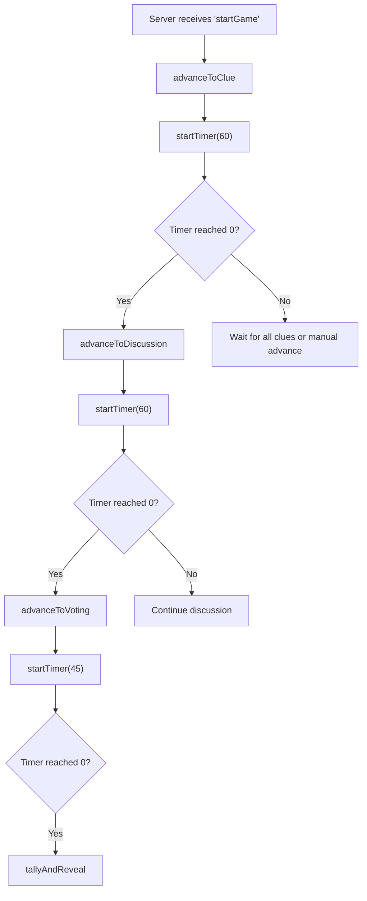
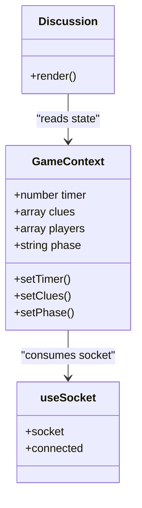
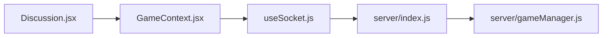

# Discussion Screen

<cite>
**Referenced Files in This Document**
- [Discussion.jsx](file://client/src/screens/Discussion.jsx)
- [GameContext.jsx](file://client/src/context/GameContext.jsx)
- [useSocket.js](file://client/src/hooks/useSocket.js)
- [App.jsx](file://client/src/App.jsx)
- [index.css](file://client/src/index.css)
- [CluePhase.jsx](file://client/src/screens/CluePhase.jsx)
- [Voting.jsx](file://client/src/screens/Voting.jsx)
- [Results.jsx](file://client/src/screens/Results.jsx)
- [index.js](file://server/index.js)
- [gameManager.js](file://server/gameManager.js)
</cite>

## Table of Contents
1. [Introduction](#introduction)
2. [Project Structure](#project-structure)
3. [Core Components](#core-components)
4. [Architecture Overview](#architecture-overview)
5. [Detailed Component Analysis](#detailed-component-analysis)
6. [Dependency Analysis](#dependency-analysis)
7. [Performance Considerations](#performance-considerations)
8. [Troubleshooting Guide](#troubleshooting-guide)
9. [Conclusion](#conclusion)

## Introduction
This document provides comprehensive technical documentation for the Discussion screen component in the Imposter game. It explains the shared clue review interface, discussion timer, and player interaction features. It details the clue display system, player attribution, and real-time discussion mechanics. It also covers timer integration, phase transitions, user engagement features, responsive layout for clue cards, scrolling behavior, visual hierarchy, socket event handling for clue sharing and timer synchronization, and integration with GameContext for state management. Finally, it includes examples of discussion flow and player interaction patterns.

## Project Structure
The Discussion screen is part of the client-side React application and integrates with a Socket.IO backend. The key files involved are:
- Client screens: Discussion, CluePhase, Voting, Results
- Client state management: GameContext and useSocket hook
- Global styles: index.css
- Server entry and game logic: server index.js and gameManager.js

**Diagram sources**
- [App.jsx:56-83](file://client/src/App.jsx#L56-L83)
- [GameContext.jsx:12-380](file://client/src/context/GameContext.jsx#L12-L380)
- [useSocket.js:8-75](file://client/src/hooks/useSocket.js#L8-L75)
- [Discussion.jsx:45-113](file://client/src/screens/Discussion.jsx#L45-L113)
- [CluePhase.jsx:45-164](file://client/src/screens/CluePhase.jsx#L45-L164)
- [Voting.jsx:56-179](file://client/src/screens/Voting.jsx#L56-L179)
- [Results.jsx:100-442](file://client/src/screens/Results.jsx#L100-L442)
- [index.js:49-122](file://server/index.js#L49-L122)
- [gameManager.js:488-531](file://server/gameManager.js#L488-L531)

**Section sources**
- [App.jsx:56-83](file://client/src/App.jsx#L56-L83)
- [Discussion.jsx:45-113](file://client/src/screens/Discussion.jsx#L45-L113)
- [GameContext.jsx:12-380](file://client/src/context/GameContext.jsx#L12-L380)
- [useSocket.js:8-75](file://client/src/hooks/useSocket.js#L8-L75)
- [index.js:49-122](file://server/index.js#L49-L122)
- [gameManager.js:488-531](file://server/gameManager.js#L488-L531)

## Core Components
- Discussion screen: Displays the discussion timer, animated speaking indicators, and a scrollable list of submitted clues attributed to players.
- GameContext: Centralized state management including timer, clues, players, and socket event handlers.
- useSocket: Provides the Socket.IO connection and reconnection logic.
- Server phase transitions: Orchestrates clue, discussion, and voting phases with timers and state updates.

Key responsibilities:
- Real-time clue display and attribution
- Discussion timer synchronized via server events
- Responsive layout with glass cards and staggered animations
- Integration with GameContext for state and actions

**Section sources**
- [Discussion.jsx:45-113](file://client/src/screens/Discussion.jsx#L45-L113)
- [GameContext.jsx:138-148](file://client/src/context/GameContext.jsx#L138-L148)
- [useSocket.js:34-72](file://client/src/hooks/useSocket.js#L34-L72)
- [index.js:72-97](file://server/index.js#L72-L97)

## Architecture Overview
The Discussion screen participates in a multi-phase game flow:
1. Clue phase: Players submit one-word clues; server broadcasts received clues.
2. Discussion phase: All clues are shown to players for 60 seconds while the timer counts down.
3. Voting phase: Players vote on the imposter; timer counts down to reveal results.
4. Results phase: Round/final results are displayed with animations and scoring.

**Diagram sources**
- [Discussion.jsx:45-113](file://client/src/screens/Discussion.jsx#L45-L113)
- [GameContext.jsx:110-128](file://client/src/context/GameContext.jsx#L110-L128)
- [GameContext.jsx:138-148](file://client/src/context/GameContext.jsx#L138-L148)
- [GameContext.jsx:142-147](file://client/src/context/GameContext.jsx#L142-L147)
- [index.js:72-97](file://server/index.js#L72-L97)
- [index.js:314-347](file://server/index.js#L314-L347)

## Detailed Component Analysis

### Discussion Screen Component
The Discussion screen renders:
- A circular countdown timer synchronized with the server.
- An animated "speaking" visualizer to enhance engagement.
- A titled section for submitted clues with player attribution.
- Instructions and a floating action area at the bottom.

Responsive layout and visual hierarchy:
- Flex column layout with centered content and controlled max-width.
- Glass cards for clue entries and informational panels.
- Staggered child animations for list items.
- Scroll container for long clue lists.

Real-time integration:
- Reads timer and clues from GameContext.
- Uses a local total time constant for the Discussion phase.
- Displays player name fallbacks when missing from the clue payload.

**Diagram sources**
- [Discussion.jsx:45-113](file://client/src/screens/Discussion.jsx#L45-L113)
- [GameContext.jsx:142-147](file://client/src/context/GameContext.jsx#L142-L147)

**Section sources**
- [Discussion.jsx:45-113](file://client/src/screens/Discussion.jsx#L45-L113)
- [index.css:111-126](file://client/src/index.css#L111-L126)
- [index.css:165-190](file://client/src/index.css#L165-L190)

### Shared Clue Review Interface
The clue review interface displays:
- Player attribution using the player name from the GameContext players list or the clue payload.
- A vertical stack of clue cards with subtle borders and glass backgrounds.
- Graceful handling when no clues are present.

Integration points:
- GameContext.onClueReceived updates the clues array.
- Discussion reads clues and players to render the list.

**Diagram sources**
- [GameContext.jsx:142-147](file://client/src/context/GameContext.jsx#L142-L147)
- [Discussion.jsx:75-99](file://client/src/screens/Discussion.jsx#L75-L99)

**Section sources**
- [GameContext.jsx:142-147](file://client/src/context/GameContext.jsx#L142-L147)
- [Discussion.jsx:75-99](file://client/src/screens/Discussion.jsx#L75-L99)

### Discussion Timer
The Discussion timer:
- Is a circular SVG progress indicator with dynamic stroke offset.
- Changes color based on remaining time (green > 50%, yellow > 25%, red otherwise).
- Receives updates via the "timerTick" socket event.
- Uses a fixed total time constant for the Discussion phase.

**Diagram sources**
- [GameContext.jsx:138-140](file://client/src/context/GameContext.jsx#L138-L140)
- [Discussion.jsx:4-43](file://client/src/screens/Discussion.jsx#L4-L43)

**Section sources**
- [Discussion.jsx:4-43](file://client/src/screens/Discussion.jsx#L4-L43)
- [GameContext.jsx:138-140](file://client/src/context/GameContext.jsx#L138-L140)

### Player Interaction Features
Player interactions in the Discussion screen:
- Real-time visibility of all submitted clues.
- No direct interaction on the Discussion screen; it is read-only for discussion.
- Engagement cues: animated speaking bars and staggered animations for clue cards.

Related interactive screens:
- CluePhase: Allows single-word clue submission with validation and feedback.
- Voting: Allows selecting a target and locking in a vote.

**Section sources**
- [Discussion.jsx:62-73](file://client/src/screens/Discussion.jsx#L62-L73)
- [CluePhase.jsx:49-54](file://client/src/screens/CluePhase.jsx#L49-L54)
- [Voting.jsx:63-71](file://client/src/screens/Voting.jsx#L63-L71)

### Clue Display System and Player Attribution
The clue display system:
- Iterates over the clues array and finds the matching player by playerId.
- Displays player name from the players list or falls back to playerName from the clue payload.
- Renders each clue in a glass card with a readable layout.

**Diagram sources**
- [Discussion.jsx:80-91](file://client/src/screens/Discussion.jsx#L80-L91)
- [GameContext.jsx:142-147](file://client/src/context/GameContext.jsx#L142-L147)

**Section sources**
- [Discussion.jsx:80-91](file://client/src/screens/Discussion.jsx#L80-L91)
- [GameContext.jsx:142-147](file://client/src/context/GameContext.jsx#L142-L147)

### Real-Time Discussion Mechanics
Real-time mechanics:
- Server emits "phaseChanged" with phase "discussion" and includes all clues.
- Clients clear previous timers and start a new 60-second timer.
- "timerTick" events keep the UI synchronized across clients.
- "clueReceived" events append new clues to the Discussion screen.

**Diagram sources**
- [index.js:72-97](file://server/index.js#L72-L97)
- [GameContext.jsx:110-128](file://client/src/context/GameContext.jsx#L110-L128)
- [GameContext.jsx:138-140](file://client/src/context/GameContext.jsx#L138-L140)
- [GameContext.jsx:142-147](file://client/src/context/GameContext.jsx#L142-L147)

**Section sources**
- [index.js:72-97](file://server/index.js#L72-L97)
- [GameContext.jsx:110-128](file://client/src/context/GameContext.jsx#L110-L128)
- [GameContext.jsx:138-140](file://client/src/context/GameContext.jsx#L138-L140)
- [GameContext.jsx:142-147](file://client/src/context/GameContext.jsx#L142-L147)

### Timer Integration and Phase Transitions
Timer integration:
- Server manages timers via GameManager.startTimer and GameManager.clearTimer.
- On phase change to "discussion", server clears any existing timer and starts a new 60-second timer.
- On phase change to "voting", server starts a 45-second timer.
- "timerTick" broadcasts secondsLeft to all clients.

Phase transitions:
- advanceToClue: sets phase "clue" and starts a 60-second timer; on end, advances to discussion.
- advanceToDiscussion: sets phase "discussion", sends all clues, starts a 60-second timer; on end, advances to voting.
- advanceToVoting: sets phase "voting" and starts a 45-second timer; on end, tallies results.

**Diagram sources**
- [index.js:49-66](file://server/index.js#L49-L66)
- [index.js:72-97](file://server/index.js#L72-L97)
- [index.js:103-122](file://server/index.js#L103-L122)
- [gameManager.js:495-518](file://server/gameManager.js#L495-L518)

**Section sources**
- [index.js:49-66](file://server/index.js#L49-L66)
- [index.js:72-97](file://server/index.js#L72-L97)
- [index.js:103-122](file://server/index.js#L103-L122)
- [gameManager.js:495-518](file://server/gameManager.js#L495-L518)

### User Engagement Features
Engagement features in the Discussion screen:
- Animated speaking bars under the header to simulate conversation.
- Staggered animations for clue cards to improve perceived performance and readability.
- Glass card design with backdrop blur for depth and modern feel.
- Floating instruction panel at the bottom with contextual guidance.

**Section sources**
- [Discussion.jsx:62-73](file://client/src/screens/Discussion.jsx#L62-L73)
- [Discussion.jsx:80-99](file://client/src/screens/Discussion.jsx#L80-L99)
- [index.css:111-126](file://client/src/index.css#L111-L126)
- [index.css:165-190](file://client/src/index.css#L165-L190)

### Responsive Layout and Scrolling Behavior
Layout characteristics:
- Full-width, full-height flex column with center alignment.
- Controlled max-width containers for content sections.
- Scroll container for clue list to accommodate many players.
- Responsive typography and spacing for various screen sizes.

Scroll behavior:
- The screen uses overflow-y-auto to enable vertical scrolling when content exceeds viewport height.
- Clue cards are stacked vertically with consistent spacing.

**Section sources**
- [Discussion.jsx:50](file://client/src/screens/Discussion.jsx#L50)
- [Discussion.jsx:80-99](file://client/src/screens/Discussion.jsx#L80-L99)
- [index.css:28-45](file://client/src/index.css#L28-L45)

### Socket Event Handling and GameContext Integration
Socket event handling:
- GameContext registers listeners for "phaseChanged", "timerTick", "clueReceived", and others.
- "phaseChanged" resets relevant state and clears timers when entering discussion.
- "timerTick" updates the timer state for all screens.
- "clueReceived" appends new clues to the Discussion screen.

Integration with GameContext:
- Discussion reads timer, clues, and players from GameContext.
- The provider exposes actions and state to all screens.
- useSocket encapsulates connection lifecycle and reconnection.

**Diagram sources**
- [GameContext.jsx:12-380](file://client/src/context/GameContext.jsx#L12-L380)
- [Discussion.jsx:45-113](file://client/src/screens/Discussion.jsx#L45-L113)
- [useSocket.js:8-75](file://client/src/hooks/useSocket.js#L8-L75)

**Section sources**
- [GameContext.jsx:70-254](file://client/src/context/GameContext.jsx#L70-L254)
- [Discussion.jsx:45-113](file://client/src/screens/Discussion.jsx#L45-L113)
- [useSocket.js:34-72](file://client/src/hooks/useSocket.js#L34-L72)

### Examples of Discussion Flow and Player Interaction Patterns
Typical Discussion flow:
1. Server transitions to "discussion" and broadcasts all clues.
2. Clients clear previous timers and start a 60-second timer.
3. Players observe the timer and review all clues.
4. When the timer ends, the server advances to "voting".

Player interaction patterns:
- Observational: Players read and discuss clues without direct input on the Discussion screen.
- Synchronization: All clients receive the same timer and clue updates via socket events.
- Transition awareness: Clients react to "phaseChanged" to reset UI state and timers.

**Section sources**
- [index.js:72-97](file://server/index.js#L72-L97)
- [GameContext.jsx:110-128](file://client/src/context/GameContext.jsx#L110-L128)
- [GameContext.jsx:138-140](file://client/src/context/GameContext.jsx#L138-L140)

## Dependency Analysis
The Discussion screen depends on:
- GameContext for state (timer, clues, players, phase).
- useSocket for real-time communication.
- Server for phase transitions and timer events.

**Diagram sources**
- [Discussion.jsx:45-113](file://client/src/screens/Discussion.jsx#L45-L113)
- [GameContext.jsx:12-380](file://client/src/context/GameContext.jsx#L12-L380)
- [useSocket.js:8-75](file://client/src/hooks/useSocket.js#L8-L75)
- [index.js:49-122](file://server/index.js#L49-L122)
- [gameManager.js:488-531](file://server/gameManager.js#L488-L531)

**Section sources**
- [Discussion.jsx:45-113](file://client/src/screens/Discussion.jsx#L45-L113)
- [GameContext.jsx:12-380](file://client/src/context/GameContext.jsx#L12-L380)
- [useSocket.js:8-75](file://client/src/hooks/useSocket.js#L8-L75)
- [index.js:49-122](file://server/index.js#L49-L122)
- [gameManager.js:488-531](file://server/gameManager.js#L488-L531)

## Performance Considerations
- Minimize re-renders: Keep clue list rendering efficient by avoiding unnecessary key changes.
- Efficient state updates: Use immutable updates for clues to prevent stale references.
- Animation performance: Keep animation durations reasonable to avoid jank on lower-end devices.
- Network efficiency: Rely on server-driven timers to avoid client-side drift.

## Troubleshooting Guide
Common issues and resolutions:
- Timer not updating: Verify "timerTick" events are received and setTimer is called.
- Clues not appearing: Confirm "clueReceived" events append to clues and players list contains matching ids.
- Phase stuck: Ensure "phaseChanged" resets state and clears timers appropriately.
- Connection drops: useSocket handles reconnection; verify reconnected event restores state.

**Section sources**
- [GameContext.jsx:138-140](file://client/src/context/GameContext.jsx#L138-L140)
- [GameContext.jsx:142-147](file://client/src/context/GameContext.jsx#L142-L147)
- [GameContext.jsx:110-128](file://client/src/context/GameContext.jsx#L110-L128)
- [useSocket.js:34-72](file://client/src/hooks/useSocket.js#L34-L72)

## Conclusion
The Discussion screen provides a focused, real-time environment for players to review clues and deliberate before voting. Its integration with GameContext and the server ensures synchronized timers, seamless clue sharing, and smooth phase transitions. The responsive layout, engaging animations, and clear visual hierarchy contribute to an immersive gameplay experience.