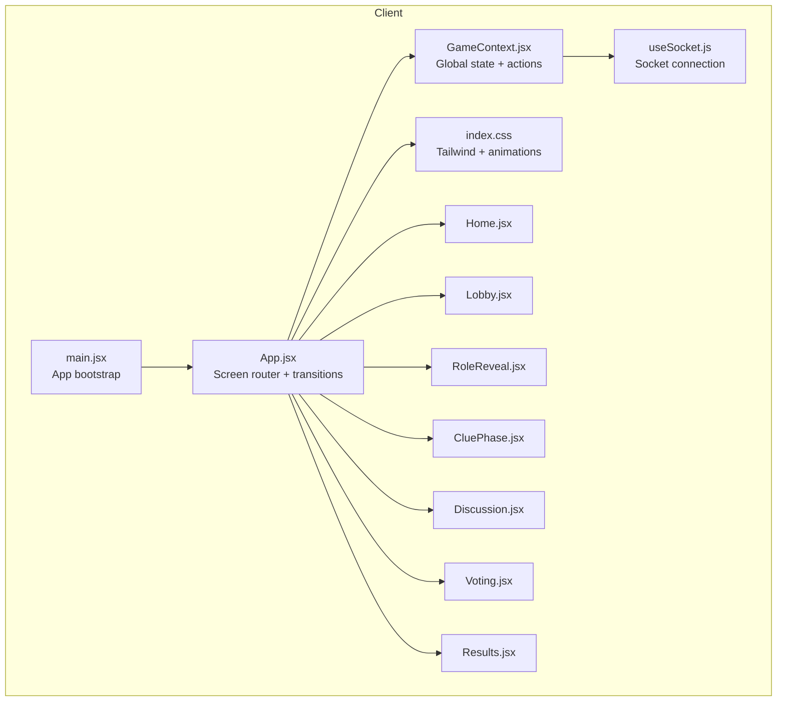
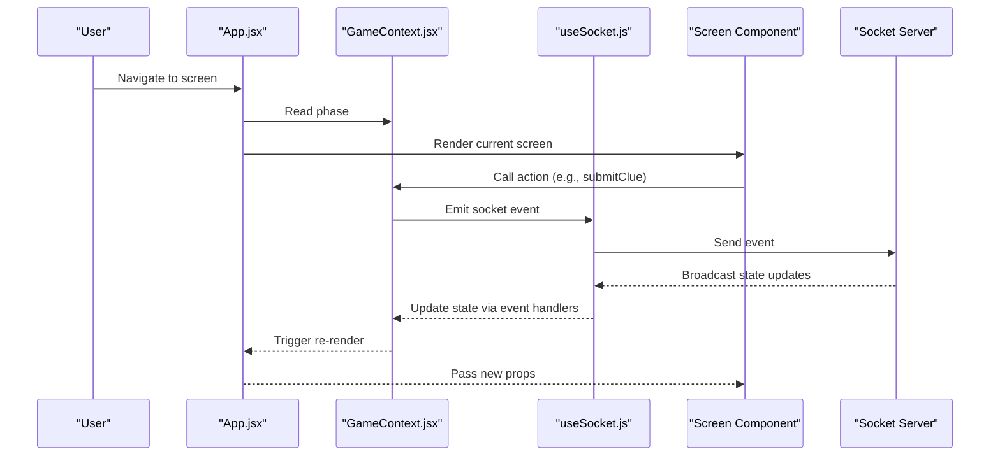
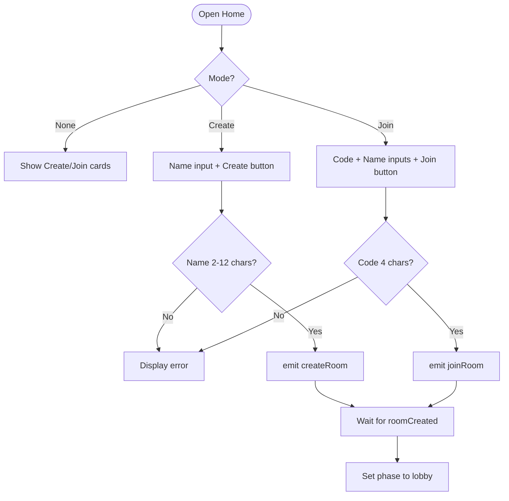
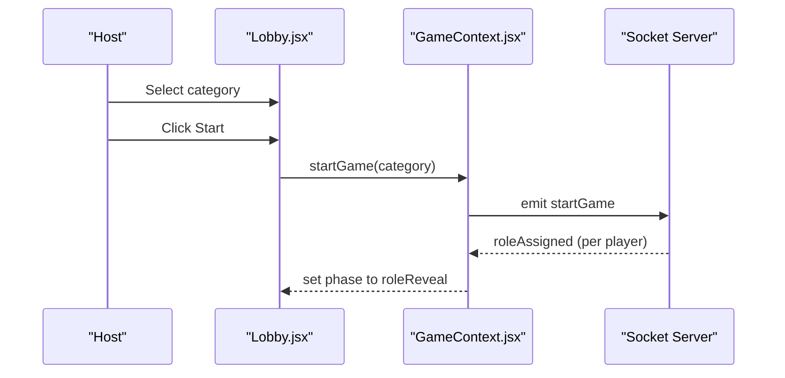
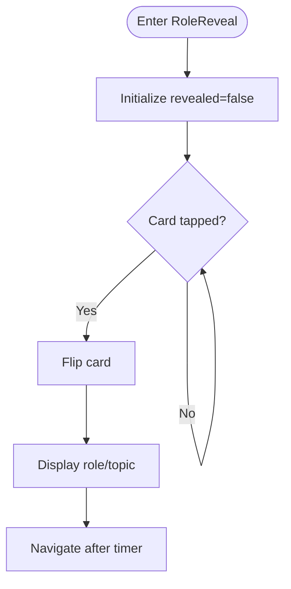
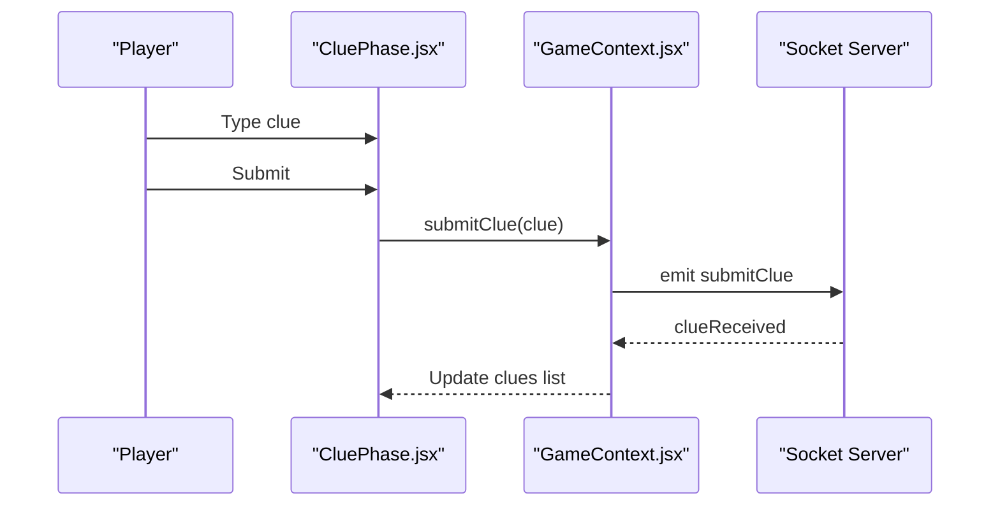
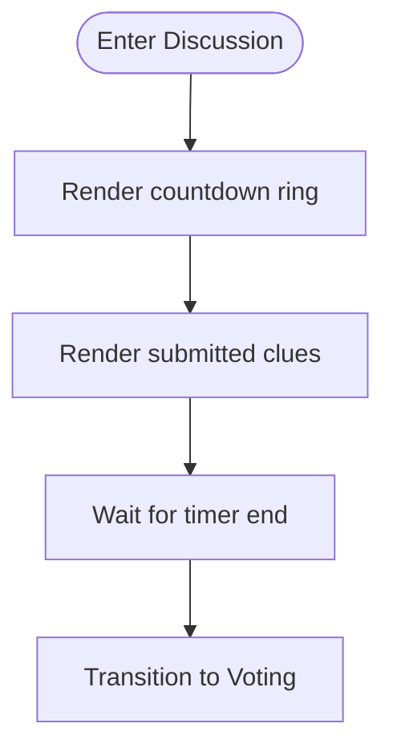
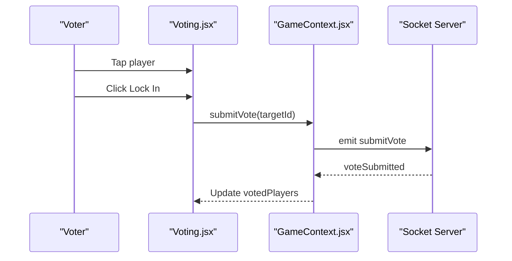
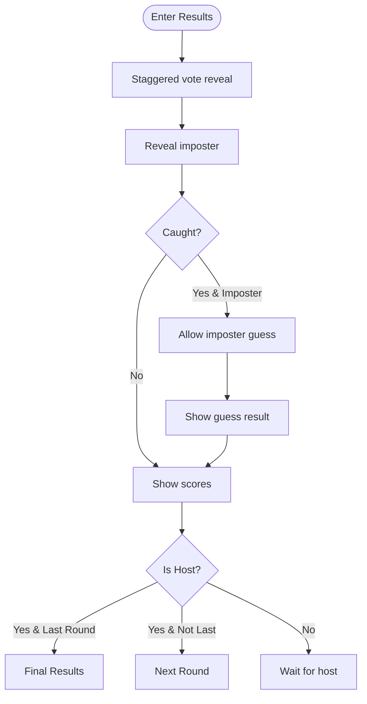
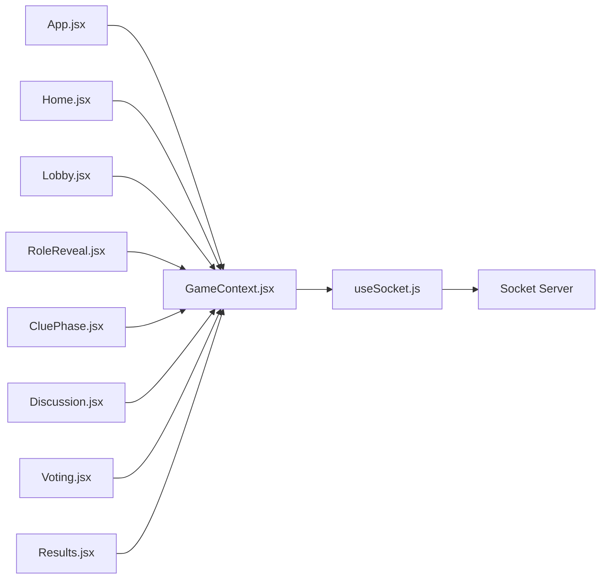

# Game Screens and UI Components

<cite>
**Referenced Files in This Document**
- [App.jsx](file://client/src/App.jsx)
- [GameContext.jsx](file://client/src/context/GameContext.jsx)
- [Home.jsx](file://client/src/screens/Home.jsx)
- [Lobby.jsx](file://client/src/screens/Lobby.jsx)
- [RoleReveal.jsx](file://client/src/screens/RoleReveal.jsx)
- [CluePhase.jsx](file://client/src/screens/CluePhase.jsx)
- [Discussion.jsx](file://client/src/screens/Discussion.jsx)
- [Voting.jsx](file://client/src/screens/Voting.jsx)
- [Results.jsx](file://client/src/screens/Results.jsx)
- [useSocket.js](file://client/src/hooks/useSocket.js)
- [index.css](file://client/src/index.css)
- [main.jsx](file://client/src/main.jsx)
- [README.md](file://README.md)
</cite>

## Table of Contents
1. [Introduction](#introduction)
2. [Project Structure](#project-structure)
3. [Core Components](#core-components)
4. [Architecture Overview](#architecture-overview)
5. [Detailed Component Analysis](#detailed-component-analysis)
6. [Dependency Analysis](#dependency-analysis)
7. [Performance Considerations](#performance-considerations)
8. [Troubleshooting Guide](#troubleshooting-guide)
9. [Conclusion](#conclusion)

## Introduction
This document describes all game screens and UI components in the Imposter Game. It covers the complete user journey from room creation and joining to the final results, detailing each screen’s visual appearance, user interactions, component props, state management, and integration with the global GameContext. It also documents responsive design considerations, animations, accessibility features, and screen transition logic that drives the overall game flow.

## Project Structure
The client-side application is organized around a central App container that routes to different screens based on the current game phase. Global state is managed by a React context provider that connects to a Socket.IO backend. Each screen is a self-contained module that reads from and writes to the shared GameContext.

**Diagram sources**
- [main.jsx:1-14](file://client/src/main.jsx#L1-L14)
- [App.jsx:1-101](file://client/src/App.jsx#L1-L101)
- [GameContext.jsx:1-383](file://client/src/context/GameContext.jsx#L1-L383)
- [useSocket.js:1-76](file://client/src/hooks/useSocket.js#L1-L76)
- [index.css:1-215](file://client/src/index.css#L1-L215)

**Section sources**
- [README.md:88-111](file://README.md#L88-L111)
- [main.jsx:1-14](file://client/src/main.jsx#L1-L14)
- [App.jsx:1-101](file://client/src/App.jsx#L1-L101)

## Core Components
- App: Central router that renders the current screen with smooth transitions and overlays for toasts and connection status.
- GameContext: Provides global state (room, players, phase, timer, clues, votes, scores) and actions (create/join/start/submit/clue/vote/nextRound/playAgain/leave).
- useSocket: Manages the persistent Socket.IO connection and reconnection logic.
- Screens: Home, Lobby, RoleReveal, CluePhase, Discussion, Voting, Results.

Key responsibilities:
- State synchronization: All screens subscribe to GameContext and react to server events.
- Transitions: App manages cross-fade transitions between screens.
- Animations: CSS-driven animations for cards, timers, toasts, and confetti.
- Accessibility: Semantic markup, keyboard navigation, focus styles, and readable contrast.

**Section sources**
- [App.jsx:56-100](file://client/src/App.jsx#L56-L100)
- [GameContext.jsx:12-380](file://client/src/context/GameContext.jsx#L12-L380)
- [useSocket.js:1-76](file://client/src/hooks/useSocket.js#L1-L76)

## Architecture Overview
The game follows a reactive architecture:
- App listens to GameContext.phase and renders the appropriate screen with a fade transition.
- GameContext listens to Socket.IO events and updates state accordingly.
- Screens render UI based on current state and trigger actions via GameContext.

**Diagram sources**
- [App.jsx:67-100](file://client/src/App.jsx#L67-L100)
- [GameContext.jsx:70-254](file://client/src/context/GameContext.jsx#L70-L254)
- [useSocket.js:34-72](file://client/src/hooks/useSocket.js#L34-L72)

## Detailed Component Analysis

### Home Screen (Room Creation and Joining)
- Purpose: Allows the host to create a room or players to join via a 4-character code.
- Visual appearance:
  - Floating animated emojis and gradient title.
  - Two interactive cards: “Create Game” and “Join Game”.
  - Form inputs with character limits and validation.
  - Connection status indicator and error overlay.
- User interactions:
  - Create: Validates name length, emits createRoom.
  - Join: Validates code length and name, emits joinRoom.
  - Back button resets mode and clears errors.
- Props/state:
  - Uses GameContext: createRoom, joinRoom, error, clearError, connected.
  - Local state: mode, code, name, createName.
- Integration with GameContext:
  - On roomCreated/joinedRoom, sets roomCode, playerId, players, and navigates to lobby.
- Responsive design:
  - Flex layout adapts to mobile viewport; inputs use max-width constraints.
- Animations:
  - Fade-in/slide-up for content; floating emojis with staggered delays.
- Accessibility:
  - Proper labels, placeholders, focus-visible outlines, and disabled states.

**Diagram sources**
- [Home.jsx:12-41](file://client/src/screens/Home.jsx#L12-L41)
- [GameContext.jsx:74-94](file://client/src/context/GameContext.jsx#L74-L94)

**Section sources**
- [Home.jsx:1-231](file://client/src/screens/Home.jsx#L1-L231)
- [GameContext.jsx:74-94](file://client/src/context/GameContext.jsx#L74-L94)

### Lobby Screen (Player Management and Category Selection)
- Purpose: Displays players, room code, and host controls.
- Visual appearance:
  - Player avatars with initials and online status indicators.
  - Room code with copy-to-clipboard support.
  - Category picker (General/Family/Adult) for host.
  - Start button with dynamic state.
- User interactions:
  - Host selects category and starts game.
  - Non-host waits with animated thinking dots.
  - Copy room code with feedback.
  - Leave room.
- Props/state:
  - Uses GameContext: roomCode, players, isHost, startGame, leaveGame, playerId, addToast.
  - Local state: selectedCategory, copied.
- Integration with GameContext:
  - Emits startGame(category) when ready.
  - Listens for playerJoined/playerLeft to update UI.
- Responsive design:
  - Grid layout for avatars; responsive typography.
- Animations:
  - Staggered child animations for lists; glow effect for start button.
- Accessibility:
  - Clear labels, hover/focus states, and status indicators.

**Diagram sources**
- [Lobby.jsx:56-86](file://client/src/screens/Lobby.jsx#L56-L86)
- [GameContext.jsx:130-136](file://client/src/context/GameContext.jsx#L130-L136)

**Section sources**
- [Lobby.jsx:1-211](file://client/src/screens/Lobby.jsx#L1-L211)
- [GameContext.jsx:130-136](file://client/src/context/GameContext.jsx#L130-L136)

### RoleReveal Screen (Private Role Display)
- Purpose: Private role reveal with a flip card animation.
- Visual appearance:
  - Centered flip card with front/back sides.
  - Background glow changes based on role.
  - Timer overlay.
- User interactions:
  - Tap/click the card to reveal role.
- Props/state:
  - Uses GameContext: role, topic, timer.
  - Local state: revealed.
- Integration with GameContext:
  - On roleAssigned, sets role/topic and navigates here.
  - Timer updates via timerTick events.
- Responsive design:
  - Fixed aspect ratio card with max-width constraints.
- Animations:
  - Flip card 3D animation; pulsing ring; background glow transitions.
- Accessibility:
  - Large touch targets; clear role text; sufficient contrast.

**Diagram sources**
- [RoleReveal.jsx:4-14](file://client/src/screens/RoleReveal.jsx#L4-L14)
- [GameContext.jsx:130-136](file://client/src/context/GameContext.jsx#L130-L136)

**Section sources**
- [RoleReveal.jsx:1-123](file://client/src/screens/RoleReveal.jsx#L1-L123)
- [GameContext.jsx:130-136](file://client/src/context/GameContext.jsx#L130-L136)

### CluePhase Screen (Timed Clue Submission)
- Purpose: One-word clue submission under time pressure.
- Visual appearance:
  - Circular countdown ring with color-coded segments.
  - Input field for clue with space removal and length limit.
  - Live player status list with submitted indicators.
- User interactions:
  - Type one-word clue, submit.
  - View others’ clues as they submit.
- Props/state:
  - Uses GameContext: timer, submitClue, hasSubmittedClue, clues, players, playerId.
  - Local state: clueText.
- Integration with GameContext:
  - Emits submitClue; receives clueReceived; resets on phase change.
- Responsive design:
  - Centered column layout; responsive font sizes.
- Animations:
  - Staggered children for player list; thinking dots; fade/slide transitions.
- Accessibility:
  - Clear instructions, live status updates, and keyboard support.

**Diagram sources**
- [CluePhase.jsx:45-54](file://client/src/screens/CluePhase.jsx#L45-L54)
- [GameContext.jsx:142-148](file://client/src/context/GameContext.jsx#L142-L148)

**Section sources**
- [CluePhase.jsx:1-165](file://client/src/screens/CluePhase.jsx#L1-L165)
- [GameContext.jsx:142-148](file://client/src/context/GameContext.jsx#L142-L148)

### Discussion Screen (Shared Clue Review)
- Purpose: Open discussion before voting; displays submitted clues.
- Visual appearance:
  - Circular countdown ring.
  - Animated sound wave indicators.
  - Clues list with player names and clues.
- User interactions:
  - No input; watch others’ clues.
- Props/state:
  - Uses GameContext: timer, clues, players.
- Integration with GameContext:
  - Receives clueReceived and timerTick events.
- Responsive design:
  - Vertical scrolling container; compact list items.
- Animations:
  - Staggered children; floating sound bars with pulse animation.
- Accessibility:
  - Readable text, consistent spacing, and focus management.

**Diagram sources**
- [Discussion.jsx:45-54](file://client/src/screens/Discussion.jsx#L45-L54)
- [GameContext.jsx:138-140](file://client/src/context/GameContext.jsx#L138-L140)

**Section sources**
- [Discussion.jsx:1-114](file://client/src/screens/Discussion.jsx#L1-L114)
- [GameContext.jsx:138-140](file://client/src/context/GameContext.jsx#L138-L140)

### Voting Screen (Target Selection)
- Purpose: Players vote for who they think is the imposter.
- Visual appearance:
  - Small circular countdown ring.
  - Grid of player avatars with initials and selection state.
  - “Lock In Vote” button with dynamic state.
- User interactions:
  - Tap a player to select; lock in vote; wait for others.
- Props/state:
  - Uses GameContext: timer, players, playerId, submitVote, hasVoted, votedPlayers.
  - Local state: selectedId.
- Integration with GameContext:
  - Emits submitVote(targetId); tracks votedPlayers; resets on phase change.
- Responsive design:
  - 2-column grid; avatar sizing scales with viewport.
- Animations:
  - Pulse ring for selected; thinking dots while waiting; fade/slide transitions.
- Accessibility:
  - Visual selection feedback; disabled states; clear status text.

**Diagram sources**
- [Voting.jsx:56-71](file://client/src/screens/Voting.jsx#L56-L71)
- [GameContext.jsx:150-156](file://client/src/context/GameContext.jsx#L150-L156)

**Section sources**
- [Voting.jsx:1-180](file://client/src/screens/Voting.jsx#L1-L180)
- [GameContext.jsx:150-156](file://client/src/context/GameContext.jsx#L150-L156)

### Results Screen (Scoreboard Display and Round Flow)
- Purpose: Staged reveal of votes, imposter identity, scoring, and next steps.
- Visual appearance:
  - Staggered vote reveal with slide-in animation.
  - Imposter reveal with dynamic background and emoji.
  - Scoreboard with avatar initials and score changes.
  - Imposter guess input (when caught and imposter).
  - Next Round/Final Results buttons for host.
- User interactions:
  - Confetti fireworks on catches.
  - Imposter guess submission and result display.
  - Host advances to next round or final results.
- Props/state:
  - Uses GameContext: phase, roundResult, players, isHost, nextRound, playAgain, leaveGame, currentRound, totalRounds, finalScores, submitImposterGuess, imposterGuessResult, role, playerId.
  - Local state: imposterGuess, guessSubmitted.
- Integration with GameContext:
  - Receives roundResult and game over events; triggers confetti; resets on nextRound/playAgain.
- Responsive design:
  - Full-width lists; compact rows; centered cards.
- Animations:
  - Staggered children; scale-in/out; glow transitions; confetti bursts.
- Accessibility:
  - Clear status messages, readable scores, and keyboard-friendly controls.

**Diagram sources**
- [Results.jsx:100-179](file://client/src/screens/Results.jsx#L100-L179)
- [GameContext.jsx:158-170](file://client/src/context/GameContext.jsx#L158-L170)

**Section sources**
- [Results.jsx:1-443](file://client/src/screens/Results.jsx#L1-L443)
- [GameContext.jsx:158-170](file://client/src/context/GameContext.jsx#L158-L170)

## Dependency Analysis
- App depends on GameContext for phase and renders the corresponding screen component.
- Screens depend on GameContext for state and actions; they do not manage network directly.
- GameContext depends on useSocket for connection and event handling.
- useSocket depends on environment variable VITE_SERVER_URL and Socket.IO client.

**Diagram sources**
- [App.jsx:67-83](file://client/src/App.jsx#L67-L83)
- [GameContext.jsx:12-380](file://client/src/context/GameContext.jsx#L12-L380)
- [useSocket.js:1-76](file://client/src/hooks/useSocket.js#L1-L76)

**Section sources**
- [App.jsx:67-83](file://client/src/App.jsx#L67-L83)
- [GameContext.jsx:12-380](file://client/src/context/GameContext.jsx#L12-L380)
- [useSocket.js:1-76](file://client/src/hooks/useSocket.js#L1-L76)

## Performance Considerations
- Minimal re-renders: Each screen only subscribes to the state it uses via GameContext.
- Efficient transitions: CSS transitions replace heavy JS animations.
- Lightweight timers: SVG countdown rings are computed on demand.
- Animation throttling: Confetti is triggered conditionally and cleared on cleanup.
- Memory safety: Event listeners are cleaned up in GameContext and App.

## Troubleshooting Guide
Common issues and remedies:
- Connection problems:
  - Verify VITE_SERVER_URL is set correctly in the client environment.
  - Check the connection indicator; it pulses when connected.
- Room join failures:
  - Ensure code is exactly 4 characters and name is 2–12 characters.
  - Confirm the room exists and is not full.
- Missing events:
  - On reconnect, GameContext restores state and re-subscribes to events.
  - Use the reconnected toast to confirm restoration.
- Voting/Clue submission blocked:
  - Ensure you have not already submitted or voted.
  - Check hasSubmittedClue/hasVoted flags in GameContext.
- Animations not playing:
  - Confirm Tailwind classes are present and index.css is loaded.
  - Check that the browser supports CSS animations.

**Section sources**
- [useSocket.js:34-72](file://client/src/hooks/useSocket.js#L34-L72)
- [GameContext.jsx:177-191](file://client/src/context/GameContext.jsx#L177-L191)
- [index.css:47-215](file://client/src/index.css#L47-L215)

## Conclusion
The Imposter Game’s UI is a cohesive, reactive system built around a central App router and a robust GameContext. Each screen is designed for clarity and responsiveness, with thoughtful animations and accessibility considerations. The integration with Socket.IO ensures synchronized gameplay across devices, while the staged Results screen provides satisfying feedback loops. Together, these components deliver an engaging, real-time multiplayer experience.