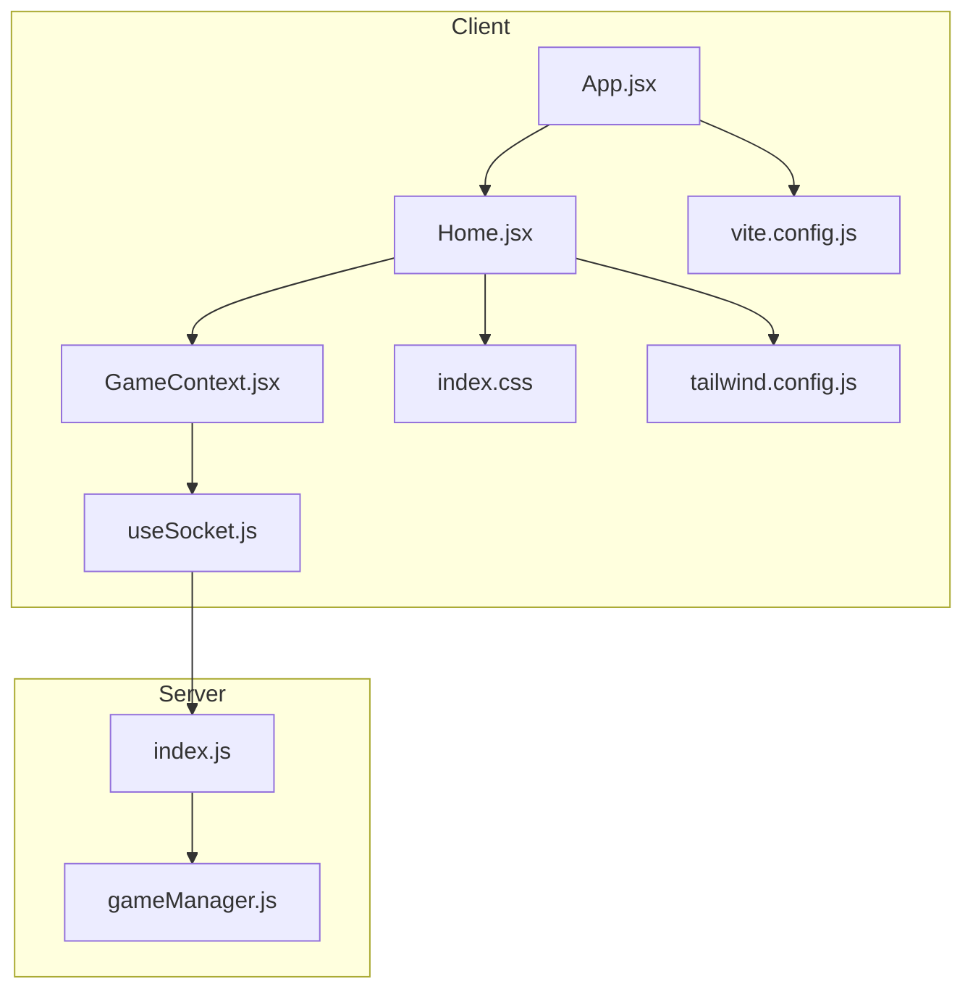
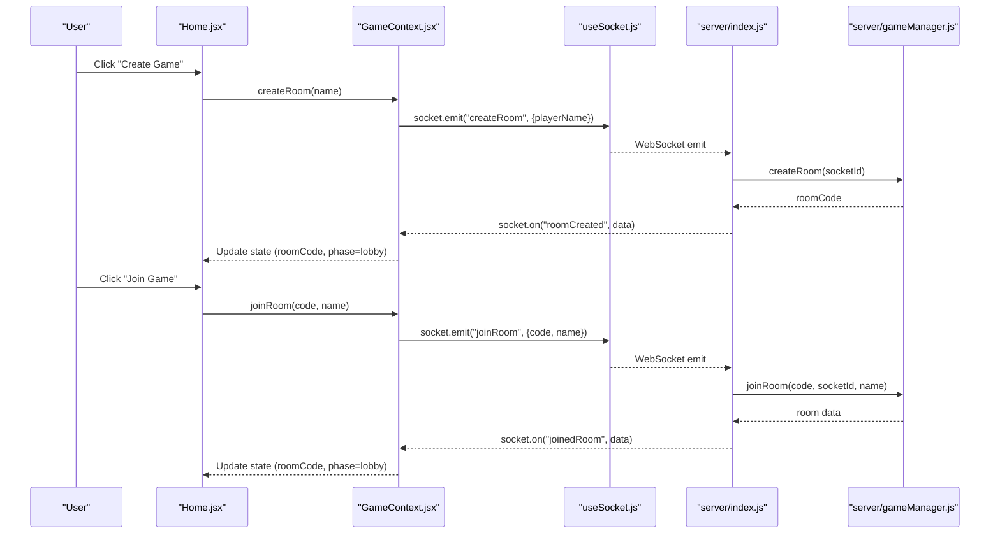
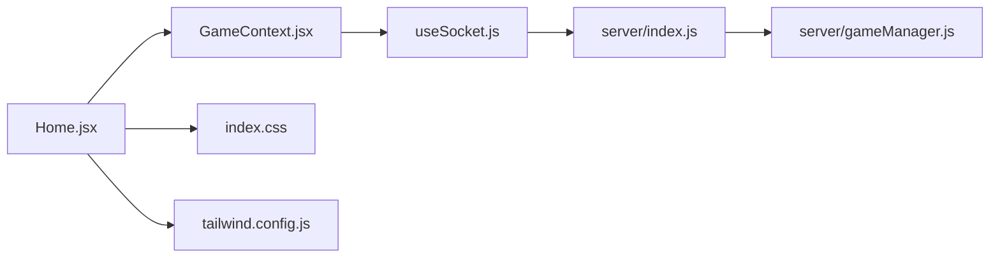

# Home Screen

<cite>
**Referenced Files in This Document**
- [Home.jsx](file://client/src/screens/Home.jsx)
- [GameContext.jsx](file://client/src/context/GameContext.jsx)
- [useSocket.js](file://client/src/hooks/useSocket.js)
- [App.jsx](file://client/src/App.jsx)
- [index.css](file://client/src/index.css)
- [tailwind.config.js](file://client/tailwind.config.js)
- [vite.config.js](file://client/vite.config.js)
- [index.js](file://server/index.js)
- [gameManager.js](file://server/gameManager.js)
</cite>

## Table of Contents
1. [Introduction](#introduction)
2. [Project Structure](#project-structure)
3. [Core Components](#core-components)
4. [Architecture Overview](#architecture-overview)
5. [Detailed Component Analysis](#detailed-component-analysis)
6. [Dependency Analysis](#dependency-analysis)
7. [Performance Considerations](#performance-considerations)
8. [Troubleshooting Guide](#troubleshooting-guide)
9. [Conclusion](#conclusion)

## Introduction
This document provides comprehensive documentation for the Home screen component, focusing on room creation and joining functionality, form validation, input sanitization, error handling, animated background elements, responsive design, button interactions, state management for mode switching, connection status indicators, error messaging system, keyboard navigation support, styling approach using Tailwind CSS classes and custom animations, and examples of form validation logic and user interaction patterns.

## Project Structure
The Home screen resides in the client application under the screens directory and integrates with the GameContext for state management and useSocket for WebSocket connectivity. The server-side logic handles room creation, joining, and emits events consumed by the client.

**Diagram sources**
- [App.jsx:1-101](file://client/src/App.jsx#L1-L101)
- [Home.jsx:1-231](file://client/src/screens/Home.jsx#L1-L231)
- [GameContext.jsx:1-383](file://client/src/context/GameContext.jsx#L1-L383)
- [useSocket.js:1-76](file://client/src/hooks/useSocket.js#L1-L76)
- [index.css:1-215](file://client/src/index.css#L1-L215)
- [tailwind.config.js:1-48](file://client/tailwind.config.js#L1-L48)
- [vite.config.js:1-16](file://client/vite.config.js#L1-L16)
- [index.js:1-687](file://server/index.js#L1-L687)
- [gameManager.js:1-636](file://server/gameManager.js#L1-L636)

**Section sources**
- [Home.jsx:1-231](file://client/src/screens/Home.jsx#L1-L231)
- [GameContext.jsx:12-383](file://client/src/context/GameContext.jsx#L12-L383)
- [useSocket.js:8-76](file://client/src/hooks/useSocket.js#L8-L76)
- [App.jsx:67-101](file://client/src/App.jsx#L67-L101)
- [index.css:1-215](file://client/src/index.css#L1-L215)
- [tailwind.config.js:1-48](file://client/tailwind.config.js#L1-L48)
- [vite.config.js:1-16](file://client/vite.config.js#L1-L16)
- [index.js:173-248](file://server/index.js#L173-L248)
- [gameManager.js:53-136](file://server/gameManager.js#L53-L136)

## Core Components
- Home screen component manages two primary modes: create and join. It renders floating emoji backgrounds, glow orbs, connection status indicator, error messages, and interactive cards for room actions.
- GameContext provides centralized state and actions for room creation, joining, and error handling, along with socket connection state.
- useSocket encapsulates WebSocket connection logic, reconnection behavior, and connection status updates.
- Tailwind CSS and custom animations define the visual presentation and motion effects.

Key responsibilities:
- Form validation and sanitization for room creation and joining inputs.
- Mode switching between create/join views with state management.
- Animated background elements with floating emojis and glow effects.
- Responsive design using Tailwind utilities and custom animations.
- Keyboard navigation support via Enter key handling.
- Error messaging system with automatic timeouts and clear controls.
- Connection status indicators and reconnection handling.

**Section sources**
- [Home.jsx:12-231](file://client/src/screens/Home.jsx#L12-L231)
- [GameContext.jsx:12-383](file://client/src/context/GameContext.jsx#L12-L383)
- [useSocket.js:8-76](file://client/src/hooks/useSocket.js#L8-L76)
- [index.css:111-215](file://client/src/index.css#L111-L215)
- [tailwind.config.js:10-43](file://client/tailwind.config.js#L10-L43)

## Architecture Overview
The Home screen orchestrates user interactions for room creation and joining. It relies on GameContext for state and actions and useSocket for connection status. The server handles room lifecycle events and broadcasts updates to clients.

**Diagram sources**
- [Home.jsx:19-28](file://client/src/screens/Home.jsx#L19-L28)
- [GameContext.jsx:257-269](file://client/src/context/GameContext.jsx#L257-L269)
- [useSocket.js:12-32](file://client/src/hooks/useSocket.js#L12-L32)
- [index.js:178-248](file://server/index.js#L178-L248)
- [gameManager.js:53-136](file://server/gameManager.js#L53-L136)

## Detailed Component Analysis

### Home Screen Component
The Home screen implements:
- Floating emoji background elements with randomized positions, delays, and durations.
- Glow orbs for ambient visual enhancement.
- Title with gradient text and drop shadow.
- Connection warning banner when offline.
- Error banner with automatic dismissal.
- Mode switching between create and join views.
- Form validation and sanitization for inputs.
- Keyboard navigation support via Enter key.
- Responsive design using Tailwind utilities and custom animations.

Form validation and sanitization:
- Create mode validates name length (minimum 2 characters) and trims whitespace before submission.
- Join mode enforces:
  - Room code length equals 4 characters.
  - Name length minimum 2 characters.
  - Room code sanitization to uppercase letters and digits, limiting to 4 characters.
  - Name sanitization to a maximum of 12 characters.
- Input handlers clear errors on change to prevent stale messages.

State management:
- Tracks mode (null, 'create', 'join').
- Maintains separate state for createName and name to isolate validation contexts.
- Uses connected flag to disable actions until the client is connected.

Button interactions:
- Create Game button triggers createRoom action when connected and name is valid.
- Join Game button triggers joinRoom action when connected and inputs are valid.
- Back buttons reset mode and clear error state.

Keyboard navigation:
- Enter key triggers form submission for both create and join forms.

Responsive design:
- Uses Tailwind utilities for responsive typography and spacing.
- Animations leverage Tailwind animation utilities and custom keyframes.

Animated background elements:
- Floating emojis: randomized top/left/right/bottom positioning, animation delay, and duration.
- Glow orbs: positioned absolute with blur effects and pointer-events disabled.

Connection status indicators:
- Connection warning appears when connected is false.
- Global connection indicator in App.jsx shows live/offline status.

Error messaging system:
- Error banners display server-reported errors with automatic timeout clearing.
- clearError resets error state and cancels pending timeouts.

Styling approach:
- Tailwind utilities for layout, colors, borders, shadows, and transitions.
- Custom animations defined in tailwind.config.js and index.css for floating, glowing, fading, and scaling effects.
- Gradient text and drop shadow for title emphasis.

**Section sources**
- [Home.jsx:12-231](file://client/src/screens/Home.jsx#L12-L231)
- [index.css:111-215](file://client/src/index.css#L111-L215)
- [tailwind.config.js:10-43](file://client/tailwind.config.js#L10-L43)

### GameContext and useSocket Integration
GameContext coordinates:
- Socket connection state and event listeners.
- Room creation and joining actions.
- Error handling with timeouts and manual clearing.
- Phase transitions and player state updates.

useSocket manages:
- Singleton WebSocket instance with reconnection settings.
- Connection status updates and reconnection on startup.
- Transport selection and timeout configuration.

Server-side room lifecycle:
- Room creation generates a unique 4-character uppercase code.
- Joining validates room existence, lobby phase, capacity, and name uniqueness.
- Emits roomCreated and joinedRoom events with player lists and host flags.
- Handles reconnection requests and restores game state snapshots.

**Section sources**
- [GameContext.jsx:12-383](file://client/src/context/GameContext.jsx#L12-L383)
- [useSocket.js:8-76](file://client/src/hooks/useSocket.js#L8-L76)
- [index.js:178-248](file://server/index.js#L178-L248)
- [gameManager.js:53-136](file://server/gameManager.js#L53-L136)

### Animated Background Elements
Floating emojis:
- Defined via FLOATING_EMOJIS array with emoji character, position properties, animation delay, and duration.
- Rendered as absolute positioned divs with animation classes and styles.

Glow orbs:
- Two large blurred circles positioned absolutely with gradient overlays and blur filters.

Custom animations:
- Tailwind animation utilities configured in tailwind.config.js.
- Keyframes for float, glow, fade-in, slide-up, and scale-in.
- CSS keyframes in index.css for additional effects.

**Section sources**
- [Home.jsx:4-10](file://client/src/screens/Home.jsx#L4-L10)
- [Home.jsx:44-65](file://client/src/screens/Home.jsx#L44-L65)
- [tailwind.config.js:10-43](file://client/tailwind.config.js#L10-L43)
- [index.css:111-215](file://client/src/index.css#L111-L215)

### Responsive Design Implementation
Responsive behavior:
- Tailwind utilities for responsive typography (e.g., sm:text-6xl, sm:text-7xl).
- Flexible container layouts with flex utilities and max-width constraints.
- Animation timing and easing adapted for various screen sizes.

Accessibility considerations:
- Focus-visible outlines managed via focus utilities.
- Disabled states for buttons when conditions are not met.
- Keyboard navigation via Enter key support.

**Section sources**
- [Home.jsx:67-82](file://client/src/screens/Home.jsx#L67-L82)
- [Home.jsx:157-158](file://client/src/screens/Home.jsx#L157-L158)
- [Home.jsx:208-209](file://client/src/screens/Home.jsx#L208-L209)

### Button Interactions and State Management
Mode switching:
- mode state toggles between null, 'create', and 'join'.
- Cards render different content based on mode and connected state.

Validation-driven disabled states:
- Create button disabled when name is invalid or not connected.
- Join button disabled when code length is not 4, name is invalid, or not connected.

Back navigation:
- Resets mode to null and clears error state.

**Section sources**
- [Home.jsx:100-134](file://client/src/screens/Home.jsx#L100-L134)
- [Home.jsx:136-171](file://client/src/screens/Home.jsx#L136-L171)
- [Home.jsx:173-226](file://client/src/screens/Home.jsx#L173-L226)

### Connection Status Indicators and Error Messaging
Connection indicator:
- Live/offline dot with label in App.jsx overlay.
- Reflects useSocket connected state.

Error messaging:
- Error banner displays server-reported messages.
- Automatic timeout clears errors after 5 seconds.
- Manual clear via clearError resets state and cancels timeouts.

Reconnection:
- useSocket attempts reconnection with exponential backoff.
- On connect, App.jsx sends reconnect event with stored room code and name.

**Section sources**
- [App.jsx:39-54](file://client/src/App.jsx#L39-L54)
- [GameContext.jsx:53-68](file://client/src/context/GameContext.jsx#L53-L68)
- [useSocket.js:34-72](file://client/src/hooks/useSocket.js#L34-L72)
- [index.js:542-608](file://server/index.js#L542-L608)

### Keyboard Navigation Support
Enter key handling:
- Create form: onKeyDown triggers handleCreate when Enter is pressed.
- Join form: onKeyDown triggers handleJoin when Enter is pressed.

Focus management:
- autoFocus applied to input fields for improved accessibility.
- Disabled states prevent unintended submissions.

**Section sources**
- [Home.jsx:157-158](file://client/src/screens/Home.jsx#L157-L158)
- [Home.jsx:208-209](file://client/src/screens/Home.jsx#L208-L209)

### Styling Approach Using Tailwind CSS Classes and Custom Animations
Tailwind utilities:
- Layout: w-full, h-full, flex, flex-col, items-center, justify-center, px-6, relative, overflow-hidden.
- Spacing: mb-*, mt-*, mr-*, ml-*, space-y-*.
- Typography: text-*, font-*, uppercase, tracking-*, leading-*, text-center.
- Colors: bg-*, text-*, border-*, border-opacity, shadow-*, ring-*, from-*, to-*, via-*, gradient-to-r.
- Effects: backdrop-blur, filter, drop-shadow, transition-all, duration-*, ease-out, hover:*, focus:*.
- Responsive: sm:*, md:*, lg:*, xl:*.

Custom animations:
- Tailwind animation utilities: animate-fade-in, animate-slide-up, animate-scale-in, animate-glow, animate-float.
- Keyframes defined in tailwind.config.js and index.css for float, glow, fade-in, slide-up, scale-in.

Glass card effect:
- Custom classes glass-card and glass-card-strong with backdrop-filter and border styles.

Gradient text:
- Linear gradient applied to title text with WebkitBackgroundClip and filter.

**Section sources**
- [Home.jsx:42-229](file://client/src/screens/Home.jsx#L42-L229)
- [index.css:111-215](file://client/src/index.css#L111-L215)
- [tailwind.config.js:10-43](file://client/tailwind.config.js#L10-L43)

### Examples of Form Validation Logic and User Interaction Patterns
Validation examples:
- Create form: name must be at least 2 characters after trimming.
- Join form: code must be exactly 4 characters; name must be at least 2 characters after trimming.
- Sanitization: code converted to uppercase and restricted to letters/digits; name truncated to 12 characters.

User interaction patterns:
- Mode selection cards enable create/join actions.
- Input sanitization occurs on change; errors cleared on subsequent changes.
- Disabled states prevent invalid submissions until conditions are met.
- Enter key triggers submission for both forms.

**Section sources**
- [Home.jsx:19-28](file://client/src/screens/Home.jsx#L19-L28)
- [Home.jsx:30-40](file://client/src/screens/Home.jsx#L30-L40)

## Dependency Analysis
The Home screen depends on GameContext for state and actions, and on useSocket for connection status. The server-side index.js and gameManager.js handle room lifecycle and event broadcasting.

**Diagram sources**
- [Home.jsx:12-231](file://client/src/screens/Home.jsx#L12-L231)
- [GameContext.jsx:12-383](file://client/src/context/GameContext.jsx#L12-L383)
- [useSocket.js:8-76](file://client/src/hooks/useSocket.js#L8-L76)
- [index.js:173-248](file://server/index.js#L173-L248)
- [gameManager.js:53-136](file://server/gameManager.js#L53-L136)
- [index.css:1-215](file://client/src/index.css#L1-215)
- [tailwind.config.js:1-48](file://client/tailwind.config.js#L1-L48)

**Section sources**
- [Home.jsx:12-231](file://client/src/screens/Home.jsx#L12-L231)
- [GameContext.jsx:12-383](file://client/src/context/GameContext.jsx#L12-L383)
- [useSocket.js:8-76](file://client/src/hooks/useSocket.js#L8-L76)
- [index.js:173-248](file://server/index.js#L173-L248)
- [gameManager.js:53-136](file://server/gameManager.js#L53-L136)
- [index.css:1-215](file://client/src/index.css#L1-L215)
- [tailwind.config.js:1-48](file://client/tailwind.config.js#L1-L48)

## Performance Considerations
- Animation performance: Floating and glow animations use transform and opacity for GPU acceleration; keep the number of animated elements reasonable.
- Input handling: Debounced or throttled input handlers can reduce unnecessary re-renders; current implementation updates on change with minimal overhead.
- Connection management: useSocket employs reconnection with exponential backoff; ensure server-side reconnection logic avoids duplicate entries.
- Rendering: Conditional rendering based on mode and connected state minimizes DOM updates.

## Troubleshooting Guide
Common issues and resolutions:
- Room creation fails: Verify server availability and network connectivity; check error messages emitted by the server.
- Joining fails: Ensure room code exists, is in lobby phase, and name is unique; confirm client is connected.
- Inputs not updating: Check input handlers for sanitization and state updates; ensure error clearing on change.
- Animations not playing: Confirm Tailwind animation utilities are loaded and keyframes are defined; verify CSS is included.
- Connection indicator stuck offline: Review useSocket connection logic and server-side connection events; check proxy configuration in vite.config.js.

**Section sources**
- [GameContext.jsx:53-68](file://client/src/context/GameContext.jsx#L53-L68)
- [useSocket.js:34-72](file://client/src/hooks/useSocket.js#L34-L72)
- [index.js:178-248](file://server/index.js#L178-L248)
- [vite.config.js:6-15](file://client/vite.config.js#L6-L15)

## Conclusion
The Home screen component provides a robust foundation for room creation and joining with comprehensive form validation, input sanitization, error handling, and animated visual enhancements. Its integration with GameContext and useSocket ensures reliable state management and real-time connectivity. The responsive design and keyboard navigation improve accessibility, while the styling approach leverages Tailwind utilities and custom animations for a polished user experience.