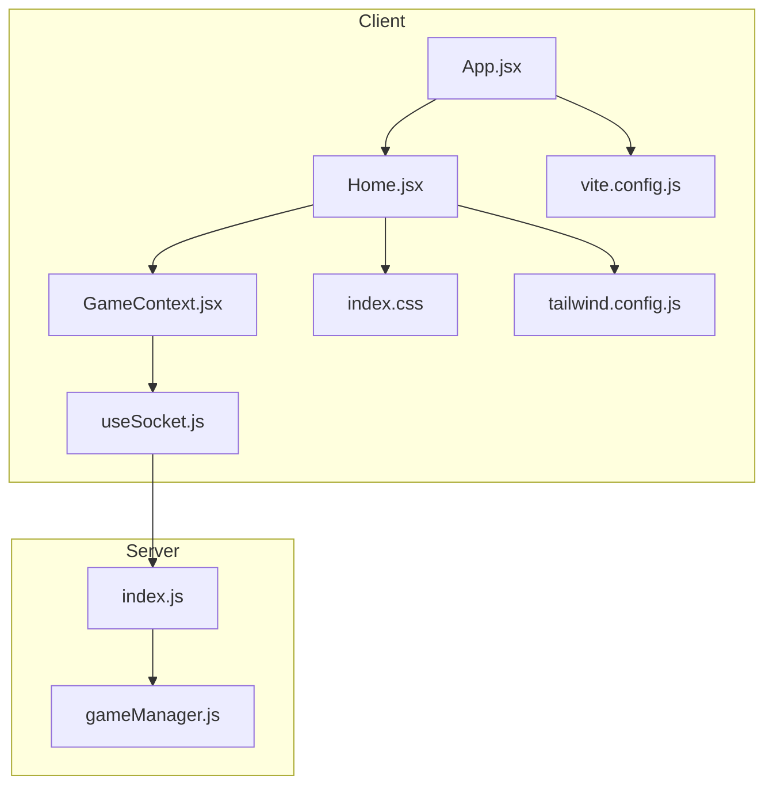
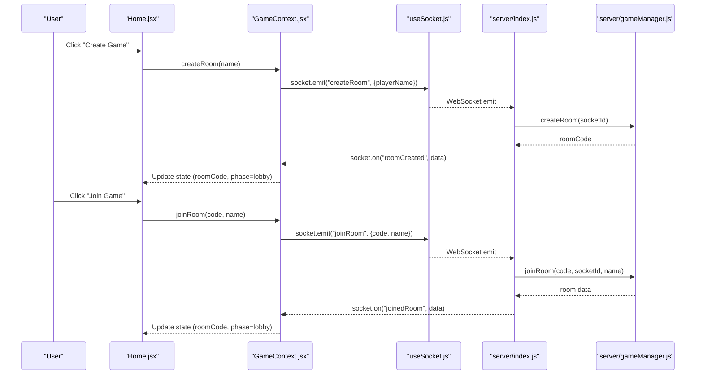
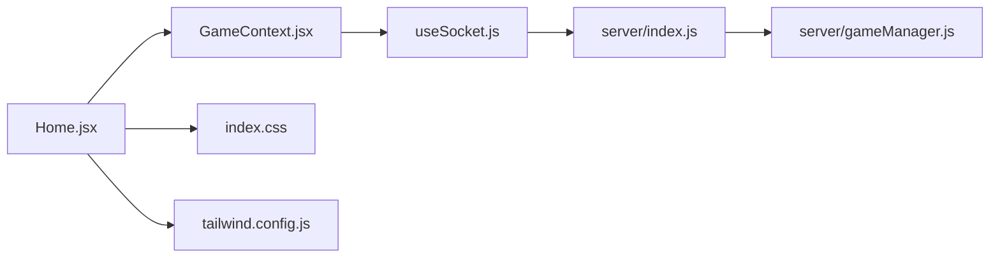

# Home Screen

<cite>
**Referenced Files in This Document**
- [Home.jsx](file://client/src/screens/Home.jsx)
- [GameContext.jsx](file://client/src/context/GameContext.jsx)
- [useSocket.js](file://client/src/hooks/useSocket.js)
- [App.jsx](file://client/src/App.jsx)
- [index.css](file://client/src/index.css)
- [tailwind.config.js](file://client/tailwind.config.js)
- [vite.config.js](file://client/vite.config.js)
- [index.js](file://server/index.js)
- [gameManager.js](file://server/gameManager.js)
</cite>

## Update Summary
**Changes Made**
- Updated styling to reflect light theme implementation with new color palette and gradients
- Enhanced glass card styling with light theme rgba values for improved visual depth
- Updated background gradients to use light theme colors (#f5f5f5, #e8e8f0, #f0f0f5)
- Refined text colors to use gray-800 and gray-500 for optimal contrast
- Improved component styling with light theme compatible colors and effects

## Table of Contents
1. [Introduction](#introduction)
2. [Project Structure](#project-structure)
3. [Core Components](#core-components)
4. [Architecture Overview](#architecture-overview)
5. [Detailed Component Analysis](#detailed-component-analysis)
6. [Dependency Analysis](#dependency-analysis)
7. [Performance Considerations](#performance-considerations)
8. [Troubleshooting Guide](#troubleshooting-guide)
9. [Conclusion](#conclusion)

## Introduction
This document provides comprehensive documentation for the Home screen component, focusing on room creation and joining functionality, form validation, input sanitization, error handling, animated background elements, responsive design, button interactions, state management for mode switching, enhanced connection status indicators with improved user interface, error messaging system, keyboard navigation support, styling approach using Tailwind CSS classes and custom animations, and examples of form validation logic and user interaction patterns.

**Updated** The Home screen now implements a cohesive light theme aesthetic with refined color palettes, enhanced glass card effects, and optimized visual hierarchy that maintains accessibility while providing modern visual appeal.

## Project Structure
The Home screen resides in the client application under the screens directory and integrates with the GameContext for state management and useSocket for WebSocket connectivity. The server-side logic handles room creation, joining, and emits events consumed by the client.

**Diagram sources**
- [App.jsx:1-101](file://client/src/App.jsx#L1-L101)
- [Home.jsx:1-238](file://client/src/screens/Home.jsx#L1-L238)
- [GameContext.jsx:1-383](file://client/src/context/GameContext.jsx#L1-L383)
- [useSocket.js:1-76](file://client/src/hooks/useSocket.js#L1-L76)
- [index.css:1-217](file://client/src/index.css#L1-L217)
- [tailwind.config.js:1-48](file://client/tailwind.config.js#L1-L48)
- [vite.config.js:1-16](file://client/vite.config.js#L1-L16)
- [index.js:1-687](file://server/index.js#L1-L687)
- [gameManager.js:1-636](file://server/gameManager.js#L1-L636)

**Section sources**
- [Home.jsx:1-238](file://client/src/screens/Home.jsx#L1-L238)
- [GameContext.jsx:12-383](file://client/src/context/GameContext.jsx#L12-L383)
- [useSocket.js:8-76](file://client/src/hooks/useSocket.js#L8-L76)
- [App.jsx:67-101](file://client/src/App.jsx#L67-L101)
- [index.css:1-217](file://client/src/index.css#L1-L217)
- [tailwind.config.js:1-48](file://client/tailwind.config.js#L1-L48)
- [vite.config.js:1-16](file://client/vite.config.js#L1-L16)
- [index.js:173-248](file://server/index.js#L173-L248)
- [gameManager.js:53-136](file://server/gameManager.js#L53-L136)

## Core Components
- Home screen component manages two primary modes: create and join. It renders floating emoji backgrounds, glow orbs, enhanced connection status indicator with retry button, error messages, and interactive cards for room actions.
- GameContext provides centralized state and actions for room creation, joining, and error handling, along with socket connection state.
- useSocket encapsulates WebSocket connection logic, reconnection behavior, and connection status updates.
- Tailwind CSS and custom animations define the visual presentation and motion effects with a cohesive light theme aesthetic.

Key responsibilities:
- Form validation and sanitization for room creation and joining inputs.
- Mode switching between create/join views with state management.
- Animated background elements with floating emojis and glow effects.
- Responsive design using Tailwind utilities and custom animations.
- Keyboard navigation support via Enter key handling.
- Enhanced error messaging system with automatic timeouts and clear controls.
- Improved connection status indicators with retry functionality and troubleshooting guidance.
- Connection status indicators and reconnection handling.
- **Light theme styling with refined color palette and glass effects**.

**Section sources**
- [Home.jsx:12-238](file://client/src/screens/Home.jsx#L12-L238)
- [GameContext.jsx:12-383](file://client/src/context/GameContext.jsx#L12-L383)
- [useSocket.js:8-76](file://client/src/hooks/useSocket.js#L8-L76)
- [index.css:111-217](file://client/src/index.css#L111-L217)
- [tailwind.config.js:10-43](file://client/tailwind.config.js#L10-L43)

## Architecture Overview
The Home screen orchestrates user interactions for room creation and joining. It relies on GameContext for state and actions and useSocket for connection status. The server handles room lifecycle events and broadcasts updates to clients.

**Diagram sources**
- [Home.jsx:19-28](file://client/src/screens/Home.jsx#L19-L28)
- [GameContext.jsx:257-269](file://client/src/context/GameContext.jsx#L257-L269)
- [useSocket.js:12-32](file://client/src/hooks/useSocket.js#L12-L32)
- [index.js:178-248](file://server/index.js#L178-L248)
- [gameManager.js:53-136](file://server/gameManager.js#L53-L136)

## Detailed Component Analysis

### Home Screen Component
The Home screen implements:
- Floating emoji background elements with randomized positions, delays, and durations.
- Glow orbs for ambient visual enhancement using light theme colors.
- Title with gradient text and drop shadow.
- **Enhanced connection warning banner** with retry button and troubleshooting guidance when offline.
- Error banner with automatic dismissal.
- Mode switching between create and join views.
- Form validation and sanitization for inputs.
- Keyboard navigation support via Enter key.
- Responsive design using Tailwind utilities and custom animations.
- **Light theme styling with refined glass card effects and color palette**.

**Enhanced Connection Status Display System**:
The connection status display has been significantly improved with:
- Informative connection status messages explaining the connection state
- Troubleshooting guidance for common connection issues
- Prominent retry button with clear visual hierarchy
- Animated fade-in transition for better user experience
- Color-coded styling with red accents for visibility
- Proper spacing and typography for readability

**Light Theme Styling Enhancements**:
The component now features a cohesive light theme aesthetic:
- Background gradient using light theme colors: `#f5f5f5`, `#e8e8f0`, `#f0f0f5`
- Glass card effects with enhanced rgba values for better transparency: `rgba(255, 255, 255, 0.7)` and `rgba(255, 255, 255, 0.9)`
- Text colors optimized for light theme: `text-gray-800` for primary text, `text-gray-500` for secondary text
- Accent colors using light theme variants: `accent` for red (`#e94560`) and `accent-light` for lighter red (`#ff6b81`)
- Neon colors for interactive elements: `neon-blue` (`#3b82f6`), `neon-purple` (`#8b5cf6`), `neon-green` (`#10b981`)

Form validation and sanitization:
- Create mode validates name length (minimum 2 characters) and trims whitespace before submission.
- Join mode enforces:
  - Room code length equals 4 characters.
  - Name length minimum 2 characters.
  - Room code sanitization to uppercase letters and digits, limiting to 4 characters.
  - Name sanitization to a maximum of 12 characters.
- Input handlers clear errors on change to prevent stale messages.

State management:
- Tracks mode (null, 'create', 'join').
- Maintains separate state for createName and name to isolate validation contexts.
- Uses connected flag to disable actions until the client is connected.

Button interactions:
- Create Game button triggers createRoom action when connected and name is valid.
- Join Game button triggers joinRoom action when connected and inputs are valid.
- Back buttons reset mode and clear error state.
- **Retry button** triggers page reload for immediate connection recovery.

Keyboard navigation:
- Enter key triggers form submission for both create and join forms.

Responsive design:
- Uses Tailwind utilities for responsive typography and spacing.
- Animations leverage Tailwind animation utilities and custom keyframes.

Animated background elements:
- Floating emojis: randomized top/left/right/bottom positioning, animation delay, and duration.
- Glow orbs: positioned absolute with blur effects and pointer-events disabled.

**Enhanced Connection Status Indicators**:
- Connection warning appears when connected is false with improved styling and messaging.
- Global connection indicator in App.jsx shows live/offline status with pulsing animation.
- Retry button provides immediate action for users experiencing connection issues.
- Troubleshooting guidance helps users understand and resolve connection problems.

Error messaging system:
- Error banners display server-reported errors with automatic timeout clearing.
- clearError resets error state and cancels pending timeouts.

Styling approach:
- Tailwind utilities for layout, colors, borders, shadows, and transitions.
- Custom animations defined in tailwind.config.js and index.css for floating, glowing, fading, and scaling effects.
- Gradient text and drop shadow for title emphasis.
- Enhanced glass card styling with improved backdrop-filter effects using light theme rgba values.
- **Light theme color palette with optimized contrast ratios for accessibility**.

**Section sources**
- [Home.jsx:12-238](file://client/src/screens/Home.jsx#L12-L238)
- [index.css:111-217](file://client/src/index.css#L111-L217)
- [tailwind.config.js:10-43](file://client/tailwind.config.js#L10-L43)

### GameContext and useSocket Integration
GameContext coordinates:
- Socket connection state and event listeners.
- Room creation and joining actions.
- Error handling with timeouts and manual clearing.
- Phase transitions and player state updates.

useSocket manages:
- Singleton WebSocket instance with reconnection settings.
- Connection status updates and reconnection on startup.
- Transport selection and timeout configuration.

Server-side room lifecycle:
- Room creation generates a unique 4-character uppercase code.
- Joining validates room existence, lobby phase, capacity, and name uniqueness.
- Emits roomCreated and joinedRoom events with player lists and host flags.
- Handles reconnection requests and restores game state snapshots.

**Section sources**
- [GameContext.jsx:12-383](file://client/src/context/GameContext.jsx#L12-L383)
- [useSocket.js:8-76](file://client/src/hooks/useSocket.js#L8-L76)
- [index.js:178-248](file://server/index.js#L178-L248)
- [gameManager.js:53-136](file://server/gameManager.js#L53-L136)

### Animated Background Elements
Floating emojis:
- Defined via FLOATING_EMOJIS array with emoji character, position properties, animation delay, and duration.
- Rendered as absolute positioned divs with animation classes and styles.

Glow orbs:
- Two large blurred circles positioned absolutely with gradient overlays and blur filters.
- **Enhanced with light theme colors using accent and neon-purple variants**.

Custom animations:
- Tailwind animation utilities configured in tailwind.config.js.
- Keyframes for float, glow, fade-in, slide-up, and scale-in.
- CSS keyframes in index.css for additional effects.

**Section sources**
- [Home.jsx:4-10](file://client/src/screens/Home.jsx#L4-L10)
- [Home.jsx:44-65](file://client/src/screens/Home.jsx#L44-L65)
- [tailwind.config.js:10-43](file://client/tailwind.config.js#L10-L43)
- [index.css:111-217](file://client/src/index.css#L111-L217)

### Responsive Design Implementation
Responsive behavior:
- Tailwind utilities for responsive typography (e.g., sm:text-6xl, sm:text-7xl).
- Flexible container layouts with flex utilities and max-width constraints.
- Animation timing and easing adapted for various screen sizes.

Accessibility considerations:
- Focus-visible outlines managed via focus utilities.
- Disabled states for buttons when conditions are not met.
- Keyboard navigation via Enter key support.
- **Optimized color contrast ratios for light theme accessibility**.

**Section sources**
- [Home.jsx:67-82](file://client/src/screens/Home.jsx#L67-L82)
- [Home.jsx:157-158](file://client/src/screens/Home.jsx#L157-L158)
- [Home.jsx:208-209](file://client/src/screens/Home.jsx#L208-L209)

### Button Interactions and State Management
Mode switching:
- mode state toggles between null, 'create', and 'join'.
- Cards render different content based on mode and connected state.

Validation-driven disabled states:
- Create button disabled when name is invalid or not connected.
- Join button disabled when code length is not 4, name is invalid, or not connected.

Back navigation:
- Resets mode to null and clears error state.

**Section sources**
- [Home.jsx:100-134](file://client/src/screens/Home.jsx#L100-L134)
- [Home.jsx:136-171](file://client/src/screens/Home.jsx#L136-L171)
- [Home.jsx:173-238](file://client/src/screens/Home.jsx#L173-L238)

### Enhanced Connection Status Indicators and Error Messaging
**Enhanced Connection Indicator**:
- **New connection warning banner** appears when connected is false with improved styling.
- **Informative messaging** explains "Connecting to server..." and provides troubleshooting guidance.
- **Prominent retry button** with clear visual hierarchy and hover effects.
- **Animated fade-in transition** for better user experience.
- **Color-coded styling** with red accents for visibility and urgency.

**Connection Indicator**:
- Live/offline dot with label in App.jsx overlay using pulsing animation.
- Reflects useSocket connected state with neon green pulse for live connections.

**Error Messaging**:
- Error banner displays server-reported messages with automatic timeout clearing.
- Manual clear via clearError resets state and cancels timeouts.

**Reconnection**:
- useSocket attempts reconnection with exponential backoff.
- On connect, App.jsx sends reconnect event with stored room code and name.

**Section sources**
- [App.jsx:39-54](file://client/src/App.jsx#L39-L54)
- [GameContext.jsx:53-68](file://client/src/context/GameContext.jsx#L53-L68)
- [useSocket.js:34-72](file://client/src/hooks/useSocket.js#L34-L72)
- [index.js:542-608](file://server/index.js#L542-L608)

### Keyboard Navigation Support
Enter key handling:
- Create form: onKeyDown triggers handleCreate when Enter is pressed.
- Join form: onKeyDown triggers handleJoin when Enter is pressed.

Focus management:
- autoFocus applied to input fields for improved accessibility.
- Disabled states prevent unintended submissions.

**Section sources**
- [Home.jsx:157-158](file://client/src/screens/Home.jsx#L157-L158)
- [Home.jsx:208-209](file://client/src/screens/Home.jsx#L208-L209)

### Styling Approach Using Tailwind CSS Classes and Custom Animations
**Light Theme Color Palette**:
- Primary background: `#f5f5f5` (light theme 100)
- Secondary background: `#e8e8f0` (light theme 200)
- Accent red: `#e94560` (accent)
- Light red: `#ff6b81` (accent-light)
- Neon colors: blue (`#3b82f6`), purple (`#8b5cf6`), green (`#10b981`)

**Enhanced Glass Card Effects**:
- `.glass-card`: `rgba(255, 255, 255, 0.7)` background with `blur(24px)` backdrop-filter
- `.glass-card-strong`: `rgba(255, 255, 255, 0.9)` background with `blur(32px)` backdrop-filter
- Improved border radius: 16px for `.glass-card`, 20px for `.glass-card-strong`
- Enhanced box shadows with light theme opacity values

**Tailwind utilities**:
- Layout: w-full, h-full, flex, flex-col, items-center, justify-center, px-6, relative, overflow-hidden.
- Spacing: mb-*, mt-*, mr-*, ml-*, space-y-*.
- Typography: text-*, font-*, uppercase, tracking-*, leading-*, text-center.
- Colors: bg-*, text-*, border-*, border-opacity, shadow-*, ring-*, from-*, to-*, via-*, gradient-to-r.
- Effects: backdrop-blur, filter, drop-shadow, transition-all, duration-*, ease-out, hover:*, focus:*.
- Responsive: sm:*, md:*, lg:*, xl:*.

**Custom animations**:
- Tailwind animation utilities: animate-fade-in, animate-slide-up, animate-scale-in, animate-glow, animate-float.
- Keyframes defined in tailwind.config.js and index.css for float, glow, fade-in, slide-up, scale-in.

**Gradient text**:
- Linear gradient applied to title text with WebkitBackgroundClip and filter.
- **Enhanced with light theme color combinations for better contrast**.

**Section sources**
- [Home.jsx:42-238](file://client/src/screens/Home.jsx#L42-L238)
- [index.css:111-217](file://client/src/index.css#L111-L217)
- [tailwind.config.js:10-43](file://client/tailwind.config.js#L10-L43)

### Examples of Form Validation Logic and User Interaction Patterns
Validation examples:
- Create form: name must be at least 2 characters after trimming.
- Join form: code must be exactly 4 characters; name must be at least 2 characters after trimming.
- Sanitization: code converted to uppercase and restricted to letters/digits; name truncated to 12 characters.

User interaction patterns:
- Mode selection cards enable create/join actions.
- Input sanitization occurs on change; errors cleared on subsequent changes.
- Disabled states prevent invalid submissions until conditions are met.
- Enter key triggers submission for both forms.
- **Retry button provides immediate action for connection recovery**.

**Section sources**
- [Home.jsx:19-28](file://client/src/screens/Home.jsx#L19-L28)
- [Home.jsx:30-40](file://client/src/screens/Home.jsx#L30-L40)

## Dependency Analysis
The Home screen depends on GameContext for state and actions, and on useSocket for connection status. The server-side index.js and gameManager.js handle room lifecycle and event broadcasting.

**Diagram sources**
- [Home.jsx:12-238](file://client/src/screens/Home.jsx#L12-L238)
- [GameContext.jsx:12-383](file://client/src/context/GameContext.jsx#L12-L383)
- [useSocket.js:8-76](file://client/src/hooks/useSocket.js#L8-L76)
- [index.js:173-248](file://server/index.js#L173-L248)
- [gameManager.js:53-136](file://server/gameManager.js#L53-L136)
- [index.css:1-217](file://client/src/index.css#L1-L217)
- [tailwind.config.js:1-48](file://client/tailwind.config.js#L1-L48)

**Section sources**
- [Home.jsx:12-238](file://client/src/screens/Home.jsx#L12-L238)
- [GameContext.jsx:12-383](file://client/src/context/GameContext.jsx#L12-L383)
- [useSocket.js:8-76](file://client/src/hooks/useSocket.js#L8-L76)
- [index.js:173-248](file://server/index.js#L173-L248)
- [gameManager.js:53-136](file://server/gameManager.js#L53-L136)
- [index.css:1-217](file://client/src/index.css#L1-L217)
- [tailwind.config.js:1-48](file://client/tailwind.config.js#L1-L48)

## Performance Considerations
- Animation performance: Floating and glow animations use transform and opacity for GPU acceleration; keep the number of animated elements reasonable.
- Input handling: Debounced or throttled input handlers can reduce unnecessary re-renders; current implementation updates on change with minimal overhead.
- Connection management: useSocket employs reconnection with exponential backoff; ensure server-side reconnection logic avoids duplicate entries.
- Rendering: Conditional rendering based on mode and connected state minimizes DOM updates.
- **Enhanced connection status display**: Optimized rendering of connection warnings and retry buttons for better performance.
- **Light theme optimization**: Glass card effects use efficient rgba values and backdrop-filter for optimal performance across devices.

## Troubleshooting Guide
Common issues and resolutions:
- Room creation fails: Verify server availability and network connectivity; check error messages emitted by the server.
- Joining fails: Ensure room code exists, is in lobby phase, and name is unique; confirm client is connected.
- Inputs not updating: Check input handlers for sanitization and state updates; ensure error clearing on change.
- Animations not playing: Confirm Tailwind animation utilities are loaded and keyframes are defined; verify CSS is included.
- Connection indicator stuck offline: Review useSocket connection logic and server-side connection events; check proxy configuration in vite.config.js.
- **Connection issues with enhanced display**: Use the retry button to immediately attempt reconnection; check network connectivity and server availability.
- **Connection warning persists**: Review browser console for WebSocket connection errors; verify server is reachable and not blocking connections.
- **Light theme rendering issues**: Check browser compatibility with backdrop-filter and rgba values; verify Tailwind CSS is properly configured.

**Section sources**
- [GameContext.jsx:53-68](file://client/src/context/GameContext.jsx#L53-L68)
- [useSocket.js:34-72](file://client/src/hooks/useSocket.js#L34-L72)
- [index.js:178-248](file://server/index.js#L178-L248)
- [vite.config.js:6-15](file://client/vite.config.js#L6-L15)

## Conclusion
The Home screen component provides a robust foundation for room creation and joining with comprehensive form validation, input sanitization, error handling, and animated visual enhancements. Its integration with GameContext and useSocket ensures reliable state management and real-time connectivity. The **enhanced connection status display system** significantly improves user experience by providing informative connection messages, troubleshooting guidance, and a prominent retry button for better handling of connection issues. The responsive design and keyboard navigation improve accessibility, while the styling approach leverages Tailwind utilities and custom animations for a polished user experience.

**Updated** The implementation now features a cohesive light theme aesthetic with refined color palettes, enhanced glass card effects, and optimized visual hierarchy that maintains accessibility while providing modern visual appeal. The light theme styling uses carefully selected rgba values for glass effects, optimized text colors for contrast, and harmonious color combinations that work seamlessly across different devices and screen sizes.