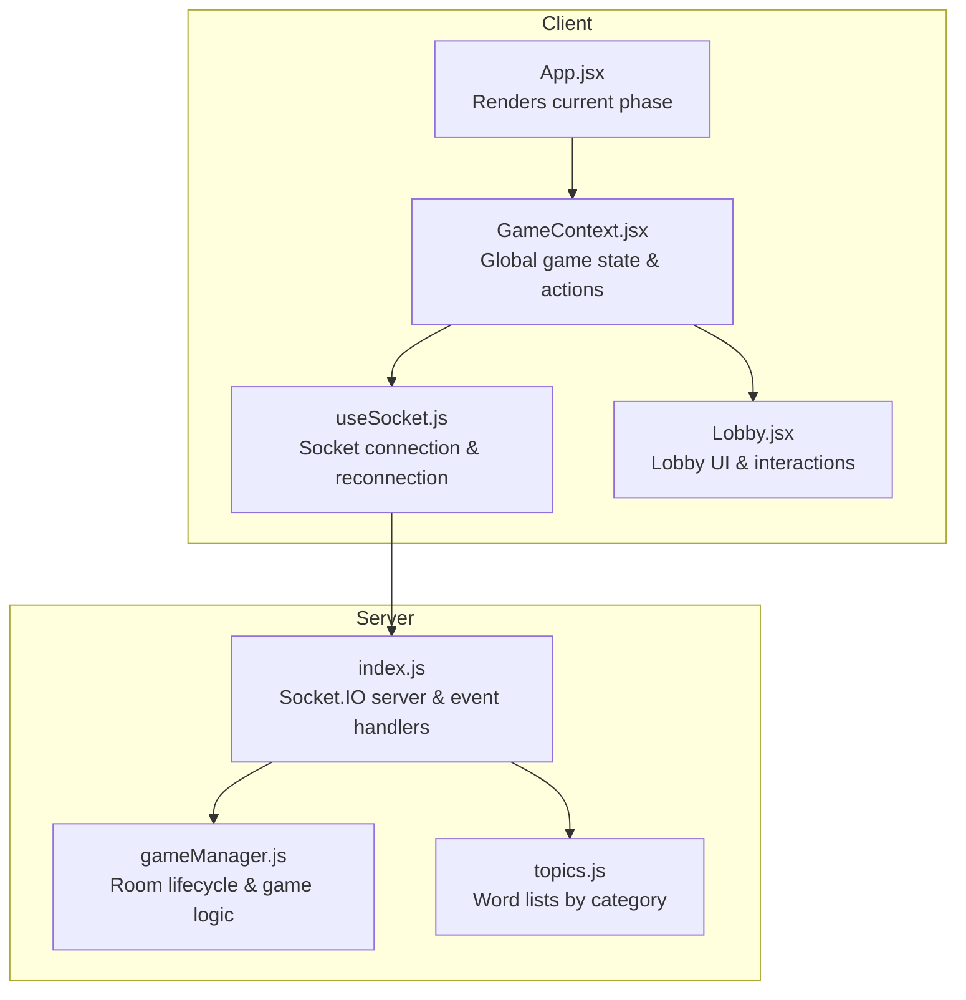
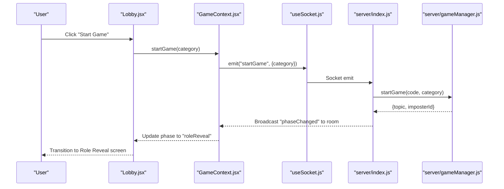
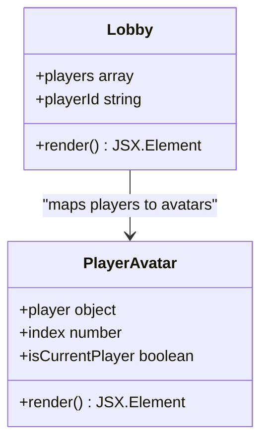
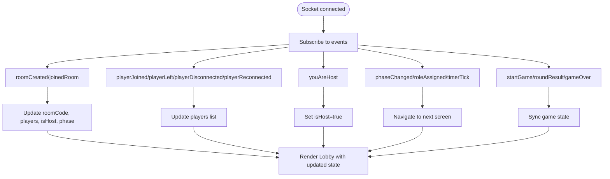
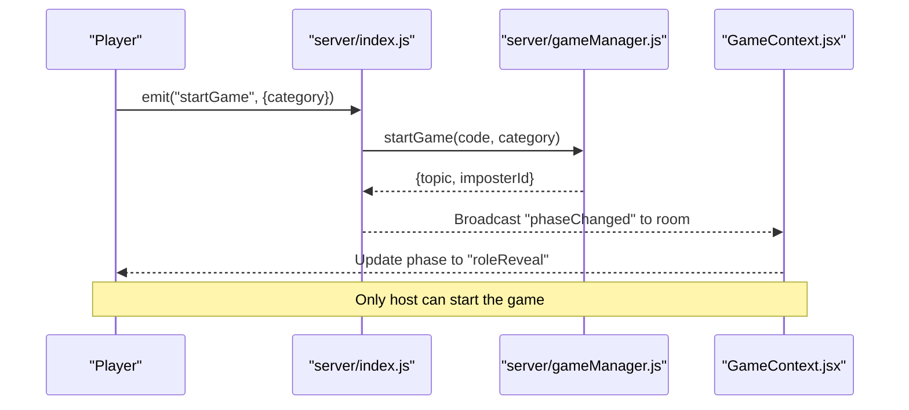
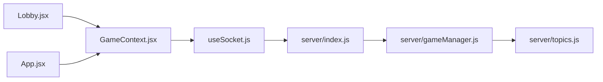

# Lobby Screen

<cite>
**Referenced Files in This Document**
- [Lobby.jsx](file://client/src/screens/Lobby.jsx)
- [GameContext.jsx](file://client/src/context/GameContext.jsx)
- [useSocket.js](file://client/src/hooks/useSocket.js)
- [App.jsx](file://client/src/App.jsx)
- [gameManager.js](file://server/gameManager.js)
- [index.js](file://server/index.js)
- [topics.js](file://server/topics.js)
</cite>

## Table of Contents
1. [Introduction](#introduction)
2. [Project Structure](#project-structure)
3. [Core Components](#core-components)
4. [Architecture Overview](#architecture-overview)
5. [Detailed Component Analysis](#detailed-component-analysis)
6. [Dependency Analysis](#dependency-analysis)
7. [Performance Considerations](#performance-considerations)
8. [Troubleshooting Guide](#troubleshooting-guide)
9. [Conclusion](#conclusion)

## Introduction
The Lobby screen is the central hub for multiplayer session management in the Imposter Game. It provides real-time player list management, host controls, and game setup options. This document explains how the lobby integrates with GameContext for state synchronization, handles socket events for live updates, manages player status indicators, displays room codes, and coordinates game start functionality with host privileges.

## Project Structure
The lobby implementation spans client-side React components and server-side Socket.IO logic. The client manages UI state and user interactions, while the server maintains authoritative game state and broadcasts updates to all clients.

**Diagram sources**
- [App.jsx:67-100](file://client/src/App.jsx#L67-L100)
- [GameContext.jsx:12-380](file://client/src/context/GameContext.jsx#L12-L380)
- [useSocket.js:8-75](file://client/src/hooks/useSocket.js#L8-L75)
- [Lobby.jsx:56-210](file://client/src/screens/Lobby.jsx#L56-L210)
- [index.js:173-676](file://server/index.js#L173-L676)
- [gameManager.js:9-636](file://server/gameManager.js#L9-L636)
- [topics.js:4-103](file://server/topics.js#L4-L103)

**Section sources**
- [App.jsx:56-100](file://client/src/App.jsx#L56-L100)
- [GameContext.jsx:12-380](file://client/src/context/GameContext.jsx#L12-L380)
- [useSocket.js:8-75](file://client/src/hooks/useSocket.js#L8-L75)
- [Lobby.jsx:56-210](file://client/src/screens/Lobby.jsx#L56-L210)
- [index.js:173-676](file://server/index.js#L173-L676)
- [gameManager.js:9-636](file://server/gameManager.js#L9-L636)
- [topics.js:4-103](file://server/topics.js#L4-L103)

## Core Components
- Lobby screen: Renders room code, player grid with status indicators, host controls, and start button. Handles copying room code and starting the game.
- GameContext: Provides centralized state (roomCode, players, isHost, phase, timer, etc.) and actions (createRoom, joinRoom, startGame, leaveGame). Subscribes to socket events to keep UI synchronized.
- Socket hook: Manages persistent connection, reconnection, and emits/receives events.
- Server game manager: Enforces room lifecycle, player management, host transitions, and game progression.

Key responsibilities:
- Real-time player updates: Joined/left/disconnected/reconnected events update the player list and notify users via toasts.
- Host controls: Only the host can select category and start the game; UI reflects host privileges.
- Game start: Validates prerequisites (player count ≥ 4, category selected, host) before emitting startGame.
- Room code display: Copy-to-clipboard with visual feedback and sharing instructions.

**Section sources**
- [Lobby.jsx:56-210](file://client/src/screens/Lobby.jsx#L56-L210)
- [GameContext.jsx:70-254](file://client/src/context/GameContext.jsx#L70-L254)
- [useSocket.js:34-72](file://client/src/hooks/useSocket.js#L34-L72)
- [index.js:173-297](file://server/index.js#L173-L297)
- [gameManager.js:53-201](file://server/gameManager.js#L53-L201)

## Architecture Overview
The lobby follows a reactive architecture: client state is driven by server events. The GameContext listens to socket events and updates local state, which the Lobby component consumes to render UI elements.

**Diagram sources**
- [Lobby.jsx:83-86](file://client/src/screens/Lobby.jsx#L83-L86)
- [GameContext.jsx:271-274](file://client/src/context/GameContext.jsx#L271-L274)
- [useSocket.js:34-72](file://client/src/hooks/useSocket.js#L34-L72)
- [index.js:252-297](file://server/index.js#L252-L297)
- [gameManager.js:213-241](file://server/gameManager.js#L213-L241)

## Detailed Component Analysis

### Lobby Screen Component
Responsibilities:
- Display room code with copy-to-clipboard functionality and visual feedback.
- Render player avatars with status indicators (connected, current player, host).
- Host-only controls: category picker and start button with validation.
- Non-host view: waiting indicator and animated dots.
- Responsive player grid with placeholders for empty seats.

Player avatar features:
- Initials badge with gradient color based on player index.
- Current player marker ("You") and host indicator.
- Connectivity overlay with signal icon when disconnected.

Host controls:
- Category selection: General, Family, Adult.
- Start button disabled until prerequisites are met.
- Prerequisites: player count ≥ 4, category selected, and isHost.

Room code display:
- Large, monospace digits for easy recognition.
- Tap-to-copy with fallback to textarea method.
- Visual feedback ("Copied!") and toast notification.

Responsive layout:
- Grid layout for players with 4 columns.
- Empty seat placeholders with "?" and "Waiting..." labels.
- Animations for fade-in/slide-up effects.

Hover and visual feedback:
- Hover states on buttons and category cards.
- Animated glow and scaling for interactive elements.
- Toast notifications for user actions and system events.

**Section sources**
- [Lobby.jsx:21-54](file://client/src/screens/Lobby.jsx#L21-L54)
- [Lobby.jsx:56-210](file://client/src/screens/Lobby.jsx#L56-L210)

#### Player Avatar Component

**Diagram sources**
- [Lobby.jsx:21-54](file://client/src/screens/Lobby.jsx#L21-L54)
- [Lobby.jsx:135-142](file://client/src/screens/Lobby.jsx#L135-L142)

### GameContext Integration
State synchronization:
- Socket event handlers update roomCode, players, isHost, phase, and other game state.
- addToast provides user feedback for joins, leaves, disconnections, and errors.
- Actions like startGame, leaveGame, createRoom, joinRoom are exposed to components.

Socket event subscriptions:
- Room creation/joining sets lobby phase and persists room/player metadata.
- Player lifecycle events update the player list and broadcast toasts.
- Phase changes drive navigation to subsequent screens.

Host privilege handling:
- isHost flag determines whether to render host controls.
- Only host can start the game; server enforces this.

**Section sources**
- [GameContext.jsx:70-254](file://client/src/context/GameContext.jsx#L70-L254)
- [GameContext.jsx:256-337](file://client/src/context/GameContext.jsx#L256-L337)

#### Socket Event Handling Flow

**Diagram sources**
- [GameContext.jsx:70-254](file://client/src/context/GameContext.jsx#L70-L254)
- [index.js:173-676](file://server/index.js#L173-L676)

### Server-Side Game Management
Room lifecycle:
- createRoom: Generates unique 4-letter code, adds host as first player, sets hostId.
- joinRoom: Validates room phase and capacity, prevents duplicate names, assigns player socket to room.
- removePlayer: Host leaving triggers new host assignment; empty room deletion cleans up timers and memory.

Game progression:
- startGame: Requires ≥4 players and valid category; selects topic and random imposter; transitions to role reveal.
- Host-only actions: nextRound, playAgain enforce host privileges.

Reconnection:
- Grace period (30s) for temporary disconnections; removes player after timeout if not reconnected.
- Reconnect merges old socketId with new socketId, preserving roles and votes.

**Section sources**
- [gameManager.js:53-201](file://server/gameManager.js#L53-L201)
- [gameManager.js:213-241](file://server/gameManager.js#L213-L241)
- [index.js:612-676](file://server/index.js#L612-L676)

#### Host Privilege Flow

**Diagram sources**
- [index.js:252-297](file://server/index.js#L252-L297)
- [gameManager.js:213-241](file://server/gameManager.js#L213-L241)

### Game Setup Options and Categories
Categories:
- General: broad topics suitable for mixed audiences.
- Family: child-friendly themes.
- Adult: mature themes.

Selection mechanism:
- Host chooses category via card interface.
- Category selection is required before starting the game.

Topic selection:
- Server randomly picks a topic from the chosen category.
- Topics are defined in topics.js with at least 30 entries per category.

**Section sources**
- [Lobby.jsx:15-19](file://client/src/screens/Lobby.jsx#L15-L19)
- [topics.js:4-103](file://server/topics.js#L4-L103)
- [index.js:252-297](file://server/index.js#L252-L297)

### Player Removal Mechanisms
Automatic removal:
- On disconnect, player marked as disconnected with 30s grace period.
- If not reconnected, server removes player and notifies others.
- Host leaving triggers new host assignment to the next player.

Manual removal:
- Not implemented in the lobby; host can only start or reset the game.

**Section sources**
- [index.js:612-676](file://server/index.js#L612-L676)
- [gameManager.js:165-201](file://server/gameManager.js#L165-L201)

### Responsive Layout and Visual Feedback
Layout:
- Player grid with 4 columns and empty seat placeholders.
- Animations for entrance and transitions.

Visual feedback:
- Toast notifications for joins, leaves, disconnections, and errors.
- Connection indicator shows live/offline status.
- Start button disabled state with explanatory messages.

**Section sources**
- [Lobby.jsx:134-151](file://client/src/screens/Lobby.jsx#L134-L151)
- [App.jsx:11-37](file://client/src/App.jsx#L11-L37)
- [App.jsx:39-54](file://client/src/App.jsx#L39-L54)

## Dependency Analysis
Client dependencies:
- Lobby depends on GameContext for state and actions.
- GameContext depends on useSocket for event subscriptions and emits.
- App renders the current phase and overlays toasts/connection indicator.

Server dependencies:
- index.js orchestrates Socket.IO events and delegates to gameManager.
- gameManager encapsulates room logic and enforces host privileges.
- topics.js provides category word lists.

**Diagram sources**
- [Lobby.jsx:56-210](file://client/src/screens/Lobby.jsx#L56-L210)
- [GameContext.jsx:12-380](file://client/src/context/GameContext.jsx#L12-L380)
- [useSocket.js:8-75](file://client/src/hooks/useSocket.js#L8-L75)
- [App.jsx:67-100](file://client/src/App.jsx#L67-L100)
- [index.js:173-676](file://server/index.js#L173-L676)
- [gameManager.js:9-636](file://server/gameManager.js#L9-L636)
- [topics.js:4-103](file://server/topics.js#L4-L103)

**Section sources**
- [Lobby.jsx:56-210](file://client/src/screens/Lobby.jsx#L56-L210)
- [GameContext.jsx:12-380](file://client/src/context/GameContext.jsx#L12-L380)
- [useSocket.js:8-75](file://client/src/hooks/useSocket.js#L8-L75)
- [App.jsx:67-100](file://client/src/App.jsx#L67-L100)
- [index.js:173-676](file://server/index.js#L173-L676)
- [gameManager.js:9-636](file://server/gameManager.js#L9-L636)
- [topics.js:4-103](file://server/topics.js#L4-L103)

## Performance Considerations
- Efficient rendering: Player grid uses a fixed-size grid with placeholders to minimize DOM churn.
- Minimal re-renders: GameContext state updates are consolidated via socket events.
- Connection resilience: useSocket implements automatic reconnection and graceful fallback.
- Server scalability: gameManager uses Maps for O(1) lookups and efficient room management.

## Troubleshooting Guide
Common issues and resolutions:
- Cannot start game: Ensure ≥4 players, select a category, and you are the host.
- Room code not copying: Fallback method uses textarea and execCommand if Clipboard API fails.
- Disconnection: Player marked as disconnected; reconnect within 30s to remain in the room.
- Host privileges: Only the host can start the game; if you were host and left, a new host is assigned automatically.

**Section sources**
- [Lobby.jsx:81-86](file://client/src/screens/Lobby.jsx#L81-L86)
- [Lobby.jsx:61-79](file://client/src/screens/Lobby.jsx#L61-L79)
- [index.js:612-676](file://server/index.js#L612-L676)
- [gameManager.js:165-201](file://server/gameManager.js#L165-L201)

## Conclusion
The Lobby screen provides a robust, real-time multiplayer experience with clear host controls, responsive player management, and seamless integration with GameContext and Socket.IO. Its design emphasizes user feedback, accessibility, and smooth transitions between game phases, while the server enforces fairness and integrity through strict host privileges and authoritative state management.