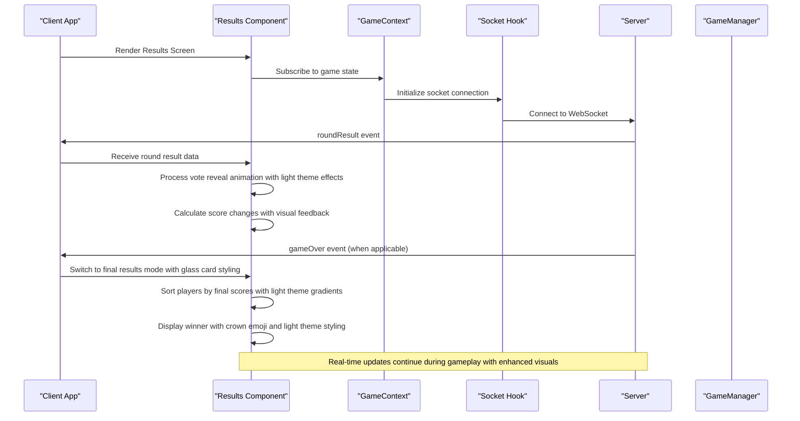
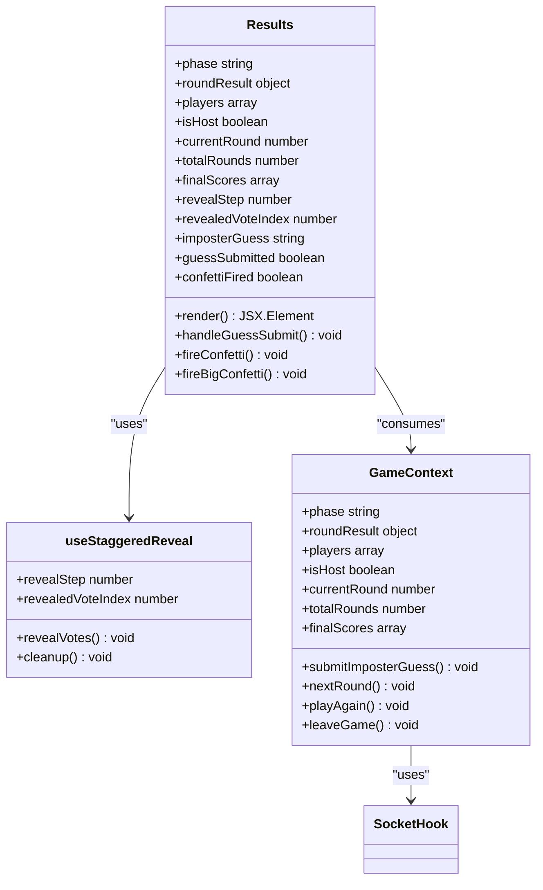
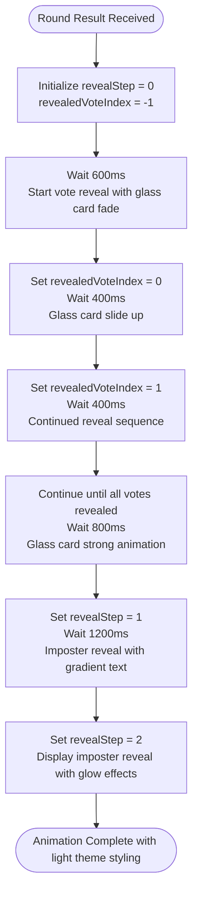
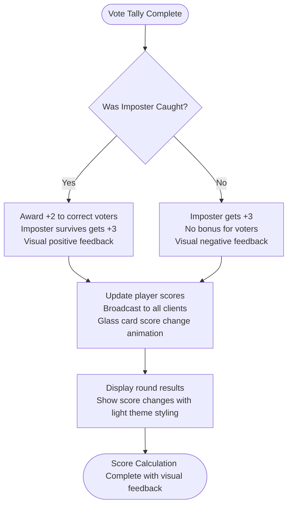
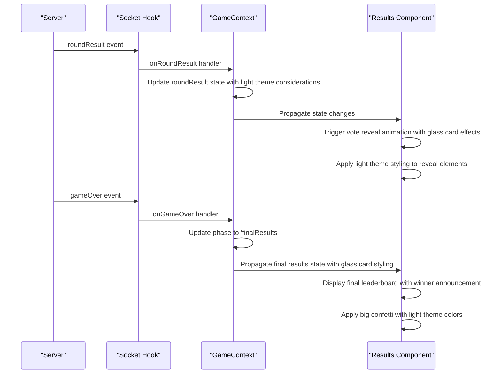
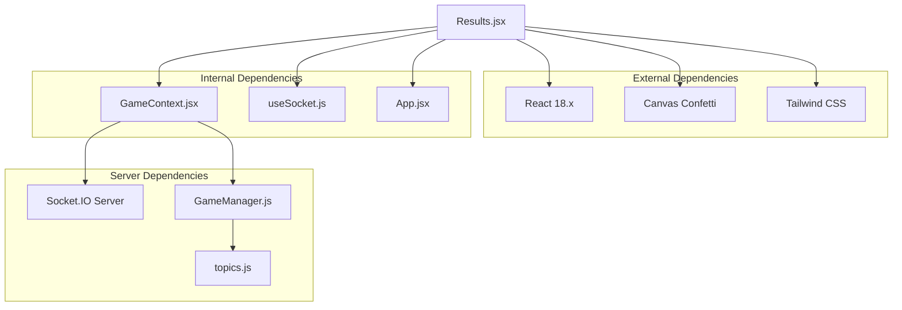

# Results Screen

<cite>
**Referenced Files in This Document**
- [Results.jsx](file://client/src/screens/Results.jsx)
- [GameContext.jsx](file://client/src/context/GameContext.jsx)
- [useSocket.js](file://client/src/hooks/useSocket.js)
- [index.js](file://server/index.js)
- [gameManager.js](file://server/gameManager.js)
- [App.jsx](file://client/src/App.jsx)
- [main.jsx](file://client/src/main.jsx)
- [index.css](file://client/src/index.css)
- [tailwind.config.js](file://client/tailwind.config.js)
</cite>

## Update Summary
**Changes Made**
- Updated Results screen styling documentation to reflect light theme transformation
- Added comprehensive coverage of glass card effects and light theme color schemes
- Enhanced documentation of winner announcement system with light theme styling
- Updated player display components with light theme color variations
- Documented statistical elements using appropriate light theme colors
- Added detailed analysis of confetti effects in light theme context

## Table of Contents
1. [Introduction](#introduction)
2. [Project Structure](#project-structure)
3. [Core Components](#core-components)
4. [Architecture Overview](#architecture-overview)
5. [Detailed Component Analysis](#detailed-component-analysis)
6. [Light Theme Styling System](#light-theme-styling-system)
7. [Dependency Analysis](#dependency-analysis)
8. [Performance Considerations](#performance-considerations)
9. [Troubleshooting Guide](#troubleshooting-guide)
10. [Conclusion](#conclusion)

## Introduction

The Results screen component is a crucial part of the Imposter Game's user interface, responsible for displaying round outcomes, final standings, and managing the transition between game phases. This component has undergone a comprehensive light theme transformation that enhances visual appeal while maintaining accessibility and performance.

The Results screen serves two distinct purposes:
- **Round Results Display**: Shows vote reveals, imposter identification, and individual player scores during active gameplay
- **Final Results Screen**: Presents comprehensive leaderboard and winner announcement at the end of the game

**Updated** The component now features a sophisticated light theme styling system with glass card effects, gradient backgrounds, and carefully curated color palettes that provide excellent contrast and readability across all device types.

## Project Structure

The Results screen is organized within the client-side React application structure with enhanced styling infrastructure:

```mermaid
graph TB
subgraph "Client Application"
Main[main.jsx]
App[App.jsx]
GameContext[GameContext.jsx]
Results[Results.jsx]
subgraph "Screens"
Home[Home.jsx]
Lobby[Lobby.jsx]
RoleReveal[RoleReveal.jsx]
CluePhase[CluePhase.jsx]
Discussion[Discussion.jsx]
Voting[Voting.jsx]
Results[Results.jsx]
end
subgraph "Context"
GameContext[GameContext.jsx]
SocketHook[useSocket.js]
end
subgraph "Styling System"
TailwindConfig[tailwind.config.js]
LightThemeCSS[index.css]
end
Main --> App
App --> Results
App --> GameContext
GameContext --> SocketHook
Results --> LightThemeCSS
Results --> TailwindConfig
end
subgraph "Server"
Server[index.js]
GameManager[gameManager.js]
Topics[topics.js]
end
Results --> GameContext
GameContext --> Server
Server --> GameManager
GameManager --> Topics
```

**Diagram sources**
- [main.jsx:1-14](file://client/src/main.jsx#L1-L14)
- [App.jsx:56-65](file://client/src/App.jsx#L56-L65)
- [Results.jsx:100-443](file://client/src/screens/Results.jsx#L100-L443)
- [GameContext.jsx:12-383](file://client/src/context/GameContext.jsx#L12-L383)
- [index.css:111-128](file://client/src/index.css#L111-L128)
- [tailwind.config.js:1-48](file://client/tailwind.config.js#L1-L48)

**Section sources**
- [main.jsx:1-14](file://client/src/main.jsx#L1-L14)
- [App.jsx:56-65](file://client/src/App.jsx#L56-L65)

## Core Components

The Results screen component consists of several interconnected parts that work together to provide a comprehensive gaming experience with enhanced light theme styling:

### Primary Components

1. **Results Component**: Main container that renders either round results or final standings with glass card effects
2. **useStaggeredReveal Hook**: Manages the animated reveal sequence for votes using light theme transitions
3. **Confetti Animation System**: Provides celebratory effects for winners and game completion with light theme color coordination
4. **Score Calculation Engine**: Processes round outcomes and updates player scores with visual feedback
5. **Animation Management**: Coordinates timing and transitions between result stages with smooth light theme animations

### Key Features

- **Dual Mode Operation**: Automatically switches between round results and final results based on game phase
- **Progressive Disclosure**: Staggered reveal of votes with smooth animations using light theme color transitions
- **Real-time Updates**: Synchronizes with server for live result broadcasting
- **Responsive Design**: Adapts layout for different screen sizes and orientations with glass card effects
- **Visual Feedback**: Comprehensive animations and effects for game events with light theme styling
- **Light Theme Integration**: Seamless integration with glass card effects and gradient backgrounds

**Section sources**
- [Results.jsx:100-443](file://client/src/screens/Results.jsx#L100-L443)
- [GameContext.jsx:158-170](file://client/src/context/GameContext.jsx#L158-L170)

## Architecture Overview

The Results screen follows a reactive architecture pattern that integrates tightly with the GameContext for state management and socket.io for real-time communication, enhanced with light theme styling:



**Diagram sources**
- [Results.jsx:100-443](file://client/src/screens/Results.jsx#L100-L443)
- [GameContext.jsx:158-170](file://client/src/context/GameContext.jsx#L158-L170)
- [index.js:127-167](file://server/index.js#L127-L167)

The architecture ensures seamless integration between client-side rendering and server-side game logic, with automatic state synchronization and real-time result broadcasting enhanced by light theme styling.

## Detailed Component Analysis

### Results Component Structure

The Results component is implemented as a sophisticated React component with multiple rendering modes and complex state management, featuring enhanced light theme styling:



**Diagram sources**
- [Results.jsx:100-443](file://client/src/screens/Results.jsx#L100-L443)
- [Results.jsx:16-53](file://client/src/screens/Results.jsx#L16-L53)
- [GameContext.jsx:339-380](file://client/src/context/GameContext.jsx#L339-L380)

### Animation System

The Results component implements a sophisticated animation system using React hooks and canvas-based confetti effects with light theme color coordination:

#### Vote Reveal Animation

The staggered reveal effect creates a dramatic reveal of voting results with smooth light theme transitions:



**Diagram sources**
- [Results.jsx:16-53](file://client/src/screens/Results.jsx#L16-L53)

#### Confetti Effects

The component includes two types of confetti animations with light theme color coordination:

1. **Standard Confetti**: Triggered when the imposter is caught with light theme colors (#e94560, #10b981, #3b82f6, #8b5cf6, #f59e0b)
2. **Big Confetti**: Triggered during final results display with enhanced color palette

These animations use the canvas-confetti library with carefully tuned parameters for optimal visual impact against the light theme background.

### Score Calculation System

The Results screen processes and displays score changes through a multi-stage calculation system with visual feedback:

#### Round Score Calculation

The server calculates scores based on voting outcomes with immediate visual feedback:



**Diagram sources**
- [gameManager.js:316-378](file://server/gameManager.js#L316-L378)

#### Score Display Logic

The Results component displays scores with visual indicators using light theme colors:

- **Positive Changes**: Green "+1" prefix for score increases with neon-green styling
- **Current Scores**: Dark gray bold text for final scores with light theme contrast
- **Player Order**: Sorted by descending score with special styling for top positions using crown emoji and light theme gradients
- **Avatar Colors**: Gradient color scheme using light theme compatible colors

### Responsive Design Implementation

The Results screen implements a comprehensive responsive design system with light theme styling:

#### Layout Adaptations

- **Mobile-First Design**: Optimized for small screens with appropriate spacing and glass card sizing
- **Flexible Containers**: Max-width constraints with fluid scaling using light theme background gradients
- **Adaptive Typography**: Font sizes adjust based on screen dimensions with light theme color contrast
- **Touch-Friendly Elements**: Sufficient button sizes and spacing for mobile interaction with glass card effects

#### Visual Hierarchy

The component maintains clear visual hierarchy through light theme styling:

- **Gradient Headers**: Distinctive branding for different screen modes using light theme gradients
- **Glass Card Effects**: Semi-transparent backgrounds with blur effects using rgba values for light theme compatibility
- **Color Coding**: Different colors for winners, runners-up, and regular players with light theme accessible contrast
- **Animation Timing**: Carefully orchestrated reveal sequences with smooth transitions

### Socket Event Integration

The Results screen integrates with socket events for real-time updates with enhanced visual feedback:

#### Event Handling



**Diagram sources**
- [index.js:127-167](file://server/index.js#L127-L167)
- [GameContext.jsx:158-170](file://client/src/context/GameContext.jsx#L158-L170)

#### Transition Logic

The component handles transitions between different game states with smooth light theme animations:

- **Round Results**: Active gameplay with ongoing voting and glass card effects
- **Final Results**: Game completion with comprehensive standings and enhanced visual feedback
- **Host Controls**: Special buttons available only to the host player with light theme styling

**Section sources**
- [Results.jsx:100-443](file://client/src/screens/Results.jsx#L100-L443)
- [GameContext.jsx:158-170](file://client/src/context/GameContext.jsx#L158-L170)
- [index.js:127-167](file://server/index.js#L127-L167)

## Light Theme Styling System

The Results screen features a comprehensive light theme styling system that enhances visual appeal while maintaining accessibility and performance:

### Glass Card Effects

The component utilizes sophisticated glass card effects designed specifically for light themes:

```mermaid
graph TB
subgraph "Glass Card Variants"
GlassCard[glass-card<br/>rgba(255, 255, 255, 0.7)<br/>blur(24px)<br/>border: rgba(0, 0, 0, 0.06)]
GlassCardStrong[glass-card-strong<br/>rgba(255, 255, 255, 0.9)<br/>blur(32px)<br/>border: rgba(0, 0, 0, 0.08)]
End
subgraph "Light Theme Colors"
AccentColors[accent: #e94560<br/>neon: #10b981, #3b82f6, #8b5cf6, #ec4899<br/>light: #f5f5f5, #e5e5e5]
GlowEffects[glow-red: #e94560<br/>glow-green: #10b981<br/>glow-blue: #3b82f6]
End
GlassCard --> AccentColors
GlassCardStrong --> GlowEffects
```

**Diagram sources**
- [index.css:111-128](file://client/src/index.css#L111-L128)
- [index.css:154-165](file://client/src/index.css#L154-L165)
- [tailwind.config.js:5-9](file://client/tailwind.config.js#L5-L9)

### Color Palette and Typography

The light theme employs a carefully curated color palette optimized for readability and visual appeal:

- **Primary Background**: Light gray gradient background (#f5f5f5) providing excellent contrast
- **Card Backgrounds**: Semi-transparent white cards with blur effects for depth perception
- **Accent Colors**: Vibrant accent colors (#e94560, #10b981, #3b82f6) for highlights and feedback
- **Typography**: Dark gray text (#1a1a2e) for excellent readability against light backgrounds
- **Border Colors**: Subtle borders with low opacity for visual separation

### Animation and Effect System

The light theme styling includes specialized animations and effects:

- **Fade In Animations**: Smooth entrance animations using opacity transitions
- **Slide Up Effects**: Staggered reveal animations with timing delays
- **Scale In Transitions**: Dynamic scaling effects for emphasis
- **Glow Effects**: Soft glow animations using light theme compatible colors
- **Thinking Dots**: Animated loading indicators with bounce effects

### Responsive Typography

The Results screen adapts typography for optimal readability across all devices:

- **Header Text**: Large, bold text with gradient effects for visual impact
- **Body Text**: Medium-sized text with appropriate line heights for readability
- **Small Text**: Compact text for secondary information and statistics
- **Emoji Integration**: Strategic use of emojis for visual cues and engagement

**Section sources**
- [index.css:111-165](file://client/src/index.css#L111-L165)
- [tailwind.config.js:5-9](file://client/tailwind.config.js#L5-L9)
- [Results.jsx:167-178](file://client/src/screens/Results.jsx#L167-L178)

## Dependency Analysis

The Results screen component has well-defined dependencies that support its functionality with enhanced light theme styling:



**Diagram sources**
- [Results.jsx:1-4](file://client/src/screens/Results.jsx#L1-L4)
- [GameContext.jsx:1-2](file://client/src/context/GameContext.jsx#L1-L2)
- [useSocket.js:1-2](file://client/src/hooks/useSocket.js#L1-L2)

### Component Coupling

The Results component demonstrates good separation of concerns with enhanced styling integration:

- **High Cohesion**: All result-related functionality is contained within the component with light theme styling
- **Low Coupling**: Minimal dependencies on external components with styled components
- **Clear Interfaces**: Well-defined props and state management through GameContext with styling context

### Circular Dependencies

The architecture avoids circular dependencies through:

- **Unidirectional Data Flow**: GameContext provides state, Results consumes it with styling
- **Event-Driven Communication**: Socket events flow from server to client with visual updates
- **Hook-Based Architecture**: useSocket encapsulates socket functionality with styling integration

**Section sources**
- [Results.jsx:100-443](file://client/src/screens/Results.jsx#L100-L443)
- [GameContext.jsx:12-383](file://client/src/context/GameContext.jsx#L12-L383)

## Performance Considerations

The Results screen is designed with several performance optimizations, enhanced by light theme styling:

### Animation Performance

- **Efficient Timers**: Uses React refs for timer management to prevent memory leaks
- **Canvas Optimization**: Confetti effects are optimized for smooth performance against light backgrounds
- **Conditional Rendering**: Animations only run when result data is available with efficient state updates
- **Glass Card Optimization**: CSS blur effects are optimized for modern browsers with light theme compatibility

### Memory Management

- **Cleanup Functions**: Proper cleanup of timeouts and intervals
- **State Optimization**: Efficient state updates using React hooks with styling state management
- **Component Unmounting**: Proper cleanup when navigating away from results with light theme cleanup

### Network Efficiency

- **Event-Driven Updates**: Results update only when new data arrives with minimal re-renders
- **Minimal Re-renders**: Strategic use of React.memo patterns with styled components
- **Efficient Broadcasting**: Server sends only necessary result data with light theme considerations

## Troubleshooting Guide

Common issues and their solutions with light theme considerations:

### Animation Issues

**Problem**: Vote reveal animation not triggering with light theme effects
**Solution**: Verify roundResult prop contains vote data and revealStep state updates correctly with glass card transitions

**Problem**: Confetti not appearing with light theme colors
**Solution**: Check confettiFired flag and ensure revealStep reaches stage 2 with proper color coordination

### Score Display Problems

**Problem**: Incorrect score calculations with light theme visual feedback
**Solution**: Verify server-side score calculation logic and client-side display formatting with light theme colors

**Problem**: Player ordering incorrect with glass card styling
**Solution**: Check sorting logic by score property and fallback to player ID with proper z-index stacking

### Socket Communication Issues

**Problem**: Results not updating in real-time with light theme animations
**Solution**: Verify socket connection status and event listener registration with animation state management

**Problem**: Host controls not appearing with light theme styling
**Solution**: Check isHost state and ensure proper socket event handling with styled button components

### Responsive Design Issues

**Problem**: Layout breaks on mobile devices with glass card effects
**Solution**: Verify Tailwind CSS classes and responsive breakpoints with light theme background compatibility

**Problem**: Light theme colors not displaying correctly
**Solution**: Check CSS variables and color definitions in tailwind.config.js with proper rgba values

**Section sources**
- [Results.jsx:130-149](file://client/src/screens/Results.jsx#L130-L149)
- [GameContext.jsx:158-170](file://client/src/context/GameContext.jsx#L158-L170)

## Conclusion

The Results screen component represents a sophisticated implementation of real-time game result presentation with comprehensive light theme styling. Its architecture successfully balances visual appeal with functional requirements, providing players with clear feedback on game outcomes while maintaining performance and responsiveness.

Key achievements include:

- **Seamless Integration**: Tight coupling with GameContext and socket events with enhanced visual feedback
- **Rich Animation System**: Multi-layered reveal effects with confetti celebrations using light theme colors
- **Light Theme Mastery**: Sophisticated glass card effects and gradient backgrounds optimized for readability
- **Responsive Design**: Adaptive layouts that work across all device types with light theme considerations
- **Performance Optimization**: Efficient state management and animation performance with styling optimization
- **Extensible Architecture**: Clean separation of concerns supporting future enhancements with light theme expansion

The component serves as an excellent example of modern React development practices, combining functional programming patterns with real-time communication and light theme styling to create engaging user experiences that prioritize both aesthetics and accessibility.