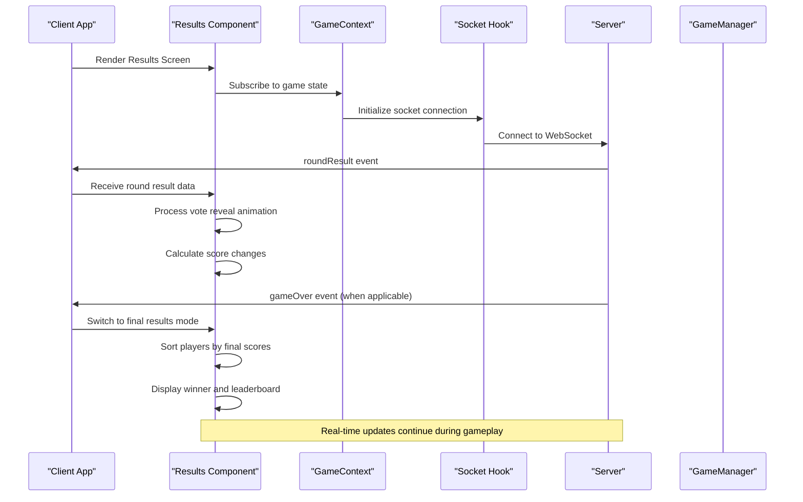
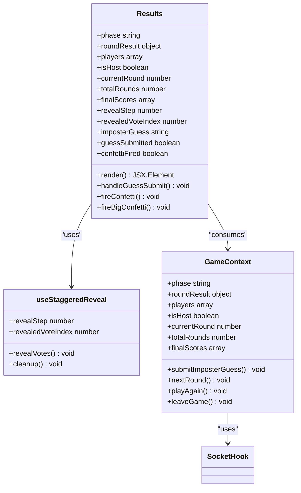
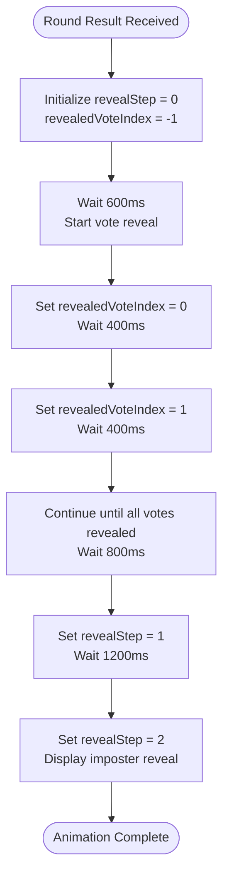
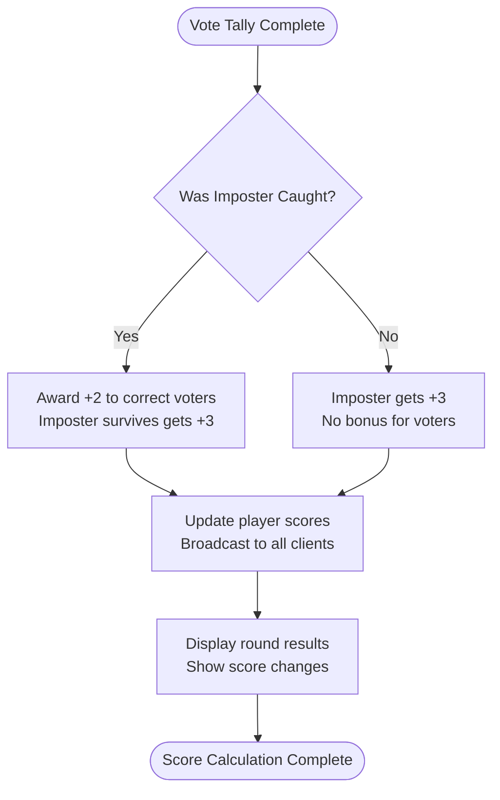
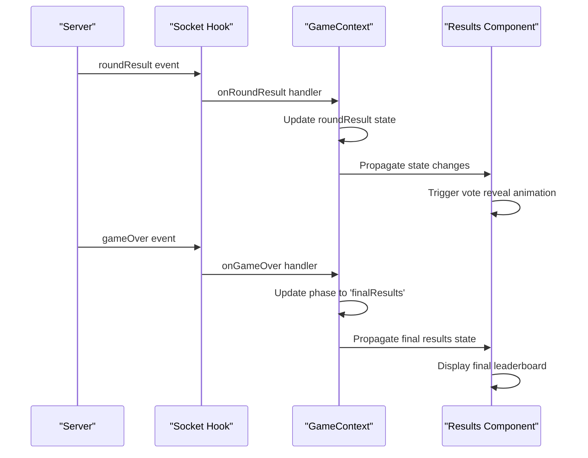
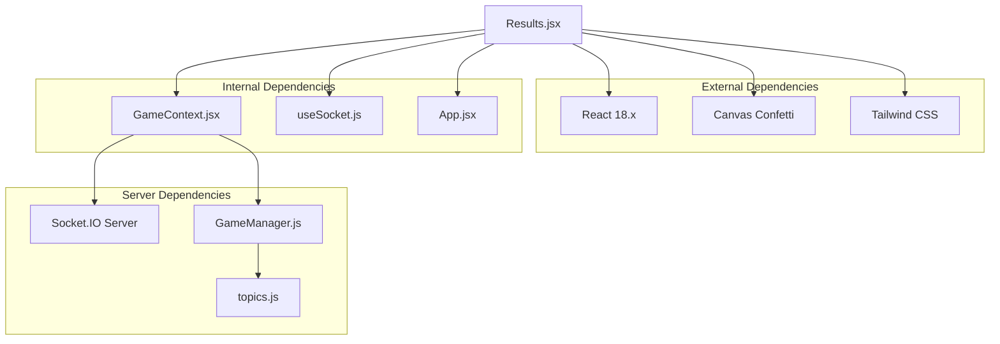

# Results Screen

<cite>
**Referenced Files in This Document**
- [Results.jsx](file://client/src/screens/Results.jsx)
- [GameContext.jsx](file://client/src/context/GameContext.jsx)
- [useSocket.js](file://client/src/hooks/useSocket.js)
- [index.js](file://server/index.js)
- [gameManager.js](file://server/gameManager.js)
- [App.jsx](file://client/src/App.jsx)
- [main.jsx](file://client/src/main.jsx)
</cite>

## Table of Contents
1. [Introduction](#introduction)
2. [Project Structure](#project-structure)
3. [Core Components](#core-components)
4. [Architecture Overview](#architecture-overview)
5. [Detailed Component Analysis](#detailed-component-analysis)
6. [Dependency Analysis](#dependency-analysis)
7. [Performance Considerations](#performance-considerations)
8. [Troubleshooting Guide](#troubleshooting-guide)
9. [Conclusion](#conclusion)

## Introduction

The Results screen component is a crucial part of the Imposter Game's user interface, responsible for displaying round outcomes, final standings, and managing the transition between game phases. This component handles complex animations, score calculations, and integrates seamlessly with the GameContext for real-time updates from the server.

The Results screen serves two distinct purposes:
- **Round Results Display**: Shows vote reveals, imposter identification, and individual player scores during active gameplay
- **Final Results Screen**: Presents comprehensive leaderboard and winner announcement at the end of the game

## Project Structure

The Results screen is organized within the client-side React application structure:

```mermaid
graph TB
subgraph "Client Application"
Main[main.jsx]
App[App.jsx]
GameContext[GameContext.jsx]
Results[Results.jsx]
subgraph "Screens"
Home[Home.jsx]
Lobby[Lobby.jsx]
RoleReveal[RoleReveal.jsx]
CluePhase[CluePhase.jsx]
Discussion[Discussion.jsx]
Voting[Voting.jsx]
Results[Results.jsx]
end
subgraph "Context"
GameContext[GameContext.jsx]
SocketHook[useSocket.js]
end
Main --> App
App --> Results
App --> GameContext
GameContext --> SocketHook
end
subgraph "Server"
Server[index.js]
GameManager[gameManager.js]
Topics[topics.js]
end
Results --> GameContext
GameContext --> Server
Server --> GameManager
GameManager --> Topics
```

**Diagram sources**
- [main.jsx:1-14](file://client/src/main.jsx#L1-L14)
- [App.jsx:56-65](file://client/src/App.jsx#L56-L65)
- [Results.jsx:100-443](file://client/src/screens/Results.jsx#L100-L443)
- [GameContext.jsx:12-383](file://client/src/context/GameContext.jsx#L12-L383)

**Section sources**
- [main.jsx:1-14](file://client/src/main.jsx#L1-L14)
- [App.jsx:56-65](file://client/src/App.jsx#L56-L65)

## Core Components

The Results screen component consists of several interconnected parts that work together to provide a comprehensive gaming experience:

### Primary Components

1. **Results Component**: Main container that renders either round results or final standings
2. **useStaggeredReveal Hook**: Manages the animated reveal sequence for votes
3. **Confetti Animation System**: Provides celebratory effects for winners and game completion
4. **Score Calculation Engine**: Processes round outcomes and updates player scores
5. **Animation Management**: Coordinates timing and transitions between result stages

### Key Features

- **Dual Mode Operation**: Automatically switches between round results and final results based on game phase
- **Progressive Disclosure**: Staggered reveal of votes with smooth animations
- **Real-time Updates**: Synchronizes with server for live result broadcasting
- **Responsive Design**: Adapts layout for different screen sizes and orientations
- **Visual Feedback**: Comprehensive animations and effects for game events

**Section sources**
- [Results.jsx:100-443](file://client/src/screens/Results.jsx#L100-L443)
- [GameContext.jsx:158-170](file://client/src/context/GameContext.jsx#L158-L170)

## Architecture Overview

The Results screen follows a reactive architecture pattern that integrates tightly with the GameContext for state management and socket.io for real-time communication:



**Diagram sources**
- [Results.jsx:100-443](file://client/src/screens/Results.jsx#L100-L443)
- [GameContext.jsx:158-170](file://client/src/context/GameContext.jsx#L158-L170)
- [index.js:127-167](file://server/index.js#L127-L167)

The architecture ensures seamless integration between client-side rendering and server-side game logic, with automatic state synchronization and real-time result broadcasting.

## Detailed Component Analysis

### Results Component Structure

The Results component is implemented as a sophisticated React component with multiple rendering modes and complex state management:



**Diagram sources**
- [Results.jsx:100-443](file://client/src/screens/Results.jsx#L100-L443)
- [Results.jsx:16-53](file://client/src/screens/Results.jsx#L16-L53)
- [GameContext.jsx:339-380](file://client/src/context/GameContext.jsx#L339-L380)

### Animation System

The Results component implements a sophisticated animation system using React hooks and canvas-based confetti effects:

#### Vote Reveal Animation

The staggered reveal effect creates a dramatic reveal of voting results:



**Diagram sources**
- [Results.jsx:16-53](file://client/src/screens/Results.jsx#L16-L53)

#### Confetti Effects

The component includes two types of confetti animations:

1. **Standard Confetti**: Triggered when the imposter is caught
2. **Big Confetti**: Triggered during final results display

These animations use the canvas-confetti library with carefully tuned parameters for optimal visual impact.

### Score Calculation System

The Results screen processes and displays score changes through a multi-stage calculation system:

#### Round Score Calculation

The server calculates scores based on voting outcomes:



**Diagram sources**
- [gameManager.js:316-378](file://server/gameManager.js#L316-L378)

#### Score Display Logic

The Results component displays scores with visual indicators:

- **Positive Changes**: Green "+" prefix for score increases
- **Current Scores**: White bold text for final scores
- **Player Order**: Sorted by descending score with special styling for top positions

### Responsive Design Implementation

The Results screen implements a comprehensive responsive design system:

#### Layout Adaptations

- **Mobile-First Design**: Optimized for small screens with appropriate spacing
- **Flexible Containers**: Max-width constraints with fluid scaling
- **Adaptive Typography**: Font sizes adjust based on screen dimensions
- **Touch-Friendly Elements**: Sufficient button sizes and spacing for mobile interaction

#### Visual Hierarchy

The component maintains clear visual hierarchy through:

- **Gradient Headers**: Distinctive branding for different screen modes
- **Glass Card Effects**: Semi-transparent backgrounds with blur effects
- **Color Coding**: Different colors for winners, runners-up, and regular players
- **Animation Timing**: Carefully orchestrated reveal sequences

### Socket Event Integration

The Results screen integrates with socket events for real-time updates:

#### Event Handling



**Diagram sources**
- [index.js:127-167](file://server/index.js#L127-L167)
- [GameContext.jsx:158-170](file://client/src/context/GameContext.jsx#L158-L170)

#### Transition Logic

The component handles transitions between different game states:

- **Round Results**: Active gameplay with ongoing voting
- **Final Results**: Game completion with comprehensive standings
- **Host Controls**: Special buttons available only to the host player

**Section sources**
- [Results.jsx:100-443](file://client/src/screens/Results.jsx#L100-L443)
- [GameContext.jsx:158-170](file://client/src/context/GameContext.jsx#L158-L170)
- [index.js:127-167](file://server/index.js#L127-L167)

## Dependency Analysis

The Results screen component has well-defined dependencies that support its functionality:



**Diagram sources**
- [Results.jsx:1-4](file://client/src/screens/Results.jsx#L1-L4)
- [GameContext.jsx:1-2](file://client/src/context/GameContext.jsx#L1-L2)
- [useSocket.js:1-2](file://client/src/hooks/useSocket.js#L1-L2)

### Component Coupling

The Results component demonstrates good separation of concerns:

- **High Cohesion**: All result-related functionality is contained within the component
- **Low Coupling**: Minimal dependencies on external components
- **Clear Interfaces**: Well-defined props and state management through GameContext

### Circular Dependencies

The architecture avoids circular dependencies through:

- **Unidirectional Data Flow**: GameContext provides state, Results consumes it
- **Event-Driven Communication**: Socket events flow from server to client
- **Hook-Based Architecture**: useSocket encapsulates socket functionality

**Section sources**
- [Results.jsx:100-443](file://client/src/screens/Results.jsx#L100-L443)
- [GameContext.jsx:12-383](file://client/src/context/GameContext.jsx#L12-L383)

## Performance Considerations

The Results screen is designed with several performance optimizations:

### Animation Performance

- **Efficient Timers**: Uses React refs for timer management to prevent memory leaks
- **Canvas Optimization**: Confetti effects are optimized for smooth performance
- **Conditional Rendering**: Animations only run when result data is available

### Memory Management

- **Cleanup Functions**: Proper cleanup of timeouts and intervals
- **State Optimization**: Efficient state updates using React hooks
- **Component Unmounting**: Proper cleanup when navigating away from results

### Network Efficiency

- **Event-Driven Updates**: Results update only when new data arrives
- **Minimal Re-renders**: Strategic use of React.memo patterns
- **Efficient Broadcasting**: Server sends only necessary result data

## Troubleshooting Guide

Common issues and their solutions:

### Animation Issues

**Problem**: Vote reveal animation not triggering
**Solution**: Verify roundResult prop contains vote data and revealStep state updates correctly

**Problem**: Confetti not appearing
**Solution**: Check confettiFired flag and ensure revealStep reaches stage 2

### Score Display Problems

**Problem**: Incorrect score calculations
**Solution**: Verify server-side score calculation logic and client-side display formatting

**Problem**: Player ordering incorrect
**Solution**: Check sorting logic by score property and fallback to player ID

### Socket Communication Issues

**Problem**: Results not updating in real-time
**Solution**: Verify socket connection status and event listener registration

**Problem**: Host controls not appearing
**Solution**: Check isHost state and ensure proper socket event handling

### Responsive Design Issues

**Problem**: Layout breaks on mobile devices
**Solution**: Verify Tailwind CSS classes and responsive breakpoints

**Section sources**
- [Results.jsx:130-149](file://client/src/screens/Results.jsx#L130-L149)
- [GameContext.jsx:158-170](file://client/src/context/GameContext.jsx#L158-L170)

## Conclusion

The Results screen component represents a sophisticated implementation of real-time game result presentation. Its architecture successfully balances visual appeal with functional requirements, providing players with clear feedback on game outcomes while maintaining performance and responsiveness.

Key achievements include:

- **Seamless Integration**: Tight coupling with GameContext and socket events
- **Rich Animation System**: Multi-layered reveal effects with confetti celebrations
- **Responsive Design**: Adaptive layouts that work across all device types
- **Performance Optimization**: Efficient state management and animation performance
- **Extensible Architecture**: Clean separation of concerns supporting future enhancements

The component serves as an excellent example of modern React development practices, combining functional programming patterns with real-time communication to create engaging user experiences.