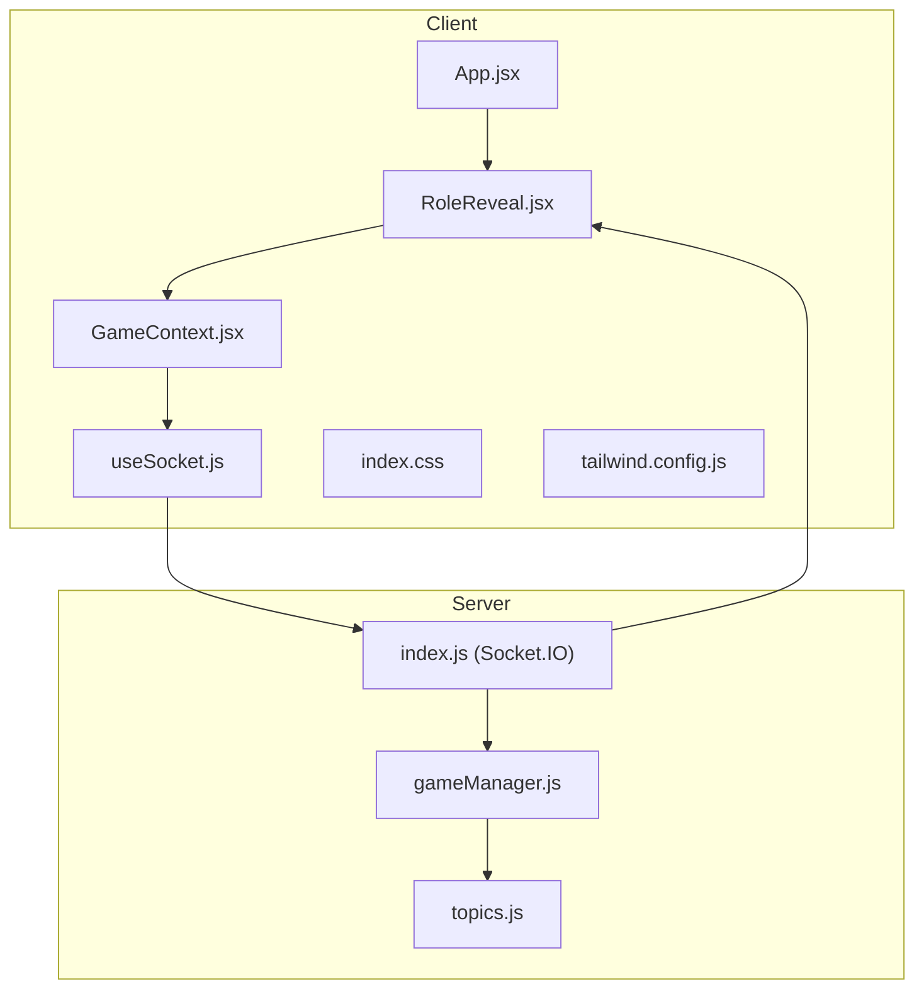
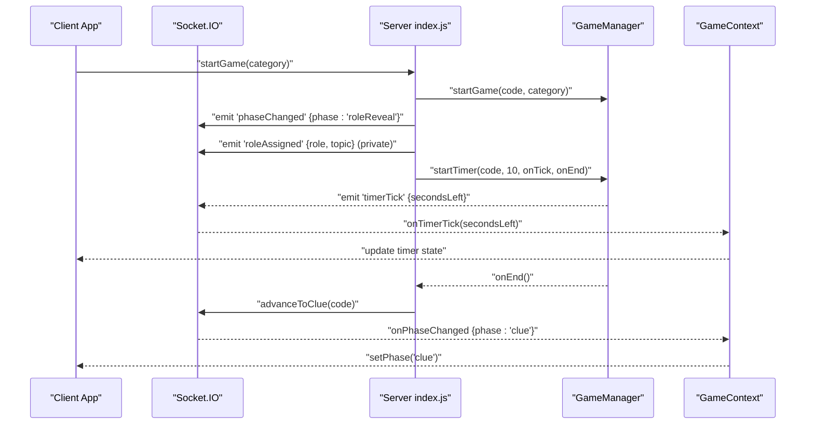
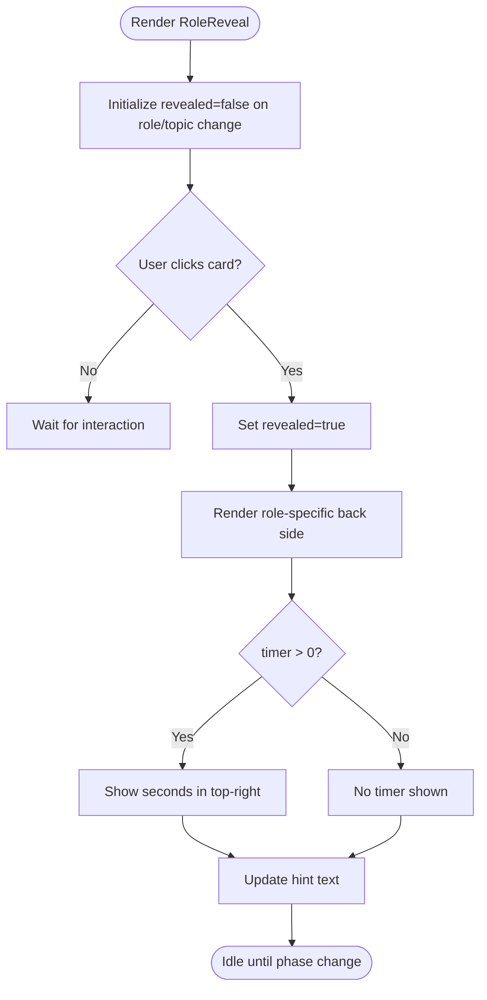
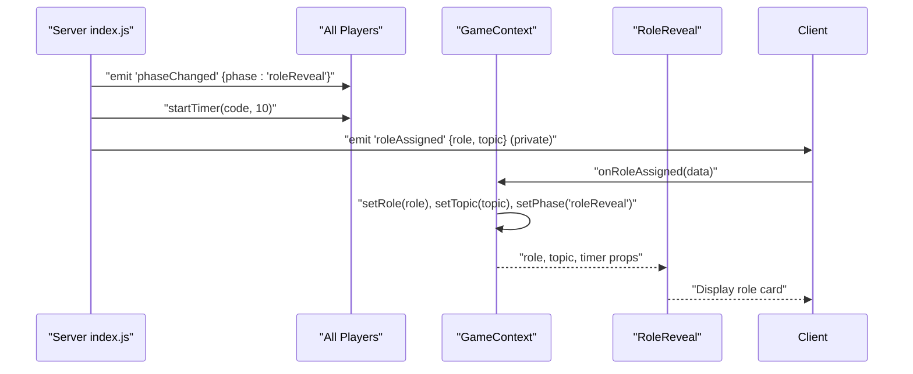
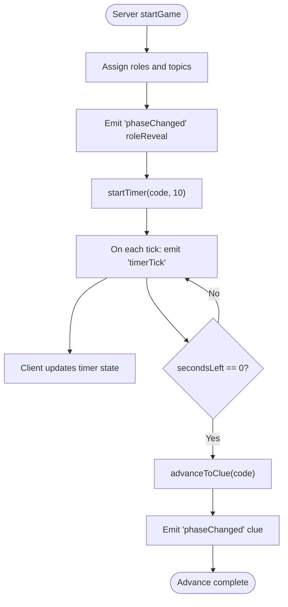
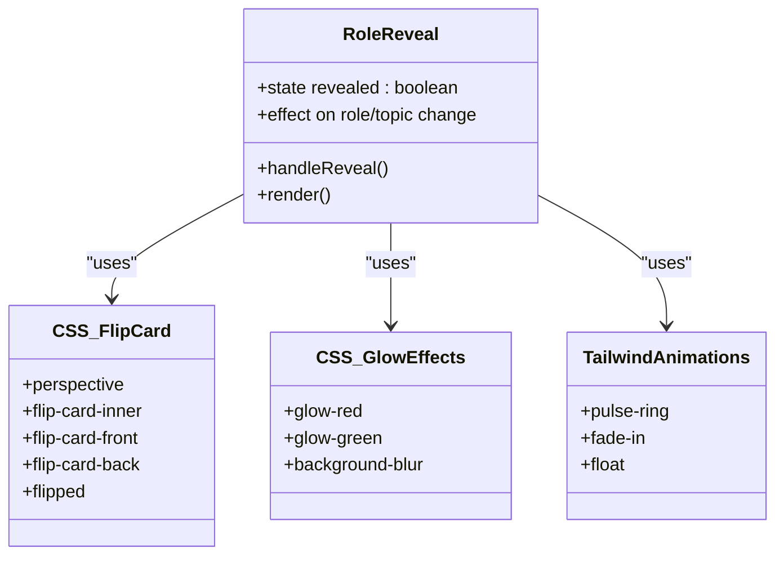
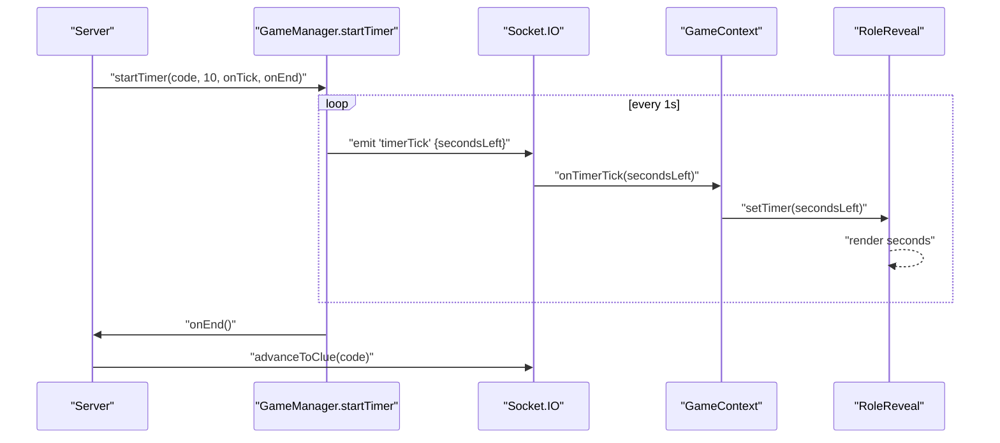
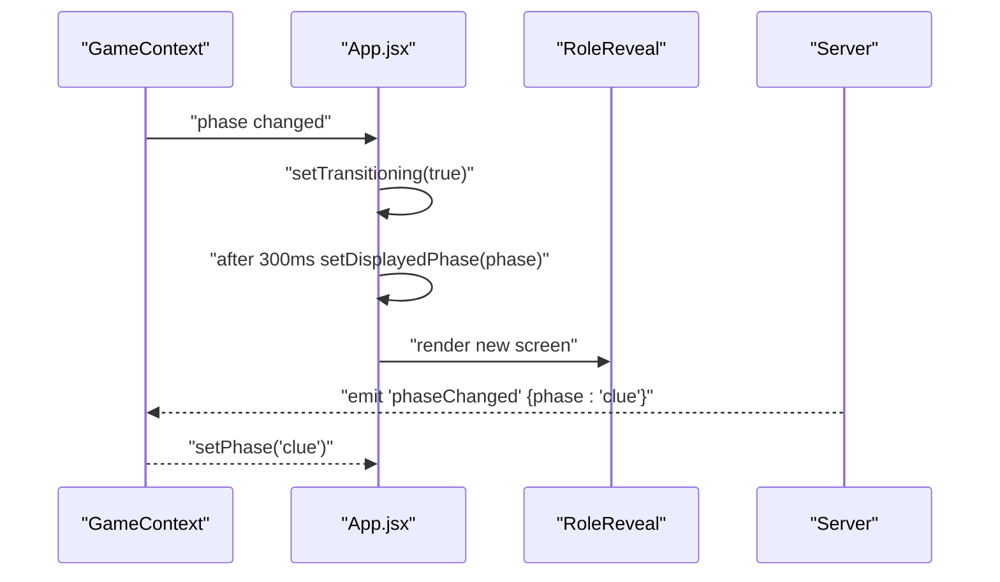
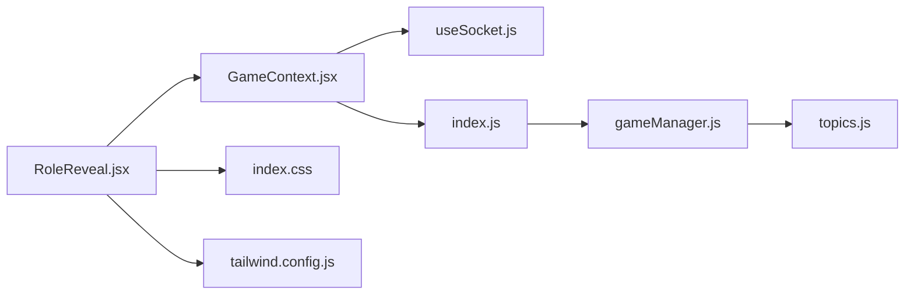

# Role Reveal Screen

<cite>
**Referenced Files in This Document**
- [RoleReveal.jsx](file://client/src/screens/RoleReveal.jsx)
- [GameContext.jsx](file://client/src/context/GameContext.jsx)
- [App.jsx](file://client/src/App.jsx)
- [useSocket.js](file://client/src/hooks/useSocket.js)
- [index.css](file://client/src/index.css)
- [tailwind.config.js](file://client/tailwind.config.js)
- [index.js](file://server/index.js)
- [gameManager.js](file://server/gameManager.js)
- [topics.js](file://server/topics.js)
</cite>

## Table of Contents
1. [Introduction](#introduction)
2. [Project Structure](#project-structure)
3. [Core Components](#core-components)
4. [Architecture Overview](#architecture-overview)
5. [Detailed Component Analysis](#detailed-component-analysis)
6. [Dependency Analysis](#dependency-analysis)
7. [Performance Considerations](#performance-considerations)
8. [Troubleshooting Guide](#troubleshooting-guide)
9. [Conclusion](#conclusion)

## Introduction
The Role Reveal screen displays each player’s role privately after the game starts. It features a flip-card animation, dynamic background glow based on role, a countdown timer, and responsive design. The screen integrates tightly with the game state management and socket events to orchestrate automatic transitions and role distribution.

## Project Structure
The Role Reveal screen is part of the client-side React application and interacts with the server via Socket.IO. The game flow is managed centrally in the GameContext provider, which subscribes to socket events emitted by the server.

**Diagram sources**
- [RoleReveal.jsx:1-123](file://client/src/screens/RoleReveal.jsx#L1-L123)
- [GameContext.jsx:1-383](file://client/src/context/GameContext.jsx#L1-L383)
- [App.jsx:1-101](file://client/src/App.jsx#L1-L101)
- [useSocket.js:1-76](file://client/src/hooks/useSocket.js#L1-L76)
- [index.css:1-215](file://client/src/index.css#L1-L215)
- [tailwind.config.js:1-48](file://client/tailwind.config.js#L1-L48)
- [index.js:1-687](file://server/index.js#L1-L687)
- [gameManager.js:1-636](file://server/gameManager.js#L1-L636)
- [topics.js:1-104](file://server/topics.js#L1-L104)

**Section sources**
- [RoleReveal.jsx:1-123](file://client/src/screens/RoleReveal.jsx#L1-L123)
- [GameContext.jsx:1-383](file://client/src/context/GameContext.jsx#L1-L383)
- [App.jsx:1-101](file://client/src/App.jsx#L1-L101)
- [useSocket.js:1-76](file://client/src/hooks/useSocket.js#L1-L76)
- [index.css:1-215](file://client/src/index.css#L1-L215)
- [tailwind.config.js:1-48](file://client/tailwind.config.js#L1-L48)
- [index.js:1-687](file://server/index.js#L1-L687)
- [gameManager.js:1-636](file://server/gameManager.js#L1-L636)
- [topics.js:1-104](file://server/topics.js#L1-L104)

## Core Components
- RoleReveal screen: Renders the flip card, background glow, timer, and role-specific content. It manages local reveal state and responds to game state updates.
- GameContext: Centralizes game state (phase, role, topic, timer) and socket event subscriptions. It triggers transitions to subsequent phases.
- App routing: Provides screen transitions with fade/slide animations and maintains the current displayed phase.
- Socket hooks: Establishes and manages the Socket.IO connection and reconnection logic.
- Server game loop: Orchestrates role assignment, emits role events, and runs a 10-second reveal timer before advancing to the next phase.

**Section sources**
- [RoleReveal.jsx:4-123](file://client/src/screens/RoleReveal.jsx#L4-L123)
- [GameContext.jsx:12-254](file://client/src/context/GameContext.jsx#L12-L254)
- [App.jsx:56-100](file://client/src/App.jsx#L56-L100)
- [useSocket.js:8-75](file://client/src/hooks/useSocket.js#L8-L75)
- [index.js:252-297](file://server/index.js#L252-L297)

## Architecture Overview
The Role Reveal screen participates in a real-time game flow driven by the server. The server assigns roles privately to each player, then broadcasts a 10-second countdown. On completion, the server advances to the next phase automatically.

**Diagram sources**
- [index.js:252-297](file://server/index.js#L252-L297)
- [index.js:49-66](file://server/index.js#L49-L66)
- [gameManager.js:213-241](file://server/gameManager.js#L213-L241)
- [gameManager.js:495-518](file://server/gameManager.js#L495-L518)
- [GameContext.jsx:130-140](file://client/src/context/GameContext.jsx#L130-L140)
- [GameContext.jsx:110-128](file://client/src/context/GameContext.jsx#L110-L128)

## Detailed Component Analysis

### Role Reveal Screen Component
The Role Reveal screen renders a flip card with two sides:
- Front side: "Tap to reveal" prompt with animated elements and a pulsing ring.
- Back side: Role-specific content:
  - Imposter: Dark red glow, message indicating lack of topic knowledge, and a stylized "YOU ARE THE IMPOSTER" headline.
  - Non-imposter: Neon green glow, topic display, and instructions to keep the word secret.

It also shows a timer when greater than zero and a hint message that changes based on reveal state.

**Diagram sources**
- [RoleReveal.jsx:8-14](file://client/src/screens/RoleReveal.jsx#L8-L14)
- [RoleReveal.jsx:32-36](file://client/src/screens/RoleReveal.jsx#L32-L36)
- [RoleReveal.jsx:115-119](file://client/src/screens/RoleReveal.jsx#L115-L119)

**Section sources**
- [RoleReveal.jsx:4-123](file://client/src/screens/RoleReveal.jsx#L4-L123)

### Private Role Distribution Mechanism
The server assigns roles privately to each player upon game start:
- The server selects a random topic and imposter.
- It emits a private "roleAssigned" event containing either:
  - role: "imposter" with topic: null
  - role: "player" with the actual topic
- The client receives this event and sets the role and topic, then transitions to the roleReveal phase.

**Diagram sources**
- [index.js:252-297](file://server/index.js#L252-L297)
- [index.js:264-271](file://server/index.js#L264-L271)
- [GameContext.jsx:130-136](file://client/src/context/GameContext.jsx#L130-L136)

**Section sources**
- [index.js:252-297](file://server/index.js#L252-L297)
- [GameContext.jsx:130-136](file://client/src/context/GameContext.jsx#L130-L136)

### Timing Controls and Automatic Advancement
- The server starts a 10-second countdown after role assignment.
- Each tick updates the client via "timerTick".
- When the timer ends, the server advances to the clue phase and clears the timer.

**Diagram sources**
- [index.js:277-287](file://server/index.js#L277-L287)
- [index.js:49-66](file://server/index.js#L49-L66)
- [gameManager.js:495-518](file://server/gameManager.js#L495-L518)
- [GameContext.jsx:138-140](file://client/src/context/GameContext.jsx#L138-L140)

**Section sources**
- [index.js:277-287](file://server/index.js#L277-L287)
- [index.js:49-66](file://server/index.js#L49-L66)
- [gameManager.js:495-518](file://server/gameManager.js#L495-L518)
- [GameContext.jsx:138-140](file://client/src/context/GameContext.jsx#L138-L140)

### Transition Animations and Visual Styling
- Flip card animation: 3D flip with a custom easing curve and preserve-3d transform.
- Background glow: Dynamic blur and color based on role and reveal state.
- Pulse ring and floating elements: Animated prompts for interaction.
- Screen transitions: Fade/slide transition when changing phases.

**Diagram sources**
- [RoleReveal.jsx:18-122](file://client/src/screens/RoleReveal.jsx#L18-L122)
- [index.css:128-150](file://client/src/index.css#L128-L150)
- [index.css:152-159](file://client/src/index.css#L152-L159)
- [tailwind.config.js:10-43](file://client/tailwind.config.js#L10-L43)

**Section sources**
- [RoleReveal.jsx:18-122](file://client/src/screens/RoleReveal.jsx#L18-L122)
- [index.css:128-150](file://client/src/index.css#L128-L150)
- [index.css:152-159](file://client/src/index.css#L152-L159)
- [tailwind.config.js:10-43](file://client/tailwind.config.js#L10-L43)

### Countdown Timer Implementation
- Server-side timer: 10 seconds with per-second callbacks.
- Client-side updates: "timerTick" event updates the timer state.
- Visibility: Timer is shown only when greater than zero.

**Diagram sources**
- [index.js:277-287](file://server/index.js#L277-L287)
- [gameManager.js:495-518](file://server/gameManager.js#L495-L518)
- [GameContext.jsx:138-140](file://client/src/context/GameContext.jsx#L138-L140)
- [RoleReveal.jsx:32-36](file://client/src/screens/RoleReveal.jsx#L32-L36)

**Section sources**
- [index.js:277-287](file://server/index.js#L277-L287)
- [gameManager.js:495-518](file://server/gameManager.js#L495-L518)
- [GameContext.jsx:138-140](file://client/src/context/GameContext.jsx#L138-L140)
- [RoleReveal.jsx:32-36](file://client/src/screens/RoleReveal.jsx#L32-L36)

### Screen Transition Logic
- Phase-driven rendering: App.jsx maps the current phase to the appropriate screen component.
- Smooth transitions: A 300ms fade/slide transition occurs when the phase changes.
- Role reveal to clue: After the 10-second timer, the server emits "phaseChanged" to move to the clue phase.

**Diagram sources**
- [App.jsx:67-81](file://client/src/App.jsx#L67-L81)
- [App.jsx:83-99](file://client/src/App.jsx#L83-L99)
- [GameContext.jsx:110-128](file://client/src/context/GameContext.jsx#L110-L128)
- [index.js:262](file://server/index.js#L262)

**Section sources**
- [App.jsx:67-81](file://client/src/App.jsx#L67-L81)
- [App.jsx:83-99](file://client/src/App.jsx#L83-L99)
- [GameContext.jsx:110-128](file://client/src/context/GameContext.jsx#L110-L128)
- [index.js:262](file://server/index.js#L262)

### Responsive Design Considerations
- Flexible container sizing: Full viewport height and width with percentage-based card sizing.
- Adaptive typography: Relative units and clamp-like scaling via Tailwind utilities.
- Mobile-first animations: Pulse and float animations are lightweight and device-friendly.
- Touch-friendly targets: Large tap area for the flip card and ring element.

**Section sources**
- [RoleReveal.jsx:18-122](file://client/src/screens/RoleReveal.jsx#L18-L122)
- [index.css:128-150](file://client/src/index.css#L128-L150)
- [tailwind.config.js:10-43](file://client/tailwind.config.js#L10-L43)

### Accessibility Features
- Keyboard focus indicators: Tailwind utilities provide visible focus states.
- Reduced motion support: Animations use Tailwind defaults suitable for reduced motion preferences.
- Color contrast: Role-specific glows and backgrounds meet contrast guidelines for readability.
- Semantic structure: Headings and paragraphs provide clear content hierarchy.

**Section sources**
- [index.css:111-126](file://client/src/index.css#L111-L126)
- [tailwind.config.js:5-9](file://client/tailwind.config.js#L5-L9)

## Dependency Analysis
The Role Reveal screen depends on:
- GameContext for role, topic, timer, and phase state.
- Tailwind CSS for animations and visual effects.
- Socket.IO for real-time updates and role distribution.
- Server game manager for authoritative game flow and timers.

**Diagram sources**
- [RoleReveal.jsx:1-123](file://client/src/screens/RoleReveal.jsx#L1-L123)
- [GameContext.jsx:1-383](file://client/src/context/GameContext.jsx#L1-L383)
- [useSocket.js:1-76](file://client/src/hooks/useSocket.js#L1-L76)
- [index.css:1-215](file://client/src/index.css#L1-L215)
- [tailwind.config.js:1-48](file://client/tailwind.config.js#L1-L48)
- [index.js:1-687](file://server/index.js#L1-L687)
- [gameManager.js:1-636](file://server/gameManager.js#L1-L636)
- [topics.js:1-104](file://server/topics.js#L1-L104)

**Section sources**
- [RoleReveal.jsx:1-123](file://client/src/screens/RoleReveal.jsx#L1-L123)
- [GameContext.jsx:1-383](file://client/src/context/GameContext.jsx#L1-L383)
- [useSocket.js:1-76](file://client/src/hooks/useSocket.js#L1-L76)
- [index.css:1-215](file://client/src/index.css#L1-L215)
- [tailwind.config.js:1-48](file://client/tailwind.config.js#L1-L48)
- [index.js:1-687](file://server/index.js#L1-L687)
- [gameManager.js:1-636](file://server/gameManager.js#L1-L636)
- [topics.js:1-104](file://server/topics.js#L1-L104)

## Performance Considerations
- Efficient state updates: GameContext updates only necessary fields (role, topic, timer).
- Minimal re-renders: RoleReveal uses local state for reveal toggle and derives visuals from props.
- Lightweight animations: CSS transforms and opacity transitions are GPU-friendly.
- Server-side timers: Single interval per room prevents redundant timers.

## Troubleshooting Guide
- Roles not displaying: Verify "roleAssigned" events are received and that the client sets role/topic and phase accordingly.
- Timer not updating: Confirm "timerTick" events are emitted and that GameContext updates the timer state.
- Auto-advance not happening: Ensure the 10-second timer completes and "phaseChanged" to "clue" is emitted.
- Flip animation issues: Check Tailwind flip-card classes and ensure the flipped class toggles correctly.

**Section sources**
- [GameContext.jsx:130-140](file://client/src/context/GameContext.jsx#L130-L140)
- [index.js:277-287](file://server/index.js#L277-L287)
- [RoleReveal.jsx:43-44](file://client/src/screens/RoleReveal.jsx#L43-L44)

## Conclusion
The Role Reveal screen provides a polished, immersive experience with private role delivery, smooth animations, and seamless integration with the game state and server timers. Its modular design ensures maintainability and extensibility for future enhancements.