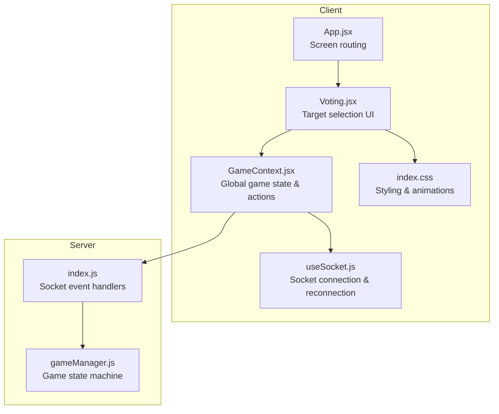
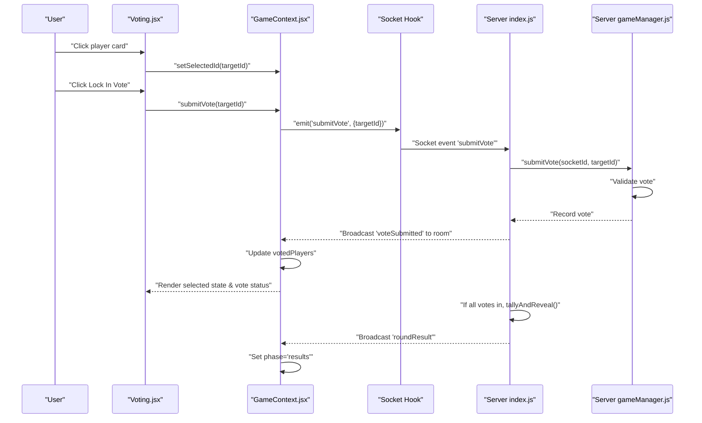
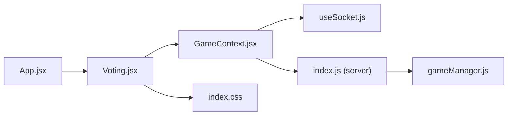

# Voting Screen

<cite>
**Referenced Files in This Document**
- [Voting.jsx](file://client/src/screens/Voting.jsx)
- [GameContext.jsx](file://client/src/context/GameContext.jsx)
- [useSocket.js](file://client/src/hooks/useSocket.js)
- [index.css](file://client/src/index.css)
- [App.jsx](file://client/src/App.jsx)
- [index.js](file://server/index.js)
- [gameManager.js](file://server/gameManager.js)
</cite>

## Table of Contents
1. [Introduction](#introduction)
2. [Project Structure](#project-structure)
3. [Core Components](#core-components)
4. [Architecture Overview](#architecture-overview)
5. [Detailed Component Analysis](#detailed-component-analysis)
6. [Dependency Analysis](#dependency-analysis)
7. [Performance Considerations](#performance-considerations)
8. [Troubleshooting Guide](#troubleshooting-guide)
9. [Conclusion](#conclusion)

## Introduction
This document provides comprehensive documentation for the Voting screen component in the Imposter game. It explains the target selection interface, vote submission mechanics, real-time voting updates, player targeting system, vote validation, and submission confirmation. It also covers the voting timer integration, player status indicators, visual feedback for selected targets, responsive design for player cards, hover states, selection animations, socket event handling for vote submissions and real-time vote counting, and integration with game state management. Finally, it includes examples of voting logic and real-time synchronization patterns.

## Project Structure
The Voting screen is part of the client-side React application and integrates with a Socket.IO server that manages game state. The key files involved are:
- Voting screen component and its styling
- Game state management context
- Socket hook for real-time communication
- Server-side game manager and event handlers

**Diagram sources**
- [Voting.jsx:1-180](file://client/src/screens/Voting.jsx#L1-L180)
- [GameContext.jsx:1-383](file://client/src/context/GameContext.jsx#L1-L383)
- [useSocket.js:1-76](file://client/src/hooks/useSocket.js#L1-L76)
- [index.css:1-215](file://client/src/index.css#L1-L215)
- [App.jsx:1-101](file://client/src/App.jsx#L1-L101)
- [index.js:1-687](file://server/index.js#L1-L687)
- [gameManager.js:1-636](file://server/gameManager.js#L1-L636)

**Section sources**
- [Voting.jsx:1-180](file://client/src/screens/Voting.jsx#L1-L180)
- [GameContext.jsx:1-383](file://client/src/context/GameContext.jsx#L1-L383)
- [useSocket.js:1-76](file://client/src/hooks/useSocket.js#L1-L76)
- [index.css:1-215](file://client/src/index.css#L1-L215)
- [App.jsx:1-101](file://client/src/App.jsx#L1-L101)
- [index.js:1-687](file://server/index.js#L1-L687)
- [gameManager.js:1-636](file://server/gameManager.js#L1-L636)

## Core Components
- Voting screen component: Renders the timer, player grid, selection controls, and real-time vote status.
- Game context provider: Exposes game state (players, timer, votes, hasVoted, votedPlayers) and actions (submitVote).
- Socket hook: Manages connection lifecycle and reconnection logic.
- Server game manager: Validates votes, tracks per-round state, and broadcasts real-time updates.

Key responsibilities:
- Target selection: Users can click a player card to select/deselect a target.
- Vote locking: After selecting a target, users can lock in their vote.
- Real-time updates: Other players’ votes are shown via a “has voted” indicator; the total locked-in vote count is displayed.
- Timer integration: A countdown ring reflects the remaining voting time.
- Responsive design: Player cards adapt to selection state, hover states, and disabled states.

**Section sources**
- [Voting.jsx:56-179](file://client/src/screens/Voting.jsx#L56-L179)
- [GameContext.jsx:282-286](file://client/src/context/GameContext.jsx#L282-L286)
- [index.js:375-405](file://server/index.js#L375-L405)
- [gameManager.js:284-307](file://server/gameManager.js#L284-L307)

## Architecture Overview
The Voting screen participates in a real-time, event-driven architecture:
- Client emits submitVote events to the server.
- Server validates the vote, records it, and broadcasts voteSubmitted to all clients.
- Clients update local state (hasVoted, votedPlayers) and reflect visual changes.
- When all connected players have voted, the server tallies votes and transitions to results.

**Diagram sources**
- [Voting.jsx:63-71](file://client/src/screens/Voting.jsx#L63-L71)
- [GameContext.jsx:282-286](file://client/src/context/GameContext.jsx#L282-L286)
- [useSocket.js:1-76](file://client/src/hooks/useSocket.js#L1-L76)
- [index.js:375-405](file://server/index.js#L375-L405)
- [gameManager.js:284-307](file://server/gameManager.js#L284-L307)

## Detailed Component Analysis

### Voting Screen Component
The Voting screen renders:
- A countdown ring synchronized with the server timer.
- A header indicating whether the vote is locked in.
- A responsive grid of player cards representing other players.
- A “Lock In Vote” button that submits the vote.
- A status bar showing how many votes are locked in.

Selection and interaction:
- Clicking a player card toggles selection (only one target at a time).
- Once a target is selected, the Lock In Vote button becomes enabled.
- After submitting, the UI disables further interactions and shows a “waiting for others” message.

Visual feedback:
- Selected target: a pulsing accent border and slight scale-up.
- Disabled state: cards become translucent and unclickable after voting.
- “Has voted” indicator: a small green checkmark badge appears on cards of players who have voted.
- Hover and active states: subtle scaling and border changes for interactivity.

Responsive design:
- Player cards use a two-column grid on medium screens and adjust spacing and typography for readability.

**Section sources**
- [Voting.jsx:56-179](file://client/src/screens/Voting.jsx#L56-L179)
- [index.css:111-126](file://client/src/index.css#L111-L126)
- [index.css:191-209](file://client/src/index.css#L191-L209)

### Countdown Ring Component
The CountdownRing component draws a circular SVG progress indicator:
- Calculates circumference and stroke offset based on timeLeft and totalTime.
- Dynamically adjusts color based on remaining time (green, yellow, red).
- Displays a monospaced digital time overlay.

Integration:
- The Voting screen passes timer and totalTime props to render the ring during the voting phase.

**Section sources**
- [Voting.jsx:15-54](file://client/src/screens/Voting.jsx#L15-L54)

### Player Cards and Status Indicators
Player cards:
- Display player initials derived from the player’s name.
- Assign a unique avatar color based on player index to visually distinguish players.
- Show a “has voted” indicator when the player has submitted a vote.
- Reflect selection state with a border ring and subtle scaling.

Hover and selection states:
- Non-selected cards have hover and active scaling/opacity transitions.
- Selected cards pulse with an accent glow and scale slightly larger.

Responsive layout:
- Two-column grid adapts to smaller screens and centers content.

**Section sources**
- [Voting.jsx:88-138](file://client/src/screens/Voting.jsx#L88-L138)
- [index.css:111-126](file://client/src/index.css#L111-L126)

### Vote Submission Mechanics
Client-side:
- The Voting screen calls submitVote with the selected targetId.
- The action sets hasVoted to true locally to disable further interactions.

Server-side:
- The server validates the vote (phase is voting, target is a valid player, voter is not voting for themselves).
- Records the vote and broadcasts voteSubmitted to the room.
- If all connected players have voted, the server immediately proceeds to tallying.

Real-time synchronization:
- Clients receive voteSubmitted and append the voterId to votedPlayers.
- The UI updates to show the “has voted” indicator on the corresponding player card and increments the vote count.

**Section sources**
- [Voting.jsx:63-71](file://client/src/screens/Voting.jsx#L63-L71)
- [GameContext.jsx:282-286](file://client/src/context/GameContext.jsx#L282-L286)
- [index.js:375-405](file://server/index.js#L375-L405)
- [gameManager.js:284-307](file://server/gameManager.js#L284-L307)

### Voting Timer Integration
Timer lifecycle:
- The server advances to the voting phase and starts a 45-second countdown.
- Each tick emits timerTick with secondsLeft.
- The client updates the timer state, which is passed to the CountdownRing.

Behavior:
- The ring updates smoothly with a stroke-dashoffset transition.
- When time expires, the server tallies votes and transitions to results.

**Section sources**
- [index.js:103-122](file://server/index.js#L103-L122)
- [index.js:127-167](file://server/index.js#L127-L167)
- [GameContext.jsx:138-140](file://client/src/context/GameContext.jsx#L138-L140)
- [index.css:70-78](file://client/src/index.css#L70-L78)

### Real-Time Vote Counting and Visual Feedback
Real-time updates:
- On voteSubmitted, the client adds the voterId to votedPlayers.
- The UI displays a count of locked-in votes and shows a “has voted” indicator on the target’s card.

Submission confirmation:
- After locking in a vote, the UI switches to a confirmation state with a “Vote Locked In” message and animated thinking dots.

**Section sources**
- [GameContext.jsx:150-156](file://client/src/context/GameContext.jsx#L150-L156)
- [Voting.jsx:140-176](file://client/src/screens/Voting.jsx#L140-L176)

### Player Targeting System and Validation
Validation rules enforced by the server:
- Must be in the voting phase.
- Target must be a valid player in the room.
- Voters cannot vote for themselves.

Client-side safeguards:
- The Voting screen filters out the current player from selectable targets.
- Selection is disabled after hasVoted is true.

**Section sources**
- [Voting.jsx:61-66](file://client/src/screens/Voting.jsx#L61-L66)
- [gameManager.js:284-292](file://server/gameManager.js#L284-L292)

### Socket Event Handling and Game State Management
Socket events handled by the client:
- voteSubmitted: Updates votedPlayers to reflect other players’ votes.
- timerTick: Updates the shared timer state.
- phaseChanged: Resets relevant state when entering the voting phase.

Actions exposed by the context:
- submitVote: Emits the submitVote event and marks the local player as having voted.

**Section sources**
- [GameContext.jsx:150-156](file://client/src/context/GameContext.jsx#L150-L156)
- [GameContext.jsx:138-140](file://client/src/context/GameContext.jsx#L138-L140)
- [GameContext.jsx:110-128](file://client/src/context/GameContext.jsx#L110-L128)
- [GameContext.jsx:282-286](file://client/src/context/GameContext.jsx#L282-L286)

### Responsive Design and Animations
Responsive layout:
- Player grid uses a two-column layout on medium screens with adjustable gaps.
- Typography and spacing adapt to smaller viewports.

Animations and transitions:
- Fade-in and slide-up animations for screen elements.
- Pulse ring animation for selected targets.
- Thinking dots animation for “waiting for others.”
- Smooth transitions for hover and active states on cards and buttons.

**Section sources**
- [Voting.jsx:88-176](file://client/src/screens/Voting.jsx#L88-L176)
- [index.css:47-68](file://client/src/index.css#L47-L68)
- [index.css:165-190](file://client/src/index.css#L165-L190)
- [index.css:191-209](file://client/src/index.css#L191-L209)

## Dependency Analysis
The Voting screen depends on:
- GameContext for game state and actions.
- useSocket for real-time connectivity.
- Tailwind utility classes and custom animations for styling.

Server dependencies:
- Socket event handlers manage vote submission and broadcasting.
- gameManager enforces validation and maintains per-round state.

**Diagram sources**
- [Voting.jsx:1-180](file://client/src/screens/Voting.jsx#L1-L180)
- [GameContext.jsx:1-383](file://client/src/context/GameContext.jsx#L1-L383)
- [useSocket.js:1-76](file://client/src/hooks/useSocket.js#L1-L76)
- [index.css:1-215](file://client/src/index.css#L1-L215)
- [App.jsx:56-83](file://client/src/App.jsx#L56-L83)
- [index.js:1-687](file://server/index.js#L1-L687)
- [gameManager.js:1-636](file://server/gameManager.js#L1-L636)

**Section sources**
- [Voting.jsx:1-180](file://client/src/screens/Voting.jsx#L1-L180)
- [GameContext.jsx:1-383](file://client/src/context/GameContext.jsx#L1-L383)
- [useSocket.js:1-76](file://client/src/hooks/useSocket.js#L1-L76)
- [index.css:1-215](file://client/src/index.css#L1-L215)
- [App.jsx:56-83](file://client/src/App.jsx#L56-L83)
- [index.js:1-687](file://server/index.js#L1-L687)
- [gameManager.js:1-636](file://server/gameManager.js#L1-L636)

## Performance Considerations
- Minimize re-renders: The Voting screen uses local state for selection and disables interactions after voting to prevent unnecessary updates.
- Efficient rendering: Player cards are rendered in a grid; consider virtualization for very large player counts.
- Animation smoothness: CSS transitions and transforms are hardware-accelerated; keep animations lightweight.
- Network efficiency: voteSubmitted is emitted only once per vote; avoid redundant emissions.

## Troubleshooting Guide
Common issues and resolutions:
- Vote not accepted: Verify the player is in the voting phase and the target is valid. Check for self-voting errors.
- VoteSubmitted not reflected: Ensure the client receives the voteSubmitted event and that the socket connection is established.
- Timer not updating: Confirm timerTick events are received and that the timer state is updated accordingly.
- UI not disabling after voting: Check that hasVoted is set and that the component conditionally disables interactions.

**Section sources**
- [gameManager.js:284-292](file://server/gameManager.js#L284-L292)
- [GameContext.jsx:150-156](file://client/src/context/GameContext.jsx#L150-L156)
- [GameContext.jsx:138-140](file://client/src/context/GameContext.jsx#L138-L140)
- [useSocket.js:34-72](file://client/src/hooks/useSocket.js#L34-L72)

## Conclusion
The Voting screen provides a responsive, real-time voting experience with clear visual feedback and robust validation. It integrates tightly with the game state and server-side logic to ensure fair and synchronized gameplay. The component’s design emphasizes usability, accessibility, and performance, making it a cornerstone of the Imposter game’s interactive flow.