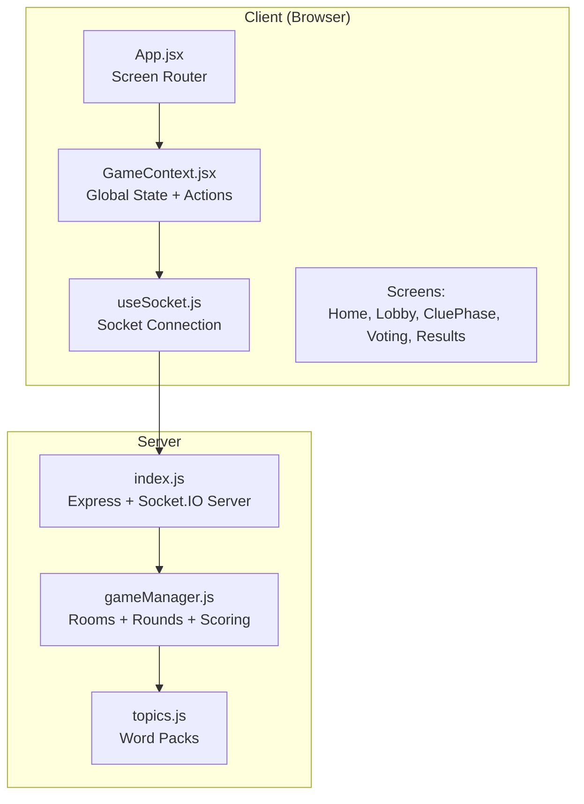
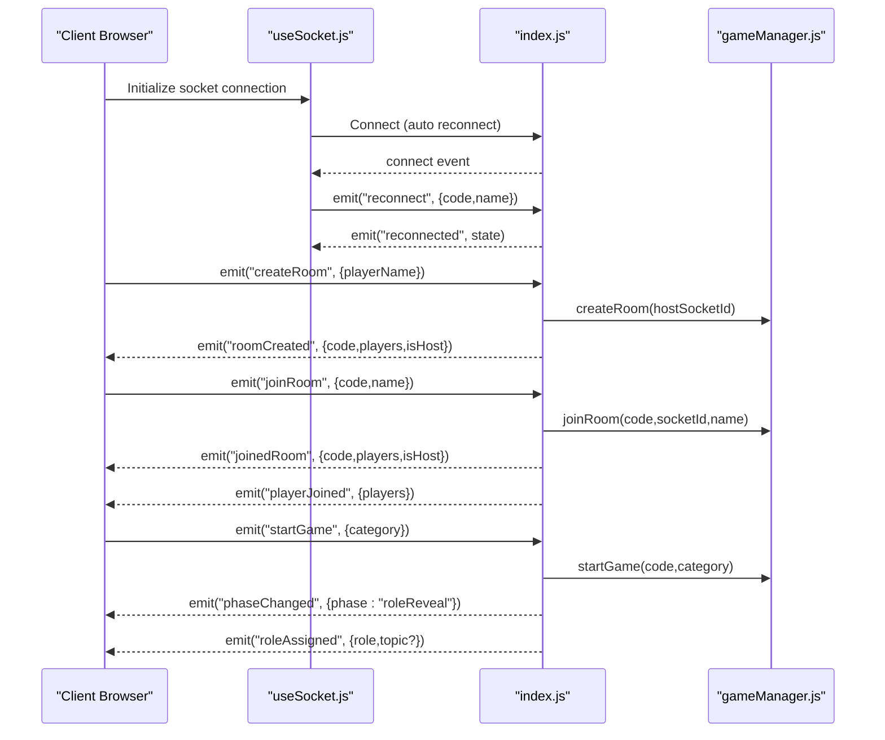
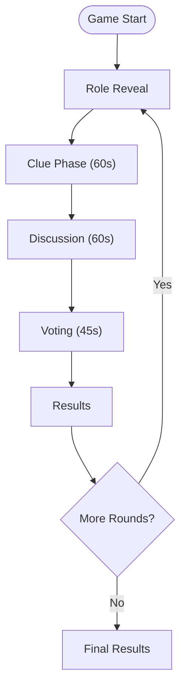
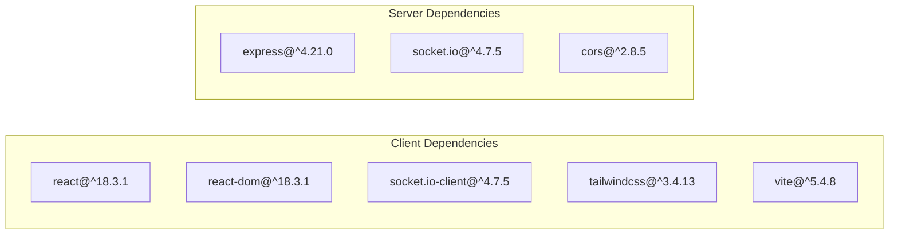

# Project Overview

<cite>
**Referenced Files in This Document**
- [README.md](file://README.md)
- [client/package.json](file://client/package.json)
- [server/package.json](file://server/package.json)
- [client/src/App.jsx](file://client/src/App.jsx)
- [client/src/context/GameContext.jsx](file://client/src/context/GameContext.jsx)
- [client/src/hooks/useSocket.js](file://client/src/hooks/useSocket.js)
- [server/index.js](file://server/index.js)
- [server/gameManager.js](file://server/gameManager.js)
- [server/topics.js](file://server/topics.js)
- [client/src/screens/Home.jsx](file://client/src/screens/Home.jsx)
- [client/src/screens/Lobby.jsx](file://client/src/screens/Lobby.jsx)
- [client/src/screens/CluePhase.jsx](file://client/src/screens/CluePhase.jsx)
- [client/src/screens/Voting.jsx](file://client/src/screens/Voting.jsx)
</cite>

## Table of Contents
1. [Introduction](#introduction)
2. [Project Structure](#project-structure)
3. [Core Components](#core-components)
4. [Architecture Overview](#architecture-overview)
5. [Detailed Component Analysis](#detailed-component-analysis)
6. [Dependency Analysis](#dependency-analysis)
7. [Performance Considerations](#performance-considerations)
8. [Troubleshooting Guide](#troubleshooting-guide)
9. [Conclusion](#conclusion)

## Introduction
Imposter Game is a real-time multiplayer social deduction party game. One player is secretly the imposter while the others attempt to identify them by interpreting one-word clues and debating who is faking it. The game runs across devices and platforms with a modern web stack and provides a smooth, responsive experience on phones, tablets, and desktop browsers.

Key goals:
- Deliver a fun, fast-paced social deduction experience
- Enable seamless cross-device play with real-time synchronization
- Provide a lightweight, scalable architecture suitable for deployment

Target audience:
- Casual gamers and party-goers seeking quick, engaging social experiences
- Teams and groups playing remotely or in-person
- Developers and educators interested in real-time collaboration and event-driven architectures

Core value proposition:
- Real-time multiplayer with minimal friction to start and play
- Cross-platform accessibility via web browsers and mobile devices
- Lightweight, in-memory state management for simplicity and speed
- Built-in resilience with graceful reconnection and host handoff

## Project Structure
The repository is split into two primary packages:
- Frontend (client): React 18 + Vite + Tailwind CSS with Socket.IO client for real-time updates
- Backend (server): Node.js + Express + Socket.IO for game orchestration and state

High-level structure:
- client/src: React screens, context, hooks, and styles
- server: Express server, Socket.IO integration, game state machine, and topic packs

**Diagram sources**
- [client/src/App.jsx:67-100](file://client/src/App.jsx#L67-L100)
- [client/src/context/GameContext.jsx:12-380](file://client/src/context/GameContext.jsx#L12-L380)
- [client/src/hooks/useSocket.js:1-76](file://client/src/hooks/useSocket.js#L1-L76)
- [server/index.js:1-687](file://server/index.js#L1-L687)
- [server/gameManager.js:1-636](file://server/gameManager.js#L1-L636)
- [server/topics.js:1-104](file://server/topics.js#L1-L104)

**Section sources**
- [README.md:81-111](file://README.md#L81-L111)
- [client/package.json:1-26](file://client/package.json#L1-L26)
- [server/package.json:1-16](file://server/package.json#L1-L16)

## Core Components
- Client-side state and actions: centralized in GameContext, exposing reactive state and action methods (createRoom, joinRoom, startGame, submitClue, submitVote, nextRound, playAgain, etc.)
- Real-time connection: managed by a dedicated hook that connects to the server and handles reconnection and session restoration
- Server-side game engine: GameManager orchestrates rooms, players, phases, timers, voting, scoring, and persistence of in-memory state
- Event-driven server: index.js wires Socket.IO events to GameManager methods and broadcasts updates to clients

Practical examples:
- Creating a room: the host emits a create event; the server responds with a unique room code and host privileges
- Starting the game: the host selects a category; the server assigns roles and topics, then advances to role reveal
- Clue submission: players submit one-word clues during the timed clue phase; the server broadcasts received clues
- Voting: players vote for who they suspect; the server tallies votes and applies scoring rules
- Reconnection: if a player loses connectivity, they can reconnect using stored session data and receive a full state snapshot

**Section sources**
- [client/src/context/GameContext.jsx:256-337](file://client/src/context/GameContext.jsx#L256-L337)
- [client/src/hooks/useSocket.js:12-75](file://client/src/hooks/useSocket.js#L12-L75)
- [server/index.js:173-608](file://server/index.js#L173-L608)
- [server/gameManager.js:48-241](file://server/gameManager.js#L48-L241)

## Architecture Overview
The system follows a classic client-server model with real-time bidirectional communication:
- Clients connect to the server via Socket.IO
- The server maintains in-memory rooms and game state
- The server broadcasts events to all clients in a room
- Clients render screens based on the current game phase and state

**Diagram sources**
- [client/src/hooks/useSocket.js:34-72](file://client/src/hooks/useSocket.js#L34-L72)
- [server/index.js:173-297](file://server/index.js#L173-L297)
- [server/gameManager.js:48-241](file://server/gameManager.js#L48-L241)

## Detailed Component Analysis

### Technology Stack
- Frontend: React 18 + Vite + Tailwind CSS
- Backend: Node.js + Express + Socket.IO
- State: In-memory (no database)
- Animations: CSS transitions + canvas-confetti

Environment variables:
- Client: VITE_SERVER_URL pointing to the backend server
- Server: PORT (default 3001)

Deployment targets:
- Server: Railway
- Client: Vercel

**Section sources**
- [README.md:81-86](file://README.md#L81-L86)
- [README.md:48-61](file://README.md#L48-L61)
- [README.md:62-80](file://README.md#L62-L80)
- [client/package.json:12-24](file://client/package.json#L12-L24)
- [server/package.json:10-14](file://server/package.json#L10-L14)

### Game Mechanics and Phases
The game proceeds through a fixed sequence of phases with timers and state transitions:
- Lobby: players join, host selects category, ready to start
- Role Reveal: each player receives their role privately
- Clue Phase (60s): players submit one-word clues
- Discussion (60s): players review clues and debate
- Voting (45s): players vote for the imposter
- Results: staggered reveal of votes and round outcomes
- Final Results: cumulative scores across rounds

Scoring system:
- Players who correctly vote out the imposter: +2 each
- Imposter survives the vote: +3 to the imposter
- Imposter guesses the topic correctly: +1 consolation

**Diagram sources**
- [server/index.js:49-122](file://server/index.js#L49-L122)
- [server/index.js:127-167](file://server/index.js#L127-L167)
- [server/gameManager.js:40-453](file://server/gameManager.js#L40-L453)
- [README.md:40-47](file://README.md#L40-L47)

**Section sources**
- [README.md:27-39](file://README.md#L27-L39)
- [README.md:40-47](file://README.md#L40-L47)
- [server/index.js:49-167](file://server/index.js#L49-L167)
- [server/gameManager.js:316-378](file://server/gameManager.js#L316-L378)

### Multi-Platform Accessibility
- Single-page application built with Vite for rapid development and production builds
- Responsive UI designed for phones, tablets, and desktops
- Real-time communication via WebSocket with polling fallback
- Graceful reconnection with automatic state restoration
- No native app required—works in any modern browser

**Section sources**
- [README.md](file://README.md#L25)
- [client/src/App.jsx:67-100](file://client/src/App.jsx#L67-L100)
- [client/src/hooks/useSocket.js:21-29](file://client/src/hooks/useSocket.js#L21-L29)

### Practical Gameplay Scenarios
- Scenario 1: Host creates a room, invites friends, selects a category, and starts the game. Everyone receives their role privately; the imposter does not see the topic.
- Scenario 2: During the clue phase, players race to submit one-word clues. The server broadcasts clues to all players as they arrive.
- Scenario 3: After voting, the server tallies votes and reveals the outcome. Correct voters gain points; if the imposter survives, they gain bonus points.
- Scenario 4: A player temporarily loses connection; upon reconnection, they receive a full state snapshot and continue playing seamlessly.

**Section sources**
- [client/src/screens/Home.jsx:19-28](file://client/src/screens/Home.jsx#L19-L28)
- [client/src/screens/Lobby.jsx:83-86](file://client/src/screens/Lobby.jsx#L83-L86)
- [client/src/screens/CluePhase.jsx:49-54](file://client/src/screens/CluePhase.jsx#L49-L54)
- [client/src/screens/Voting.jsx:68-71](file://client/src/screens/Voting.jsx#L68-L71)
- [server/index.js:542-608](file://server/index.js#L542-L608)
- [server/gameManager.js:316-378](file://server/gameManager.js#L316-L378)

## Dependency Analysis
Client dependencies:
- React 18, React DOM
- Socket.IO client for real-time communication
- Tailwind CSS for styling
- Vite for build tooling

Server dependencies:
- Express for HTTP routing
- Socket.IO for real-time bidirectional communication
- CORS for cross-origin support

**Diagram sources**
- [client/package.json:12-24](file://client/package.json#L12-L24)
- [server/package.json:10-14](file://server/package.json#L10-L14)

**Section sources**
- [client/package.json:12-24](file://client/package.json#L12-L24)
- [server/package.json:10-14](file://server/package.json#L10-L14)

## Performance Considerations
- In-memory state: efficient for small to medium-scale games; consider persistence for larger deployments
- Minimal server-side computation: timers and voting are handled on the server; clients render UI updates reactively
- Real-time events: keep payloads small (IDs, booleans, short strings) to reduce bandwidth
- Graceful reconnection: reduces churn and improves UX under intermittent network conditions

[No sources needed since this section provides general guidance]

## Troubleshooting Guide
Common issues and resolutions:
- Cannot connect to server: verify VITE_SERVER_URL points to a reachable backend; check firewall and CORS settings
- Room creation fails: ensure the host name is valid and not too long; confirm the server is running
- Joining fails: verify the room code is exactly four uppercase letters; ensure the room is still in the lobby phase
- Voting or clue submission errors: ensure the correct phase is active; check for duplicate submissions
- Reconnection problems: ensure session storage contains room code and player name; verify the server logs for disconnect timers

**Section sources**
- [README.md:48-61](file://README.md#L48-L61)
- [client/src/hooks/useSocket.js:34-72](file://client/src/hooks/useSocket.js#L34-L72)
- [server/index.js:173-248](file://server/index.js#L173-L248)
- [server/index.js:612-676](file://server/index.js#L612-L676)

## Conclusion
Imposter Game delivers a streamlined, real-time social deduction experience with a clean separation between client and server concerns. Its event-driven architecture, combined with React’s declarative UI and Socket.IO’s reliable transport, enables a responsive and accessible multiplayer game that works across devices. The in-memory design keeps the system simple and fast, while the scoring and multi-round structure encourages replayability and strategic play.

[No sources needed since this section summarizes without analyzing specific files]