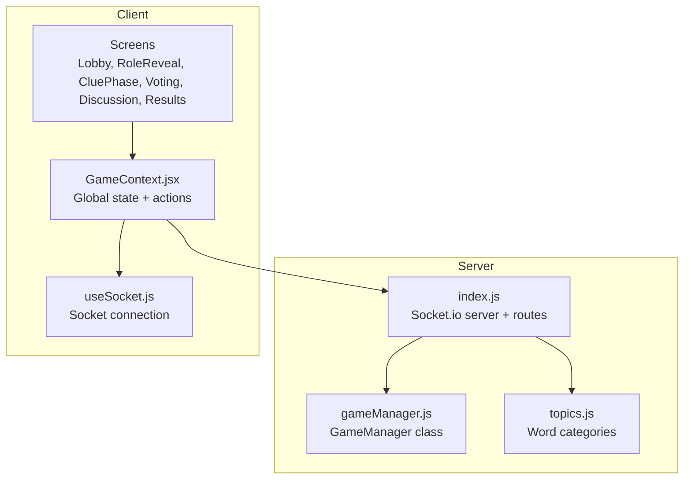
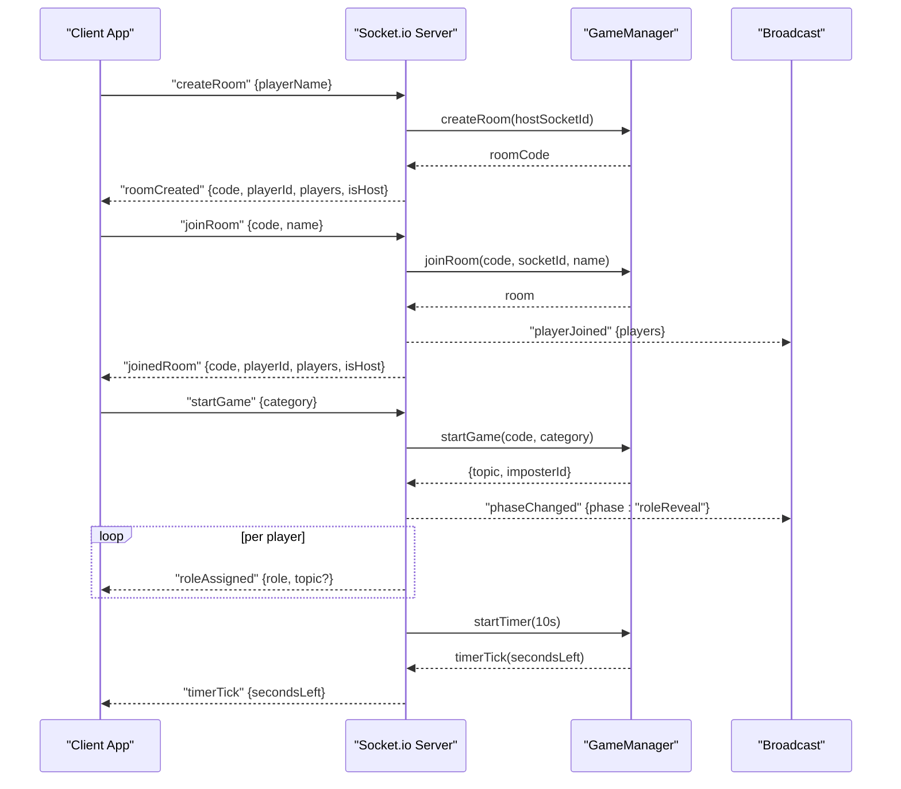
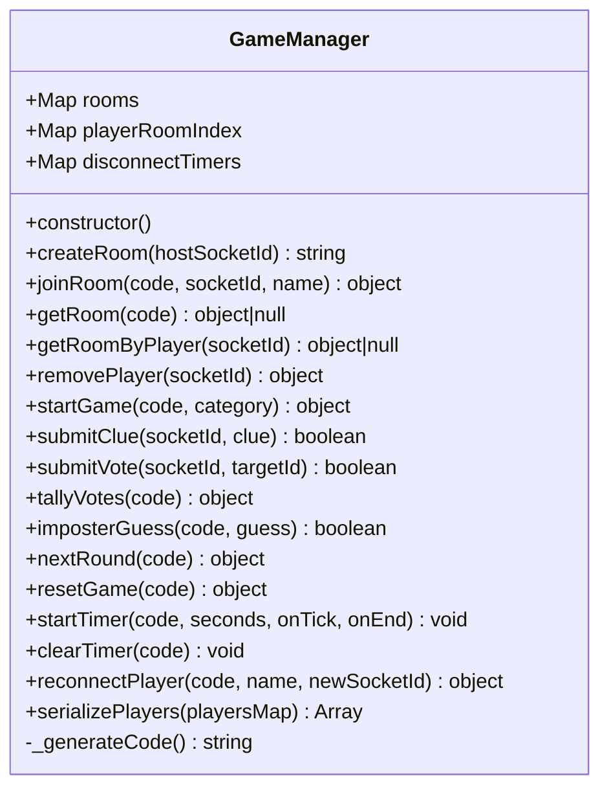
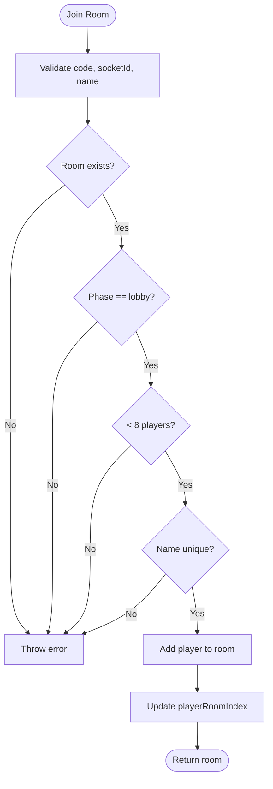
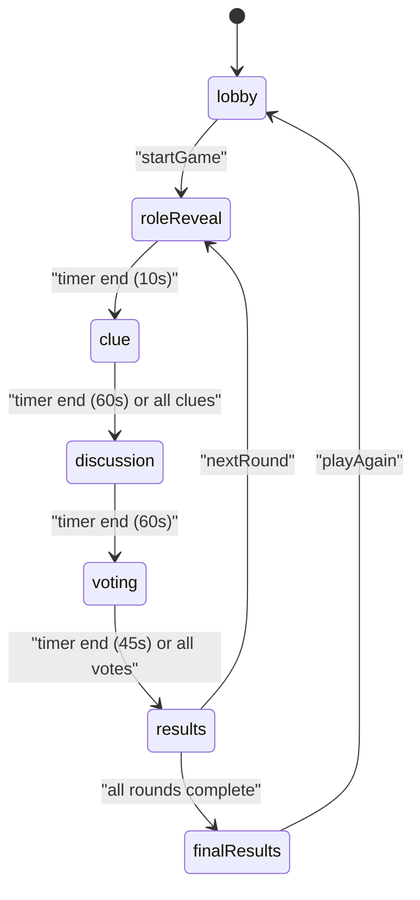
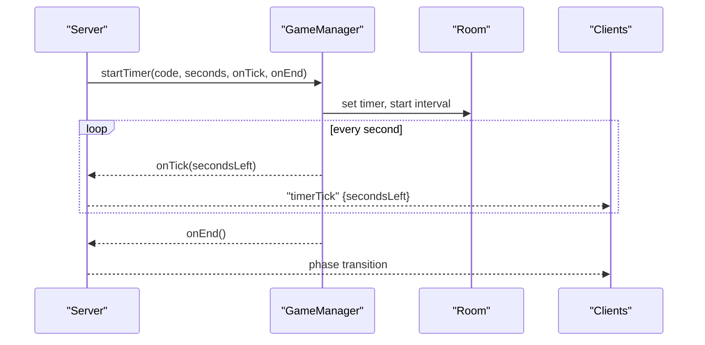
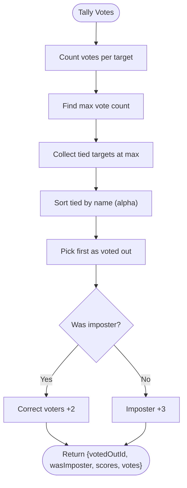
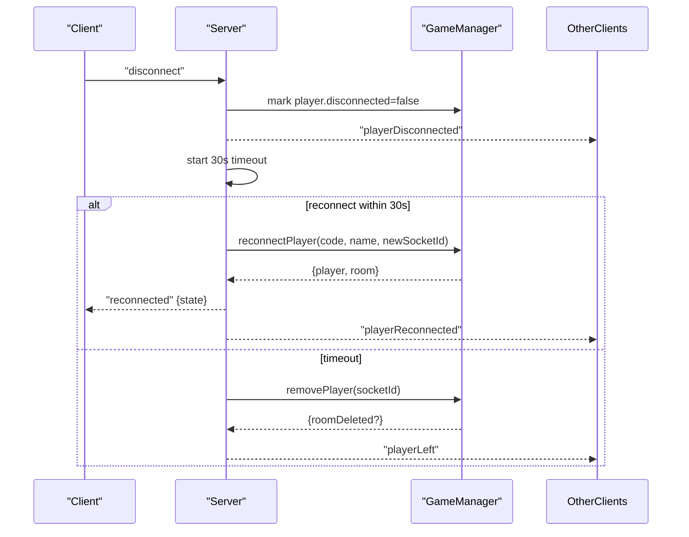
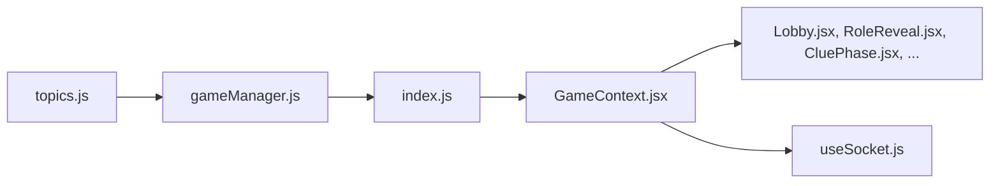

# Game State Management

<cite>
**Referenced Files in This Document**
- [gameManager.js](file://server/gameManager.js)
- [index.js](file://server/index.js)
- [topics.js](file://server/topics.js)
- [GameContext.jsx](file://client/src/context/GameContext.jsx)
- [useSocket.js](file://client/src/hooks/useSocket.js)
- [Lobby.jsx](file://client/src/screens/Lobby.jsx)
- [RoleReveal.jsx](file://client/src/screens/RoleReveal.jsx)
- [CluePhase.jsx](file://client/src/screens/CluePhase.jsx)
- [README.md](file://README.md)
</cite>

## Table of Contents
1. [Introduction](#introduction)
2. [Project Structure](#project-structure)
3. [Core Components](#core-components)
4. [Architecture Overview](#architecture-overview)
5. [Detailed Component Analysis](#detailed-component-analysis)
6. [Dependency Analysis](#dependency-analysis)
7. [Performance Considerations](#performance-considerations)
8. [Troubleshooting Guide](#troubleshooting-guide)
9. [Conclusion](#conclusion)

## Introduction
This document explains the GameManager class and its role in managing game state for the Imposter Game. It covers room lifecycle management, player state tracking, game phase transitions, timer coordination, scoring and vote tallying, round progression, error handling, state validation, recovery for disconnected players, and serialization patterns used for client-server communication.

## Project Structure
The project consists of a Node.js/Express + Socket.io server and a React/Vite client. The server encapsulates all game logic in a single GameManager class and exposes real-time events consumed by the client.

**Diagram sources**
- [index.js:1-687](file://server/index.js#L1-L687)
- [gameManager.js:1-636](file://server/gameManager.js#L1-L636)
- [topics.js:1-104](file://server/topics.js#L1-L104)
- [GameContext.jsx:1-383](file://client/src/context/GameContext.jsx#L1-L383)
- [useSocket.js:1-76](file://client/src/hooks/useSocket.js#L1-L76)

**Section sources**
- [README.md:88-111](file://README.md#L88-L111)

## Core Components
- GameManager: Central state machine managing rooms, players, phases, timers, votes, and scoring.
- Socket.io server: Bridges client events to GameManager and broadcasts state updates.
- Client GameContext: Maintains UI state and orchestrates actions via Socket events.

Key responsibilities:
- Room lifecycle: create, join, remove players, delete room.
- Player state: id, name, score, connected, vote, clue.
- Phases: lobby, roleReveal, clue, discussion, voting, results, finalResults.
- Timers: per-phase countdowns with tick and end callbacks.
- Scoring: vote-based outcomes and tie-breaking.
- Serialization: converting internal Maps to arrays for client transport.

**Section sources**
- [gameManager.js:9-636](file://server/gameManager.js#L9-L636)
- [index.js:173-676](file://server/index.js#L173-L676)
- [GameContext.jsx:12-383](file://client/src/context/GameContext.jsx#L12-L383)

## Architecture Overview
The server exposes Socket.io events that the client listens to. GameManager handles all game logic and emits structured events for UI updates.

**Diagram sources**
- [index.js:178-297](file://server/index.js#L178-L297)
- [gameManager.js:53-90](file://server/gameManager.js#L53-L90)
- [gameManager.js:99-136](file://server/gameManager.js#L99-L136)
- [gameManager.js:213-241](file://server/gameManager.js#L213-L241)

## Detailed Component Analysis

### GameManager Class
GameManager is the core state machine. It maintains:
- Rooms: Map of roomCode to room object.
- Player index: Map of socketId to roomCode for quick lookup.
- Disconnect timers: Map of socketId to timeoutId for graceful reconnection.

Room object fields:
- code, hostId, players (Map), category, currentRound, totalRounds, phase, topic, imposterId, timer, timerInterval, votes (Map).

Player object fields:
- id, name, score, connected, vote, clue.

**Diagram sources**
- [gameManager.js:9-636](file://server/gameManager.js#L9-L636)

**Section sources**
- [gameManager.js:9-636](file://server/gameManager.js#L9-L636)

### Room Lifecycle Management
- Create room: Generates a unique 4-letter uppercase code, initializes a room with host as first player, sets phase to lobby.
- Join room: Validates room exists, phase is lobby, capacity, and name uniqueness; adds player to room.
- Remove player: Removes player from room; if host leaves, assigns next player as host; if room empty, deletes it.

**Diagram sources**
- [gameManager.js:99-136](file://server/gameManager.js#L99-L136)

**Section sources**
- [gameManager.js:53-90](file://server/gameManager.js#L53-L90)
- [gameManager.js:99-136](file://server/gameManager.js#L99-L136)
- [gameManager.js:165-201](file://server/gameManager.js#L165-L201)

### Player State Tracking
- Connection status: tracked per player; disconnect triggers a 30-second grace period.
- Roles: imposterId identifies the imposter; role is sent privately to each player after startGame.
- Scores: accumulated per round; reset on resetGame.

Serialization for client:
- serializePlayers converts the players Map to a plain array containing id, name, score, connected, clue.

**Section sources**
- [gameManager.js:76-83](file://server/gameManager.js#L76-L83)
- [gameManager.js:620-632](file://server/gameManager.js#L620-L632)
- [index.js:265-271](file://server/index.js#L265-L271)

### Game Phase Transitions
Phases in order: lobby, roleReveal, clue, discussion, voting, results, finalResults.

Server-managed transitions:
- roleReveal: 10s timer after startGame; advances to clue automatically.
- clue: 60s timer; advances to discussion when time ends or all clues received.
- discussion: 60s timer; advances to voting when time ends.
- voting: 45s timer; tallies votes and advances to results.
- results: displays outcome; host triggers nextRound or playAgain.
- finalResults: computed winner based on total scores.

**Diagram sources**
- [index.js:49-122](file://server/index.js#L49-L122)
- [index.js:127-167](file://server/index.js#L127-L167)
- [index.js:446-511](file://server/index.js#L446-L511)
- [index.js:515-538](file://server/index.js#L515-L538)

**Section sources**
- [index.js:49-122](file://server/index.js#L49-L122)
- [index.js:127-167](file://server/index.js#L127-L167)
- [index.js:446-511](file://server/index.js#L446-L511)
- [index.js:515-538](file://server/index.js#L515-L538)

### Timer Management System
- startTimer: clears existing timer, sets seconds, starts interval ticking onTick every second until onEnd fires.
- clearTimer: stops interval and resets timer fields.
- Server triggers timers for each phase and broadcasts timerTick to the room.

**Diagram sources**
- [gameManager.js:495-531](file://server/gameManager.js#L495-L531)
- [index.js:56-65](file://server/index.js#L56-L65)
- [index.js:87-96](file://server/index.js#L87-L96)
- [index.js:112-121](file://server/index.js#L112-L121)

**Section sources**
- [gameManager.js:495-531](file://server/gameManager.js#L495-L531)
- [index.js:49-122](file://server/index.js#L49-L122)

### Scoring Algorithm and Vote Tallying
- Vote tally: counts votes per target; ties broken by alphabetical order of player names.
- Scoring rules:
  - If imposter was caught: correct voters (+2), imposter survives (+3).
  - If imposter survives: imposter (+3).
  - Imposter guess: +1 consolation if correct.
- Per-round state cleared: votes, clues, and per-player vote/clue fields.

**Diagram sources**
- [gameManager.js:316-378](file://server/gameManager.js#L316-L378)

**Section sources**
- [gameManager.js:316-378](file://server/gameManager.js#L316-L378)
- [README.md:40-47](file://README.md#L40-L47)

### Round Progression Logic
- nextRound increments currentRound; if rounds exceed totalRounds, sets phase to finalResults.
- Otherwise, selects new topic and a new imposter (tries to avoid same imposter).
- Clears per-round state and starts roleReveal with a 10s timer.

**Section sources**
- [gameManager.js:410-453](file://server/gameManager.js#L410-L453)

### Error Handling, Validation, and Recovery
- Validation: checks for missing params, invalid room, phase restrictions, capacity limits, name uniqueness, self-vote.
- Graceful disconnect: marks player disconnected, notifies others, starts 30s timeout; removes player if not reconnected.
- Reconnection: replaces socketId, preserves role/topic if applicable, updates votes referencing old id, cancels disconnect timer.

**Diagram sources**
- [index.js:612-675](file://server/index.js#L612-L675)
- [gameManager.js:544-609](file://server/gameManager.js#L544-L609)

**Section sources**
- [index.js:612-675](file://server/index.js#L612-L675)
- [gameManager.js:544-609](file://server/gameManager.js#L544-L609)

### Serialization Methods and State Synchronization
- serializePlayers: converts players Map to array for client transport.
- Server emits structured events with snapshots of state (players, clues, votes, scores).
- Client persists roomCode and playerName in sessionStorage to support automatic reconnection.

**Section sources**
- [gameManager.js:620-632](file://server/gameManager.js#L620-L632)
- [index.js:41-43](file://server/index.js#L41-L43)
- [index.js:560-587](file://server/index.js#L560-L587)
- [useSocket.js:40-44](file://client/src/hooks/useSocket.js#L40-L44)

## Dependency Analysis
- GameManager depends on topics for category selection.
- index.js orchestrates Socket.io events and delegates to GameManager.
- Client GameContext coordinates UI state and dispatches actions via Socket events.

**Diagram sources**
- [topics.js:1-104](file://server/topics.js#L1-L104)
- [gameManager.js:1-636](file://server/gameManager.js#L1-L636)
- [index.js:1-687](file://server/index.js#L1-L687)
- [GameContext.jsx:1-383](file://client/src/context/GameContext.jsx#L1-L383)
- [useSocket.js:1-76](file://client/src/hooks/useSocket.js#L1-L76)

**Section sources**
- [topics.js:1-104](file://server/topics.js#L1-L104)
- [index.js:1-687](file://server/index.js#L1-L687)

## Performance Considerations
- In-memory storage: efficient for small to medium deployments; consider persistence for production.
- Timer intervals: ensure cleanup via clearTimer to prevent memory leaks.
- Event broadcasting: minimize payload sizes; serialize only necessary fields.
- Client reconnection: use sessionStorage to reduce redundant joins.

## Troubleshooting Guide
Common issues and remedies:
- Room not found: verify room code and that the room exists.
- Cannot join: ensure phase is lobby, capacity < 8, and name is unique.
- Vote errors: ensure voting phase, target is a valid player, and self-vote is prevented.
- Timer not updating: confirm startTimer invoked and no lingering intervals.
- Disconnected player not removed: check 30s grace period and disconnectTimers cleanup.

**Section sources**
- [gameManager.js:104-113](file://server/gameManager.js#L104-L113)
- [gameManager.js:284-307](file://server/gameManager.js#L284-L307)
- [index.js:636-671](file://server/index.js#L636-L671)

## Conclusion
GameManager centralizes all game logic, ensuring predictable state transitions, robust error handling, and seamless client-server synchronization. The modular design allows straightforward extension for new categories, phases, or scoring rules.