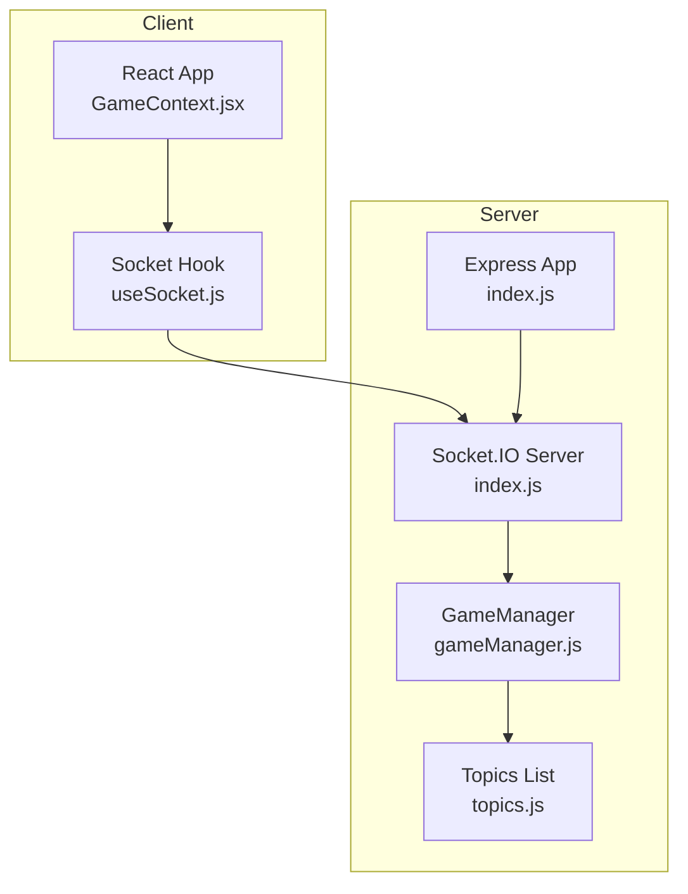
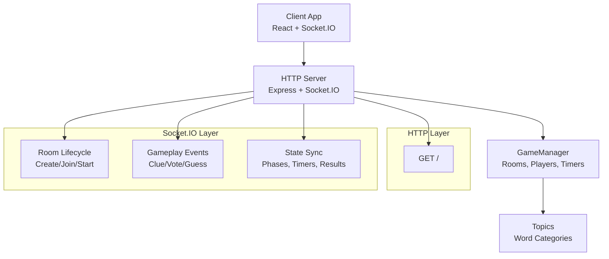
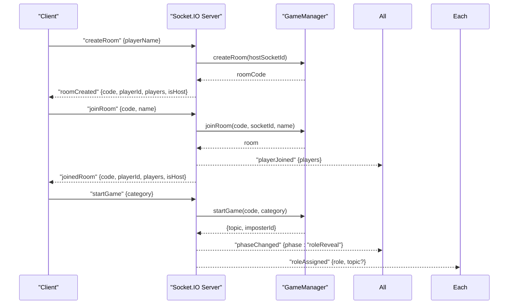
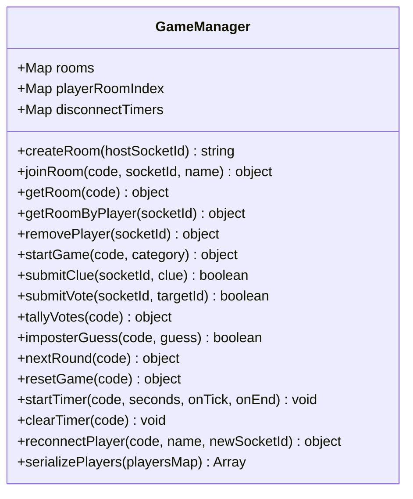
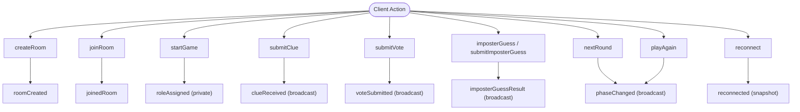
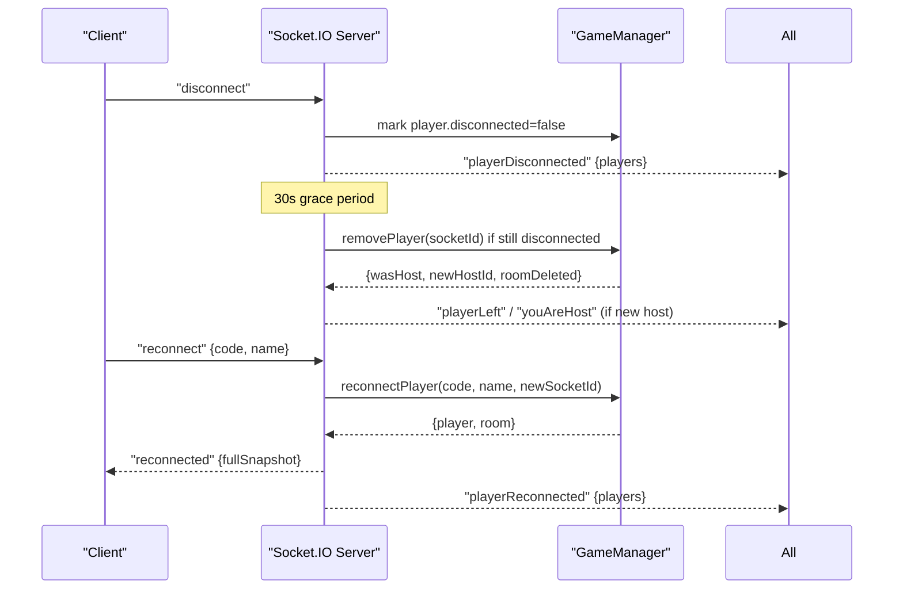
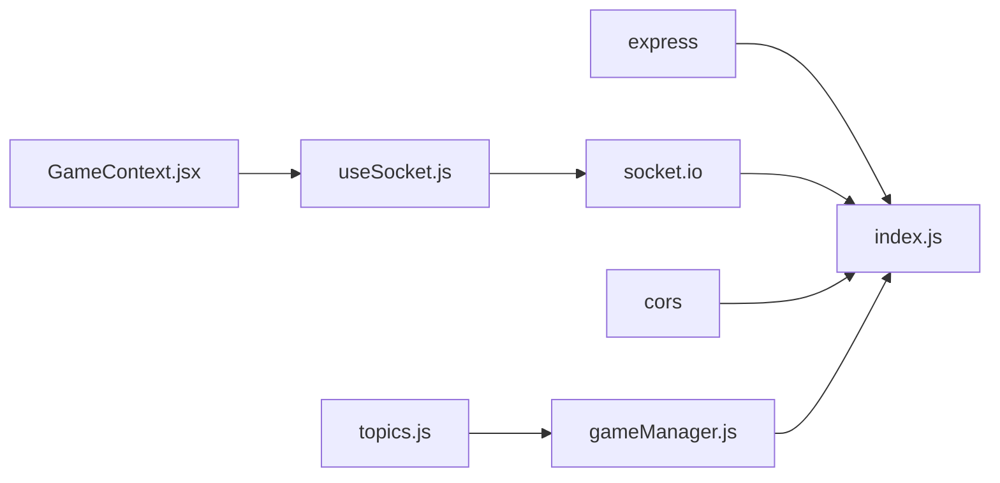

# Server Architecture

<cite>
**Referenced Files in This Document**
- [index.js](file://server/index.js)
- [gameManager.js](file://server/gameManager.js)
- [topics.js](file://server/topics.js)
- [package.json](file://server/package.json)
- [useSocket.js](file://client/src/hooks/useSocket.js)
- [GameContext.jsx](file://client/src/context/GameContext.jsx)
- [README.md](file://README.md)
</cite>

## Table of Contents
1. [Introduction](#introduction)
2. [Project Structure](#project-structure)
3. [Core Components](#core-components)
4. [Architecture Overview](#architecture-overview)
5. [Detailed Component Analysis](#detailed-component-analysis)
6. [Dependency Analysis](#dependency-analysis)
7. [Performance Considerations](#performance-considerations)
8. [Security Considerations](#security-considerations)
9. [Troubleshooting Guide](#troubleshooting-guide)
10. [Conclusion](#conclusion)

## Introduction
This document describes the server architecture for the Imposter Game backend. It covers Express server initialization, Socket.IO configuration, CORS settings, the GameManager class that manages game state and room lifecycle, the topics.js module that supplies word categories, and the real-time event handling protocol between server and clients. It also documents the health check REST endpoint, WebSocket connection management, error handling, and performance and security considerations.

## Project Structure
The server is a small, focused Node.js service built with Express and Socket.IO. The client is a React application that connects via Socket.IO to the server. The server exposes a single health check endpoint and handles all game logic and real-time events.

**Diagram sources**
- [index.js:14-25](file://server/index.js#L14-L25)
- [index.js:27](file://server/index.js#L27)
- [gameManager.js:4](file://server/gameManager.js#L4)
- [topics.js:4](file://server/topics.js#L4)
- [useSocket.js:21-29](file://client/src/hooks/useSocket.js#L21-L29)
- [GameContext.jsx:12](file://client/src/context/GameContext.jsx#L12)

**Section sources**
- [README.md:88-111](file://README.md#L88-L111)
- [package.json:10-14](file://server/package.json#L10-L14)

## Core Components
- Express server and HTTP server creation
- Socket.IO server with CORS configuration
- GameManager singleton managing rooms, players, timers, and game flow
- Topics module providing word lists by category
- Health check REST endpoint

Key responsibilities:
- index.js initializes Express, Socket.IO, and routes all server-side events
- gameManager.js encapsulates all game state and logic
- topics.js provides curated word lists for gameplay
- The client connects via Socket.IO and receives state updates

**Section sources**
- [index.js:14-25](file://server/index.js#L14-L25)
- [index.js:27](file://server/index.js#L27)
- [gameManager.js:9-17](file://server/gameManager.js#L9-L17)
- [topics.js:4](file://server/topics.js#L4)

## Architecture Overview
The server uses a layered architecture:
- HTTP layer: Express app with a health check endpoint
- Real-time layer: Socket.IO server handling bidirectional events
- Game engine: GameManager orchestrating rooms, phases, timers, and scoring
- Content layer: topics.js supplying game content

**Diagram sources**
- [index.js:14-35](file://server/index.js#L14-L35)
- [index.js:173-676](file://server/index.js#L173-L676)
- [gameManager.js:48-482](file://server/gameManager.js#L48-L482)
- [topics.js:4](file://server/topics.js#L4)

## Detailed Component Analysis

### Express Server Initialization and CORS
- Express app is created and JSON body parsing is enabled
- CORS is enabled globally with default behavior
- HTTP server wraps the Express app
- Socket.IO server is attached to the HTTP server with CORS allowing GET and POST from any origin

Operational notes:
- The CORS configuration allows broad access for development and deployment convenience
- The health check endpoint responds with server status and live room count

**Section sources**
- [index.js:14-16](file://server/index.js#L14-L16)
- [index.js:20-25](file://server/index.js#L20-L25)
- [index.js:33-35](file://server/index.js#L33-L35)

### Socket.IO Configuration and Event Handling
- Connection lifecycle: on connection, join room, start game, submit clues/votes, imposter guess, next round, play again, reconnect, disconnect
- Private vs broadcast events:
  - Private: roleAssigned
  - Broadcast: phaseChanged, timerTick, clueReceived, voteSubmitted, roundResult, gameOver, playerDisconnected, playerReconnected, imposterGuessResult, youAreHost
- Graceful disconnect handling with 30-second timeout before removing players
- Reconnection restores state snapshot and updates host/imposter references if applicable

**Diagram sources**
- [index.js:173-297](file://server/index.js#L173-L297)
- [gameManager.js:53-90](file://server/gameManager.js#L53-L90)
- [gameManager.js:99-136](file://server/gameManager.js#L99-L136)
- [gameManager.js:213-241](file://server/gameManager.js#L213-L241)

**Section sources**
- [index.js:173-676](file://server/index.js#L173-L676)

### GameManager Class Structure and Responsibilities
GameManager is a central state machine managing:
- Room lifecycle: create, join, remove, reset
- Player management: add/remove/update, host assignment, disconnect/reconnect
- Game flow: phases, timers, clue submission, voting, tallying, next round, final results
- Scoring: tie-breaking, point allocation
- Content: selecting topic and imposter from topics.js

**Diagram sources**
- [gameManager.js:9-636](file://server/gameManager.js#L9-L636)

Key behaviors:
- Room creation generates a unique 4-letter uppercase code
- Player joins enforce lobby-only, capacity limits, and name uniqueness
- Timers are server-side with periodic ticks and automatic advancement
- Voting uses majority with alphabetical tie-break
- Imposter guess awards consolation points when correct
- Reconnection preserves roles and updates internal references

**Section sources**
- [gameManager.js:23-42](file://server/gameManager.js#L23-L42)
- [gameManager.js:99-136](file://server/gameManager.js#L99-L136)
- [gameManager.js:213-241](file://server/gameManager.js#L213-L241)
- [gameManager.js:249-276](file://server/gameManager.js#L249-L276)
- [gameManager.js:284-307](file://server/gameManager.js#L284-L307)
- [gameManager.js:316-378](file://server/gameManager.js#L316-L378)
- [gameManager.js:387-403](file://server/gameManager.js#L387-L403)
- [gameManager.js:410-453](file://server/gameManager.js#L410-L453)
- [gameManager.js:461-482](file://server/gameManager.js#L461-L482)
- [gameManager.js:495-531](file://server/gameManager.js#L495-L531)
- [gameManager.js:544-609](file://server/gameManager.js#L544-L609)
- [gameManager.js:620-632](file://server/gameManager.js#L620-L632)

### Topics Module
The topics.js module exports three categories of word lists:
- general: everyday nouns suitable for broad audiences
- family: child-friendly scenarios and activities
- adult: mature themes and social situations

These lists are consumed by GameManager during game start to select a topic and by clients to render role reveals appropriately.

**Section sources**
- [topics.js:4](file://server/topics.js#L4-L103)

### Real-Time Communication Protocols and State Synchronization
- Phases: lobby, roleReveal, clue, discussion, voting, results, finalResults
- Timers: server-driven countdowns with per-second ticks
- State snapshots: reconnection sends a full snapshot including phase, players, roles, clues (when applicable)
- Broadcast vs private:
  - Private: roleAssigned
  - Broadcast: phaseChanged, timerTick, clueReceived, voteSubmitted, roundResult, gameOver, playerDisconnected, playerReconnected, imposterGuessResult

**Diagram sources**
- [index.js:173-676](file://server/index.js#L173-L676)
- [GameContext.jsx:70-254](file://client/src/context/GameContext.jsx#L70-L254)

**Section sources**
- [index.js:173-676](file://server/index.js#L173-L676)
- [GameContext.jsx:70-254](file://client/src/context/GameContext.jsx#L70-L254)

### REST Endpoint: Health Check
- Path: GET /
- Purpose: Basic liveness probe returning server status and number of active rooms
- Typical response: { status: "ok", rooms: N }

**Section sources**
- [index.js:33-35](file://server/index.js#L33-L35)

### WebSocket Connection Management
- Connection lifecycle:
  - connect: initialize state and optionally reconnect if session data exists
  - disconnect: mark player as disconnected and schedule removal after 30 seconds
  - reconnect: restore session snapshot and update internal references
- Reconnection logic:
  - Validates room existence and player identity by name
  - Updates host/imposter references if applicable
  - Replays votes that referenced old socket IDs
  - Cancels disconnect timer upon successful reconnection

**Diagram sources**
- [index.js:612-676](file://server/index.js#L612-L676)
- [gameManager.js:544-609](file://server/gameManager.js#L544-L609)

**Section sources**
- [index.js:612-676](file://server/index.js#L612-L676)
- [gameManager.js:544-609](file://server/gameManager.js#L544-L609)

## Dependency Analysis
External dependencies:
- Express: HTTP server and middleware
- Socket.IO: Real-time bidirectional communication
- Cors: Cross-origin resource sharing

Internal dependencies:
- index.js depends on GameManager and topics.js indirectly via GameManager
- gameManager.js depends on topics.js for content
- Client depends on socket.io-client and uses the server’s Socket.IO interface

**Diagram sources**
- [package.json:10-14](file://server/package.json#L10-L14)
- [index.js:8](file://server/index.js#L8)
- [gameManager.js:4](file://server/gameManager.js#L4)
- [useSocket.js:2](file://client/src/hooks/useSocket.js#L2)

**Section sources**
- [package.json:10-14](file://server/package.json#L10-L14)
- [index.js:8](file://server/index.js#L8)
- [gameManager.js:4](file://server/gameManager.js#L4)

## Performance Considerations
- In-memory state: Rooms and players are stored in Maps; this avoids persistence overhead but requires careful cleanup on disconnects and room deletion
- Timers: Server-side intervals are used; ensure intervals are cleared on room deletion and transitions to prevent memory leaks
- Broadcast efficiency: Broadcasting to a room uses Socket.IO rooms; keep messages minimal and targeted
- Reconnection: Graceful disconnects reduce churn; ensure disconnect timers are cleaned up on reconnect
- Scalability: Current design is single-process; consider clustering or scaling out if traffic grows

[No sources needed since this section provides general guidance]

## Security Considerations
- CORS: Broad origin '*' is configured; in production, restrict origins to your deployed client domains
- Authentication: No authentication is enforced; ensure the game runs in trusted environments or add authentication as needed
- Input validation: Client inputs are validated on the server (names, clues, votes); continue enforcing length and presence checks
- Host privileges: Host-only actions (start game, next round, play again) are guarded by hostId checks
- Error propagation: Errors are emitted back to clients; avoid leaking sensitive server details in error messages

**Section sources**
- [index.js:20-25](file://server/index.js#L20-L25)
- [index.js:252-296](file://server/index.js#L252-L296)
- [index.js:446-511](file://server/index.js#L446-L511)
- [index.js:515-538](file://server/index.js#L515-L538)

## Troubleshooting Guide
Common issues and remedies:
- Room creation fails: Verify host socket ID and uniqueness of room code
- Join fails: Ensure room exists, is in lobby, has capacity, and name is unique
- Start game fails: Confirm minimum player count, category validity, and host privileges
- Clue submission errors: Validate clue length and phase
- Vote errors: Ensure voting phase, valid target, and self-vote prevention
- Disconnect/reconnect anomalies: Check disconnect timers and reconnection snapshot logic
- Health check failing: Verify server startup and port binding

Operational logs:
- Server logs indicate room creation, joins, starts, phases, and disconnects
- Client logs show connection/disconnection and reconnection attempts

**Section sources**
- [index.js:178-210](file://server/index.js#L178-L210)
- [index.js:214-248](file://server/index.js#L214-L248)
- [index.js:252-297](file://server/index.js#L252-L297)
- [index.js:314-347](file://server/index.js#L314-L347)
- [index.js:377-405](file://server/index.js#L377-L405)
- [index.js:410-442](file://server/index.js#L410-L442)
- [index.js:446-538](file://server/index.js#L446-L538)
- [index.js:542-608](file://server/index.js#L542-L608)
- [index.js:612-676](file://server/index.js#L612-L676)

## Conclusion
The Imposter Game server is a compact, real-time system built around Express and Socket.IO. GameManager centralizes all game logic, while topics.js supplies curated content. The architecture cleanly separates concerns between HTTP health checks, real-time events, and state management. With careful attention to CORS, input validation, and graceful disconnect handling, the system provides a responsive multiplayer experience suitable for deployment.