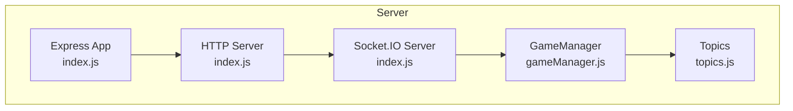
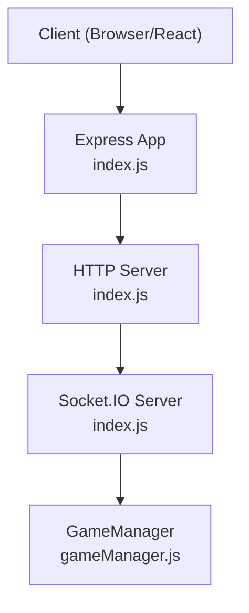
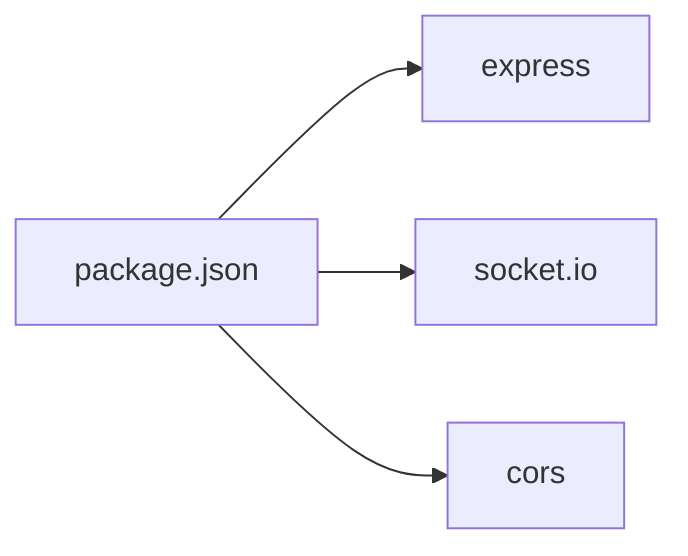
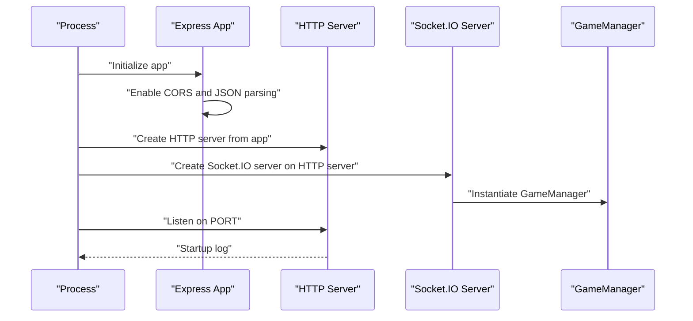

# Server Setup and Configuration

<cite>
**Referenced Files in This Document**
- [index.js](file://server/index.js)
- [package.json](file://server/package.json)
- [gameManager.js](file://server/gameManager.js)
- [topics.js](file://server/topics.js)
- [README.md](file://README.md)
</cite>

## Table of Contents
1. [Introduction](#introduction)
2. [Project Structure](#project-structure)
3. [Core Components](#core-components)
4. [Architecture Overview](#architecture-overview)
5. [Detailed Component Analysis](#detailed-component-analysis)
6. [Dependency Analysis](#dependency-analysis)
7. [Performance Considerations](#performance-considerations)
8. [Troubleshooting Guide](#troubleshooting-guide)
9. [Conclusion](#conclusion)
10. [Appendices](#appendices)

## Introduction
This document explains the server setup and configuration for the Imposter Game backend. It covers Express server initialization, HTTP server creation, Socket.IO configuration with CORS, middleware configuration, environment variable handling, server startup, health checks, lifecycle management, graceful shutdown strategies, error handling, monitoring, and production deployment considerations.

## Project Structure
The server component consists of:
- An Express application with middleware
- An HTTP server wrapping the Express app
- A Socket.IO server configured with CORS
- A game manager module managing rooms, players, timers, and game flow
- A topics module providing categories of words for gameplay

**Diagram sources**
- [index.js:14-25](file://server/index.js#L14-L25)
- [index.js:27](file://server/index.js#L27)
- [gameManager.js:9-17](file://server/gameManager.js#L9-L17)
- [topics.js:4-103](file://server/topics.js#L4-L103)

**Section sources**
- [README.md:88-111](file://README.md#L88-L111)
- [package.json:1-16](file://server/package.json#L1-L16)

## Core Components
- Express app with CORS and JSON middleware
- HTTP server created from the Express app
- Socket.IO server bound to the HTTP server with CORS configuration
- GameManager singleton managing rooms, timers, and game state
- Topics module providing word lists by category

Key responsibilities:
- Initialize Express app and apply middleware
- Configure Socket.IO with CORS allowing GET/POST
- Expose a health check endpoint returning server status and room count
- Manage server startup on configurable port
- Handle Socket.IO events and delegate to GameManager

**Section sources**
- [index.js:14-25](file://server/index.js#L14-L25)
- [index.js:33-35](file://server/index.js#L33-L35)
- [index.js:682-686](file://server/index.js#L682-L686)
- [gameManager.js:9-17](file://server/gameManager.js#L9-L17)
- [topics.js:4-103](file://server/topics.js#L4-L103)

## Architecture Overview
The server initializes an Express app, wraps it in an HTTP server, and mounts Socket.IO on top. GameManager orchestrates game logic and state. The health check endpoint reports runtime status.

**Diagram sources**
- [index.js:14-25](file://server/index.js#L14-L25)
- [index.js:173-676](file://server/index.js#L173-L676)
- [gameManager.js:9-17](file://server/gameManager.js#L9-L17)

## Detailed Component Analysis

### Express Initialization and Middleware
- Express app is created and CORS is enabled globally.
- JSON body parsing is enabled for incoming requests.
- These middleware layers prepare the app to receive HTTP requests and parse JSON payloads.

Security and behavior implications:
- Global CORS allows cross-origin requests from any origin for GET/POST.
- JSON parsing is essential for handling POST bodies from clients.

**Section sources**
- [index.js:14-16](file://server/index.js#L14-L16)

### HTTP Server Creation
- The HTTP server is created from the Express app.
- This server is passed to Socket.IO to enable WebSocket transport.

Operational note:
- The HTTP server is separate from the Socket.IO server instance, which is mounted on top of the HTTP server.

**Section sources**
- [index.js:18](file://server/index.js#L18)

### Socket.IO Configuration and CORS
- Socket.IO is instantiated with an explicit CORS configuration:
  - origin: wildcard allowing any origin
  - methods: GET and POST
- This enables clients from different origins to connect and communicate via Socket.IO.

Security consideration:
- Wildcard origin is convenient for development and demos but should be restricted in production deployments.

**Section sources**
- [index.js:20-25](file://server/index.js#L20-L25)

### Health Check Endpoint
- A GET route at the root returns a simple JSON payload indicating server status and the number of active rooms.
- This endpoint is useful for monitoring and readiness checks.

**Section sources**
- [index.js:33-35](file://server/index.js#L33-L35)

### Server Startup and Port Configuration
- The server listens on a port derived from the PORT environment variable, defaulting to 3001 if not set.
- The server logs a startup message upon successful listen.

Deployment note:
- Railway and other platforms typically set PORT automatically.

**Section sources**
- [index.js:682-686](file://server/index.js#L682-L686)
- [README.md:52-54](file://README.md#L52-L54)

### Socket.IO Event Handlers and Lifecycle
- Connection lifecycle:
  - On connection, the server logs the socket ID.
  - On disconnect, the server marks the player as disconnected and schedules a 30-second grace period before removing the player if they do not reconnect.
- Room lifecycle:
  - Create room: Host creates a room and sets the host’s display name.
  - Join room: Validates code and name length, prevents duplicates, and notifies other players.
  - Start game: Host triggers game start, assigns roles privately, and advances to the clue phase after a short reveal.
  - Manual phase advancement: Host can advance to clue, discussion, or voting phases.
  - Clue submission: Validates and records clues; advances automatically when all players submit.
  - Voting: Records votes; tallies and reveals results automatically when all players vote.
  - Imposter guess: Validates imposter guess and emits correctness.
  - Next round: Host advances rounds or ends the game.
  - Play again: Resets the game to lobby.
  - Reconnect: Restores player session with current game state snapshot.
- Graceful disconnection:
  - Disconnect handler marks the player as disconnected and schedules a 30-second removal timer.
  - If the player reconnects during the grace period, the timer is cleared and the session is restored.

Error handling:
- All event handlers wrap logic in try/catch blocks and emit error messages to the client.
- Validation errors are surfaced to clients via callbacks and error events.

**Section sources**
- [index.js:173-676](file://server/index.js#L173-L676)

### GameManager Responsibilities
- Room management:
  - Generates unique 4-letter uppercase room codes.
  - Enforces room capacity and lobby-only joins.
  - Tracks host, players, and per-round state.
- Game flow:
  - Starts games with category selection and random topic/imposter assignment.
  - Manages phases: clue, discussion, voting, results, final results.
  - Implements scoring rules and tie-breaking.
- Timers:
  - Provides server-side countdown timers with tick callbacks and automatic end triggers.
- Reconnection:
  - Supports restoring sessions with updated socket IDs and updating internal references.

**Section sources**
- [gameManager.js:23-90](file://server/gameManager.js#L23-L90)
- [gameManager.js:99-136](file://server/gameManager.js#L99-L136)
- [gameManager.js:213-241](file://server/gameManager.js#L213-L241)
- [gameManager.js:249-276](file://server/gameManager.js#L249-L276)
- [gameManager.js:284-307](file://server/gameManager.js#L284-L307)
- [gameManager.js:316-378](file://server/gameManager.js#L316-L378)
- [gameManager.js:387-403](file://server/gameManager.js#L387-L403)
- [gameManager.js:410-453](file://server/gameManager.js#L410-L453)
- [gameManager.js:461-482](file://server/gameManager.js#L461-L482)
- [gameManager.js:495-531](file://server/gameManager.js#L495-L531)
- [gameManager.js:544-609](file://server/gameManager.js#L544-L609)

### Topics Module
- Provides three categories of topics: general, family, and adult.
- Used by GameManager to select a random topic per round.

**Section sources**
- [topics.js:4-103](file://server/topics.js#L4-L103)

## Dependency Analysis
External dependencies declared in the server package manifest:
- Express: Web framework for HTTP routing and middleware
- Socket.IO: Real-time bidirectional communication
- Cors: Cross-origin resource sharing support

**Diagram sources**
- [package.json:10-14](file://server/package.json#L10-L14)

**Section sources**
- [package.json:10-14](file://server/package.json#L10-L14)

## Performance Considerations
- In-memory state:
  - Rooms and timers are stored in memory. This keeps latency low but does not persist across restarts.
- Scalability:
  - Current implementation is single-process and single-instance. For horizontal scaling, consider clustering or stateless design with external storage for rooms and sticky sessions for Socket.IO.
- Network efficiency:
  - Emit only necessary data per event. The server already serializes minimal state snapshots for reconnection and broadcasts.
- Resource cleanup:
  - GameManager clears intervals and timers to prevent leaks. Ensure timers are cleared on room deletion and on graceful shutdown.

[No sources needed since this section provides general guidance]

## Troubleshooting Guide
Common issues and remedies:
- CORS errors:
  - Verify that the client origin is permitted. In production, restrict origin to known domains.
- Port conflicts:
  - Ensure PORT is set appropriately in the environment. Default is 3001.
- Graceful disconnection:
  - Players may temporarily disappear during network issues. The server waits 30 seconds before removing disconnected players. Confirm timers are cleared on reconnect.
- Validation failures:
  - Events like joinRoom, startGame, submitClue, and submitVote enforce strict validation. Review client payloads to match expected shapes and constraints.
- Health check:
  - Use the root GET endpoint to confirm server availability and active room count.

**Section sources**
- [index.js:14-16](file://server/index.js#L14-L16)
- [index.js:682-686](file://server/index.js#L682-L686)
- [index.js:612-676](file://server/index.js#L612-L676)
- [index.js:20-25](file://server/index.js#L20-L25)

## Conclusion
The server is a compact, real-time backend built on Express and Socket.IO. It initializes middleware, exposes a health check, and manages game state through a dedicated GameManager. The configuration is straightforward and suitable for development and small-scale production. For larger deployments, consider restricting CORS, adding graceful shutdown hooks, and implementing clustering or external state persistence.

[No sources needed since this section summarizes without analyzing specific files]

## Appendices

### Server Startup Sequence

**Diagram sources**
- [index.js:14-25](file://server/index.js#L14-L25)
- [index.js:27](file://server/index.js#L27)
- [index.js:682-686](file://server/index.js#L682-L686)

### Graceful Shutdown Procedures
Current behavior:
- No explicit shutdown handlers are present in the server code.
- Suggested approach:
  - Register SIGTERM/SIGINT listeners to close HTTP server gracefully.
  - Close Socket.IO server and clear all timers managed by GameManager.
  - Log shutdown progress and exit cleanly.

[No sources needed since this section provides general guidance]

### Production Deployment Considerations
- CORS:
  - Restrict origin to production domains in Socket.IO CORS configuration.
- Environment variables:
  - Ensure PORT is set by platform (e.g., Railway).
- Monitoring:
  - Use the health check endpoint for readiness probes.
- Scaling:
  - Consider clustering or container orchestration with sticky sessions for Socket.IO.
- Persistence:
  - For multi-instance deployments, externalize room state and timers.

**Section sources**
- [README.md:62-80](file://README.md#L62-L80)
- [README.md:48-54](file://README.md#L48-L54)
- [index.js:20-25](file://server/index.js#L20-L25)