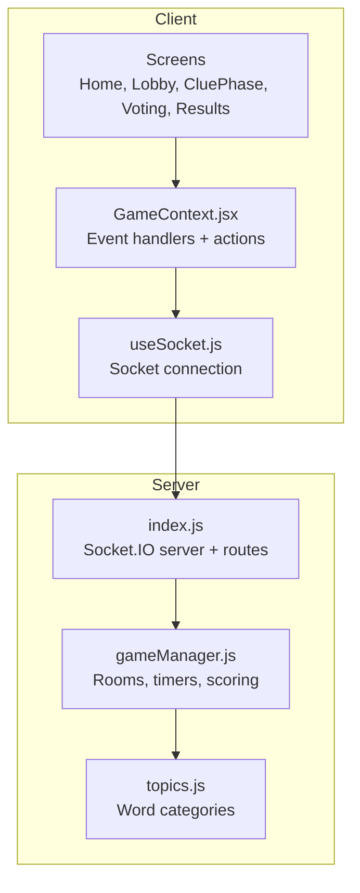
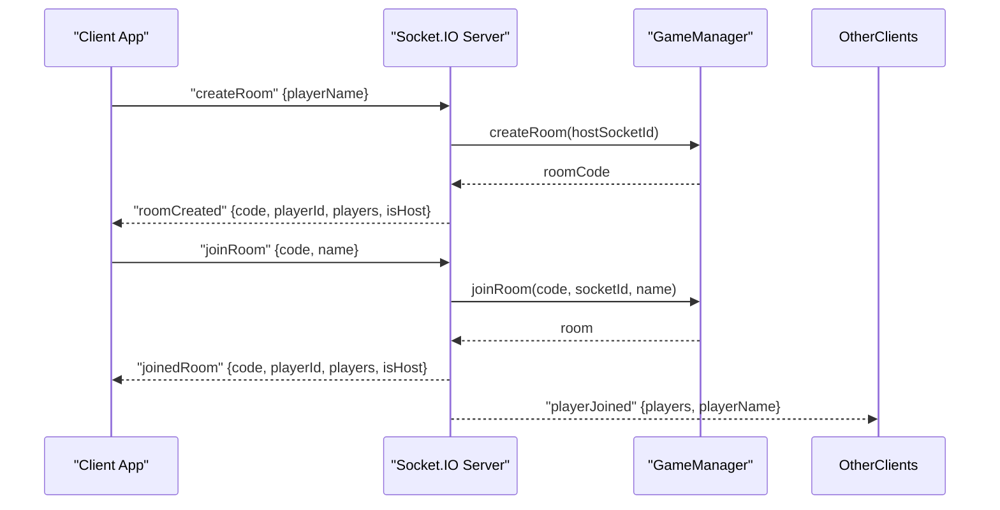
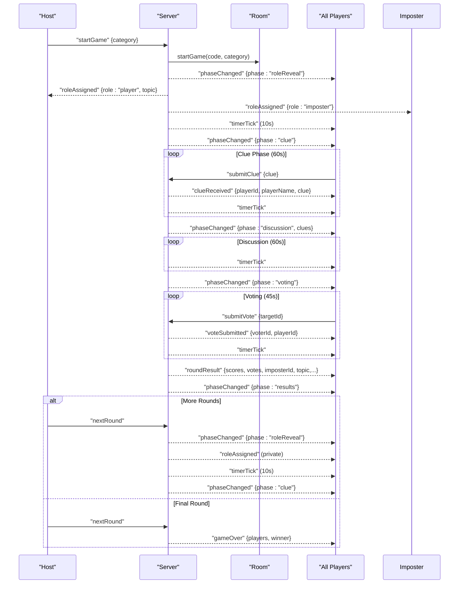
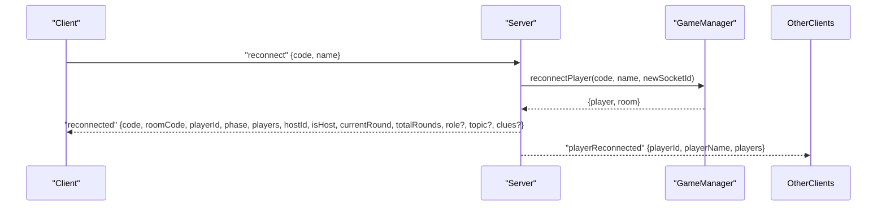
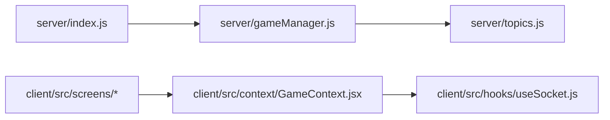

# Socket Events and API Reference

<cite>
**Referenced Files in This Document**
- [server/index.js](file://server/index.js)
- [server/gameManager.js](file://server/gameManager.js)
- [server/topics.js](file://server/topics.js)
- [client/src/hooks/useSocket.js](file://client/src/hooks/useSocket.js)
- [client/src/context/GameContext.jsx](file://client/src/context/GameContext.jsx)
- [client/src/screens/Home.jsx](file://client/src/screens/Home.jsx)
- [client/src/screens/Lobby.jsx](file://client/src/screens/Lobby.jsx)
- [client/src/screens/CluePhase.jsx](file://client/src/screens/CluePhase.jsx)
- [client/src/screens/Voting.jsx](file://client/src/screens/Voting.jsx)
- [client/src/screens/Results.jsx](file://client/src/screens/Results.jsx)
- [README.md](file://README.md)
</cite>

## Table of Contents
1. [Introduction](#introduction)
2. [Project Structure](#project-structure)
3. [Core Components](#core-components)
4. [Architecture Overview](#architecture-overview)
5. [Detailed Component Analysis](#detailed-component-analysis)
6. [Dependency Analysis](#dependency-analysis)
7. [Performance Considerations](#performance-considerations)
8. [Troubleshooting Guide](#troubleshooting-guide)
9. [Conclusion](#conclusion)
10. [Appendices](#appendices)

## Introduction
This document provides a comprehensive API reference for the Socket.IO events and WebSocket communication protocol used by the Imposter Game server. It covers all client-to-server and server-to-client events, including payloads, validation rules, error responses, and real-time synchronization behavior. It also documents typical game sequences, event ordering guarantees, and client integration patterns.

## Project Structure
The project consists of a Node.js + Express + Socket.IO server and a React client. The server manages rooms, players, game phases, timers, and scoring. The client connects via Socket.IO, listens to server events, and emits commands to drive gameplay.

**Diagram sources**
- [server/index.js:14-25](file://server/index.js#L14-L25)
- [server/gameManager.js:1-20](file://server/gameManager.js#L1-L20)
- [server/topics.js:1-104](file://server/topics.js#L1-L104)
- [client/src/hooks/useSocket.js:1-76](file://client/src/hooks/useSocket.js#L1-L76)
- [client/src/context/GameContext.jsx:12-254](file://client/src/context/GameContext.jsx#L12-L254)

**Section sources**
- [README.md:88-111](file://README.md#L88-L111)

## Core Components
- Socket.IO server: Establishes connections, handles client events, broadcasts server events, and orchestrates game progression.
- GameManager: Central state machine managing rooms, players, phases, timers, votes, scoring, and reconnection logic.
- Client socket hook: Provides a singleton Socket.IO connection with automatic reconnection and transport selection.
- GameContext: Centralizes event subscriptions, state updates, and action dispatchers for UI screens.

Key responsibilities:
- Event orchestration and validation on the server.
- Real-time synchronization of game state across clients.
- Graceful handling of disconnections and reconnections.

**Section sources**
- [server/index.js:173-676](file://server/index.js#L173-L676)
- [server/gameManager.js:9-636](file://server/gameManager.js#L9-L636)
- [client/src/hooks/useSocket.js:8-75](file://client/src/hooks/useSocket.js#L8-L75)
- [client/src/context/GameContext.jsx:12-254](file://client/src/context/GameContext.jsx#L12-L254)

## Architecture Overview
The server exposes a health endpoint and a Socket.IO namespace. Clients connect, emit commands, and receive state updates. The server validates inputs, updates internal state, and broadcasts events to the room.

**Diagram sources**
- [server/index.js:178-210](file://server/index.js#L178-L210)
- [server/index.js:214-248](file://server/index.js#L214-L248)
- [server/gameManager.js:53-90](file://server/gameManager.js#L53-L90)
- [server/gameManager.js:99-136](file://server/gameManager.js#L99-L136)

## Detailed Component Analysis

### Client-to-Server Events

#### createRoom
- Purpose: Create a new game room and register the host player.
- Payload
  - playerName: string (optional; defaults to "Host"; trimmed to 20 chars)
- Validation
  - Host socket ID must be present.
  - Player name sanitized and limited to 20 characters.
- Responses
  - Success: callback({ success: true, ...roomCreated })
  - Failure: callback({ success: false, error }), emits "error" to sender
- Server emits
  - roomCreated: { code, roomCode, playerId, players, isHost }
  - On success, sender joins the room and receives joinedRoom shortly after.

**Section sources**
- [server/index.js:178-210](file://server/index.js#L178-L210)
- [server/index.js:200](file://server/index.js#L200)
- [server/gameManager.js:53-90](file://server/gameManager.js#L53-L90)

#### joinRoom
- Purpose: Join an existing room by code and name.
- Payload
  - code or roomCode: string (uppercased, trimmed)
  - name or playerName: string (trimmed)
- Validation
  - Room code and name required.
  - Name length ≤ 20.
  - Room must be in "lobby" phase.
  - Room must not be full (≤ 8 players).
  - Duplicate names (case-insensitive) not allowed.
- Responses
  - Success: callback({ success: true, ...joinedRoom })
  - Failure: callback({ success: false, error }), emits "error" to sender
- Server emits
  - joinedRoom: { code, roomCode, playerId, players, isHost }
  - playerJoined: { players, playerName } to all room members

**Section sources**
- [server/index.js:214-248](file://server/index.js#L214-L248)
- [server/index.js:231](file://server/index.js#L231)
- [server/gameManager.js:99-136](file://server/gameManager.js#L99-L136)

#### startGame
- Purpose: Start the game; selects topic and imposter; begins role reveal.
- Payload
  - category: string ("general", "family", "adult")
- Validation
  - Must be called by the host.
  - Room must have ≥ 4 players.
  - Category must be valid.
- Responses
  - Success: callback({ success: true })
  - Failure: callback({ success: false, error }), emits "error" to sender
- Server emits
  - phaseChanged: { phase: "roleReveal" }
  - roleAssigned (private): { role: "imposter"|"player", topic?: string }
  - timerTick during 10-second role reveal
  - After 10s: advanceToClue

**Section sources**
- [server/index.js:252-297](file://server/index.js#L252-L297)
- [server/index.js:262](file://server/index.js#L262)
- [server/index.js:267-271](file://server/index.js#L267-L271)
- [server/index.js:278-287](file://server/index.js#L278-L287)
- [server/gameManager.js:213-241](file://server/gameManager.js#L213-L241)

#### submitClue
- Purpose: Submit a one-word clue during the "clue" phase.
- Payload
  - clue: string (trimmed; length ≤ 100)
- Validation
  - Must be in "clue" phase.
  - Clue must be non-empty and ≤ 100 chars.
- Responses
  - Success: callback({ success: true })
  - Failure: callback({ success: false, error }), emits "error" to sender
- Server emits
  - clueReceived: { playerId, playerName, clue }
  - If all connected players have submitted, advances to discussion immediately

**Section sources**
- [server/index.js:314-347](file://server/index.js#L314-L347)
- [server/index.js:325-329](file://server/index.js#L325-L329)
- [server/gameManager.js:249-276](file://server/gameManager.js#L249-L276)

#### submitVote
- Purpose: Submit a vote during the "voting" phase.
- Payload
  - targetId: string (player ID)
- Validation
  - Must be in "voting" phase.
  - Target must be a valid player in the room.
  - Self-vote not allowed.
- Responses
  - Success: callback({ success: true })
  - Failure: callback({ success: false, error }), emits "error" to sender
- Server emits
  - voteSubmitted: { voterId, playerId } to notify others
  - If all connected players have voted, tallies immediately

**Section sources**
- [server/index.js:377-405](file://server/index.js#L377-L405)
- [server/index.js:387](file://server/index.js#L387)
- [server/gameManager.js:284-307](file://server/gameManager.js#L284-L307)

#### imposterGuess (and submitImposterGuess)
- Purpose: Allow the imposter to guess the topic after a round ends.
- Payload
  - guess: string (trimmed)
- Validation
  - Must be called by the imposter in the room.
  - Case-insensitive comparison against the actual topic.
- Responses
  - Success: callback({ success: true, correct })
  - Failure: callback({ success: false, error }), emits "error" to sender
- Server emits
  - imposterGuessResult: { correct, guess, imposterId, imposterName, players }

Notes
- Two event names are accepted for compatibility: "imposterGuess" and "submitImposterGuess".

**Section sources**
- [server/index.js:409-442](file://server/index.js#L409-L442)
- [server/index.js:420-426](file://server/index.js#L420-L426)
- [server/gameManager.js:387-403](file://server/gameManager.js#L387-L403)

#### nextRound
- Purpose: Advance to the next round or end the game.
- Validation
  - Must be called by the host.
  - If all rounds complete, computes final winner.
- Responses
  - Success: callback({ success: true, gameOver: boolean })
  - Failure: callback({ success: false, error }), emits "error" to sender
- Server emits
  - phaseChanged: { phase: "roleReveal" } (new round)
  - roleAssigned (private) to each player
  - timerTick during 10-second role reveal
  - After 10s: advanceToClue
  - Or gameOver: { players, winner } (final results)

**Section sources**
- [server/index.js:446-511](file://server/index.js#L446-L511)
- [server/index.js:465-468](file://server/index.js#L465-L468)
- [server/index.js:474-484](file://server/index.js#L474-L484)
- [server/index.js:491-500](file://server/index.js#L491-L500)

#### playAgain
- Purpose: Reset the game to lobby state.
- Validation
  - Must be called by the host.
- Responses
  - Success: callback({ success: true })
  - Failure: callback({ success: false, error }), emits "error" to sender
- Server emits
  - phaseChanged: { phase: "lobby" }
  - playerJoined: { players } snapshot

**Section sources**
- [server/index.js:515-538](file://server/index.js#L515-L538)
- [server/index.js:523-524](file://server/index.js#L523-L524)

#### reconnect
- Purpose: Reconnect a previously connected player after network interruption.
- Payload
  - code or roomCode: string (uppercased, trimmed)
  - name or playerName: string (trimmed)
- Validation
  - All fields required.
  - Room must exist.
  - Player must be known by name (case-insensitive).
- Responses
  - Success: callback({ success: true, ...reconnected })
  - Failure: callback({ success: false, error }), emits "error" to sender
- Server emits
  - reconnected: { code, roomCode, playerId, phase, players, hostId, isHost, currentRound, totalRounds, role?, topic?, clues? }
  - playerReconnected: { playerId, playerName, players } to others

**Section sources**
- [server/index.js:542-608](file://server/index.js#L542-L608)
- [server/index.js:587](file://server/index.js#L587)
- [server/index.js:590-594](file://server/index.js#L590-L594)
- [server/gameManager.js:544-609](file://server/gameManager.js#L544-L609)

#### disconnect
- Purpose: Handle client disconnect; marks player as disconnected with a grace period.
- Behavior
  - Marks player.connected = false.
  - Emits playerDisconnected to the room.
  - Starts a 30-second grace period.
  - If player does not reconnect, removes them and notifies others.

**Section sources**
- [server/index.js:612-675](file://server/index.js#L612-L675)
- [server/gameManager.js:165-201](file://server/gameManager.js#L165-L201)

### Server-to-Client Events

#### timerTick
- Payload: { secondsLeft }
- Emitted by: Server during phase transitions with timers.
- Typical durations: clue (60s), discussion (60s), voting (45s), roleReveal (10s).

**Section sources**
- [server/index.js:49-66](file://server/index.js#L49-L66)
- [server/index.js:87-96](file://server/index.js#L87-L96)
- [server/index.js:112-122](file://server/index.js#L112-L122)
- [server/index.js:281-287](file://server/index.js#L281-L287)
- [server/index.js:494-500](file://server/index.js#L494-L500)

#### phaseChanged
- Payload: { phase }
- Phases in order: lobby, roleReveal, clue, discussion, voting, results, finalResults.
- Notes: May include additional fields (e.g., clues in discussion).

**Section sources**
- [server/index.js:49-66](file://server/index.js#L49-L66)
- [server/index.js:72-96](file://server/index.js#L72-L96)
- [server/index.js:103-122](file://server/index.js#L103-L122)
- [server/index.js:262](file://server/index.js#L262)
- [server/index.js:278-287](file://server/index.js#L278-L287)
- [server/index.js:475](file://server/index.js#L475)
- [server/index.js:491-499](file://server/index.js#L491-L499)

#### clueReceived
- Payload: { playerId, playerName, clue }
- Emitted when any player submits a clue.

**Section sources**
- [server/index.js:325-329](file://server/index.js#L325-L329)

#### voteSubmitted
- Payload: { voterId, playerId }
- Emitted when any player submits a vote.

**Section sources**
- [server/index.js:387](file://server/index.js#L387)

#### roundResult
- Payload: { votedOutId, votedOutName, wasImposter, caught, imposterId, imposterName, topic, scores, votes, currentRound, totalRounds, players }
- Emitted after voting completes.

**Section sources**
- [server/index.js:153-166](file://server/index.js#L153-L166)

#### gameOver
- Payload: { players, winner }
- Emitted when the game ends after final round.

**Section sources**
- [server/index.js:465-468](file://server/index.js#L465-L468)

#### playerDisconnected
- Payload: { playerId, playerName, players }
- Emitted when a player disconnects; client can show a grace period UI.

**Section sources**
- [server/index.js:628-632](file://server/index.js#L628-L632)

#### playerReconnected
- Payload: { playerId, playerName, players }
- Emitted when a previously disconnected player reconnects.

**Section sources**
- [server/index.js:590-594](file://server/index.js#L590-L594)

#### roleAssigned
- Private event emitted to each player after startGame.
- Payload: { role: "imposter"|"player", topic?: string }
- Note: topic is null for the imposter.

**Section sources**
- [server/index.js:267-271](file://server/index.js#L267-L271)

#### reconnected
- Private event emitted to the reconnecting player.
- Payload: { code, roomCode, playerId, phase, players, hostId, isHost, currentRound, totalRounds, role?, topic?, clues? }

**Section sources**
- [server/index.js:587](file://server/index.js#L587)

#### imposterGuessResult
- Payload: { correct, guess, imposterId, imposterName, players }
- Emitted after imposter guess submission.

**Section sources**
- [server/index.js:420-426](file://server/index.js#L420-L426)

### Event Flow Diagrams

#### Typical Game Sequence (Host starts, roles revealed, clue, discussion, voting, results)

**Diagram sources**
- [server/index.js:252-297](file://server/index.js#L252-L297)
- [server/index.js:49-66](file://server/index.js#L49-L66)
- [server/index.js:72-96](file://server/index.js#L72-L96)
- [server/index.js:103-122](file://server/index.js#L103-L122)
- [server/index.js:153-166](file://server/index.js#L153-L166)
- [server/index.js:446-511](file://server/index.js#L446-L511)

#### Reconnection Flow

**Diagram sources**
- [server/index.js:542-608](file://server/index.js#L542-L608)
- [server/gameManager.js:544-609](file://server/gameManager.js#L544-L609)

### Data Models and Schemas

#### Room
- Fields: code, hostId, players (Map), category, currentRound, totalRounds, phase, topic, imposterId, timer, timerInterval, votes (Map)
- Players Map entries include: id, name, score, connected, vote, clue

**Section sources**
- [server/gameManager.js:60-83](file://server/gameManager.js#L60-L83)
- [server/gameManager.js:620-632](file://server/gameManager.js#L620-L632)

#### Player
- Fields: id, name, score, connected, vote, clue

**Section sources**
- [server/gameManager.js:76-83](file://server/gameManager.js#L76-L83)

#### roundResult
- Fields: votedOutId, votedOutName, wasImposter, caught, imposterId, imposterName, topic, scores, votes, currentRound, totalRounds, players

**Section sources**
- [server/index.js:153-166](file://server/index.js#L153-L166)

#### imposterGuessResult
- Fields: correct, guess, imposterId, imposterName, players

**Section sources**
- [server/index.js:420-426](file://server/index.js#L420-L426)

### Real-Time Communication Patterns and Ordering Guarantees
- Event ordering within a room is FIFO per Socket.IO room broadcast semantics.
- Private events (roleAssigned, reconnected) are delivered to specific sockets.
- Timers emit periodic timerTick events; manual triggers (advanceToClue/Discussion/Voting) bypass timers.
- Graceful disconnect handling ensures eventual consistency: disconnected players are marked, then removed after a grace period.

**Section sources**
- [server/index.js:612-675](file://server/index.js#L612-L675)
- [server/index.js:49-66](file://server/index.js#L49-L66)

### Error Handling Strategies
- Validation errors: thrown and caught; server responds with callback({ success: false, error }) and emits "error".
- Client-side error display: GameContext sets an error state with a timeout.
- Reconnection: Client automatically attempts to reconnect and sends "reconnect" on initial connect if stored credentials exist.

**Section sources**
- [server/index.js:214-248](file://server/index.js#L214-L248)
- [server/index.js:314-347](file://server/index.js#L314-L347)
- [server/index.js:377-405](file://server/index.js#L377-L405)
- [client/src/context/GameContext.jsx:172-175](file://client/src/context/GameContext.jsx#L172-L175)
- [client/src/hooks/useSocket.js:34-57](file://client/src/hooks/useSocket.js#L34-L57)

### Retry Mechanisms and Connection Recovery
- Automatic reconnection: Client configured with reconnectionAttempts and exponential backoff.
- Graceful disconnect: 30-second grace period before removing disconnected players.
- Reconnect event: Client sends stored room code and name to restore state.

**Section sources**
- [client/src/hooks/useSocket.js:21-29](file://client/src/hooks/useSocket.js#L21-L29)
- [server/index.js:612-675](file://server/index.js#L612-L675)
- [server/index.js:542-608](file://server/index.js#L542-L608)

### Integration Patterns for Client Applications
- Use GameContext actions to emit events and manage state.
- Subscribe to server events in GameContext to update UI.
- Respect phase-specific UI states and disable controls accordingly.
- Handle error messages and toasts for user feedback.

**Section sources**
- [client/src/context/GameContext.jsx:256-337](file://client/src/context/GameContext.jsx#L256-L337)
- [client/src/screens/Home.jsx:19-28](file://client/src/screens/Home.jsx#L19-L28)
- [client/src/screens/Lobby.jsx:83-86](file://client/src/screens/Lobby.jsx#L83-L86)
- [client/src/screens/CluePhase.jsx:49-54](file://client/src/screens/CluePhase.jsx#L49-L54)
- [client/src/screens/Voting.jsx:68-71](file://client/src/screens/Voting.jsx#L68-L71)
- [client/src/screens/Results.jsx:151-155](file://client/src/screens/Results.jsx#L151-L155)

## Dependency Analysis

**Diagram sources**
- [server/index.js:8](file://server/index.js#L8)
- [server/gameManager.js:4](file://server/gameManager.js#L4)
- [client/src/context/GameContext.jsx:2](file://client/src/context/GameContext.jsx#L2)
- [client/src/hooks/useSocket.js:2](file://client/src/hooks/useSocket.js#L2)

**Section sources**
- [server/index.js:8](file://server/index.js#L8)
- [server/gameManager.js:4](file://server/gameManager.js#L4)
- [client/src/context/GameContext.jsx:2](file://client/src/context/GameContext.jsx#L2)
- [client/src/hooks/useSocket.js:2](file://client/src/hooks/useSocket.js#L2)

## Performance Considerations
- In-memory state: No persistence; rooms are held in memory. Expect state loss on restart.
- Timers: Server-side intervals; ensure cleanup on room deletion and phase changes.
- Broadcast volume: Events are broadcased per room; keep payloads minimal.
- Client throttling: Input sanitization and UI constraints prevent oversized payloads.

[No sources needed since this section provides general guidance]

## Troubleshooting Guide
Common issues and resolutions:
- Cannot join room: Ensure code is 4 uppercase letters and name is unique and ≤ 20 chars.
- Not in the correct phase: Some actions are only valid during specific phases (e.g., submitClue only in "clue").
- Disconnected player: Gracefully handled; UI shows a disconnected indicator until reconnection or timeout.
- Reconnection fails: Verify stored room code and name; ensure server is reachable.

**Section sources**
- [server/index.js:214-248](file://server/index.js#L214-L248)
- [server/index.js:314-347](file://server/index.js#L314-L347)
- [server/index.js:612-675](file://server/index.js#L612-L675)
- [client/src/hooks/useSocket.js:34-57](file://client/src/hooks/useSocket.js#L34-L57)

## Conclusion
The Socket.IO API for the Imposter Game provides a clear, event-driven contract for real-time multiplayer gameplay. Client applications should subscribe to server events, validate inputs, and handle errors gracefully. The server enforces strict validation and provides robust reconnection and graceful disconnect handling to maintain a smooth user experience.

[No sources needed since this section summarizes without analyzing specific files]

## Appendices

### Event Reference Summary

Client → Server
- createRoom: { playerName? } → roomCreated
- joinRoom: { code, name } → playerJoined
- startGame: { category } → roleAssigned (private)
- submitClue: { clue } → clueReceived
- submitVote: { targetId } → voteSubmitted
- imposterGuess / submitImposterGuess: { guess } → imposterGuessResult
- nextRound: — → phaseChanged / gameOver
- playAgain: — → phaseChanged
- reconnect: { code, name } → reconnected
- disconnect: — (implicit)

Server → Client
- timerTick: { secondsLeft }
- phaseChanged: { phase }
- clueReceived: { playerId, playerName, clue }
- voteSubmitted: { voterId, playerId }
- roundResult: { imposterId, wasImposter, scores, votes, topic, ... }
- gameOver: { players, winner }
- playerDisconnected: { playerId, playerName, players }
- playerReconnected: { playerId, playerName, players }
- roleAssigned: { role, topic? } (private)
- reconnected: { code, roomCode, playerId, phase, players, hostId, isHost, currentRound, totalRounds, role?, topic?, clues? }
- imposterGuessResult: { correct, guess, imposterId, imposterName, players }

**Section sources**
- [README.md:113-135](file://README.md#L113-L135)
- [server/index.js:178-210](file://server/index.js#L178-L210)
- [server/index.js:214-248](file://server/index.js#L214-L248)
- [server/index.js:252-297](file://server/index.js#L252-L297)
- [server/index.js:314-347](file://server/index.js#L314-L347)
- [server/index.js:377-405](file://server/index.js#L377-L405)
- [server/index.js:409-442](file://server/index.js#L409-L442)
- [server/index.js:446-511](file://server/index.js#L446-L511)
- [server/index.js:515-538](file://server/index.js#L515-L538)
- [server/index.js:542-608](file://server/index.js#L542-L608)
- [server/index.js:612-675](file://server/index.js#L612-L675)