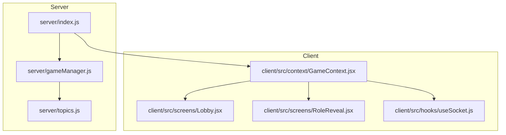
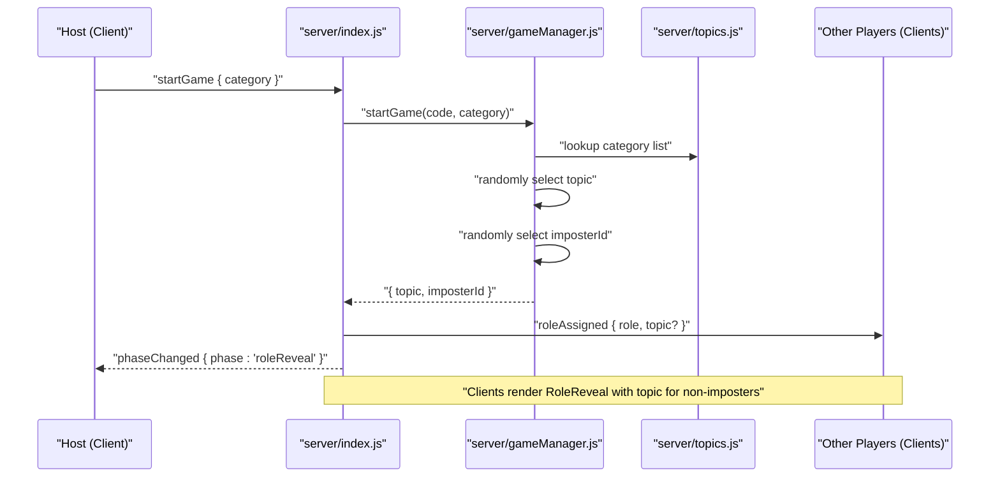
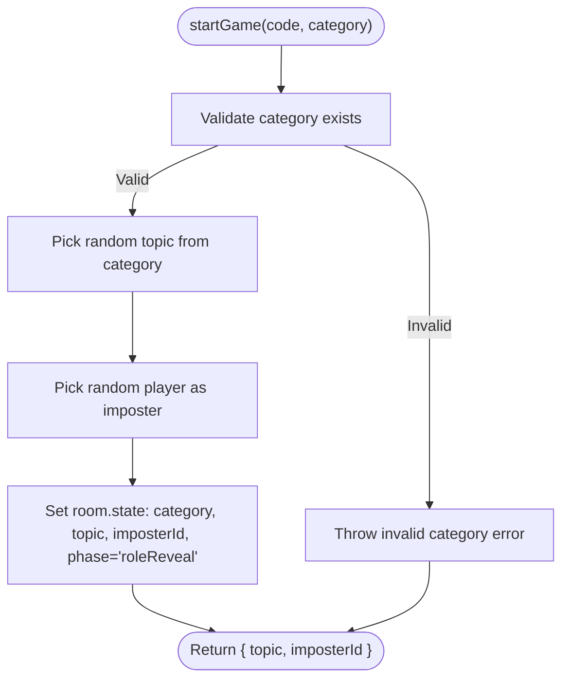
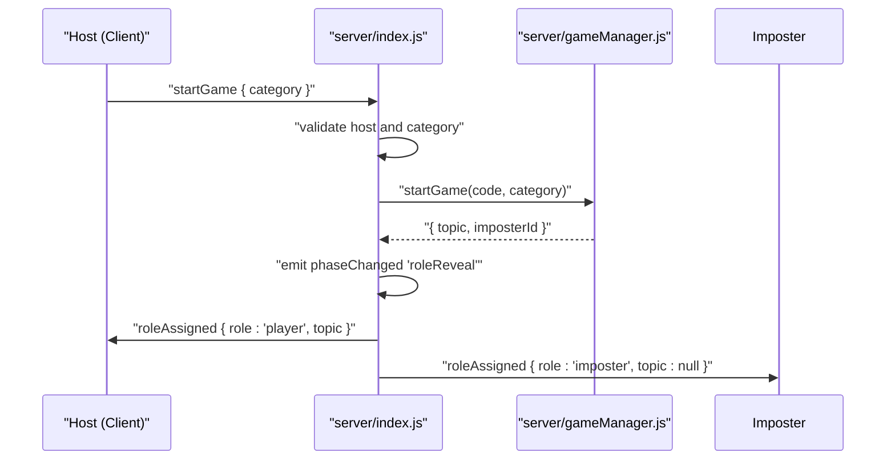
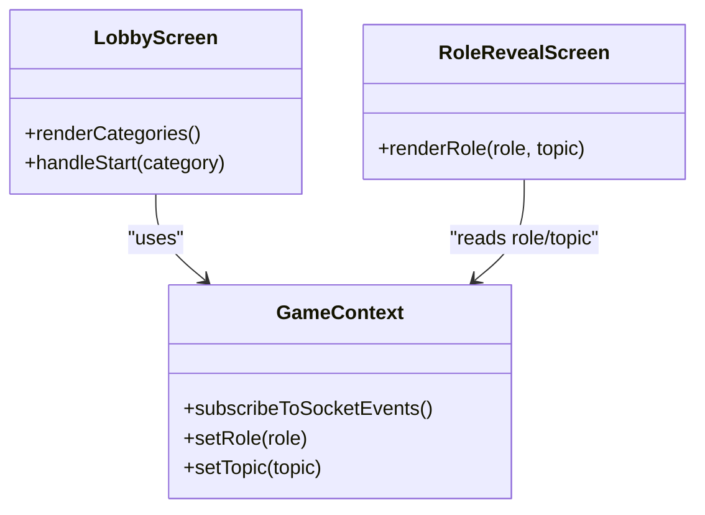
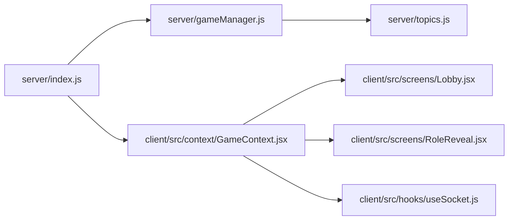

# Topics and Content System

<cite>
**Referenced Files in This Document**
- [README.md](file://README.md)
- [server/index.js](file://server/index.js)
- [server/gameManager.js](file://server/gameManager.js)
- [server/topics.js](file://server/topics.js)
- [client/src/screens/Lobby.jsx](file://client/src/screens/Lobby.jsx)
- [client/src/screens/RoleReveal.jsx](file://client/src/screens/RoleReveal.jsx)
- [client/src/context/GameContext.jsx](file://client/src/context/GameContext.jsx)
- [client/src/hooks/useSocket.js](file://client/src/hooks/useSocket.js)
</cite>

## Table of Contents
1. [Introduction](#introduction)
2. [Project Structure](#project-structure)
3. [Core Components](#core-components)
4. [Architecture Overview](#architecture-overview)
5. [Detailed Component Analysis](#detailed-component-analysis)
6. [Dependency Analysis](#dependency-analysis)
7. [Performance Considerations](#performance-considerations)
8. [Troubleshooting Guide](#troubleshooting-guide)
9. [Conclusion](#conclusion)
10. [Appendices](#appendices)

## Introduction
This document explains the topics and content management system used in the Imposter Game. It covers the category structure (general, family, adult), how topics are selected and assigned to players, content validation and sanitization, extensibility for adding new topics and categories, moderation and age-appropriate filtering guidance, and how categories influence gameplay dynamics.

## Project Structure
The topics and content system spans both server and client layers:
- Server-side topics definition and game logic
- Server-side game manager orchestrating topic selection and roles
- Client-side UI for category selection and role reveal
- Socket-driven synchronization between client and server

**Diagram sources**
- [server/index.js:1-687](file://server/index.js#L1-L687)
- [server/gameManager.js:1-636](file://server/gameManager.js#L1-L636)
- [server/topics.js:1-104](file://server/topics.js#L1-L104)
- [client/src/screens/Lobby.jsx:1-211](file://client/src/screens/Lobby.jsx#L1-L211)
- [client/src/screens/RoleReveal.jsx:1-123](file://client/src/screens/RoleReveal.jsx#L1-L123)
- [client/src/context/GameContext.jsx:1-383](file://client/src/context/GameContext.jsx#L1-L383)
- [client/src/hooks/useSocket.js:1-76](file://client/src/hooks/useSocket.js#L1-L76)

**Section sources**
- [README.md:88-111](file://README.md#L88-L111)
- [server/index.js:1-687](file://server/index.js#L1-L687)
- [server/gameManager.js:1-636](file://server/gameManager.js#L1-L636)
- [server/topics.js:1-104](file://server/topics.js#L1-L104)
- [client/src/screens/Lobby.jsx:1-211](file://client/src/screens/Lobby.jsx#L1-L211)
- [client/src/screens/RoleReveal.jsx:1-123](file://client/src/screens/RoleReveal.jsx#L1-L123)
- [client/src/context/GameContext.jsx:1-383](file://client/src/context/GameContext.jsx#L1-L383)
- [client/src/hooks/useSocket.js:1-76](file://client/src/hooks/useSocket.js#L1-L76)

## Core Components
- Topics data module: Defines three categories with curated word lists.
- Game Manager: Implements topic selection, imposter assignment, and game flow.
- Server: Exposes socket events for category selection, role assignment, and reveals.
- Client: Renders category choices, displays role/topic to players, and manages UI state.

Key responsibilities:
- Category selection and validation on the server.
- Random topic selection from the chosen category.
- Private role/topic delivery to players via socket events.
- Client-side UI for category selection and role reveal.

**Section sources**
- [server/topics.js:4-104](file://server/topics.js#L4-L104)
- [server/gameManager.js:213-241](file://server/gameManager.js#L213-L241)
- [server/index.js:252-297](file://server/index.js#L252-L297)
- [client/src/screens/Lobby.jsx:15-19](file://client/src/screens/Lobby.jsx#L15-L19)
- [client/src/screens/RoleReveal.jsx:5-100](file://client/src/screens/RoleReveal.jsx#L5-L100)

## Architecture Overview
The topic and content system integrates tightly with the game’s socket-driven flow. The host selects a category, the server picks a topic and assigns roles, and the server privately informs each player of their role and topic. Clients render the role reveal screen accordingly.

**Diagram sources**
- [server/index.js:252-297](file://server/index.js#L252-L297)
- [server/gameManager.js:213-241](file://server/gameManager.js#L213-L241)
- [server/topics.js:4-104](file://server/topics.js#L4-L104)
- [client/src/screens/RoleReveal.jsx:5-100](file://client/src/screens/RoleReveal.jsx#L5-L100)

## Detailed Component Analysis

### Topics Data Module
- Structure: Three categories (general, family, adult), each containing a list of topics.
- Purpose: Provides the pool of topics for random selection during game setup.
- Extensibility: New categories can be added by extending the exported object; new topics can be appended to existing lists.

Validation and sanitization:
- No explicit sanitization is performed in the topics module itself.
- Validation occurs at runtime when selecting topics and assigning roles.

**Section sources**
- [server/topics.js:4-104](file://server/topics.js#L4-L104)

### Game Manager: Topic Selection and Role Assignment
- Category validation: Ensures the chosen category exists before proceeding.
- Random selection:
  - Topic: Selects uniformly at random from the chosen category list.
  - Imposter: Selects uniformly at random from connected players.
- State updates: Sets category, current round, topic, and imposterId; transitions to role reveal phase.

**Diagram sources**
- [server/gameManager.js:213-241](file://server/gameManager.js#L213-L241)

**Section sources**
- [server/gameManager.js:213-241](file://server/gameManager.js#L213-L241)

### Server: Category Selection and Role Delivery
- Host-only start: Only the host can start the game; the server enforces this.
- Category defaults: If no category is provided, a default is used.
- Private role/topic delivery: The server emits roleAssigned events to each player, sending role and topic (null for imposter).
- Phase progression: After role reveal, the server advances to the clue phase automatically.

**Diagram sources**
- [server/index.js:252-297](file://server/index.js#L252-L297)
- [server/gameManager.js:213-241](file://server/gameManager.js#L213-L241)

**Section sources**
- [server/index.js:252-297](file://server/index.js#L252-L297)

### Client: Category Selection and Role Reveal
- Category picker: The lobby screen presents three categories (general, family, adult) with labels and descriptions.
- Role reveal: The RoleReveal screen displays either “You are the imposter” or the topic for non-imposters.
- State management: GameContext listens to socket events and updates UI state accordingly.

**Diagram sources**
- [client/src/screens/Lobby.jsx:15-19](file://client/src/screens/Lobby.jsx#L15-L19)
- [client/src/screens/Lobby.jsx:56-86](file://client/src/screens/Lobby.jsx#L56-L86)
- [client/src/screens/RoleReveal.jsx:5-100](file://client/src/screens/RoleReveal.jsx#L5-L100)
- [client/src/context/GameContext.jsx:12-383](file://client/src/context/GameContext.jsx#L12-L383)

**Section sources**
- [client/src/screens/Lobby.jsx:15-19](file://client/src/screens/Lobby.jsx#L15-L19)
- [client/src/screens/Lobby.jsx:56-86](file://client/src/screens/Lobby.jsx#L56-L86)
- [client/src/screens/RoleReveal.jsx:5-100](file://client/src/screens/RoleReveal.jsx#L5-L100)
- [client/src/context/GameContext.jsx:12-383](file://client/src/context/GameContext.jsx#L12-L383)

## Dependency Analysis
- server/index.js depends on server/gameManager.js and server/topics.js.
- server/gameManager.js depends on server/topics.js.
- Client components depend on GameContext, which depends on useSocket.

**Diagram sources**
- [server/index.js:1-687](file://server/index.js#L1-L687)
- [server/gameManager.js:1-636](file://server/gameManager.js#L1-L636)
- [server/topics.js:1-104](file://server/topics.js#L1-L104)
- [client/src/context/GameContext.jsx:1-383](file://client/src/context/GameContext.jsx#L1-L383)
- [client/src/screens/Lobby.jsx:1-211](file://client/src/screens/Lobby.jsx#L1-L211)
- [client/src/screens/RoleReveal.jsx:1-123](file://client/src/screens/RoleReveal.jsx#L1-L123)
- [client/src/hooks/useSocket.js:1-76](file://client/src/hooks/useSocket.js#L1-L76)

**Section sources**
- [server/index.js:1-687](file://server/index.js#L1-L687)
- [server/gameManager.js:1-636](file://server/gameManager.js#L1-L636)
- [server/topics.js:1-104](file://server/topics.js#L1-L104)
- [client/src/context/GameContext.jsx:1-383](file://client/src/context/GameContext.jsx#L1-L383)
- [client/src/screens/Lobby.jsx:1-211](file://client/src/screens/Lobby.jsx#L1-L211)
- [client/src/screens/RoleReveal.jsx:1-123](file://client/src/screens/RoleReveal.jsx#L1-L123)
- [client/src/hooks/useSocket.js:1-76](file://client/src/hooks/useSocket.js#L1-L76)

## Performance Considerations
- Topic selection uses uniform random sampling from category arrays; complexity is O(1) per selection.
- Category validation is O(k) where k is the number of keys in the topics object (constant small).
- Client rendering of categories is lightweight; ensure category lists remain manageable for UI responsiveness.

[No sources needed since this section provides general guidance]

## Troubleshooting Guide
Common issues and resolutions:
- Invalid category: The server throws an error if the category does not exist. Verify the category string matches one of the predefined keys.
- Not enough players: The server requires at least four players to start the game. Ensure sufficient players join before starting.
- Host-only start: Only the host can start the game. Confirm the current player is the host.
- Role/topic not received: Ensure the client is subscribed to socket events and that the server emitted roleAssigned.

**Section sources**
- [server/gameManager.js:213-218](file://server/gameManager.js#L213-L218)
- [server/index.js:252-297](file://server/index.js#L252-L297)

## Conclusion
The topics and content system is intentionally minimal and robust: three curated categories provide balanced content, uniform random selection ensures fairness, and strict server-side validation prevents misuse. The client renders category choices and role reveals cleanly, while the server guarantees secure, private role/topic delivery. Extensibility is straightforward: add categories or topics in the topics module and ensure the server validates against them.

[No sources needed since this section summarizes without analyzing specific files]

## Appendices

### Category Definitions and Guidelines
- General: Broad, neutral topics suitable for mixed audiences.
- Family: Kid-friendly topics; avoid explicit content.
- Adult: 18+ themes; ensure compliance with platform policies.

Guidelines:
- Maintain at least 30 unique topics per category for variety.
- Avoid sensitive or offensive content; review regularly.
- Consider cultural sensitivity and inclusivity when adding new topics.

**Section sources**
- [server/topics.js:4-104](file://server/topics.js#L4-L104)

### Random Topic Selection Algorithm
- Uniform random selection from the chosen category list.
- No weighting or bias; each topic has equal probability.
- Imposter selection is uniform among connected players.

**Section sources**
- [server/gameManager.js:222-228](file://server/gameManager.js#L222-L228)

### Content Validation and Sanitization
- Server-side validation:
  - Category existence check.
  - Minimum player count enforcement.
- Client-side validation:
  - Clue submission length limits and emptiness checks occur on the server.
- Sanitization:
  - No explicit sanitization in topics; rely on category curation and moderation.

**Section sources**
- [server/gameManager.js:213-218](file://server/gameManager.js#L213-L218)
- [server/gameManager.js:249-276](file://server/gameManager.js#L249-L276)

### Extensibility Mechanisms
- Adding a new category:
  - Extend the topics object with a new key and list of topics.
  - Update the client category picker to include the new option.
- Adding topics:
  - Append entries to an existing category list.
  - Ensure the list meets the minimum size requirement.
- Custom content:
  - Keep custom topics aligned with category guidelines.
  - Test thoroughly to avoid inappropriate content.

**Section sources**
- [server/topics.js:4-104](file://server/topics.js#L4-L104)
- [client/src/screens/Lobby.jsx:15-19](file://client/src/screens/Lobby.jsx#L15-L19)

### Age-Appropriate Filtering and Cultural Sensitivity
- Age-appropriate filtering:
  - Use the family category for younger audiences.
  - Use the adult category for 18+ contexts.
- Cultural sensitivity:
  - Avoid culturally offensive or stereotypical references.
  - Prefer universally recognizable or neutral concepts.
- Moderation:
  - Regularly audit topic lists.
  - Allow community reporting and removal of problematic entries.

[No sources needed since this section provides general guidance]

### Relationship Between Categories and Gameplay
- General: Balanced difficulty and broad appeal; suitable for casual groups.
- Family: Light-hearted, safe-for-work themes; encourages inclusive fun.
- Adult: More nuanced or mature themes; increases bluffing dynamics and social tension.

These differences influence player experience and group dynamics, but the core game mechanics remain unchanged across categories.

[No sources needed since this section provides general guidance]