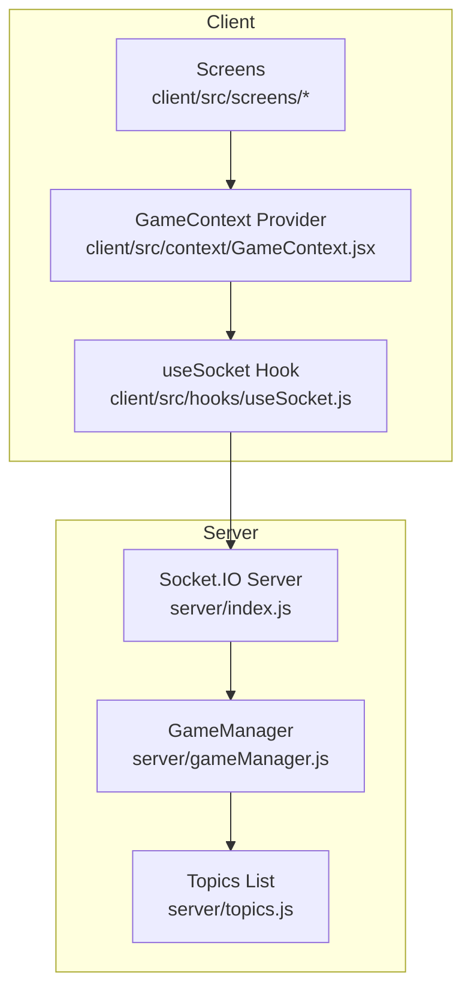
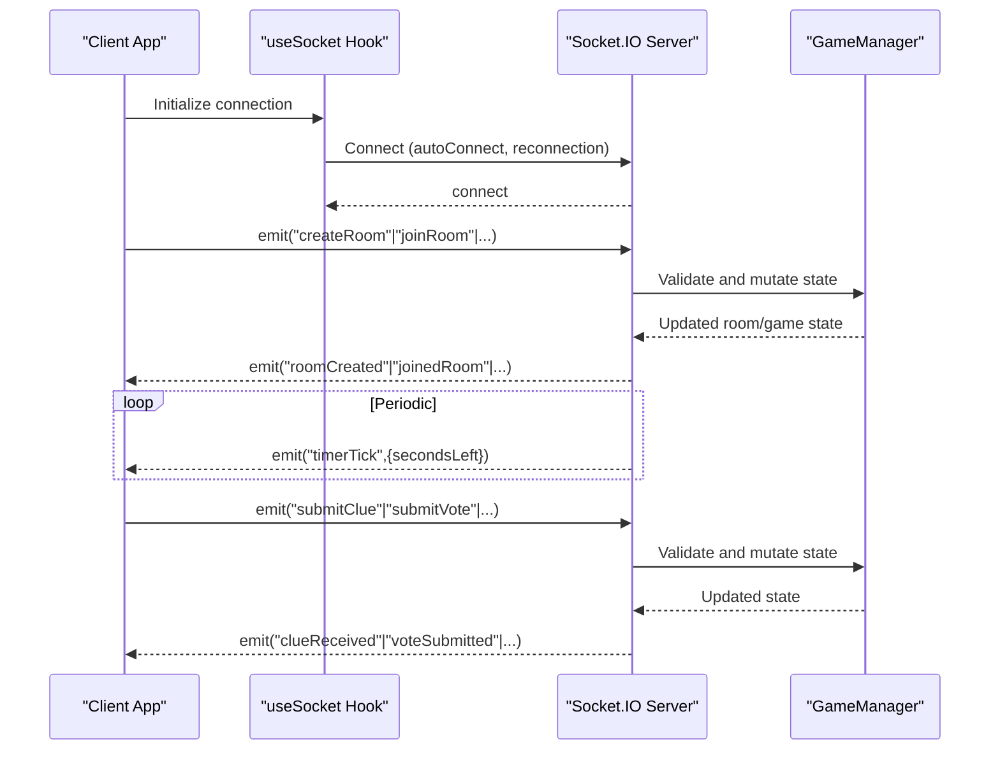
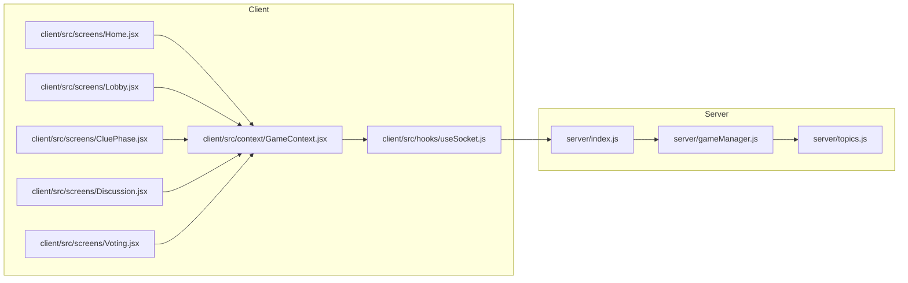

# Socket Events and API Reference

<cite>
**Referenced Files in This Document**
- [server/index.js](file://server/index.js)
- [server/gameManager.js](file://server/gameManager.js)
- [server/topics.js](file://server/topics.js)
- [client/src/hooks/useSocket.js](file://client/src/hooks/useSocket.js)
- [client/src/context/GameContext.jsx](file://client/src/context/GameContext.jsx)
- [client/src/screens/Home.jsx](file://client/src/screens/Home.jsx)
- [client/src/screens/Lobby.jsx](file://client/src/screens/Lobby.jsx)
- [client/src/screens/CluePhase.jsx](file://client/src/screens/CluePhase.jsx)
- [client/src/screens/Discussion.jsx](file://client/src/screens/Discussion.jsx)
- [client/src/screens/Voting.jsx](file://client/src/screens/Voting.jsx)
</cite>

## Table of Contents
1. [Introduction](#introduction)
2. [Project Structure](#project-structure)
3. [Core Components](#core-components)
4. [Architecture Overview](#architecture-overview)
5. [Detailed Component Analysis](#detailed-component-analysis)
6. [Dependency Analysis](#dependency-analysis)
7. [Performance Considerations](#performance-considerations)
8. [Troubleshooting Guide](#troubleshooting-guide)
9. [Conclusion](#conclusion)

## Introduction
This document provides a comprehensive API reference for the Socket.IO event system used by the Imposter Game. It covers all client-to-server and server-to-client events, including their payloads, expected responses, error conditions, timing, frequency, and state synchronization patterns. Practical examples of event handling in both client and server contexts are included, along with error handling strategies and debugging approaches for WebSocket communication issues.

## Project Structure
The Socket.IO integration spans the server and client sides:
- Server: Express + Socket.IO server with a central GameManager orchestrating game state and timers.
- Client: React application using a shared GameContext and a dedicated hook for Socket.IO connectivity.

**Diagram sources**
- [server/index.js:173-676](file://server/index.js#L173-L676)
- [server/gameManager.js:9-636](file://server/gameManager.js#L9-L636)
- [server/topics.js:4-103](file://server/topics.js#L4-L103)
- [client/src/hooks/useSocket.js:1-76](file://client/src/hooks/useSocket.js#L1-L76)
- [client/src/context/GameContext.jsx:12-383](file://client/src/context/GameContext.jsx#L12-L383)

**Section sources**
- [server/index.js:173-676](file://server/index.js#L173-L676)
- [server/gameManager.js:9-636](file://server/gameManager.js#L9-L636)
- [client/src/hooks/useSocket.js:1-76](file://client/src/hooks/useSocket.js#L1-L76)
- [client/src/context/GameContext.jsx:12-383](file://client/src/context/GameContext.jsx#L12-L383)

## Core Components
- Socket.IO Server: Central hub for all real-time events, room lifecycle, and game progression.
- GameManager: Encapsulates game logic, state transitions, timers, and persistence of player and round data.
- Client Socket Hook: Provides a singleton Socket.IO connection with automatic reconnection and transport selection.
- GameContext: Aggregates socket event listeners, manages UI state, and exposes action functions to screens.

Key responsibilities:
- Server handles client requests, validates inputs, updates game state, and emits server-to-client events.
- Client listens to server events, updates local state, and triggers client actions via GameContext.

**Section sources**
- [server/index.js:173-676](file://server/index.js#L173-L676)
- [server/gameManager.js:9-636](file://server/gameManager.js#L9-L636)
- [client/src/hooks/useSocket.js:1-76](file://client/src/hooks/useSocket.js#L1-L76)
- [client/src/context/GameContext.jsx:12-383](file://client/src/context/GameContext.jsx#L12-L383)

## Architecture Overview
The Socket.IO event flow follows a strict request-response model with periodic server-to-client broadcasts for timers and state changes.

**Diagram sources**
- [server/index.js:173-676](file://server/index.js#L173-L676)
- [server/gameManager.js:495-531](file://server/gameManager.js#L495-L531)
- [client/src/context/GameContext.jsx:70-254](file://client/src/context/GameContext.jsx#L70-L254)

## Detailed Component Analysis

### Client-to-Server Events

#### createRoom
- Purpose: Create a new game room and register the caller as the host.
- Payload:
  - Optional: { playerName: string } or { name: string } (trimmed, max 20 chars)
  - Callback signature: callback({ success: boolean, code?: string, roomCode?: string, playerId?: string, players?: Player[], isHost?: boolean, error?: string })
- Expected responses:
  - Server emits "roomCreated" with { code, roomCode, playerId, players, isHost }
  - On success, client transitions to lobby phase
- Error conditions:
  - Server-side validation errors (e.g., invalid name length) result in "error" event and callback failure
- Timing and frequency:
  - One-shot request; no periodic emissions
- Example usage:
  - Client calls GameContext.createRoom(name) which emits "createRoom" with { playerName }

**Section sources**
- [server/index.js:178-210](file://server/index.js#L178-L210)
- [client/src/context/GameContext.jsx:257-262](file://client/src/context/GameContext.jsx#L257-L262)

#### joinRoom
- Purpose: Join an existing room by code.
- Payload:
  - Required: { code: string | roomCode: string } (uppercased and trimmed)
  - Required: { name: string | playerName: string } (trimmed, max 20 chars)
  - Callback signature: callback({ success: boolean, code?: string, roomCode?: string, playerId?: string, players?: Player[], isHost?: boolean, error?: string })
- Expected responses:
  - Server emits "joinedRoom" with { code, roomCode, playerId, players, isHost }
  - Server emits "playerJoined" to notify others
- Error conditions:
  - Missing code/name, invalid room, room not in lobby, full room, duplicate name
- Timing and frequency:
  - One-shot request; no periodic emissions
- Example usage:
  - Client calls GameContext.joinRoom(code, name) which emits "joinRoom"

**Section sources**
- [server/index.js:214-248](file://server/index.js#L214-L248)
- [client/src/context/GameContext.jsx:264-269](file://client/src/context/GameContext.jsx#L264-L269)

#### startGame
- Purpose: Start the game in a room (host-only).
- Payload:
  - Optional: { category: "general" | "family" | "adult" } (default "general")
  - Callback signature: callback({ success: boolean })
- Expected responses:
  - Server emits "phaseChanged" with { phase: "roleReveal" }
  - Server emits "roleAssigned" privately to each player with { role: "imposter"|"player", topic?: string }
  - Server emits "timerTick" during 10-second role reveal
  - After timer, server advances to clue phase
- Error conditions:
  - Not in a room, not the host, insufficient players, invalid category
- Timing and frequency:
  - 10-second role reveal with per-second "timerTick"
- Example usage:
  - Host calls GameContext.startGame(category) which emits "startGame"

**Section sources**
- [server/index.js:252-297](file://server/index.js#L252-L297)
- [server/gameManager.js:213-241](file://server/gameManager.js#L213-L241)
- [client/src/context/GameContext.jsx:271-274](file://client/src/context/GameContext.jsx#L271-L274)

#### submitClue
- Purpose: Submit a one-word clue during the clue phase.
- Payload:
  - Required: { clue: string } (trimmed, max 100 chars)
  - Callback signature: callback({ success: boolean })
- Expected responses:
  - Server emits "clueReceived" to all players with { playerId, playerName, clue }
  - If all connected players have submitted clues, server skips remaining timer and advances to discussion
- Error conditions:
  - Not in clue phase, missing clue, empty clue, clue too long
- Timing and frequency:
  - One-shot request; server may emit "timerTick" until phase advances
- Example usage:
  - Player calls GameContext.submitClue(clue) which emits "submitClue"

**Section sources**
- [server/index.js:314-347](file://server/index.js#L314-L347)
- [server/gameManager.js:249-276](file://server/gameManager.js#L249-L276)
- [client/src/context/GameContext.jsx:276-280](file://client/src/context/GameContext.jsx#L276-L280)

#### submitVote
- Purpose: Submit a vote during the voting phase.
- Payload:
  - Required: { targetId: string } (player ID)
  - Callback signature: callback({ success: boolean })
- Expected responses:
  - Server emits "voteSubmitted" to all players with { voterId: string, playerId: string }
  - If all connected non-imposter players have voted, server tallies immediately and emits "roundResult"
- Error conditions:
  - Not in voting phase, missing target, invalid target, self-vote
- Timing and frequency:
  - One-shot request; server may emit "timerTick" until phase advances
- Example usage:
  - Player calls GameContext.submitVote(targetId) which emits "submitVote"

**Section sources**
- [server/index.js:377-405](file://server/index.js#L377-L405)
- [server/gameManager.js:284-307](file://server/gameManager.js#L284-L307)
- [client/src/context/GameContext.jsx:282-286](file://client/src/context/GameContext.jsx#L282-L286)

#### imposterGuess
- Purpose: Allow the imposter to guess the topic during non-clue phases.
- Payload:
  - Required: { guess: string }
  - Callback signature: callback({ success: boolean, correct?: boolean })
- Alternative event name: "submitImposterGuess" (same handler)
- Expected responses:
  - Server emits "imposterGuessResult" to all players with { correct: boolean, guess, imposterId, imposterName, players }
- Error conditions:
  - Not in a room, not the imposter, missing guess
- Timing and frequency:
  - One-shot request; no periodic emissions
- Example usage:
  - Imposter calls GameContext.submitImposterGuess(guess) which emits "submitImposterGuess"

**Section sources**
- [server/index.js:409-442](file://server/index.js#L409-L442)
- [server/gameManager.js:387-403](file://server/gameManager.js#L387-L403)
- [client/src/context/GameContext.jsx:288-291](file://client/src/context/GameContext.jsx#L288-L291)

#### nextRound
- Purpose: Advance to the next round or end the game (host-only).
- Payload:
  - Callback signature: callback({ success: boolean, gameOver?: boolean })
- Expected responses:
  - If game continues: "phaseChanged" { phase: "roleReveal" }, private "roleAssigned" to each player, 10-second "timerTick", then advance to clue
  - If game over: "gameOver" with { players, winner }
- Error conditions:
  - Not in a room, not the host
- Timing and frequency:
  - 10-second role reveal with per-second "timerTick"
- Example usage:
  - Host calls GameContext.nextRound() which emits "nextRound"

**Section sources**
- [server/index.js:446-511](file://server/index.js#L446-L511)
- [server/gameManager.js:410-453](file://server/gameManager.js#L410-L453)
- [client/src/context/GameContext.jsx:293-296](file://client/src/context/GameContext.jsx#L293-L296)

#### playAgain
- Purpose: Restart the game from lobby (host-only).
- Payload:
  - Callback signature: callback({ success: boolean })
- Expected responses:
  - Server emits "phaseChanged" { phase: "lobby" }
  - Server emits "playerJoined" with updated player list
- Error conditions:
  - Not in a room, not the host
- Timing and frequency:
  - One-shot request; no periodic emissions
- Example usage:
  - Host calls GameContext.playAgain() which emits "playAgain"

**Section sources**
- [server/index.js:515-538](file://server/index.js#L515-L538)
- [client/src/context/GameContext.jsx:298-301](file://client/src/context/GameContext.jsx#L298-L301)

#### reconnect
- Purpose: Reconnect a previously connected player after network interruption.
- Payload:
  - Required: { code: string | roomCode: string } (uppercased and trimmed)
  - Required: { name: string | playerName: string } (trimmed)
  - Callback signature: callback({ success: boolean, ...gameState })
- Expected responses:
  - Server emits "reconnected" with current game state snapshot
  - Server emits "playerReconnected" to others
- Error conditions:
  - Missing code/name, invalid room, player not found
- Timing and frequency:
  - One-shot request; server may emit "timerTick" depending on current phase
- Example usage:
  - Client automatically emits "reconnect" on initial connect if stored credentials exist

**Section sources**
- [server/index.js:542-608](file://server/index.js#L542-L608)
- [client/src/hooks/useSocket.js:42-44](file://client/src/hooks/useSocket.js#L42-L44)
- [client/src/context/GameContext.jsx:177-191](file://client/src/context/GameContext.jsx#L177-L191)

### Server-to-Client Events

#### timerTick
- Emitted by: Server during timed phases
- Payload: { secondsLeft: number } or { timeLeft: number }
- Frequency: Every second during clue, discussion, and voting phases
- Typical durations: 60s (clue), 60s (discussion), 45s (voting)
- Client behavior: Updates local timer state for UI countdown

**Section sources**
- [server/index.js:49-66](file://server/index.js#L49-L66)
- [server/index.js:87-96](file://server/index.js#L87-L96)
- [server/index.js:112-122](file://server/index.js#L112-L122)
- [server/index.js:278-287](file://server/index.js#L278-L287)
- [server/index.js:491-500](file://server/index.js#L491-L500)
- [client/src/context/GameContext.jsx:138-140](file://client/src/context/GameContext.jsx#L138-L140)

#### phaseChanged
- Emitted by: Server when advancing between game phases
- Payload: { phase: string, clues?: Clue[], round?: number, totalRounds?: number }
- Phases: "lobby", "roleReveal", "clue", "discussion", "voting", "results", "finalResults"
- Client behavior: Resets relevant UI state and clears per-phase data

**Section sources**
- [server/index.js:49-66](file://server/index.js#L49-L66)
- [server/index.js:87-96](file://server/index.js#L87-L96)
- [server/index.js:112-122](file://server/index.js#L112-L122)
- [server/index.js:262-271](file://server/index.js#L262-L271)
- [server/index.js:475-484](file://server/index.js#L475-L484)
- [client/src/context/GameContext.jsx:110-128](file://client/src/context/GameContext.jsx#L110-L128)

#### roundResult
- Emitted by: Server after voting completes
- Payload: { votedOutId: string, votedOutName: string, wasImposter: boolean, caught: boolean, imposterId: string, imposterName: string, topic: string, scores: Record<string,number>, votes: VoteRevealEntry[], currentRound: number, totalRounds: number, players: Player[] }
- Client behavior: Displays results screen and updates player scores

**Section sources**
- [server/index.js:153-166](file://server/index.js#L153-L166)
- [server/gameManager.js:316-378](file://server/gameManager.js#L316-L378)
- [client/src/context/GameContext.jsx:158-164](file://client/src/context/GameContext.jsx#L158-L164)

#### gameOver
- Emitted by: Server when all rounds are finished
- Payload: { players: Player[], winner: { id: string, name: string, score: number } }
- Client behavior: Displays final results and winner

**Section sources**
- [server/index.js:465-468](file://server/index.js#L465-L468)
- [client/src/context/GameContext.jsx:166-170](file://client/src/context/GameContext.jsx#L166-L170)

#### playerDisconnected
- Emitted by: Server when a player disconnects
- Payload: { playerId: string, playerName: string, players: Player[] }
- Grace period: 30 seconds before removal
- Client behavior: Marks player as disconnected and shows notification

**Section sources**
- [server/index.js:628-632](file://server/index.js#L628-L632)
- [client/src/context/GameContext.jsx:198-203](file://client/src/context/GameContext.jsx#L198-L203)

#### playerReconnected
- Emitted by: Server when a previously disconnected player reconnects
- Payload: { playerId: string, playerName: string, players: Player[] }
- Client behavior: Shows notification and updates player list

**Section sources**
- [server/index.js:590-594](file://server/index.js#L590-L594)
- [client/src/context/GameContext.jsx:205-210](file://client/src/context/GameContext.jsx#L205-L210)

#### Additional Events
- roomCreated, joinedRoom: Emitted after successful room creation/join
- playerJoined, playerLeft: Emitted when players join/leave
- youAreHost: Emitted to the new host after host leaves
- error: Emitted on server-side validation failures
- clueReceived: Emitted to all players when a clue is submitted
- voteSubmitted: Emitted to all players when a vote is submitted
- roleAssigned: Emitted privately to each player with role and topic
- reconnected: Emitted to the reconnected player with full game state snapshot

**Section sources**
- [server/index.js:196-200](file://server/index.js#L196-L200)
- [server/index.js:234-238](file://server/index.js#L234-L238)
- [server/index.js:231](file://server/index.js#L231)
- [server/index.js:662-664](file://server/index.js#L662-L664)
- [server/index.js:325-329](file://server/index.js#L325-L329)
- [server/index.js:387](file://server/index.js#L387)
- [server/index.js:267-271](file://server/index.js#L267-L271)
- [server/index.js:587](file://server/index.js#L587)
- [client/src/context/GameContext.jsx:217-233](file://client/src/context/GameContext.jsx#L217-L233)

## Dependency Analysis
The Socket.IO event system relies on a clear separation of concerns:
- Server: Centralized event handlers and state mutations via GameManager
- Client: Event listeners in GameContext and action dispatchers in screens
- Transport: Automatic reconnection with WebSocket and polling fallback

**Diagram sources**
- [server/index.js:173-676](file://server/index.js#L173-L676)
- [server/gameManager.js:9-636](file://server/gameManager.js#L9-L636)
- [server/topics.js:4-103](file://server/topics.js#L4-L103)
- [client/src/hooks/useSocket.js:1-76](file://client/src/hooks/useSocket.js#L1-L76)
- [client/src/context/GameContext.jsx:12-383](file://client/src/context/GameContext.jsx#L12-L383)
- [client/src/screens/Home.jsx:1-231](file://client/src/screens/Home.jsx#L1-L231)
- [client/src/screens/Lobby.jsx:1-211](file://client/src/screens/Lobby.jsx#L1-L211)
- [client/src/screens/CluePhase.jsx:1-165](file://client/src/screens/CluePhase.jsx#L1-L165)
- [client/src/screens/Discussion.jsx:1-114](file://client/src/screens/Discussion.jsx#L1-L114)
- [client/src/screens/Voting.jsx:1-180](file://client/src/screens/Voting.jsx#L1-L180)

**Section sources**
- [server/index.js:173-676](file://server/index.js#L173-L676)
- [server/gameManager.js:9-636](file://server/gameManager.js#L9-L636)
- [client/src/hooks/useSocket.js:1-76](file://client/src/hooks/useSocket.js#L1-L76)
- [client/src/context/GameContext.jsx:12-383](file://client/src/context/GameContext.jsx#L12-L383)

## Performance Considerations
- Timers: Server maintains a single interval per room; ensure intervals are cleared on room deletion and phase transitions.
- Broadcasting: Emit only to the affected room using room IDs to minimize unnecessary traffic.
- Payload sizes: Keep payloads minimal; serialize players once per broadcast.
- Reconnection: Client uses exponential backoff and multiple transport options to improve resilience.
- Validation: Server-side validation prevents malformed data from causing repeated retries.

[No sources needed since this section provides general guidance]

## Troubleshooting Guide
Common issues and resolutions:
- Connection failures:
  - Verify server URL and CORS configuration in the client.
  - Check browser console for "connect_error" and network tab for failed WebSocket upgrades.
- Reconnection problems:
  - Ensure "reconnect" event is emitted with correct code and name.
  - Confirm client storage of roomCode and playerName.
- State desynchronization:
  - Use "reconnected" event payload to rebuild UI state.
  - Verify "phaseChanged" and "timerTick" sequences align with expected timings.
- Error handling:
  - Listen for "error" event and display user-friendly messages.
  - Validate inputs on both client and server to prevent silent failures.

Practical debugging steps:
- Enable logging in server index.js around event handlers.
- Inspect GameManager state transitions and timer intervals.
- Use browser DevTools Network tab to monitor Socket.IO frames.
- Verify event names match between client and server (e.g., "submitImposterGuess" and "imposterGuess").

**Section sources**
- [client/src/hooks/useSocket.js:34-72](file://client/src/hooks/useSocket.js#L34-L72)
- [client/src/context/GameContext.jsx:172-175](file://client/src/context/GameContext.jsx#L172-L175)
- [server/index.js:612-675](file://server/index.js#L612-L675)

## Conclusion
The Socket.IO event system in Imposter Game provides a robust, state-driven real-time experience with clear separation between client actions and server responses. By adhering to the documented payloads, error handling patterns, and timing expectations, developers can extend or debug the system effectively. The provided diagrams and references serve as a quick reference for integrating new features or diagnosing issues.