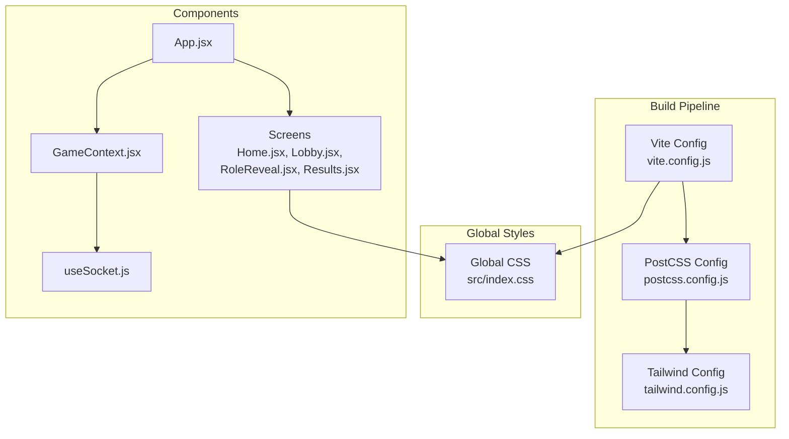
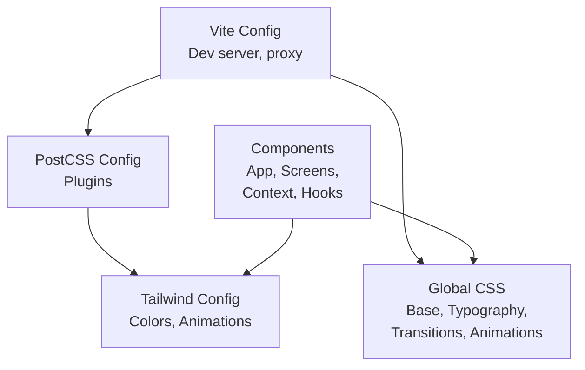
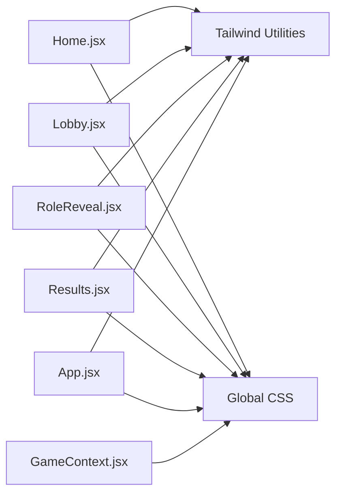

# Styling and Design System

<cite>
**Referenced Files in This Document**
- [tailwind.config.js](file://client/tailwind.config.js)
- [postcss.config.js](file://client/postcss.config.js)
- [index.css](file://client/src/index.css)
- [package.json](file://client/package.json)
- [vite.config.js](file://client/vite.config.js)
- [App.jsx](file://client/src/App.jsx)
- [Home.jsx](file://client/src/screens/Home.jsx)
- [Lobby.jsx](file://client/src/screens/Lobby.jsx)
- [RoleReveal.jsx](file://client/src/screens/RoleReveal.jsx)
- [Results.jsx](file://client/src/screens/Results.jsx)
- [GameContext.jsx](file://client/src/context/GameContext.jsx)
- [useSocket.js](file://client/src/hooks/useSocket.js)
</cite>

## Table of Contents
1. [Introduction](#introduction)
2. [Project Structure](#project-structure)
3. [Core Components](#core-components)
4. [Architecture Overview](#architecture-overview)
5. [Detailed Component Analysis](#detailed-component-analysis)
6. [Dependency Analysis](#dependency-analysis)
7. [Performance Considerations](#performance-considerations)
8. [Troubleshooting Guide](#troubleshooting-guide)
9. [Conclusion](#conclusion)
10. [Appendices](#appendices)

## Introduction
This document describes the styling and design system of the Imposter Game frontend. It covers Tailwind CSS configuration, color palette, typography, spacing, responsive behavior, animations, transitions, and build-time optimizations. It also documents component styling strategies, theme customization, accessibility considerations, dark mode support, and brand consistency across screens.

## Project Structure
The styling system is organized around a small set of configuration files and global styles, with component-specific styles applied via Tailwind utility classes and custom CSS. The build pipeline uses Vite with PostCSS and Tailwind CSS.

**Diagram sources**
- [vite.config.js:1-16](file://client/vite.config.js#L1-L16)
- [postcss.config.js:1-2](file://client/postcss.config.js#L1-L2)
- [tailwind.config.js:1-48](file://client/tailwind.config.js#L1-L48)
- [index.css:1-215](file://client/src/index.css#L1-L215)
- [App.jsx:1-101](file://client/src/App.jsx#L1-L101)
- [Home.jsx:1-231](file://client/src/screens/Home.jsx#L1-L231)
- [Lobby.jsx:1-211](file://client/src/screens/Lobby.jsx#L1-L211)
- [RoleReveal.jsx:1-123](file://client/src/screens/RoleReveal.jsx#L1-L123)
- [Results.jsx:1-443](file://client/src/screens/Results.jsx#L1-L443)
- [GameContext.jsx:1-383](file://client/src/context/GameContext.jsx#L1-L383)
- [useSocket.js:1-76](file://client/src/hooks/useSocket.js#L1-L76)

**Section sources**
- [vite.config.js:1-16](file://client/vite.config.js#L1-L16)
- [postcss.config.js:1-2](file://client/postcss.config.js#L1-L2)
- [tailwind.config.js:1-48](file://client/tailwind.config.js#L1-L48)
- [index.css:1-215](file://client/src/index.css#L1-L215)

## Core Components
- Tailwind CSS configuration defines the design tokens and custom animations.
- PostCSS configuration enables Tailwind and Autoprefixer.
- Global CSS establishes base styles, typography, layout, and reusable animations.
- Components apply Tailwind utilities and custom CSS classes for consistent visuals.

Key configuration highlights:
- Content scanning targets templates and JS/JSX files for purging unused styles.
- Color palette extends dark backgrounds, accent colors, and vibrant neon hues.
- Animation and keyframes are defined for pulse rings, fade/slide/scale-ins, glow, and floating effects.
- Global base styles set font stack, background, and viewport sizing with dynamic viewport units.

**Section sources**
- [tailwind.config.js:1-48](file://client/tailwind.config.js#L1-L48)
- [postcss.config.js:1-2](file://client/postcss.config.js#L1-L2)
- [index.css:1-215](file://client/src/index.css#L1-L215)

## Architecture Overview
The styling architecture follows a layered approach:
- Build layer: Vite compiles assets with PostCSS and Tailwind.
- Token layer: Tailwind config centralizes design tokens (colors, animations).
- Global layer: Base styles and reusable animations live in global CSS.
- Component layer: Screens and UI elements compose utilities and custom classes.

**Diagram sources**
- [tailwind.config.js:1-48](file://client/tailwind.config.js#L1-L48)
- [postcss.config.js:1-2](file://client/postcss.config.js#L1-L2)
- [vite.config.js:1-16](file://client/vite.config.js#L1-L16)
- [index.css:1-215](file://client/src/index.css#L1-L215)
- [App.jsx:1-101](file://client/src/App.jsx#L1-L101)
- [Home.jsx:1-231](file://client/src/screens/Home.jsx#L1-L231)
- [Lobby.jsx:1-211](file://client/src/screens/Lobby.jsx#L1-L211)
- [RoleReveal.jsx:1-123](file://client/src/screens/RoleReveal.jsx#L1-L123)
- [Results.jsx:1-443](file://client/src/screens/Results.jsx#L1-L443)
- [GameContext.jsx:1-383](file://client/src/context/GameContext.jsx#L1-L383)
- [useSocket.js:1-76](file://client/src/hooks/useSocket.js#L1-L76)

## Detailed Component Analysis

### Tailwind CSS Configuration
- Content scanning includes HTML and JS/JSX under src for purging.
- Extended colors:
  - Dark palette with multiple shades for backgrounds and overlays.
  - Accent palette for primary action and highlight states.
  - Neon palette for vibrant accents and glows.
- Animation and keyframes:
  - Pulse ring, fade-in, slide-up, scale-in, glow, float.
  - Used across screens for interactive feedback and visual polish.

**Section sources**
- [tailwind.config.js:1-48](file://client/tailwind.config.js#L1-L48)

### PostCSS and Build Configuration
- PostCSS loads Tailwind and Autoprefixer plugins.
- Vite dev server runs on port 5173 with a proxy to the Socket.IO backend.
- Dependencies include React, Tailwind CSS, PostCSS, and canvas-confetti for animations.

**Section sources**
- [postcss.config.js:1-2](file://client/postcss.config.js#L1-L2)
- [vite.config.js:1-16](file://client/vite.config.js#L1-L16)
- [package.json:1-26](file://client/package.json#L1-L26)

### Global Styles and Typography
- Base reset and box sizing.
- Font stack prioritizes Inter and system UI fonts.
- Body and root containers use dynamic viewport units for consistent full-screen layouts.
- Custom scrollbar styling for subtle contrast.
- Reusable animations:
  - Screen transitions (enter/exit) with opacity and transform.
  - Countdown ring progress animation.
  - Toast notifications with slide-in/out keyframes.
  - Glass card effect with backdrop blur and borders.
  - 3D flip card with preserve-3d and backface visibility.
  - Glow effects for red/green/blue themes.
  - Staggered children animation for list reveals.
  - Thinking dots animation for waiting states.
  - Gradient background for game layout.

**Section sources**
- [index.css:1-215](file://client/src/index.css#L1-L215)

### App Shell and Transitions
- App wraps the entire UI with a gradient background and manages screen transitions.
- Transition classes adjust opacity, translation, and scale during phase changes.
- Connection indicator uses Tailwind classes and animation utilities.

**Section sources**
- [App.jsx:1-101](file://client/src/App.jsx#L1-L101)

### Home Screen
- Floating emoji decorations and background glow orbs for atmosphere.
- Animated entrance for title and cards using fade-in and slide-up.
- Glass card strong containers with hover and focus states.
- Gradient buttons with shadow and hover effects.
- Responsive typography scaling with sm breakpoint.

**Section sources**
- [Home.jsx:1-231](file://client/src/screens/Home.jsx#L1-L231)

### Lobby Screen
- Player avatars with gradient color bands and online/offline indicators.
- Category selection with animated selection states.
- Start button with glow animation and disabled states.
- Thinking dots animation for non-host players.
- Copy-to-clipboard flow with toast notifications.

**Section sources**
- [Lobby.jsx:1-211](file://client/src/screens/Lobby.jsx#L1-L211)

### Role Reveal Screen
- Flip card component with 3D transform and staggered reveal timing.
- Dynamic background glow based on role (imposter vs crewmate).
- Timer overlay and tap-to-reveal prompt with pulse ring animation.

**Section sources**
- [RoleReveal.jsx:1-123](file://client/src/screens/RoleReveal.jsx#L1-L123)

### Results Screen
- Staggered vote reveal with timed reveals and smooth transitions.
- Canvas-confetti integration for celebratory and dramatic moments.
- Final results screen with leaderboard and winner highlighting.
- Imposter guess submission flow with validation and feedback.

**Section sources**
- [Results.jsx:1-443](file://client/src/screens/Results.jsx#L1-L443)

### Game Context and Notifications
- Toast management with enter/exit animations and automatic dismissal.
- Error and warning toasts styled with accent and warning palettes.

**Section sources**
- [GameContext.jsx:1-383](file://client/src/context/GameContext.jsx#L1-L383)

### Socket Hook and Connectivity
- Connection status drives UI states (disabled controls, warnings).
- Reconnection handling ensures continuity across network changes.

**Section sources**
- [useSocket.js:1-76](file://client/src/hooks/useSocket.js#L1-L76)

## Dependency Analysis
The styling system depends on Tailwind utilities and global CSS. Components rely on:
- Tailwind utilities for layout, colors, shadows, and transforms.
- Global CSS for reusable animations and base styles.
- Custom animations defined in Tailwind config and global CSS.

**Diagram sources**
- [Home.jsx:1-231](file://client/src/screens/Home.jsx#L1-L231)
- [Lobby.jsx:1-211](file://client/src/screens/Lobby.jsx#L1-L211)
- [RoleReveal.jsx:1-123](file://client/src/screens/RoleReveal.jsx#L1-L123)
- [Results.jsx:1-443](file://client/src/screens/Results.jsx#L1-L443)
- [App.jsx:1-101](file://client/src/App.jsx#L1-L101)
- [index.css:1-215](file://client/src/index.css#L1-L215)
- [tailwind.config.js:1-48](file://client/tailwind.config.js#L1-L48)

**Section sources**
- [Home.jsx:1-231](file://client/src/screens/Home.jsx#L1-L231)
- [Lobby.jsx:1-211](file://client/src/screens/Lobby.jsx#L1-L211)
- [RoleReveal.jsx:1-123](file://client/src/screens/RoleReveal.jsx#L1-L123)
- [Results.jsx:1-443](file://client/src/screens/Results.jsx#L1-L443)
- [App.jsx:1-101](file://client/src/App.jsx#L1-L101)
- [index.css:1-215](file://client/src/index.css#L1-L215)
- [tailwind.config.js:1-48](file://client/tailwind.config.js#L1-L48)

## Performance Considerations
- Purge unused CSS: Tailwind scans src/**/*.{js,jsx} and index.html to remove unreachable styles.
- Minimize repaints: Prefer transform and opacity for animations; avoid layout-affecting properties.
- Reduce blur complexity: Glass card blur is applied selectively; consider reducing blur radius on lower-powered devices.
- Limit confetti: Canvas-confetti is triggered conditionally; ensure timers clean up to prevent repeated heavy frames.
- Font rendering: Inter is prioritized; ensure efficient font loading and consider font-display strategies if needed.
- Viewport units: Using dvh prevents layout shifts on mobile browsers.

[No sources needed since this section provides general guidance]

## Troubleshooting Guide
- Animations not playing:
  - Verify Tailwind animation utilities are present and keyframes are defined.
  - Confirm global CSS animations are loaded and not overridden by component styles.
- Confetti not firing:
  - Ensure canvas-confetti is imported and effects are triggered after DOM updates.
  - Check that confetti flags reset on new round results.
- Toasts not appearing/disappearing:
  - Confirm toasts array is managed in context and exit transitions are applied.
  - Ensure backdrop-filter is supported on target devices.
- Mobile layout issues:
  - Use dynamic viewport units (dvh) and test on multiple device sizes.
  - Prefer container queries or responsive utilities for complex layouts.

**Section sources**
- [Results.jsx:55-98](file://client/src/screens/Results.jsx#L55-L98)
- [GameContext.jsx:40-51](file://client/src/context/GameContext.jsx#L40-L51)
- [index.css:81-109](file://client/src/index.css#L81-L109)

## Conclusion
The Imposter Game frontend employs a concise yet powerful styling system built on Tailwind CSS and PostCSS. The design system emphasizes a dark, high-contrast palette with vibrant neon accents, consistent glass morphism, and expressive micro-interactions. Animations and transitions reinforce gameplay phases, while global CSS ensures cohesive typography and layout. The build pipeline is optimized for rapid iteration and clean production bundles.

[No sources needed since this section summarizes without analyzing specific files]

## Appendices

### Design Tokens and Theming
- Color palette
  - Dark backgrounds: deep blues and blacks for immersive UI.
  - Accent: bright red/pink for primary actions and highlights.
  - Neon: green, blue, purple, and pink for secondary accents and glows.
- Typography
  - Inter as the primary font family for crisp readability.
  - System UI fallbacks for broader compatibility.
- Spacing and layout
  - Consistent padding and margins using Tailwind spacing scale.
  - Full-screen layout with dynamic viewport units for mobile-first responsiveness.
- Responsive breakpoints
  - Uses Tailwind’s default breakpoints; sm is leveraged for larger text and spacing adjustments.
- Accessibility
  - Sufficient contrast ratios with dark backgrounds and accent colors.
  - Focus-visible outlines via focus utilities; ensure custom focus states remain visible.
  - Semantic HTML and ARIA attributes where appropriate in components.
- Dark mode support
  - The design is optimized for dark mode; no explicit light mode toggle is present.
  - Color tokens are tuned for low-light environments.
- Brand consistency
  - Neon palette and glass card styles unify the visual identity across screens.
  - Consistent animation patterns (fade/slide/scale) reinforce brand personality.

**Section sources**
- [tailwind.config.js:5-9](file://client/tailwind.config.js#L5-L9)
- [index.css:12-19](file://client/src/index.css#L12-L19)
- [Home.jsx:67-82](file://client/src/screens/Home.jsx#L67-L82)
- [Lobby.jsx:182-196](file://client/src/screens/Lobby.jsx#L182-L196)
- [Results.jsx:182-189](file://client/src/screens/Results.jsx#L182-L189)

### Animation and Transition Reference
- Built-in Tailwind animations: pulse-ring, fade-in, slide-up, scale-in, glow, float.
- Custom keyframes: countdown ring, toast slide-in/out, staggered children, thinking dots.
- Component-specific animations: flip card, screen transitions, connection indicator pulse.

**Section sources**
- [tailwind.config.js:10-43](file://client/tailwind.config.js#L10-L43)
- [index.css:70-209](file://client/src/index.css#L70-L209)
- [App.jsx:89-97](file://client/src/App.jsx#L89-L97)
- [Lobby.jsx:199-206](file://client/src/screens/Lobby.jsx#L199-L206)
- [RoleReveal.jsx:40-56](file://client/src/screens/RoleReveal.jsx#L40-L56)