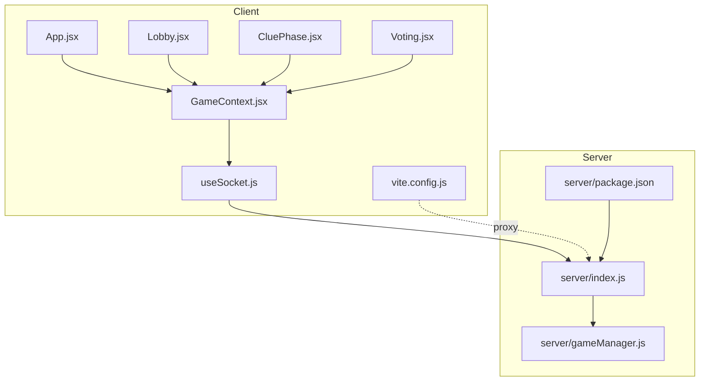
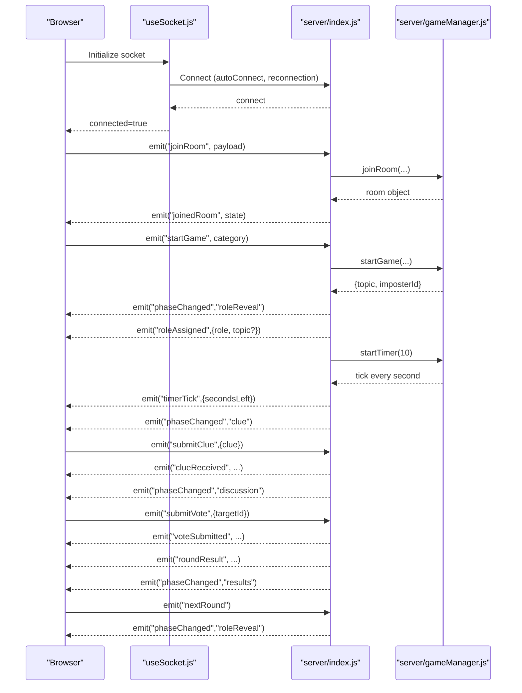
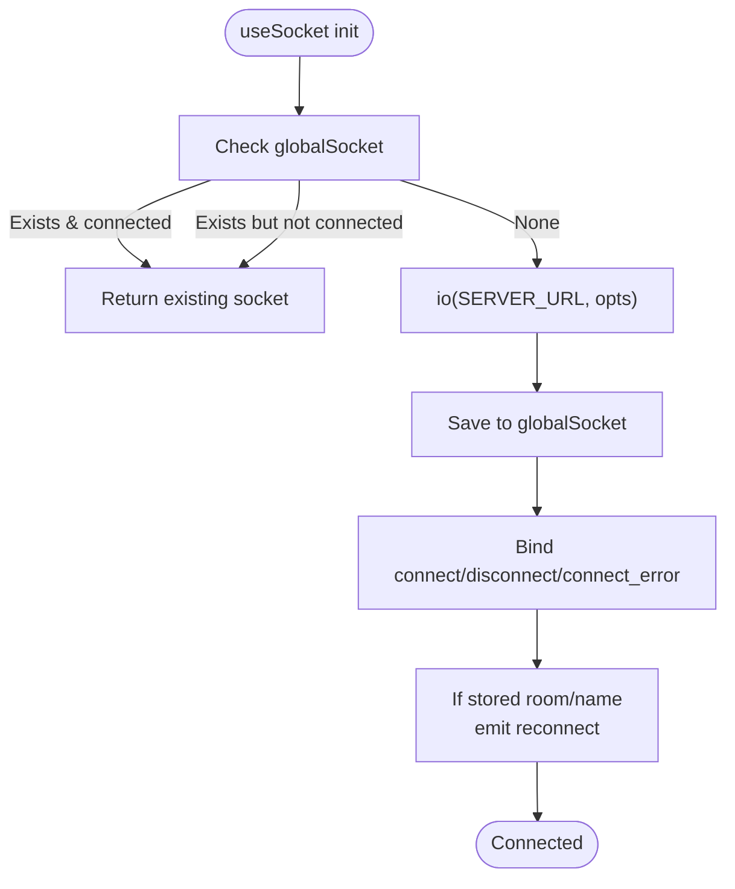
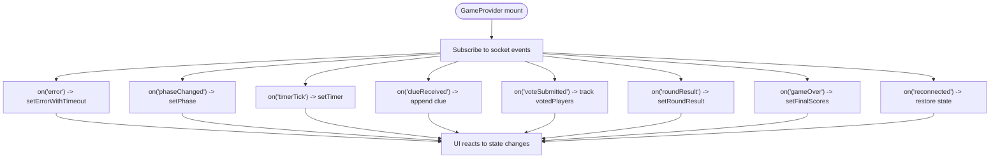
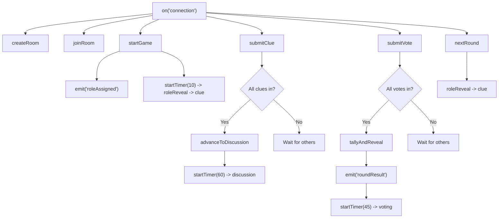
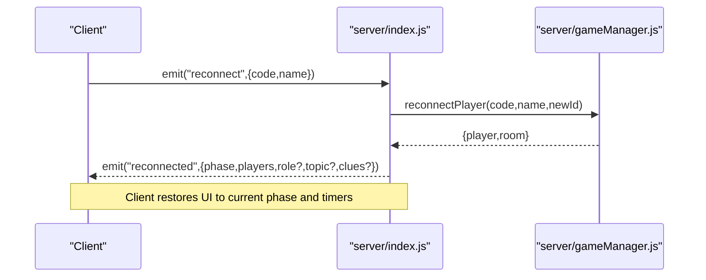
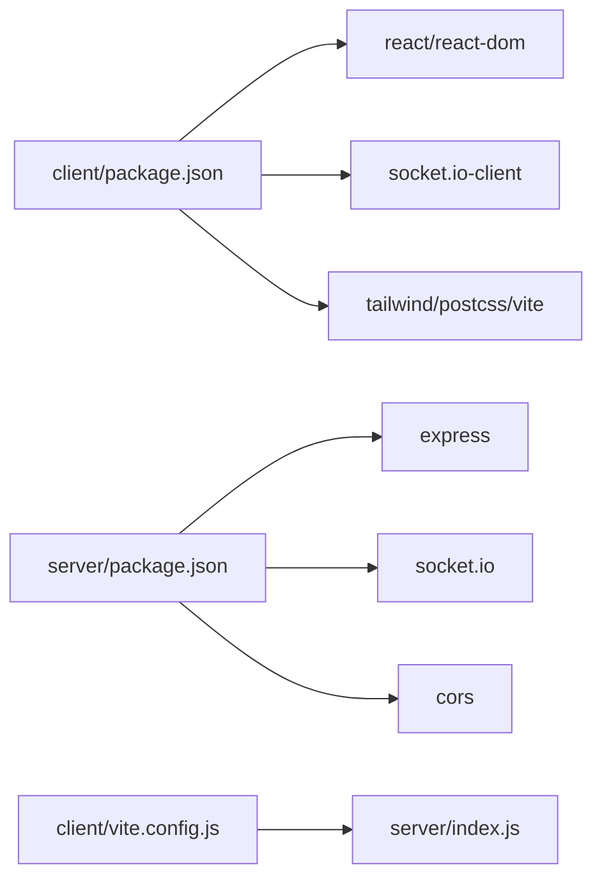

# Troubleshooting and FAQ

<cite>
**Referenced Files in This Document**
- [README.md](file://README.md)
- [server/index.js](file://server/index.js)
- [server/gameManager.js](file://server/gameManager.js)
- [client/src/hooks/useSocket.js](file://client/src/hooks/useSocket.js)
- [client/src/context/GameContext.jsx](file://client/src/context/GameContext.jsx)
- [client/src/App.jsx](file://client/src/App.jsx)
- [client/src/screens/Lobby.jsx](file://client/src/screens/Lobby.jsx)
- [client/src/screens/CluePhase.jsx](file://client/src/screens/CluePhase.jsx)
- [client/src/screens/Voting.jsx](file://client/src/screens/Voting.jsx)
- [client/vite.config.js](file://client/vite.config.js)
- [client/package.json](file://client/package.json)
- [server/package.json](file://server/package.json)
</cite>

## Table of Contents
1. [Introduction](#introduction)
2. [Project Structure](#project-structure)
3. [Core Components](#core-components)
4. [Architecture Overview](#architecture-overview)
5. [Detailed Component Analysis](#detailed-component-analysis)
6. [Dependency Analysis](#dependency-analysis)
7. [Performance Considerations](#performance-considerations)
8. [Troubleshooting Guide](#troubleshooting-guide)
9. [Frequently Asked Questions](#frequently-asked-questions)
10. [Conclusion](#conclusion)

## Introduction
This document provides comprehensive troubleshooting and FAQ guidance for the Imposter Game. It focuses on diagnosing and resolving connection issues, synchronizing game state across clients, handling timer desynchronization and phase transitions, and optimizing performance. It also covers debugging strategies, logging approaches, and solutions for browser and mobile compatibility.

## Project Structure
The project consists of:
- A React client (Vite) that renders screens and manages UI state via a context provider
- A Socket.IO server built on Express that runs the game state machine and broadcasts events
- Shared event definitions documented in the repository’s README

**Diagram sources**
- [client/src/App.jsx:67-100](file://client/src/App.jsx#L67-L100)
- [client/src/context/GameContext.jsx:12-380](file://client/src/context/GameContext.jsx#L12-L380)
- [client/src/hooks/useSocket.js:1-76](file://client/src/hooks/useSocket.js#L1-L76)
- [client/src/screens/Lobby.jsx:56-211](file://client/src/screens/Lobby.jsx#L56-L211)
- [client/src/screens/CluePhase.jsx:45-165](file://client/src/screens/CluePhase.jsx#L45-L165)
- [client/src/screens/Voting.jsx:56-180](file://client/src/screens/Voting.jsx#L56-L180)
- [client/vite.config.js:4-15](file://client/vite.config.js#L4-L15)
- [server/index.js:1-687](file://server/index.js#L1-L687)
- [server/gameManager.js:1-636](file://server/gameManager.js#L1-L636)
- [server/package.json:1-16](file://server/package.json#L1-L16)

**Section sources**
- [README.md:88-111](file://README.md#L88-L111)
- [client/src/App.jsx:67-100](file://client/src/App.jsx#L67-L100)
- [client/src/context/GameContext.jsx:12-380](file://client/src/context/GameContext.jsx#L12-L380)
- [client/src/hooks/useSocket.js:1-76](file://client/src/hooks/useSocket.js#L1-L76)
- [client/src/screens/Lobby.jsx:56-211](file://client/src/screens/Lobby.jsx#L56-L211)
- [client/src/screens/CluePhase.jsx:45-165](file://client/src/screens/CluePhase.jsx#L45-L165)
- [client/src/screens/Voting.jsx:56-180](file://client/src/screens/Voting.jsx#L56-L180)
- [client/vite.config.js:4-15](file://client/vite.config.js#L4-L15)
- [server/index.js:1-687](file://server/index.js#L1-L687)
- [server/gameManager.js:1-636](file://server/gameManager.js#L1-L636)
- [server/package.json:1-16](file://server/package.json#L1-L16)

## Core Components
- Client-side Socket connection and reconnection logic
- Global game state provider managing room, phase, timer, roles, and UI toasts
- Server-side Socket.IO event handlers and the game state machine
- Proxy configuration for local development

Key responsibilities:
- Client: maintain connection state, render screens, emit actions, and display diagnostics
- Server: enforce game rules, manage timers, broadcast updates, and handle reconnections

**Section sources**
- [client/src/hooks/useSocket.js:1-76](file://client/src/hooks/useSocket.js#L1-L76)
- [client/src/context/GameContext.jsx:12-380](file://client/src/context/GameContext.jsx#L12-L380)
- [server/index.js:173-676](file://server/index.js#L173-L676)
- [server/gameManager.js:9-636](file://server/gameManager.js#L9-L636)
- [client/vite.config.js:4-15](file://client/vite.config.js#L4-L15)

## Architecture Overview
High-level flow:
- Client connects to the server via Socket.IO
- Server emits phase and timer updates; client renders screens accordingly
- Clients submit actions (join, start, clues, votes); server validates and broadcasts results
- Reconnection preserves state when players return

**Diagram sources**
- [client/src/hooks/useSocket.js:34-72](file://client/src/hooks/useSocket.js#L34-L72)
- [server/index.js:173-676](file://server/index.js#L173-L676)
- [server/gameManager.js:488-531](file://server/gameManager.js#L488-L531)

**Section sources**
- [README.md:113-135](file://README.md#L113-L135)
- [server/index.js:173-676](file://server/index.js#L173-L676)
- [server/gameManager.js:488-531](file://server/gameManager.js#L488-L531)

## Detailed Component Analysis

### Client-Side Socket and Reconnection
- Uses a singleton Socket.IO client configured with automatic reconnection, retry limits, and polling fallback
- Emits a reconnect event on initial connection if session storage contains room code and name
- Exposes connection status to the UI

**Diagram sources**
- [client/src/hooks/useSocket.js:8-74](file://client/src/hooks/useSocket.js#L8-L74)

**Section sources**
- [client/src/hooks/useSocket.js:1-76](file://client/src/hooks/useSocket.js#L1-L76)

### Client-Side Game State Provider
- Centralized state for room, players, phase, timer, clues, votes, and UI feedback
- Subscribes to all server events and updates state consistently
- Provides action methods (create/join/start/submitClue/submitVote/nextRound/playAgain)

**Diagram sources**
- [client/src/context/GameContext.jsx:70-254](file://client/src/context/GameContext.jsx#L70-L254)

**Section sources**
- [client/src/context/GameContext.jsx:12-380](file://client/src/context/GameContext.jsx#L12-L380)

### Server-Side Event Handlers and Timers
- Validates requests and enforces game rules (e.g., only host can start, only imposter can guess)
- Manages timers per room and advances phases automatically
- Emits precise events for UI rendering and animations

**Diagram sources**
- [server/index.js:173-676](file://server/index.js#L173-L676)
- [server/gameManager.js:488-531](file://server/gameManager.js#L488-L531)

**Section sources**
- [server/index.js:173-676](file://server/index.js#L173-L676)
- [server/gameManager.js:488-531](file://server/gameManager.js#L488-L531)

### Phase Transitions and Timer Desynchronization
- Timers are server-driven; clients receive periodic ticks and derive visuals from secondsLeft
- If a client misses ticks or reconnects, the server sends a reconnected snapshot including phase, players, and optionally clues and role/topic

**Diagram sources**
- [server/index.js:540-608](file://server/index.js#L540-L608)
- [server/gameManager.js:537-609](file://server/gameManager.js#L537-L609)

**Section sources**
- [server/index.js:540-608](file://server/index.js#L540-L608)
- [server/gameManager.js:537-609](file://server/gameManager.js#L537-L609)

## Dependency Analysis
- Client depends on React, React DOM, Socket.IO client, and Tailwind-based UI
- Server depends on Express and Socket.IO
- Local development proxies Socket.IO traffic to the server

**Diagram sources**
- [client/package.json:12-24](file://client/package.json#L12-L24)
- [server/package.json:10-14](file://server/package.json#L10-L14)
- [client/vite.config.js:8-13](file://client/vite.config.js#L8-L13)

**Section sources**
- [client/package.json:12-24](file://client/package.json#L12-L24)
- [server/package.json:10-14](file://server/package.json#L10-L14)
- [client/vite.config.js:4-15](file://client/vite.config.js#L4-L15)

## Performance Considerations
- Memory and resource optimization
  - Avoid retaining stale references: clear timers and unsubscribe listeners on unmount
  - Limit state updates: batch UI updates and avoid unnecessary re-renders
  - Use efficient data structures: Maps for players and votes
- Connection pooling and transport
  - Prefer WebSocket transport when available; polling is supported as fallback
  - Tune reconnection attempts and delays to balance resilience and resource usage
- Timer accuracy
  - Server drives timers; clients should treat secondsLeft as authoritative
  - Avoid client-side timers for game-critical actions

[No sources needed since this section provides general guidance]

## Troubleshooting Guide

### Connection Issues
Symptoms:
- Connection indicator shows offline
- No events received after joining a room
- Reconnection fails or loses state

Common causes and fixes:
- Server unreachable or blocked
  - Verify server is running and listening on the configured port
  - Confirm firewall/proxy allows connections to the server port
  - Check client proxy configuration for local development
- Incorrect server URL
  - Ensure VITE_SERVER_URL matches the deployed backend address
  - For local development, confirm the proxy forwards /socket.io to the server
- Transport and reconnection
  - Client retries automatically; check logs for connect_error and disconnect events
  - If reconnection fails, verify stored room code and name in session storage

Diagnostics:
- Client-side
  - Inspect connection status and toast messages
  - Observe emitted reconnect event on initial connection
- Server-side
  - Review console logs for connection, error, and disconnection events
  - Confirm health endpoint responds

**Section sources**
- [client/src/hooks/useSocket.js:34-72](file://client/src/hooks/useSocket.js#L34-L72)
- [client/src/App.jsx:39-54](file://client/src/App.jsx#L39-L54)
- [client/vite.config.js:8-13](file://client/vite.config.js#L8-L13)
- [server/index.js:173-676](file://server/index.js#L173-L676)

### Server Availability Problems
Symptoms:
- Health check returns errors
- No response to join/create requests

Checks:
- Confirm the root GET endpoint returns a status response
- Validate environment variables (PORT) and process startup logs

**Section sources**
- [server/index.js:33-35](file://server/index.js#L33-L35)
- [server/index.js:682-686](file://server/index.js#L682-L686)

### Client-Side Connectivity Errors
Symptoms:
- UI remains stuck in lobby or previous phase
- Missing clue or vote updates

Checks:
- Ensure socket is initialized and connected
- Verify event subscriptions and that error events are surfaced as toasts
- Confirm reconnection snapshot includes expected fields

**Section sources**
- [client/src/context/GameContext.jsx:70-254](file://client/src/context/GameContext.jsx#L70-L254)
- [client/src/hooks/useSocket.js:34-72](file://client/src/hooks/useSocket.js#L34-L72)

### Game State Synchronization Issues
Symptoms:
- Mismatched phase or missing clues
- Lost votes or incorrect round totals

Checks:
- Server emits phaseChanged and timerTick events; client should switch screens and update timers
- For reconnections, server sends a reconnected snapshot including phase, players, and clues when applicable
- Ensure client clears per-round state on phase transitions

**Section sources**
- [server/index.js:49-122](file://server/index.js#L49-L122)
- [server/index.js:540-608](file://server/index.js#L540-L608)
- [client/src/context/GameContext.jsx:110-128](file://client/src/context/GameContext.jsx#L110-L128)

### Timer Desynchronization
Symptoms:
- Clock drift or mismatched countdown
- Early or late phase transitions

Checks:
- Server maintains a single source of truth for timer state
- Client should rely on secondsLeft from timerTick events
- If a client misses ticks, reconnection restores accurate state

**Section sources**
- [server/gameManager.js:495-531](file://server/gameManager.js#L495-L531)
- [server/index.js:56-65](file://server/index.js#L56-L65)
- [server/index.js:87-96](file://server/index.js#L87-L96)
- [server/index.js:112-121](file://server/index.js#L112-L121)
- [server/index.js:540-608](file://server/index.js#L540-L608)

### Phase Transition Problems
Symptoms:
- Stuck in a phase or skipping transitions
- Missing role reveal or clue/discussion phases

Checks:
- Server advances phases after timer completion or when all players submit clues/votes
- Ensure clients reset per-round state on phase changes
- Confirm host-only actions (start, nextRound) are executed by the host

**Section sources**
- [server/index.js:49-122](file://server/index.js#L49-L122)
- [server/index.js:252-297](file://server/index.js#L252-L297)
- [server/index.js:446-511](file://server/index.js#L446-L511)
- [client/src/context/GameContext.jsx:110-128](file://client/src/context/GameContext.jsx#L110-L128)

### Debugging Guides

- Client-side debugging
  - Enable browser developer tools and inspect Network tab for Socket.IO traffic
  - Watch for emitted and received events in the console
  - Verify GameContext state updates and toasts for error messages
- Server-side debugging
  - Review console logs for connection, error, and disconnection events
  - Validate event handler execution paths and error responses
  - Confirm timers are started/cleared appropriately

**Section sources**
- [client/src/context/GameContext.jsx:172-175](file://client/src/context/GameContext.jsx#L172-L175)
- [server/index.js:173-676](file://server/index.js#L173-L676)
- [server/gameManager.js:495-531](file://server/gameManager.js#L495-L531)

### Logging Strategies and Diagnostic Tools
- Client
  - Toast notifications for transient errors
  - Connection indicator overlay
  - Event subscription logs in GameContext
- Server
  - Console logs for major events (room creation, joins, starts, timers, disconnects)
  - Health check endpoint for basic availability verification

**Section sources**
- [client/src/App.jsx:39-54](file://client/src/App.jsx#L39-L54)
- [client/src/context/GameContext.jsx:172-175](file://client/src/context/GameContext.jsx#L172-L175)
- [server/index.js:33-35](file://server/index.js#L33-L35)
- [server/index.js:173-676](file://server/index.js#L173-L676)

### Browser Compatibility and Mobile Issues
- Ensure modern browsers support WebSocket and Socket.IO
- For mobile devices, test on various OS versions and network conditions
- Proxy configuration is required for local development; ensure it forwards WebSocket upgrades

**Section sources**
- [client/vite.config.js:8-13](file://client/vite.config.js#L8-L13)
- [README.md:56-61](file://README.md#L56-L61)

### Network Connectivity Challenges
- Use polling transport as fallback when WebSocket is blocked
- Adjust reconnection attempts and delays to suit unstable networks
- Validate CORS settings on the server

**Section sources**
- [client/src/hooks/useSocket.js:21-29](file://client/src/hooks/useSocket.js#L21-L29)
- [server/index.js:20-25](file://server/index.js#L20-L25)

## Frequently Asked Questions

Q: Why does my connection show offline?
A: Check if the server is reachable, the client proxy is configured correctly, and VITE_SERVER_URL points to the live backend. Inspect browser Network tab for Socket.IO traffic and verify connect/disconnect events.

Q: Why did I lose my state after reconnecting?
A: The server sends a reconnected snapshot including phase, players, and sometimes clues and role/topic. Ensure session storage contains room code and name.

Q: The timer seems off or phases jump unexpectedly.
A: Server timers are authoritative. If a client missed ticks, reconnection should restore accurate state. Verify timerTick events and that clients rely on secondsLeft.

Q: How do I restart the game?
A: Only the host can advance rounds or restart. Use the nextRound action to continue or playAgain to reset to lobby.

Q: Can I play on mobile?
A: Yes, provided the server URL is correct and the site is served over HTTPS in production. Test on different devices and networks.

Q: What are the technical requirements?
A: Client requires a modern browser; server runs on Node.js with Express and Socket.IO. For local development, Vite proxies Socket.IO to the server.

**Section sources**
- [client/src/hooks/useSocket.js:34-72](file://client/src/hooks/useSocket.js#L34-L72)
- [server/index.js:540-608](file://server/index.js#L540-L608)
- [server/index.js:446-511](file://server/index.js#L446-L511)
- [README.md:48-86](file://README.md#L48-L86)

## Conclusion
This guide consolidates practical steps to diagnose and resolve connection, synchronization, timer, and phase-related issues in the Imposter Game. By leveraging the client’s connection indicator and toasts, the server’s console logs, and the reconnection snapshot mechanism, most problems can be quickly identified and resolved. For persistent issues, review transport settings, CORS, and proxy configurations, and validate that clients adhere to server-driven timers and events.